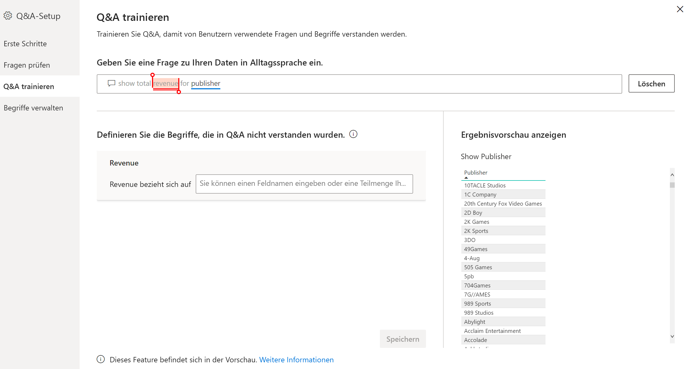
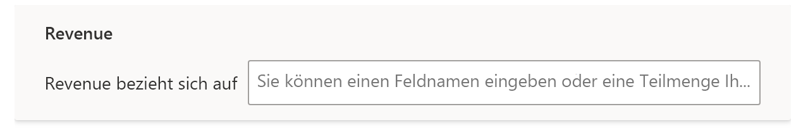
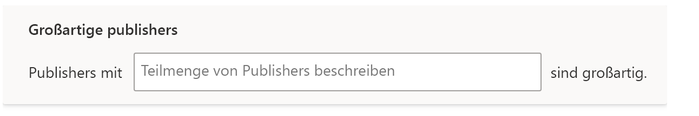

# Trainieren von Q&A zum Verständnis von Fragen und Begriffen in Power BI Q&A

Im Abschnitt **Q&A trainieren** der Q&A-Einrichtung können Sie Q&A trainieren, damit Fragen in natürlicher Sprache und Begriffe verstanden werden, die bisher nicht erkannt wurden. Zunächst übermitteln Sie eine Frage, die mindestens ein Wort enthält, das von Q&A nicht erkannt wurde. Q&A fordert Sie darauf hin auf, diesen Begriff zu definieren. Sie geben entweder einen Filter oder einen Feldnamen ein, der die Bedeutung dieses Worts repräsentiert. Q&A interpretiert anschließend die ursprüngliche Frage neu. Wenn Sie mit den Ergebnissen zufrieden sind, speichern Sie sie.

> [!NOTE]
> Die Funktionalität zum Trainieren von Q&A unterstützt nur den Importmodus. Q&A bietet bisher auch noch keine Unterstützung für die Verbindung mit einer lokalen oder Azure Analysis Services-Datenquelle. Diese Einschränkung soll in zukünftigen Versionen von Power BI wegfallen.

## Starten des Q&A-Trainings

1. Wählen Sie in Power BI Desktop im Menüband **Modellierung** die Option **Q&A-Setup** > **Q&A trainieren** aus.

    

2. Geben Sie einen Satz mit einem Begriff ein, den Q&A nicht erkennt, und klicken Sie auf **Übermitteln**.

3. Wählen Sie das rot unterstrichene Wort aus. 

    Q&A bietet Vorschläge an und fordert Sie auf, die richtige Definition für den Begriff anzugeben. 
    
3. Geben Sie unter **Definieren Sie die Begriffe, die in Q&A nicht verstanden wurden** eine Definition an.

    

4. Klicken Sie auf **Speichern**, um eine Vorschau des aktualisierten Visuals anzuzeigen.

5. Geben Sie die nächste Frage ein, oder klicken Sie auf **X**, um das Fenster zu schließen.

Den Consumern Ihres Berichts wird diese Änderung erst angezeigt, wenn Sie den Bericht wieder im Dienst veröffentlichen.

## Definieren von Nomen und Adjektiven

Sie können Q&A für zwei Arten von Begriffen trainieren:

- Nomen
- Adjektive

### Definieren eines Nomens als Synonym

Bei der Arbeit mit Daten werden für Felder oft Namen verwendet, auf die mit alternativen Namen verwiesen werden kann. Ein Beispiel hierfür ist „Umsatz“. Zahlreiche Wörter oder Begriffe können sich auf den Umsatz beziehen, darunter z. B. „Einnahmen“. Wenn eine Spalte den Namen „Umsatz“ aufweist und Berichtsconsumer den Namen „Einnahmen“ eingeben, wählt Q&A möglicherweise nicht die richtige Spalte aus, um die Frage angemessen zu beantworten. In diesem Fall können Sie Q&A trainieren, damit „Umsatz“ und „Einnahmen“ als gleichbedeutend erkannt werden.

Q&A erkennt durch Rückgriff auf Informationen in Microsoft Office automatisch, wenn es sich bei einem nicht erkannten Wort um ein Nomen handelt. Wenn Q&A ein Nomen erkennt, erhalten Sie eine Aufforderung dieser Art:

- <your term> **bezieht sich auf** 

Geben Sie im Feld den Begriff aus Ihren Daten ein.

Wenn Sie kein Feld aus dem Datenmodell angeben, kann es zu unerwünschten Ergebnissen kommen.

### Definieren einer Adjektivfilterbedingung

Gelegentlich kann es sinnvoll sein, Begriffe zu definieren, die als Bedingung für die zugrunde liegenden Daten dienen. Ein Beispiel hierfür wäre „Fantastische Herausgeber“. „Fantastisch“ könnte eine Bedingung sein, durch die nur Herausgeber ausgewählt werden, die eine bestimmte Anzahl von Produkten veröffentlicht haben. Q&A versucht, Adjektive zu erkennen, indem es eine andere Eingabeaufforderung anzeigt:

- <field name> **mit folgender Bedingung**  

Geben Sie die Bedingung in das Feld ein.

Nachfolgend einige Beispielbedingungen, die Sie definieren können:

- „Land“ mit dem Wert „USA“
- „Land“ mit einem anderen Wert als „USA“
- „Gewicht“ > 2000
- „Gewicht“ = 2000
- „Gewicht“ < 2000

Sie können in den Tools nur ein einzige Bedingung definieren. Um komplexe Bedingungen zu definieren, erstellen Sie mit DAX eine berechnete Spalte und verwenden Sie dann den Toolabschnitt, um eine einzelne Bedingung für diese berechnete Spalte zu erstellen. Measures werden nicht unterstützt. Verwenden Sie stattdessen berechnete Spalten.

## Verwalten von Begriffen

Nachdem Sie Definitionen angegeben haben, können Sie zurückwechseln, um alle vorgenommenen Korrekturen anzuzeigen und sie zu bearbeiten oder zu löschen. 

1. Wechseln Sie in **Q&A-Setup** zum Abschnitt **Begriffe verwalten**.

2. Löschen Sie alle Begriffe, die Sie nicht länger benötigen. Aktuell können Begriffe nicht bearbeitet werden. Um einen Begriff neu zu definieren, löschen Sie den Begriff, und definieren Sie ihn neu.

    

## Nächste Schritte

Es gibt verschiedene Best Practices zur Verbesserung der Engine zur Verarbeitung natürlicher Sprache. Weitere Informationen finden Sie im folgenden Artikel:

* [Q&A: Best Practices](q-and-a-best-practices.md)
