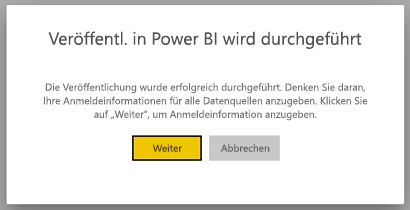
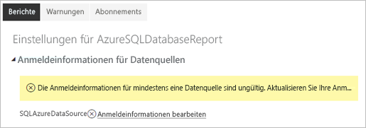
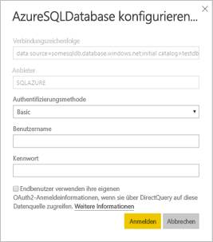

# Unterstützte Datenquellen für paginierte Power BI-Berichte

In diesem Artikel erfahren Sie mehr über unterstützte Datenquellen für paginierte Berichte im Power BI-Dienst und dazu, wie Sie eine Verbindung zu Datenquellen der Azure SQL-Datenbank herstellen. Einige Datenquellen werden nativ unterstützt. Mithilfe von Datengateways können Sie eine Verbindung mit anderen Datenquellen herstellen.

## Nativ unterstützte Datenquellen

Paginierte Berichte unterstützen nativ die folgende Liste von Datenquellen:

| Datenquelle | Authentifizierung | Hinweise |
| --- | --- | --- |
| Azure SQL-Datenbank  Azure SQL Data Warehouse | Basic, Einmaliges Anmelden (SSO) OAuth2 |   |
| Verwaltete Azure SQL-Datenbank-Instanz | Standard | Über einen öffentlichen Endpunkt mithilfe der Erweiterung für Azure SQL-Datenbank  |
| Azure Analysis Services | SSO, OAuth2 | Die Firewall von AAS muss deaktiviert oder so konfiguriert sein, dass sie sämtliche IP-Adressbereiche zulässt.  Die Verwendung eines Alias wird nicht unterstützt.  |
| Power BI-Dataset | SSO | Für Power BI Premium-Datasets und Power BI Nicht-Premium-Datasets ist eine Leseberechtigung erforderlich. |
| Premium-Power BI-Dataset (XMLA) | SSO |   |
| Daten eingeben | N/V | Daten sind in Bericht eingebettet. |

Mit Ausnahme von Azure SQL-Datenbank können alle Datenquellen verwendet werden, nachdem Sie den Bericht in den Power BI-Dienst hochgeladen haben. Bei den Datenquellen wird standardmäßig einmaliges Anmelden (Single Sign-on, SSO) verwendet, sofern zutreffend. Für Azure Analysis Services können Sie den Authentifizierungstyp in „OAuth2“ ändern.

Für Azure SQL-Datenbankdaten-Datenquellen müssen Sie weitere Informationen bereitstellen, wie im Abschnitt [Authentifizierung für Azure SQL-Datenbank](#azure-sql-database-authentication) beschrieben.

## Andere Datenquellen

Zusätzlich zu den oben genannten nativ unterstützten Datenquellen können Sie über ein [Power BI-Datengateway](service-gateway-onprem.md) auf die folgenden Datenquellen zugreifen:

- SQL Server
- SQL Server Analysis Services
- Oracle
- Teradata

Für paginierte Berichte können Azure SQL-Datenbank und Azure Analysis Services derzeit nicht über ein Power BI-Datengateway aufgerufen werden.

## Authentifizierung für Azure SQL-Datenbank

Für Azure SQL-Datenbank-Datenquellen müssen Sie vor dem Ausführen des Berichts einen Authentifizierungstyp festlegen. Dies gilt nur, wenn Sie eine Datenquelle zum ersten Mal in einem Arbeitsbereich verwenden. Beim ersten Mal wird die folgende Meldung angezeigt:

Wenn Sie keine Anmeldeinformationen angeben, tritt beim Ausführen des Berichts ein Fehler auf. Wählen Sie **Weiter** aus, um zur Seite **Anmeldeinformationen für die Datenquelle** für den soeben hochgeladenen Bericht zu gelangen:

Wählen Sie den Link **Anmeldeinformationen bearbeiten** für eine bestimmte Datenquelle aus, um das Dialogfeld **Konfigurieren** anzuzeigen:

Für Azure SQL-Datenbank-Datenquellen finden Sie hier die unterstützten Authentifizierungstypen:

- Basic (Benutzername und Kennwort)
- SSO (Einmaliges Anmelden)
- OAuth2 (gespeichertes AAD-Token)

Damit das einmalige Anmelden (SSO) und OAuth2 ordnungsgemäß funktionieren, muss für den Azure SQL-Datenbankserver, mit dem die Datenquelle verbunden ist, die [AAD-Authentifizierung aktiviert werden](https://docs.microsoft.com/azure/sql-database/sql-database-aad-authentication-configure). Bei der OAuth2-Authentifizierungsmethode generiert AAD ein Token und speichert es für den zukünftigen Zugriff auf die Datenquelle. Wenn Sie stattdessen die [SSO-Authentifizierungsmethode](https://docs.microsoft.com/power-bi/service-azure-sql-database-with-direct-connect#single-sign-on) verwenden möchten, wählen Sie die SSO-Option direkt darunter aus. **Endbenutzer verwenden Ihre eigenen OAuth2-Anmeldeinformationen, wenn Sie über DirectQuery auf diese Datenquelle zugreifen**.
  
## Nächste Schritte

[Anzeigen eines paginierten Berichts im Power BI-Dienst](consumer/paginated-reports-view-power-bi-service.md)

Weitere Fragen? [Wenden Sie sich an die Power BI-Community](https://community.powerbi.com/)
