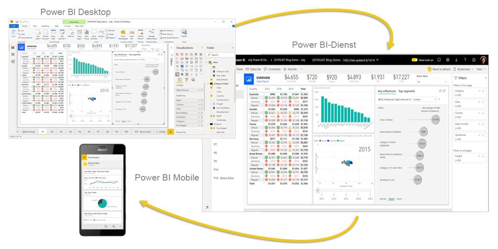

# Was ist Power BI?
**Power BI** ist eine Sammlung von Softwarediensten, Apps und Connectors, die zusammenwirken, um Ihre nicht verbundenen Datenquellen in kohärente, visuell überzeugende und interaktive Einblicke umzuwandeln. Ihre Daten können als Excel-Kalkulationstabelle oder als eine hybride Sammlung von cloudbasierten und lokalen Data Warehouse-Instanzen vorliegen. Mit Power BI können Sie komfortabel Verbindungen zwischen Ihren Datenquellen herstellen, die wichtigen Punkte entdecken und visualisieren und die Ergebnisse mit den gewünschten Personen teilen.

## Komponenten von Power BI
Power BI besteht aus Folgendem: 
- Windows-Desktopanwendung namens **Power BI Desktop**
- Online-SaaS-Dienst (*Software-as-a-Service*) namens **Power BI-Dienst** 
- **Mobile Power BI-Apps** für Windows-, iOS- und Android-Geräte

Diese drei Komponenten – &mdash;Power BI Desktop, der Dienst und die mobilen Apps&mdash; – wurden entwickelt, damit Sie ihren Anforderungen oder ihrer Rolle entsprechend möglichst effektiv Geschäftseinblicke erstellen, freigeben und nutzen können.

Ein viertes Element, der **Power BI-Berichtsserver**, ermöglicht Ihnen nach der Erstellung in Power BI Desktop das Veröffentlichen von Power BI-Berichten auf einem lokalen Berichtsserver. Informieren Sie sich umfassender über den [Power BI-Berichtsserver](#on-premises-reporting-with-power-bi-report-server).

## Verwendung von Power BI entsprechend Ihrer Rolle
Wie Sie Power BI verwenden, kann von Ihrer Rolle in einem Projekt oder einem Team abhängen. Andere Personen in anderen Rollen verwenden Power BI möglicherweise auf andere Weise.

Beispielsweise können Sie den **Power BI-Dienst** in erster Linie dazu verwenden, um sich Berichte und Dashboards anzusehen. Ihr mehr mit Zahlen befasster Arbeitskollege nutzt in großem Umfang **Power BI Desktop**, um Berichte zu erstellen und diese Berichte dann im Power BI-Dienst zu veröffentlichen, wo Sie sie sich ansehen. Ein anderer Mitarbeiter im Vertrieb verwendet dagegen hauptsächlich die **mobile Power BI-App**, um den Status von Absatzquoten zu überwachen und einen Drilldown in die Details zu neuen potenziellen Interessenten auszuführen.

Wenn Sie Entwickler sind, können Sie Power BI-APIs verwenden, um Daten per Push in Datasets zu übertragen oder um Dashboards und Berichte in Ihre eigenen benutzerdefinierten Anwendungen zu integrieren. Sie haben eine Idee für ein neues Visual? Erstellen Sie es selbst, und geben Sie es für andere frei.  

Möglicherweise verwenden Sie die einzelnen Komponenten von Power BI zu unterschiedlichen Zeitpunkten, je nachdem, welche Ziele Sie erreichen möchten oder welche Rolle Sie in einem bestimmten Projekt haben.

Wie Sie Power BI verwenden, kann sich einfach danach richten, welche Funktion oder welcher Dienst von Power BI das beste Tool für Ihre Situation darstellt. Beispielsweise können Sie Power BI Desktop verwenden, um Berichte mit statistischen Angaben zur Kundenbindung für Ihr Team zu erstellen, und Sie können den Bestands- und Herstellungsstatus in einem Echtzeitdashboard im Power BI-Dienst anzeigen. Ihnen steht jeder Teil von Power BI zur Verfügung, genau deshalb ist es so flexibel und überzeugend.

Untersuchen Sie Dokumente, die sich auf ihre Rolle beziehen:
- Power BI Desktop für [*Designer*](desktop-what-is-desktop.md)
- Power BI für [*Verbraucher*](consumer/end-user-consumer.md)
- Power BI für [*Entwickler*](developer/what-can-you-do.md)
- Power BI für [*Administratoren*](service-admin-administering-power-bi-in-your-organization.md)

## Arbeitsablauf in Power BI
Ein häufiger Workflow in Power BI beginnt mit dem Herstellen einer Verbindung mit Datenquellen und dem Erstellen eines Berichts in Power BI Desktop. Anschließend veröffentlichen Sie diesen Bericht aus Power BI Desktop im Power BI-Dienst und teilen ihn, damit Endbenutzer im Power BI-Dienst und auf den mobilen Geräten den Bericht anzeigen und mit ihm interagieren können.
Dieser Workflow ist üblich und zeigt, wie sich die drei Hauptelemente von Power BI gegenseitig ergänzen.

Hier finden Sie einen detaillierten [Vergleich von Power BI Desktop und Power BI-Dienst](service-service-vs-desktop.md).

## Lokale Berichterstellung mit Power BI-Berichtsserver

Was aber, wenn Sie noch nicht für eine Migration in die Cloud bereit sind und Ihre Berichte hinter einer Unternehmensfirewall speichern müssen?  Lesen Sie weiter.

Mithilfe der zahlreichen sofort einsetzbaren Tools und Dienste des Power BI-Berichtsservers können Sie mobile und paginierte Power BI-Berichte lokal erstellen, bereitstellen und verwalten.

Power BI-Berichtsserver ist eine Lösung, die Sie hinter Ihrer Firewall bereitstellen. Danach stellen Sie Ihre Berichte den richtigen Benutzern auf unterschiedliche Weise zur Verfügung: in einem Webbrowser, auf einem mobilen Gerät oder per E-Mail. Power BI-Berichtsserver ist mit Power BI in der Cloud kompatibel, sodass Sie jederzeit zur Cloud wechseln können. 

Informieren Sie sich umfassender über den [Power BI-Berichtsserver](report-server/get-started.md).

## Nächste Schritte
- [Schnellstart: Learn your way around the Power BI service (Schnellstart: Kennenlernen des Power BI-Diensts)](service-the-new-power-bi-experience.md)   
- [Tutorial: Erste Schritte mit dem Power BI-Dienst](service-get-started.md)
- [Schnellstart: Herstellen einer Verbindung mit Daten in Power BI Desktop](desktop-quickstart-connect-to-data.md)
