# Hinzufügen eines Filters zu einem Bericht in Power BI

Dieser Artikel erläutert, wie Sie einem Bericht in Power BI einen Seiten-, Visualisierungs-, Berichts- oder Drillthroughfilter hinzufügen. Die Beispiele in diesem Artikel stammen aus dem Power BI-Dienst. Die dargestellten Schritte sind fast identisch mit denen in Power BI Desktop.

**Wussten Sie schon?** Power BI umfasst eine neue Filteroberfläche, die sich zurzeit in der Vorschau befindet. Erfahren Sie mehr über die [neue Filteroberfläche in Power BI-Berichten](power-bi-report-filter-preview.md).

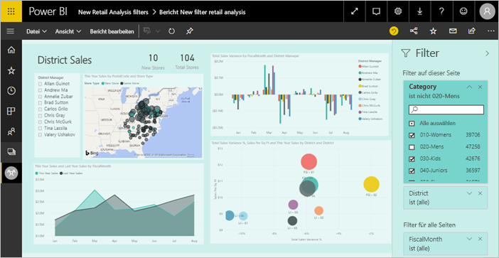

Power BI bietet eine Reihe verschiedener Arten von Filtern, von manuellen und automatischen Filtern bis hin zu Drillthrough und Pass-through. Erfahren Sie mehr über die [verschiedenen Arten von Filtern](power-bi-report-filter-types.md).

## Filter in der Bearbeitungs- und Leseansicht
Sie können mit Berichten in zwei verschiedenen Ansichten interagieren: in der Leseansicht und in der Bearbeitungsansicht. Die verfügbaren Filterfunktionen hängen von der verwendeten Ansicht ab. Mehr erfahren Sie unter [Informationen zu Filtern und Hervorhebungen in Power BI-Berichten](power-bi-reports-filters-and-highlighting.md).

Dieser Artikel beschreibt, wie Sie Filter im Bericht **Bearbeitungsansicht** erstellen.  Weitere Informationen zu Filtern in der Leseansicht finden Sie unter [Interagieren mit Filtern in der Leseansicht von Berichten](consumer/end-user-report-filter.md).

Da Filter *beibehalten werden*, wenn Sie den Bericht verlassen, behält Power BI Ihre Filter, Slicer und andere vorgenommene Änderungen an der Datenansicht bei. Wenn Sie zum Bericht zurückkehren, können Sie also dort weitermachen, wo Sie aufgehört haben. Wenn Sie Ihre Filteränderungen nicht übernehmen möchten, wählen Sie in der oberen Menüleiste **Auf Standardwert zurücksetzen** aus.

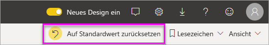

## Filterebenen im Bereich „Filter“
Der Bereich „Filter“ wird auf der rechten Seite des Zeichenbereichs für den Bericht angezeigt, egal ob Sie den Desktop- oder Power BI-Dienst verwenden. Wenn der Filterbereich nicht angezeigt wird, wählen Sie das Symbol „>“ in der oberen rechten Ecke aus, um ihn zu erweitern.

Sie können Filter auf drei verschiedenen Ebenen für den Bericht festlegen: Visual-, Seiten- und Berichtsebene. Sie können auch Drillthroughfilter einrichten. Dieser Artikel beschreibt die verschiedenen Ebenen.

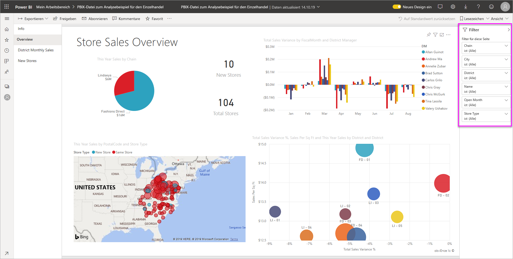

## Hinzufügen eines Filters zu einem Visual
Sie haben zwei Möglichkeiten, einem bestimmten Visual einen Filter auf Visualebene hinzuzufügen. 

* Filtern Sie ein Feld, das bereits von der Visualisierung verwendet wird.
* Identifizieren Sie ein Feld, das noch nicht von der Visualisierung verwendet wird, und fügen Sie dieses Feld direkt dem Bucket **Filter auf visueller Ebene** hinzu.

Dieses Verfahren verwendet übrigens ein Analysebeispiel für den Einzelhandel, das Sie sie herunterladen können, um es nachzuvollziehen. Den Download finden Sie hier: [Analysebeispiel für Einzelhandel](sample-retail-analysis.md).

### Filtern von Feldern im Visual

1. Wählen Sie **Bericht bearbeiten** aus, um den Bericht in der Bearbeitungsansicht zu öffnen.
   
   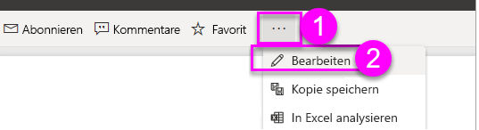

2. Öffnen Sie den Bereich für die Visualisierungen und Filter und den Bereich für die Felder (falls nicht bereits geöffnet).
   
   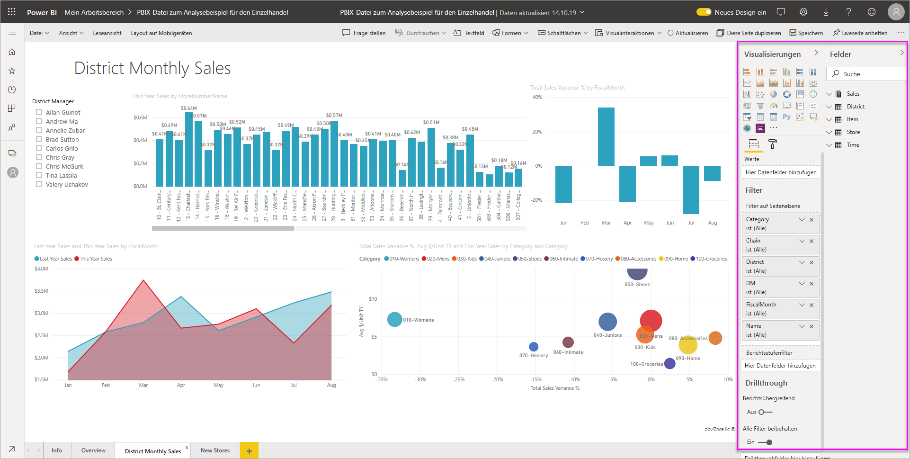
3. Wählen Sie eine Visualisierung aus, um ihn zu aktivieren. Alle Felder, die vom Visual verwendet werden, sind im Bereich **Felder** angegeben und auch im Bereich **Filter** unter der Überschrift **Filter auf visueller Ebene** aufgeführt.
   
   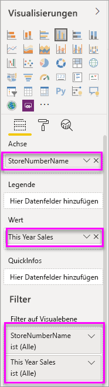
4. Jetzt wird einem Feld, das bereits von der Visualisierung verwendet wird, ein Filter hinzugefügt. 
   
    Scrollen Sie zum Bereich **Filter auf visueller Ebene**, und wählen Sie den Pfeil aus, um das Feld zu erweitern, das Sie filtern möchten. In diesem Beispiel wird nach **StoreNumberName** gefiltert.
     
    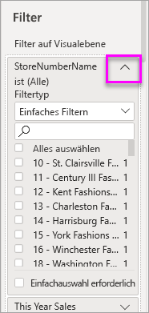 
    
    Legen Sie für die Filtersteuerelemente **Einfaches Filtern**, **Erweiterte Filterung** oder **Top N-Filter** fest. Suchen Sie für dieses Beispiel unter „Einfaches Filtern“ nach **cha**, und wählen Sie diese fünf Geschäfte aus.
     
    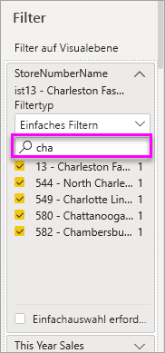 
   
    Die Visualisierung ändert sich und spiegelt den neuen Filter wider. Wenn Sie Ihren Bericht mit dem Filter speichern, sehen Berichtsleser das Visual zunächst mit dem angewendeten Filter. Diesen können sie in der Leseansicht ändern und Werte auswählen oder löschen.
     
    

### Filtern mit Feldern, die sich nicht im Visual befindet

Fügen Sie der Visualisierung nun ein neues Feld als Filter auf visueller Ebene hinzu.
   
1. Wählen Sie im Bereich „Felder“ das Feld aus, das Sie als neuen Filter auf visueller Ebene hinzufügen möchten, und ziehen Sie es in den Bereich **Filter auf visueller Ebene**.  In diesem Beispiel wird **District Manager** in den Bucket **Filter auf visueller Ebene** gezogen und **an** in das Suchfeld eingegeben. Dann werden diese drei Manager ausgewählt. 
     
    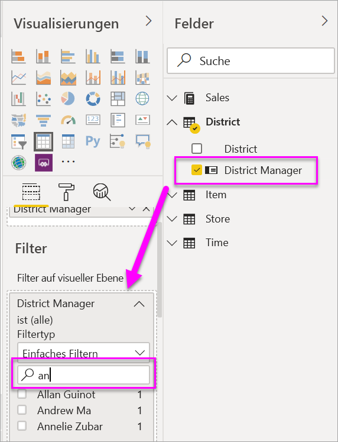

    Beachten Sie, dass **District Manager** der Visualisierung selbst *nicht* hinzugefügt wird. Die Visualisierung besteht weiterhin aus **StoreNumberName** als Achse und aus **This Year Sales** als Wert.  
     
    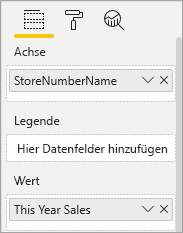

    Die Visualisierung selbst wird nun gefiltert, um nur die diesjährigen Umsätze der ausgewählten Manager für die angegebenen Geschäfte anzuzeigen.
     
    

    Wenn Sie Ihren Bericht mit dem Filter speichern, können Berichtsleser den Filter **District Manager** in der Leseansicht bearbeiten und Werte auswählen oder löschen.

## Hinzufügen eines Filters zu einer kompletten Seite

Sie können auch einen Filter auf Seitenebene hinzufügen, um eine komplette Seite zu filtern.

1. Wählen Sie **Bericht bearbeiten** aus, um den Bericht in der Bearbeitungsansicht zu öffnen.
   
   
2. Öffnen Sie den Bereich für die Visualisierungen und Filter und den Bereich für die Felder (falls nicht bereits geöffnet).
3. Wählen Sie im Bereich „Felder“ das Feld aus, das Sie als neuen Filter auf Seitenebene hinzufügen möchten, und ziehen Sie es in den Bereich **Filter auf Seitenebene**.  
4. Wählen Sie die Werte aus, die Sie filtern möchten, und legen Sie für die Filtersteuerelemente **Einfaches Filtern** oder **Erweiterte Filterung** fest.
   
   Alle Visualisierungen auf der Seite werden neu gezeichnet, um die Änderung zu übernehmen.
   
   

    Wenn Sie Ihren Bericht mit dem Filter speichern, können Berichtsleser den Filter in der Leseansicht bearbeiten und Werte auswählen oder löschen.

## Hinzufügen eines Drillthroughfilters
Mit Drillthrough im Power BI-Dienst und Power BI Desktop können Sie eine *Ziel*-Berichtseite erstellen, die auf eine bestimmte Entität fokussiert ist, z.B. einen Lieferanten, Kunden oder Hersteller. Nun können Benutzer auf den anderen Berichtseiten mit der rechten Maustaste auf einen Datenpunkt für die Entität klicken und einen Drillthrough für die fokussierte Seite ausführen.

### Erstellen eines Drillthroughfilters
Laden Sie hierfür das [Kundenrentabilitätsbeispiel](sample-customer-profitability.md) herunter. Angenommen, Sie benötigen eine Seite, die auf Managementgeschäftsbereiche fokussiert ist.

1. Wählen Sie **Bericht bearbeiten** aus, um den Bericht in der Bearbeitungsansicht zu öffnen.
   
   

1. Fügen Sie dem Bericht eine neue Seite hinzu, und benennen Sie diese **Team Executive** (Teammanager). Dies wird die *Ziel*-Drillthroughseite.
2. Fügen Sie Visualisierungen zum Verfolgen von Schlüsselmetriken für die Geschäftsbereiche der Teammanager hinzu.    
3. Fügen Sie dem Bereich „Drillthroughfilter“ **Executive > Executive Name** (Führungskraft > Name der Führungskraft) hinzu.    
   
    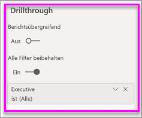
   
    Beachten Sie, dass Power BI der Berichtseite einen Zurück-Pfeil hinzufügt.  Wenn der Benutzer auf den Zurück-Pfeil klickt, kehrt er zur *Ausgangs*berichtseite zurück – zu der Seite, auf der er den Drillthrough ausgewählt hat. Der Zurück-Pfeil kann nur in der Leseansicht verwendet werden.
   
     

### Verwenden des Drillthroughfilters
Im Folgenden wird beschrieben, wie der Drillthroughfilter funktioniert.

1. Starten Sie auf der Berichtseite **Team-Scorecard**.    
2. Angenommen, Sie sind Andrew Ma und möchten die „Team Executive“-Berichtseite so gefiltert anzeigen, dass nur Ihre Daten enthalten sind.  Klicken Sie im Flächendiagramm oben rechts auf einen grünen Datenpunkt, um die Menüoption „Drillthrough“ zu öffnen.
   
    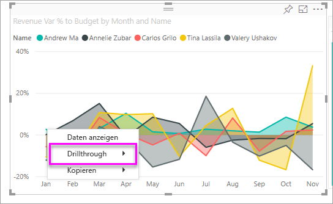
3. Wählen Sie **Drillthrough > Team Executive** aus, um einen Drillthrough zur Berichtseite **Team Executive** (Teammanager) durchzuführen. Die Seite wird so gefiltert, dass Informationen zum Datenpunkt angezeigt werden, auf den Sie mit der rechten Maustaste geklickt haben; in diesem Fall „Andrew Ma“. An die Drillthroughberichtseite wird nur das Feld übergeben, das sich im Bereich „Drillthroughfilter“ befindet.  
   
    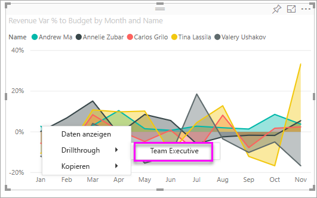

## Hinzufügen eines Filters auf Berichtsebene zum Filtern eines gesamten Berichts

1. Wählen Sie **Bericht bearbeiten** aus, um den Bericht in der Bearbeitungsansicht zu öffnen.
   
   

2. Öffnen Sie den Bereich für die Visualisierungen und Filter und den Bereich für die Felder, falls sie nicht bereits geöffnet sind.
3. Wählen Sie im Bereich „Felder“ das Feld aus, das Sie als neuen Filter auf Berichtsebene hinzufügen möchten, und ziehen Sie es in den Bereich **Berichtsstufenfilter**.  
4. Wählen Sie die zu filternden Werte aus.

    Die Visuals auf der aktiven Seite und auf allen Seiten des Berichts ändern sich, um den neuen Filter widerzuspiegeln. Wenn Sie Ihren Bericht mit dem Filter speichern, können Berichtsleser den Filter in der Leseansicht bearbeiten und Werte auswählen oder löschen.

1. Wählen Sie den Zurück-Pfeil aus, um zur vorherigen Berichtseite zurückzukehren.

## Zu beachtende Aspekte und Problembehandlung

- Es kann vorkommen, dass Filter auf visueller Ebene und Filter auf Seitenebene unterschiedliche Ergebnisse zurückgeben.  Wenn Sie beispielsweise einen Filter auf visueller Ebene hinzufügen, filtert Power BI die aggregierten Ergebnisse.  Die standardmäßige Aggregatfunktion ist „Summe“, Sie können jedoch den [Aggregattyp ändern](service-aggregates.md).  

    Wenn Sie dann einen Filter auf Seitenebene hinzufügen, filtert Power BI ohne Aggregation.  Dies liegt daran, dass eine Seite viele Visuals umfassen kann, die jeweils unterschiedliche Aggregationstypen verwenden.  Daher wird der Filter auf jede Datenzeile angewendet.

- Wenn der Bereich „Felder“ nicht angezeigt wird, stellen Sie sicher, dass Sie die [Bearbeitungsansicht](service-interact-with-a-report-in-editing-view.md) des Berichts geöffnet haben.    
- Wenn Sie viele Änderungen an den Filtern vorgenommen haben und zu den Standardeinstellungen des Berichtsautors zurückkehren möchten, wählen Sie auf der oberen Menüleiste **Auf Standardwert zurücksetzen** aus.

## Nächste Schritte
[Überblick über den Berichtsbereich „Filter“](consumer/end-user-report-filter.md)

[Filter und Hervorhebungen in Berichten](power-bi-reports-filters-and-highlighting.md)

[Filtertypen in Power BI-Berichten](power-bi-report-filter-types.md)

Weitere Fragen? [Wenden Sie sich an die Power BI-Community](http://community.powerbi.com/)

