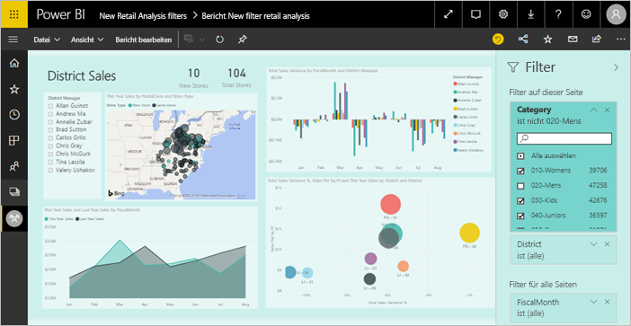
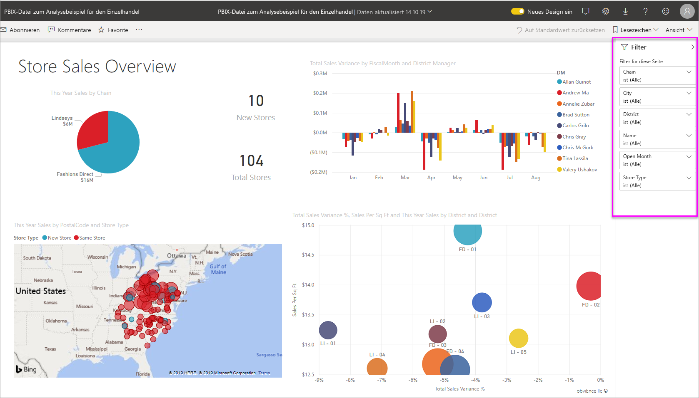
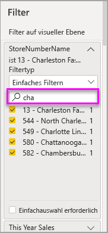
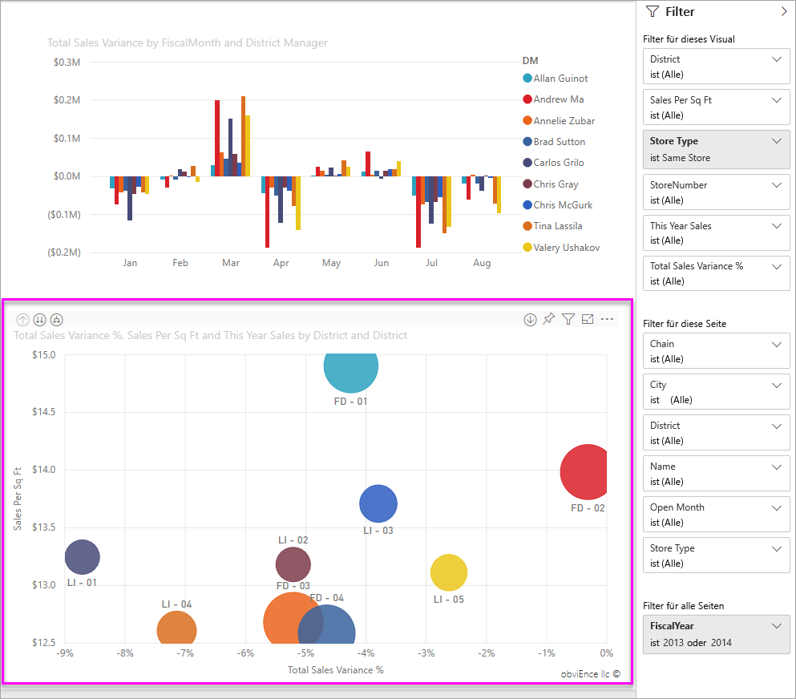
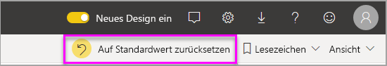
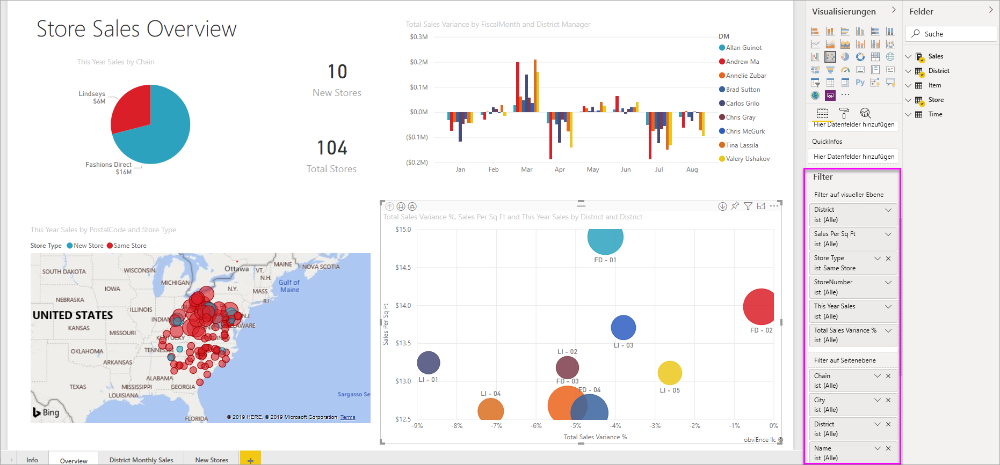

# Filter und Hervorhebungen in Power BI-Berichten
 Dieser Artikel informiert Sie über das Filtern und Hervorheben im Power BI-Dienst. Die Benutzeroberfläche ist nahezu identisch mit der von Power BI Desktop. *Filter* entfernen alles bis auf die Daten, auf die Sie sich konzentrieren möchten. *Hervorheben* ist nicht dasselbe wie Filtern. Dieser Vorgang entfernt keine Daten, sondern hebt eine Teilmenge der sichtbaren Daten hervor. Die nicht hervorgehobenen Daten bleiben sichtbar, sind jedoch abgeblendet.

Zum Zuweisen von Filtern und Hervorhebungen zu Berichten haben Sie in Power BI verschiedene Möglichkeiten. Diese eingehend zu beschreiben, würde den Rahmen dieses Artikels sprengen. Wir haben die Informationen also auf folgende Abschnitte aufgeteilt:

* Einführung in Filter und Hervorhebungen (dieser Artikel).
* [Erstellen und Verwenden von Filtern in der Bearbeitungsansicht](power-bi-report-add-filter.md) in Berichten in Power BI Desktop und dem Power BI-Dienst. Wenn Sie über Berechtigungen zum Bearbeiten von Berichten verfügen, können Sie Filter in Berichten erstellen, ändern und löschen.
* [Verwenden von Filtern und Hervorhebungen bei Visuals in einem für Sie freigegebenen Bericht](consumer/end-user-interactions.md) in der Leseansicht im Power BI-Dienst. Hier bestehen Einschränkungen, Ihnen stehen aber in jedem Fall eine Vielzahl von Optionen für Filter und Hervorhebungen zur Verfügung.  
* Ausführliche Einführung in die [in der Bearbeitungsansicht verfügbaren Steuerelemente zum Filtern und Hervorheben](power-bi-report-add-filter.md) in Power BI Desktop und dem Power BI-Dienst. Der Artikel befasst sich ausführlich mit Filtertypen wie Datum und Uhrzeit, numerischen Filtern sowie Textfiltern. Außerdem werden die Unterschiede zwischen den grundlegenden und den erweiterten Optionen behandelt.
* Wenn Sie das Standardverfahren für die Verwendung von Filtern und Hervorhebungen kennengelernt haben, erfahren Sie, [wie Sie die Art und Weise ändern, in der verschiedene Visualisierungen auf einer Seite einander durch Filter und Hervorhebungen beeinflussen](service-reports-visual-interactions.md).

**Wussten Sie schon?** Power BI umfasst eine neue Filterfunktion. Erfahren Sie mehr über die [neue Filteroberfläche in Power BI-Berichten](power-bi-report-filter.md).

## Einführung in den Bereich „Filter“

Sie können die Filter im Bereich **Filter** oder durch [Auswahl von Slicern](visuals/power-bi-visualization-slicers.md) direkt im Bericht anwenden. Im Bereich „Filter“ werden die Tabellen und Felder, die im Bericht verwendet werden, sowie die ggf. angewendeten Filter angezeigt. 

Es gibt vier Arten von Filtern.

- Ein **Seitenfilter** gilt für Visualisierungen auf der Berichtsseite.     
- Ein **Visualfilter** gilt für ein einzelnes Visual auf einer Berichtsseite. Die Filter auf Visualebene werden nur angezeigt, wenn Sie in der Berichtscanvas ein Visual ausgewählt haben.    
- Ein **Berichtsfilter** gilt für alle Seiten im Bericht.    
- Ein **Drillthroughfilter** gilt für eine einzelne Entität in einem Bericht.    

Sie können in der Lese- oder Bearbeitungsansicht in Seiten-, Visual- und Berichtsfiltern suchen, um den gewünschten Wert zu finden. 

Wenn neben einem Filter das Wort **Alle** steht, bedeutet dies, dass alle Werte im Feld in den Filter einbezogen werden.  Beispiel: **Kette(Alle)** (im Screenshot unten „Chain(All)“) bedeutet, dass diese Berichtsseite Informationen über alle Ladenketten enthält.  Andererseits können wir der Angabe **Geschäftsjahr ist 2013 oder 2014** entnehmen, dass der Bericht ausschließlich Informationen aus den Geschäftsjahren 2013 und 2014 umfasst.

## Filter in der Lese- und der Bearbeitungsansicht
Es gibt zwei Modi für die Interaktion mit Berichten: [Leseansicht](consumer/end-user-reading-view.md) und Bearbeitungsansicht. Welche Filterfunktionen verfügbar sind, richtet sich nach dem Modus, in dem Sie sich befinden.

* In der Bearbeitungsansicht können Sie Berichts-, Seiten-, Drillthrough- und Visualfilter hinzufügen. Beim Speichern des Berichts werden die Filter zusammen mit dem Bericht gespeichert – auch dann, wenn Sie den Bericht in einer mobilen App öffnen. Personen, die den Bericht in der Leseansicht anzeigen, können mit den von Ihnen hinzugefügten Filtern interagieren, aber keine neuen Filter hinzufügen.
* In der Leseansicht können Sie mit allen Filtern interagieren, die im Bericht schon vorhanden sind, und Ihre Auswahl anschließend speichern. Sie können keine neuen Filter hinzufügen.

### Filter in der Leseansicht
Wenn Sie auf einen Bericht nur über die Leseansicht zugreifen können, sieht der Bereich „Filter“ etwa wie folgt aus:

Diese Berichtsseite verfügt also über sechs Filter auf Seitenebene und einen Filter auf Berichtsebene.

Jedes Visual kann Filter für alle Felder im Visual enthalten, und ein Berichtsautor kann weitere hinzufügen. Im Bild unten weist das Blasendiagramm sechs Filter auf.

In der Leseansicht können Sie die Daten untersuchen, indem Sie die bestehenden Filter modifizieren. Selbst wenn Sie den Bericht in einer mobilen App öffnen, werden die von Ihnen vorgenommenen Veränderungen zusammen mit dem Bericht gespeichert. Mehr dazu erfahren Sie im [Überblick über den Berichtsbereich „Filter“](consumer/end-user-report-filter.md).

Wenn Sie den Bericht verlassen, werden Ihre Filter gespeichert. Um die Filterung aufzuheben und zu den Standardwerten für Filter, Slicing, Detailgenauigkeit und Sortierung zurückzukehren, die jeweils vom Berichtsautor festgelegt wurden, wählen Sie aus der Menüleiste oben **Auf Standardwert zurücksetzen** aus.

### Filter in der Bearbeitungsansicht
Wenn Sie über Besitzerberechtigungen für einen Bericht verfügen und diesen in der Bearbeitungsansicht öffnen, sehen Sie, dass der Bereich **Filter** nur einer von verschiedenen verfügbaren Bearbeitungsbereichen ist.

Wie in der Leseansicht verfügt diese Berichtsseite über sechs Filter auf Seitenebene und einen Filter auf Berichtsebene. Durch Auswahl des Blasendiagramms erfahren wir, dass sechs Filter auf Visualebene angewendet wurden.

In der Bearbeitungsansicht bieten Filter und Hervorhebungen mehr Möglichkeiten. In erster Linie können Sie Filter hinzufügen. Erfahren Sie, wie Sie [einen Filter zu einem Bericht hinzufügen](power-bi-report-add-filter.md), und vieles mehr.

## Ad-hoc-Hervorhebung
Wählen Sie einen Wert oder eine Achsenbezeichnung in einem Visual aus, um die anderen Visuals auf der Seite hervorzuheben. Wählen Sie den Wert erneut aus, oder wählen Sie einen leeren Bereich im gleichen Visual aus, um die Hervorhebung zu entfernen. Mithilfe von Hervorhebungen können Sie die Auswirkungen von Daten schnell untersuchen. Wie Sie das Verhalten dieser Art von übergreifenden Hervorhebungen anpassen können, erfahren Sie unter [Interaktionen mit Visuals](service-reports-visual-interactions.md).

## Nächste Schritte

[The new filter experience in Power BI reports (Neue Filteroberfläche in Power BI-Berichten)](power-bi-report-filter.md)

[Hinzufügen eines Filters zu einem Bericht (in der Bearbeitungsansicht)](power-bi-report-add-filter.md)

[Überblick über Berichtsfilter](consumer/end-user-report-filter.md)

[Ändern der Kreuzfilterung und -hervorhebung von Berichtsvisualisierungen](consumer/end-user-interactions.md)

Weitere Fragen? [Wenden Sie sich an die Power BI-Community](http://community.powerbi.com/)

