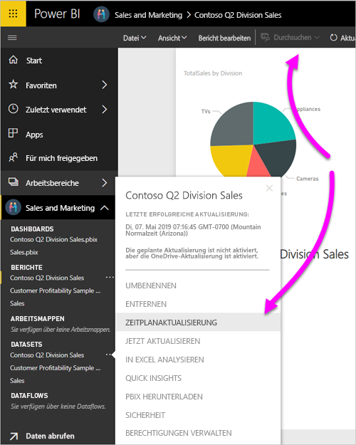

# Aktualisieren eines auf OneDrive oder in SharePoint Online gespeicherten Datasets
Das Importieren von Dateien aus OneDrive oder SharePoint Online in den Power BI-Dienst ist eine hervorragende Möglichkeit, um sicherzustellen, dass Ihre Arbeit in Power BI Desktop mit dem Power BI-Dienst synchronisiert wird.

## Vorteile beim Speichern einer Power BI Desktop-Datei auf OneDrive oder SharePoint Online
Wenn Sie eine Power BI Desktop-Datei auf OneDrive oder SharePoint Online speichern, werden alle Daten, die Sie in das Dateimodell geladen haben, in das Dataset importiert. Alle Berichte, die Sie in der Datei erstellt haben, werden im Power BI-Dienst in **Berichte** geladen. Nehmen wir an, dass Sie Änderungen an der Datei in OneDrive oder SharePoint Online vornehmen. Diese Änderungen können das Hinzufügen neuer Measures, das Ändern von Spaltennamen oder das Bearbeiten von Visualisierungen beinhalten. Sobald Sie die Datei gespeichert haben, synchronisiert sich auch der Power BI-Dienst mit diesen Änderungen, in der Regel etwa innerhalb einer Stunde.

Sie können eine einmalige, manuelle Aktualisierung direkt in Power BI Desktop ausführen, indem Sie **Aktualisieren** auf dem Menüband **Start** auswählen. Wenn Sie **Aktualisieren** auswählen, werden die Daten im Modell der Datei mit den aktualisierten Daten aus der ursprünglichen Datenquelle aktualisiert. Diese Art von Aktualisierung erfolgt vollständig innerhalb der Power BI Desktop-Anwendung selbst. Sie unterscheidet sich von einer manuellen oder geplanten Aktualisierung in Power BI, und es ist wichtig, den Unterschied zu verstehen.

Beim Importieren der Power BI Desktop-Datei aus OneDrive oder SharePoint Online laden Sie die Daten gemeinsam mit anderen Informationen über das Modell in ein Dataset in Power BI. Sie sollten das Dataset im Power BI-Dienst aktualisieren, da Ihre Berichte darauf basieren. Da die Datenquellen extern sind, können Sie das Dataset mithilfe von **Jetzt aktualisieren** manuell aktualisieren, oder Sie richten mithilfe von **Aktualisierung planen** einen Aktualisierungszeitplan ein. 

Wenn Sie das Dataset aktualisieren, stellt Power BI keine Verbindung mit der Datei in OneDrive oder SharePoint Online her, um aktualisierte Daten abzufragen. Power BI verwendet Informationen im Dataset für die direkte Verbindung mit den Datenquellen zum Abfragen von aktualisierten Daten. Dann werden diese Daten in das Dataset geladen. Diese aktualisierten Daten im Dataset werden nicht wieder mit der Datei in OneDrive oder SharePoint Online synchronisiert.

## Was wird unterstützt?
Power BI unterstützt **Jetzt Aktualisieren** und **Aktualisierung planen** für Datasets, die aus Power BI Desktop-Dateien erstellt wurden, die aus einem lokalen Laufwerk importiert wurden, wo Sie **Daten abrufen** oder den **Abfrage-Editor** verwenden, um eine Verbindung mit den Daten herzustellen und sie aus den folgenden Datenquellen zu laden.

> [!NOTE]
> Die OneDrive-Aktualisierung für Datasets von Liveverbindungen wird unterstützt. Das Ändern des Datasets für die Liveverbindung von einem Dataset in ein anderes Dataset in einem bereits veröffentlichten Bericht wird im OneDrive-Aktualisierungsszenario jedoch nicht unterstützt.

### Power BI Gateway – Personal
* Alle Onlinedatenquellen, die unter **Daten abrufen** und im **Abfrage-Editor** von Power BI Desktop angezeigt werden.
* Alle lokalen Datenquellen, die unter **Daten abrufen** oder im **Abfrage-Editor** von Power BI Desktop angezeigt werden, außer Hadoop-Dateien (HDFS) und Microsoft Exchange.

<!-- Refresh Data sources-->
[!INCLUDE [refresh-datasources](./includes/refresh-datasources.md)]

> [!NOTE]
> Ein Gateway muss installiert sein und ausgeführt werden, damit Power BI auf lokale Datenquellen zugreifen und das Dataset aktualisieren kann.
> 
> 

## OneDrive oder OneDrive for Business. Was ist der Unterschied?
Wenn Sie sowohl über ein privates OneDrive als auch OneDrive for Business verfügen, sollten Sie alle Dateien beibehalten, die Sie in Power BI in OneDrive for Business importieren möchten. Erfahren Sie, warum: Sie verwenden wahrscheinlich zwei unterschiedliche Konten für die Anmeldung.

Wenn Sie mit OneDrive for Business in Power BI eine Verbindung herstellen, ist dies einfach, da Ihr Power BI-Konto oft mit Ihrem OneDrive for Business-Konto identisch ist. Mit privatem OneDrive melden Sie sich in der Regel mit einem anderen [Microsoft-Konto](https://account.microsoft.com) an.

Wenn Sie sich mit Ihrem Microsoft-Konto anmelden, sollten Sie **Angemeldet bleiben**auswählen. Power BI kann dadurch Aktualisierungen, die Sie in der Datei in Power BI Desktop vornehmen, mit Datasets in Power BI synchronisieren.

Wenn Sie Ihre Microsoft-Anmeldeinformationen geändert haben, können Sie keine Änderungen zwischen Ihrer Datei auf OneDrive und dem Dataset in Power BI synchronisieren. Sie müssen eine Verbindung mit OneDrive herstellen und die Datei erneut importieren.

## Wie richte ich eine Zeitplanaktualisierung ein?
Wenn Sie einen Aktualisierungszeitplan einrichten, stellt Power BI direkt eine Verbindung mit den Datenquellen her. Power BI verwendet Verbindungs- und Anmeldeinformationen im Dataset, um aktualisierte Daten abzufragen. Anschließend lädt Power BI die aktualisierten Daten in das Dataset. Dann aktualisiert Power BI alle Visualisierungen und Dashboards, die auf dem Dataset im Power BI-Dienst basieren.

Weitere Details zum Einrichten einer geplanten Aktualisierung finden Sie unter [Konfigurieren einer Zeitplanaktualisierung](refresh-scheduled-refresh.md).

## Bei Problemen
Wenn etwas schief geht, liegt es in der Regel daran, dass Power BI sich nicht bei den Datenquellen anmelden kann. Fehler können auch auftreten, wenn das Dataset versucht, eine Verbindung mit einer lokalen Datenquelle herzustellen, aber das Gateway offline ist. Um solche Probleme zu vermeiden, stellen Sie sicher, dass sich Power BI bei den Datenquellen anmelden kann. Versuchen Sie, sich in **Datenquellenanmeldeinformationen** bei Ihren Datenquellen anzumelden. Manchmal ändert sich das Kennwort, mit dem Sie sich bei einer Datenquelle anmelden, oder Power BI wird von einer Datenquelle abgemeldet.

Wenn Sie Änderungen an der Power BI Desktop-Datei in OneDrive speichern und diese Änderungen nicht etwa innerhalb einer Stunde in Power BI sichtbar sind, kann Power BI möglicherweise keine Verbindung mit Ihrem OneDrive herstellen. Versuchen Sie erneut, eine Verbindung mit der Datei auf OneDrive herzustellen. Wenn Sie aufgefordert werden, sich anzumelden, stellen Sie sicher, dass **Angemeldet bleiben** aktiviert ist. Da Power BI keine Verbindung mit Ihrem OneDrive zum Synchronisieren mit der Datei herstellen konnte, müssen Sie die Datei erneut importieren.

Stellen Sie sicher, dass die Option **Benachrichtigungs-E-Mail zu Aktualisierungsfehlern an mich senden** aktiviert ist. Es ist wichtig, darüber informiert zu werden, wenn ein Fehler bei einer Zeitplanaktualisierung auftritt.

## Problembehandlung
Manchmal werden Daten nicht wie erwartet aktualisiert. In der Regel treten bei der Datenaktualisierung Probleme auf, wenn Sie mit einem Gateway verbunden sind. In den Artikeln über die Fehlerbehebung bei Gateways finden Sie Tools und Informationen zu bekannten Problemen.

[Problembehandlung beim lokalen Datengateway](service-gateway-onprem-tshoot.md)

[Problembehandlung für Power BI Gateway – Personal](service-admin-troubleshooting-power-bi-personal-gateway.md)

Weitere Fragen? Stellen Sie Ihre Frage in der [Power BI-Community](https://community.powerbi.com/).

