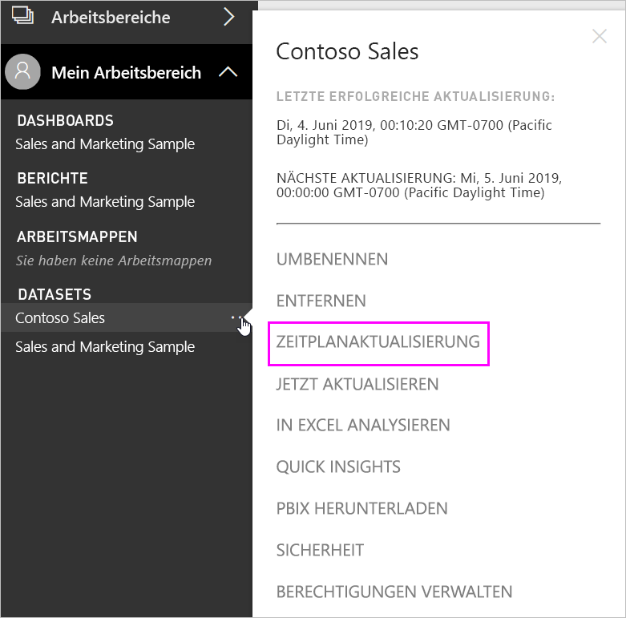
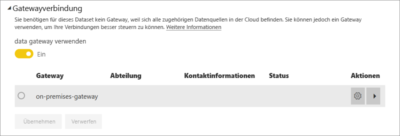
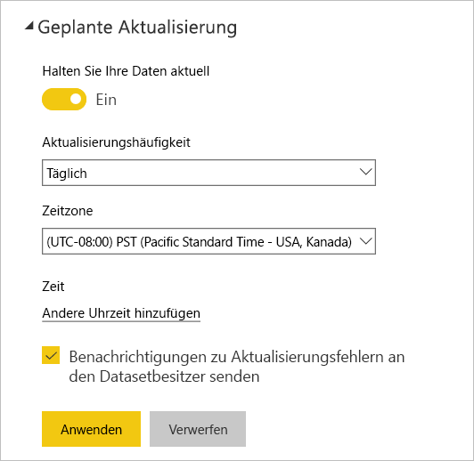

# Konfigurieren von geplanten Aktualisierungen

>[!NOTE]
>Nach zwei Monaten der Inaktivität wird die geplante Aktualisierung Ihres Datasets ausgesetzt. Weitere Informationen finden Sie später in diesem Artikel unter [*Geplante Aktualisierung*](#scheduled-refresh).

In diesem Artikel werden die Optionen beschrieben, die für die geplante Aktualisierung des [lokalen Datengateways (persönlicher Modus)](service-gateway-personal-mode.md) und des [lokalen Datengateways](service-gateway-onprem.md) verfügbar sind. Geben Sie die Aktualisierungsoptionen in den folgenden Power BI-Dienstbereichen an: **Gatewayverbindung**, **Anmeldeinformationen für die Datenquelle** und **Geplante Aktualisierung**. Wir sehen uns nachfolgend jeden einzelnen nacheinander an. Weitere Informationen zur Datenaktualisierung, einschließlich Einschränkungen für Aktualisierungszeitpläne, finden Sie unter [Datenaktualisierung](refresh-data.md#data-refresh).

So gelangen Sie zum Bildschirm für die **Geplante Aktualisierung**

1. Wählen Sie im Navigationsbereich neben einem Dataset, das unter **Datasets** aufgelistet ist, **Weitere Optionen** (...) aus.
2. Wählen Sie **Zeitplanaktualisierung** aus.

    

## Gatewayverbindung

Abhängig davon, ob Sie ein Personal oder Enterprise-Gateway online und verfügbar haben, werden Ihnen hier verschiedene Optionen angezeigt.

Falls kein Gateway verfügbar ist, wird Ihnen **Gatewayverbindung** als deaktiviert angezeigt. Ihnen wird auch eine Meldung angezeigt, die angibt, wie Sie das Personal Gateway installieren.

Falls Sie ein persönliches Gateway konfiguriert haben, steht es Ihnen als Auswahlmöglichkeit zur Verfügung, sofern es online ist. Es wird „offline“ anzeigen, falls es nicht verfügbar ist.

Sie können auch das Enterprise-Gateway verwenden, falls Ihnen eins zur Verfügung steht. Ihnen wird nur dann ein Enterprise-Gateway als verfügbar angezeigt, wenn Ihr Konto in der Registerkarte **Benutzer** der für ein bestimmtes Gateway konfigurierten Datenquelle aufgelistet ist.

## Datenquellen-Anmeldeinformationen

### Power BI Gateway – Personal

Falls Sie das persönliche Gateway zum Aktualisieren der Daten verwenden, müssen Sie die Anmeldeinformationen angeben, um eine Verbindung mit der Back-End-Datenquelle herzustellen. Falls Sie mit einem Inhaltspaket von einem Onlinedienst verbunden sind, werden die eingegebenen Anmeldeinformationen für die geplante Aktualisierung übernommen.

Sie müssen sich nur beim ersten Mal bei Datenquellen anmelden, wenn Sie dieses Dataset aktualisiert haben. Sobald Sie sie eingegeben haben, werden diese Anmeldeinformationen im Dataset beibehalten.

> [!NOTE]
> Wenn sich das Kennwort, das Sie für die Anmeldung in der Datenquelle verwenden, geändert hat oder es abgelaufen ist, erfordern einige Authentifizierungsmethoden, dass Sie das Kennwort für die Datenquellen auch unter **Datenquellen-Anmeldeinformationen** ändern.

Wenn etwas schief geht, steht das Problem normalerweise im Zusammenhang damit, dass das Gateway offline ist, weil es sich nicht bei Windows anmelden und den Dienst starten konnte, oder damit, dass sich Power BI nicht bei den Datenquellen anmelden konnte, um eine Abfrage nach aktualisierten Daten durchzuführen. Wenn die Aktualisierung fehlschlägt, überprüfen Sie das Dataseteinstellungen. Wenn der Gatewaydienst offline ist, wird Ihnen unter **Status** der Fehler angezeigt. Wenn sich Power BI nicht bei den Datenquellen anmelden kann, sehen Sie eine Fehlermeldung in den Anmeldeinformationen für die Datenquellen.

### Lokales Datengateway

Wenn Sie das lokale Datengateway zum Aktualisieren von Daten verwenden, müssen Sie keine Anmeldeinformationen angeben, da diese vom Gatewayadministrator für die Datenquelle definiert werden.

> [!NOTE]
> Bei lokalen Verbindungen mit SharePoint für die Datenaktualisierung unterstützt Power BI nur *Anonyme Authentifizierung*, *Standardauthentifizierung* und *Windows-Authentifizierung (NTLM/Kerberos)* . Power BI unterstützt die *ADFS-Authentifizierung* und *formularbasierte Authentifizierung* für die Datenaktualisierung von lokalen SharePoint-Datenquellen nicht.

## Geplante Aktualisierung

Im Bereich **Geplante Aktualisierung** definieren Sie das Aktualisierungsintervall und Aktualisierungszeitfenster für das Dataset. Einige Datenquellen erfordern kein für die Aktualisierung konfiguriertes Gateway, während dies für andere Datenquellen erforderlich ist.

Der Schieberegler **Halten Sie Ihre Daten aktuell** muss auf **Ja** festgelegt sein, um die Einstellungen konfigurieren zu können.

> [!NOTE]
> Der Power BI-Dienst ist darauf ausgelegt, die Aktualisierung der Daten innerhalb einer Toleranz von **15 Minuten** für den geplanten Aktualisierungszeitraum zu initiieren.

> [!NOTE]
> Nach zwei Monaten der Inaktivität wird die geplante Aktualisierung Ihres Datasets ausgesetzt. Ein Dataset wird als inaktiv betrachtet, wenn kein Benutzer die darauf basierenden Dashboards oder Berichte aufgerufen hat. In diesem Fall wird dem Besitzer des Datasets eine E-Mail gesendet, die darauf hinweist, dass die geplante Aktualisierung angehalten wurde. Der Aktualisierungszeitplan für das Dataset wird dann als **deaktiviert** angezeigt. Um die geplante Aktualisierung wiederaufzunehmen, rufen Sie einfach ein Dashboard oder einen Bericht auf, dem das Dataset zugrunde liegt.

## Was wird unterstützt?

Bestimmte Datasets werden gegenüber verschiedenen Gateways für geplante Aktualisierungen unterstützt. Hier finden Sie eine Referenz, dazu was verfügbar ist.

### Power BI Gateway – Personal

**Power BI Desktop**

* Alle Onlinedatenquellen, die unter **Daten abrufen** und im Abfrage-Editor von Power BI Desktop angezeigt werden.
* Alle lokalen Datenquellen, die unter **Daten abrufen** oder im Abfrage-Editor von Power BI Desktop angezeigt werden, außer Hadoop-Dateien (HDFS) und Microsoft Exchange.

**Excel**

* Alle in Power Query angezeigten Datenquellen.
* Alle lokalen Datenquellen, die unter Power Query angezeigt werden, außer Hadoop-Dateien (HDFS) und Microsoft Exchange.
* Alle in Power Pivot angezeigten Onlinedatenquellen.
* Alle lokalen Datenquellen, die unter Power Pivot angezeigt werden, außer Hadoop-Dateien (HDFS) und Microsoft Exchange.

> [!NOTE]
> In Excel 2016 und höher wird Power Query im Abschnitt **Daten** des Menübandes unter **Abrufen und transformieren** von Daten aufgeführt.

### Power BI Gateway

Weitere Informationen zu unterstützten Datenquellen finden Sie unter [Power BI-Datenquellen](power-bi-data-sources.md).

## Problembehandlung
Manchmal werden Daten nicht wie erwartet aktualisiert. Dies weist meistens auf ein Problem mit dem Gateway hin. In den Artikeln über die Fehlerbehebung bei Gateways finden Sie Tools und Informationen zu bekannten Problemen.

- [Problembehandlung beim lokalen Datengateway](service-gateway-onprem-tshoot.md)
- [Problembehandlung für Power BI Gateway – Personal](service-admin-troubleshooting-power-bi-personal-gateway.md)

## Nächste Schritte

- [Aktualisieren von Daten in Power BI](refresh-data.md)  
- [Power BI Gateway – Personal](service-gateway-personal-mode.md)  
- [Lokales Datengateway (persönlicher Modus)](service-gateway-onprem.md)  
- [Problembehandlung beim lokalen Datengateway](service-gateway-onprem-tshoot.md)  
- [Problembehandlung für Power BI Gateway – Personal](service-admin-troubleshooting-power-bi-personal-gateway.md)  

Weitere Fragen? [Stellen Sie Ihre Frage in der Power BI-Community.](https://community.powerbi.com/)