# Verwenden von freigegebenen Datasets im Power BI-Berichts-Generator

Sie können ein Dataset, das Sie in Power BI Desktop erstellt haben, als Datenquelle für paginierte Berichte des Power BI-Berichts-Generators verwenden. Stellen Sie sich dieses Szenario vor: Sie haben einen Power BI-Bericht in Power BI Desktop erstellt. Sie haben viel Zeit damit verbracht, das Datenmodell zu entwerfen, und haben dann einen schönen Power BI-Bericht mit allen möglichen tollen visuellen Elementen erstellt. Ihr Bericht enthält eine Matrix mit vielen Zeilen, sodass Sie scrollen müssen, um alle Zeilen anzuzeigen. Die Leser Ihres Berichts wünschen einen Bericht, den sie drucken können und in dem alle Zeilen aus dieser Matrix enthalten sind. Ein paginierter Power BI-Bericht ist dafür geeignet: Drucken Sie eine Tabelle oder Matrix, die über mehrere Seiten verteilt ist, mit Kopf- und Fußzeilen und einem perfekten Seitenlayout, das Sie entworfen haben. Dieser Bericht ergänzt den Power BI Desktop-Bericht. Sie möchten, dass beide Berichte auf genau denselben Daten basieren, ohne Abweichungen, also verwenden Sie dasselbe Dataset.

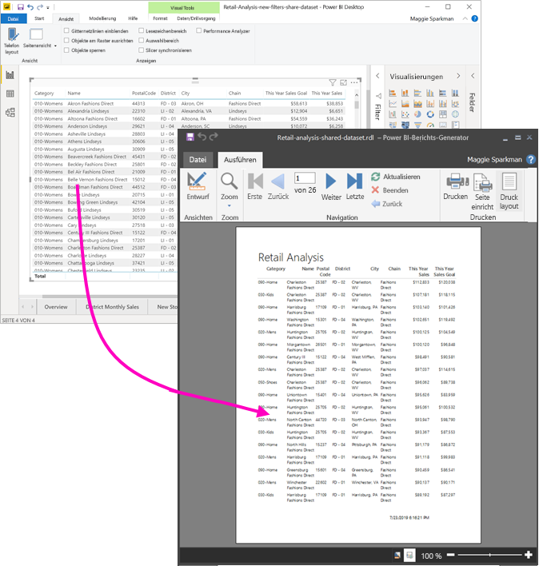

Der Datensatz muss sich nicht in einem Arbeitsbereich in einer Premium-Kapazität befinden, und Sie müssen kein Mitglied dieses Arbeitsbereichs sein. Sie müssen lediglich die [Erstellungsberechtigung](service-datasets-build-permissions.md) für das Dataset haben. Um Ihren paginierten Bericht veröffentlichen zu können, benötigen Sie eine Power BI Pro-Lizenz. Außerdem benötigen Sie mindestens eine „Mitwirkender“-Rolle für einen Arbeitsbereich in einer Premium-Kapazität.

## Voraussetzung

Im folgenden finden Sie eine Liste der Elemente, die Sie benötigen oder nicht benötigen, um ein freigegebenes Dataset im Power BI Berichts-Generator zu verwenden.

- Power BI-Berichts-Generator. [Laden Sie den Power BI-Berichts-Generator herunter, und installieren Sie ihn](https://go.microsoft.com/fwlink/?linkid=2086513).
- Um auf ein Power BI-Dataset zugreifen zu können, benötigen Sie die Erstellungsberechtigung für das Dataset. Erfahren Sie mehr über [Erstellungsberechtigung](service-datasets-build-permissions.md).
- Sie benötigen keine Power BI Pro-Lizenz, um im Berichts-Generator einen paginierten Bericht zu erstellen. 
- Sie benötigen eine Power BI Pro-Lizenz, um Ihren paginierten Bericht veröffentlichen zu können. Außerdem benötigen Sie mindestens eine „Mitwirkender“-Rolle für einen Arbeitsbereich in einer Premium-Kapazität. 
- Optional: Wenn Sie den Schritten in diesem Artikel folgen möchten, laden Sie die Power BI Desktop-Datei [Retail Analysis Sample PBIX.pbix](http://download.microsoft.com/download/9/6/D/96DDC2FF-2568-491D-AAFA-AFDD6F763AE3/Retail%20Analysis%20Sample%20PBIX.pbix) herunter, öffnen Sie die Datei in Power BI Desktop, und fügen Sie eine Tabelle mit vielen Spalten hinzu. Deaktivieren Sie im Bereich **Format** die Option **Gesamt**. Veröffentlichen Sie die Datei dann in einem Arbeitsbereich im Power BI-Dienst.

    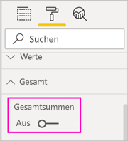

## Herstellen einer Verbindung mit dem Power BI-Dataset

1. Öffnen Sie den Power BI-Berichts-Generator.
1. Wählen Sie **Anmelden** in der oberen rechten Ecke des Berichts-Generators aus, um sich bei Ihrem Power BI-Konto anzumelden.
1. Wählen Sie im Bereich „Berichtsdaten“ den Befehl **Neu** > **Power BI-Datasetverbindung** aus.

    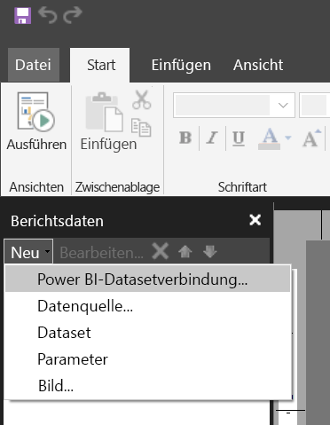

    > [!NOTE]
    > Sie können die Datenquelle oder das Dataset für ein Power BI-Dataset nicht mit dem Tabellen-, Matrix-oder Diagramm-Assistenten des Berichts-Generators erstellen. Nachdem Sie die Datenquelle oder das Dataset erstellt haben, können Sie den jeweiligen Assistenten verwenden, um auf Basis der Datenquelle oder des Datasets Tabellen, Matrizen oder Diagramme zu erstellen.

1. Suchen Sie nach dem Dataset oder dem Arbeitsbereich, in dem sich das Dataset befindet, und wählen Sie **Auswählen** aus.
    Der Berichts-Generator füllt den Datasetnamen aus.

    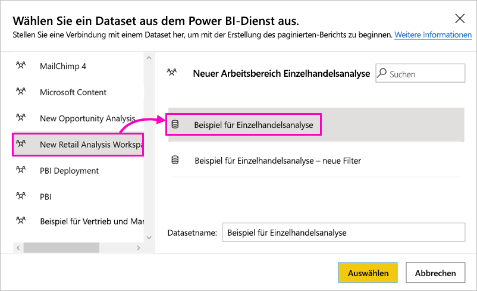
    
1. Das Dataset wird im Bereich „Berichtsdaten“ unter „Datenquellen“ aufgelistet.

    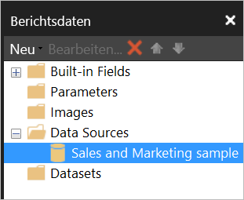

    Es sei daran erinnert, dass Sie im selben paginierten Bericht Verbindungen mit mehreren Power BI-Datasets und anderen Datenquellen herstellen können.

## Abrufen der Abfrage für das Dataset

Sollen die Daten im Power BI-Bericht und in Ihrem Berichts-Generator-Bericht identisch sein, reicht es nicht aus, eine Verbindung mit dem Dataset herzustellen. Sie benötigen auch die Abfrage, die auf diesem Dataset basiert.

1. Öffnen Sie den Power BI-Bericht (PBIX-Datei) in Power BI Desktop.
1. Vergewissern Sie sich, dass es in Ihrem Bericht eine Tabelle gibt, die alle Daten enthält, die Sie in Ihrem paginierten-Bericht benötigen.

1. Wählen Sie auf dem Menüband **Ansicht** die Option **Performance Analyzer** aus.

    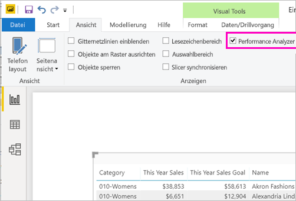

1. Wählen Sie im Bereich **Performance Analyzer** die Option **Aufzeichnung starten** aus, und wählen Sie dann **Visuals aktualisieren** aus.

    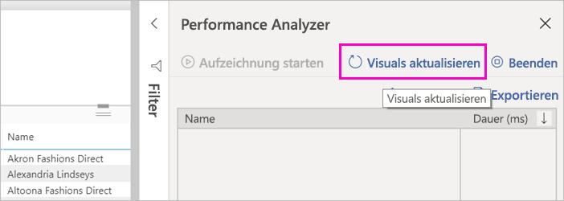

1. Erweitern Sie das Pluszeichen **(+** ) neben dem Tabellennamen, und wählen **Abfrage kopieren** aus. Die Abfrage ist die DAX-Formel, die Sie für das Dataset im Power BI-Berichts-Generator benötigen.

    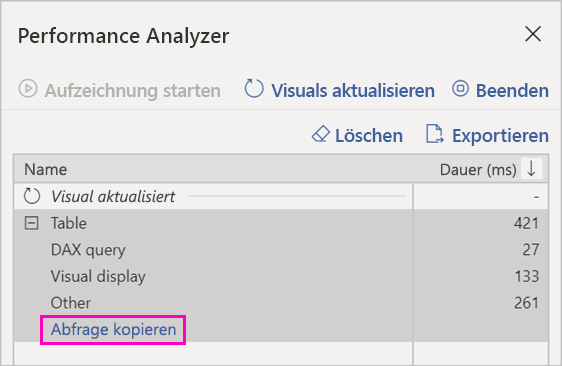

## Erstellen des Datasets mit der Abfrage

1. Wechseln Sie zurück zum Power BI-Berichts-Generator.
1. Klicken Sie unter **Datenquellen** mit der rechten Maustaste auf das Dataset, und wählen Sie **Dataset hinzufügen** aus.

    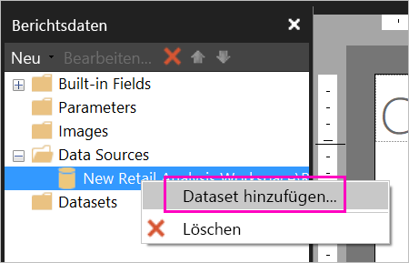

1. Geben Sie dem Dataset in den „Dataseteigenschaften“ einen Namen, und wählen Sie **Abfrage-Designer** aus.

4. Wählen Sie **DAX** aus, und deaktivieren Sie das Symbol **Entwurfsmodus**.

    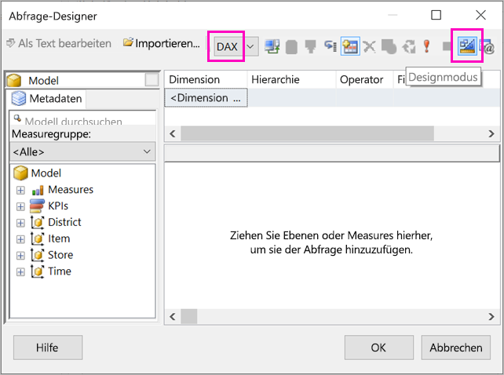

1. Fügen Sie in das obere Feld die Abfrage ein, die Sie aus Power BI Desktop kopiert haben.

1. Wählen Sie **Abfrage ausführen** (das rote Ausrufezeichen, !) aus, um sich zu vergewissern, dass die Abfrage funktioniert. 

    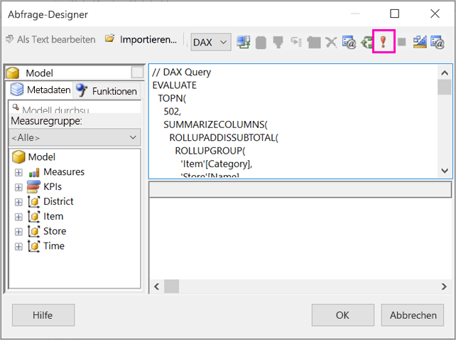

    Die Ergebnisse der Abfrage werden im unteren Feld angezeigt.

    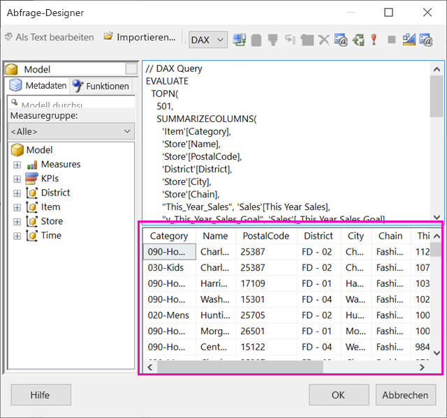

1. Wählen Sie **OK**aus. 

    Ihre Abfrage wird im Bereich **Abfrage** des Dialogfelds **Dataseteigenschaften** angezeigt.

    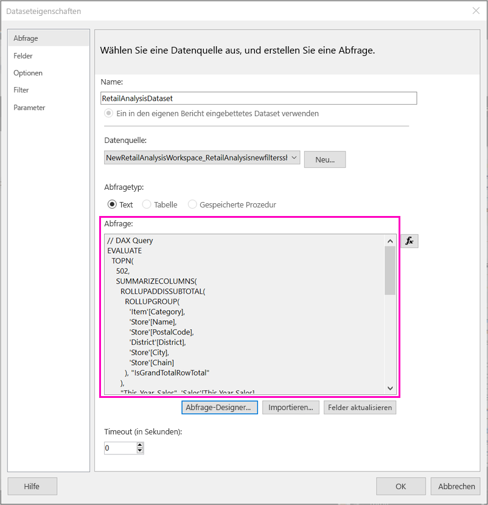

1. Wählen Sie **OK**aus.

    Nun wird das neue Dataset mit einer Liste seiner Felder im Bereich „Berichtsdaten“ angezeigt.

    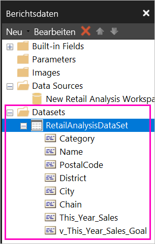

## Erstellen einer Tabelle im Bericht

Eine schnelle Möglichkeit zum Erstellen einer Tabelle besteht darin, den Tabellen-Assistenten zu verwenden.

1. Wählen Sie auf dem Menüband **Einfügen** die Option **Tabelle** > **Tabellen-Assistent** aus.

    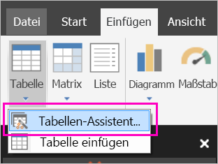

1. Wählen Sie das Dataset aus, das Sie mit der DAX-Abfrage erstellt haben, und wählen Sie **Weiter** aus.

    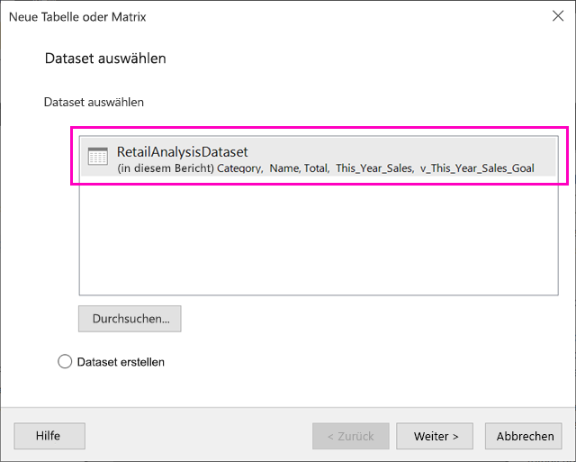

1. Um eine flache Tabelle zu erstellen, wählen Sie die gewünschten Felder in **Verfügbare Felder** aus. Sie können mehrere Felder gleichzeitig auswählen, indem Sie das erste gewünschte Feld auswählen, die UMSCHALTTASTE gedrückt halten und das letzte Feld auswählen.

    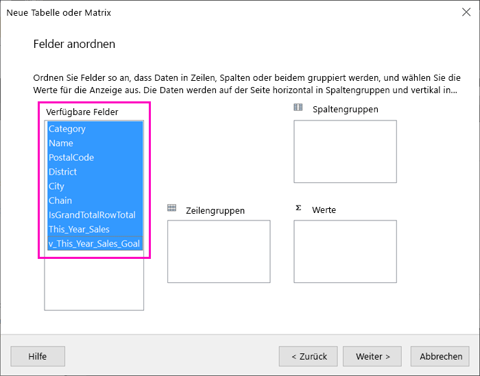

1. Ziehen Sie die Felder in das Feld **Werte**, und wählen Sie **Weiter** aus.

    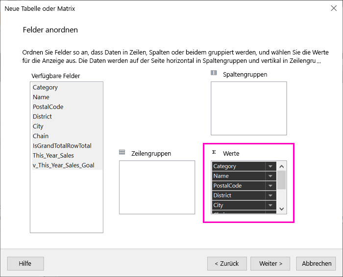

1. Wählen Sie die gewünschten Layoutoptionen aus, und wählen Sie **Weiter** aus.

1. Wählen Sie **Fertig stellen**aus.
    Die Tabelle wird in der Entwurfsansicht angezeigt.

    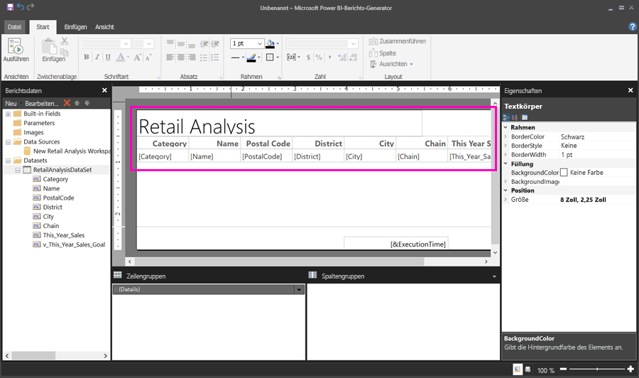

1. Wählen Sie **Zum Hinzufügen eines Titels klicken** aus, und fügen Sie einen Titel hinzu.

1. Wählen Sie **Ausführen** aus, um eine Vorschau Ihres Berichts anzuzeigen.

    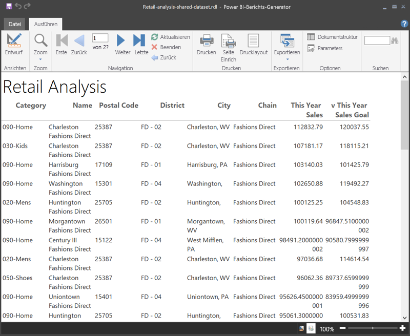

1. Wählen Sie **Drucklayout** aus, um zu sehen, wie der gedruckte Bericht aussieht. 

    Dieses Berichtslayout erfordert einige Arbeit. Es hat 54 Seiten, weil die Spalten und Ränder dazu führen, dass die Tabelle zwei Seiten breit ist.

    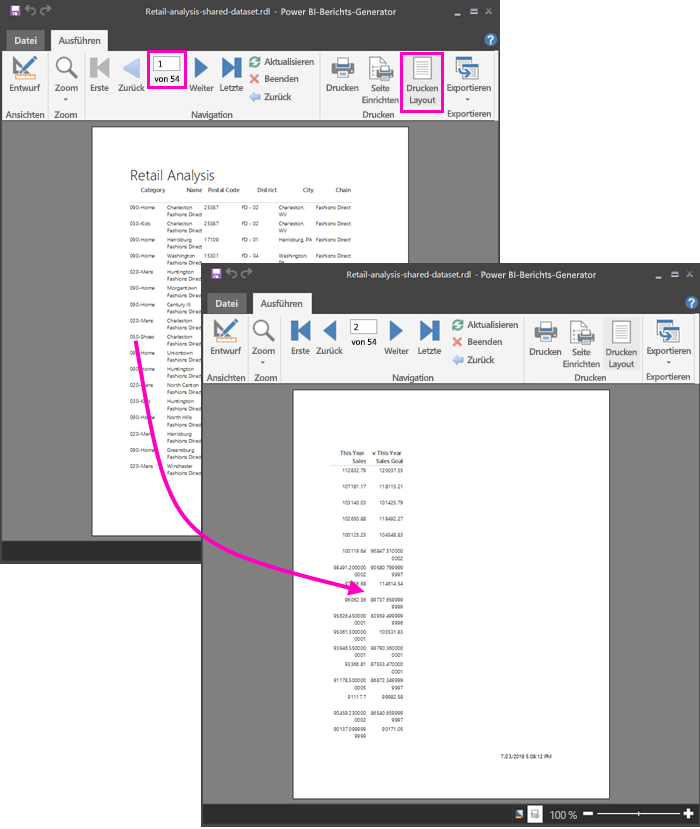

## Formatieren des Berichts

Sie haben mehrere Formatierungsoptionen, um zu bewirken, dass die Tabelle auf eine Seite passt. 

1. Sie können die Seitenränder im Bereich „Eigenschaften“ verkleinern. Wenn der Bereich „Eigenschaften“ nicht angezeigt wird, aktivieren Sie auf dem Menüband **Ansicht** das Kontrollkästchen **Eigenschaften**.

1. Wählen Sie den Bericht, nicht die Tabelle oder den Titel aus.
1. Erweitern Sie im Bereich **Berichtseigenschaften** unter **Seite** die Option **Ränder**, und ändern Sie jeden Rand in **1,91 cm**.

    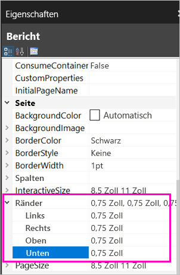

1. Sie können auch Spalten schmaler machen. Wählen Sie den Spaltenrand aus, und ziehen Sie die rechte Seite nach links.

    

1. Eine weitere Option ist sicherzustellen, dass die Zahlenwerte ordentlich formatiert sind. Wählen Sie eine Zelle mit einem Zahlenwert aus. 
    > [!TIP]
    > Sie können mehrere Zellen gleichzeitig formatieren, indem Sie die UMSCHALTTASTE gedrückt halten, während Sie die anderen Zellen auswählen.

    

1. Ändern Sie auf dem Menüband **Home** im Abschnitt **Zahl** das Format **Standard** in ein numerisches Format, etwa **Währung**.

    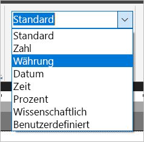

1. Ändern Sie den **Platzhalter**-Stil in **Beispielwerte**, damit Sie die Formatierung in der Zelle sehen können. 

    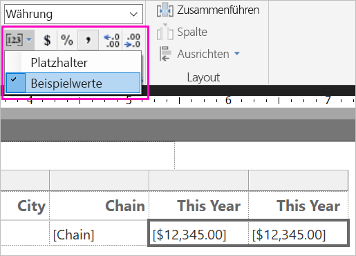

1. Verringern Sie ggf. im Abschnitt **Zahl** die Dezimalstellen, um weiteren Platz zu sparen.

### Entfernen von leeren Seiten

Auch wenn Sie die Ränder und die Tabellenspalten schmaler gemacht haben, kann es vorkommen, dass weiterhin jede weitere Seite leer ist. Warum? Der Grund liegt in der Mathematik. 

Wenn Sie die Seitenränder, die Sie festgelegt haben, und die Breite des *Textes* des Berichts addieren, muss die Gesamtbreite kleiner sein als die Breite des Berichtsformats.

Angenommen, Ihr Bericht liegt im Format 21 cm x 29,7 cm vor, und Sie haben jeden Seitenrand auf 1,91 cm festgelegt. Die beiden Ränder ergeben zusammen 3,82 cm, sodass der Text schmaler als 17,18 cm sein muss.

1. Wählen Sie den rechten Rand der Berichtsentwurfsfläche aus, und ziehen Sie ihn, sodass er kleiner ist als die gewünschte Zahl auf dem Lineal. 

    > [!TIP]
    > Sie können ihn genauer in den **Textkörper**-Eigenschaften festlegen. Legen Sie unter **Größe** die Eigenschaft **Breite** fest.

    

1. Wählen Sie **Ausführen** aus, um den Bericht in der Vorschau anzuzeigen, und vergewissern Sie sich, dass die leeren Seiten entfernt wurden. Dieser Bericht hat jetzt nur 26 Seiten anstelle der ursprünglichen 54. Der Vorgang war erfolgreich.

    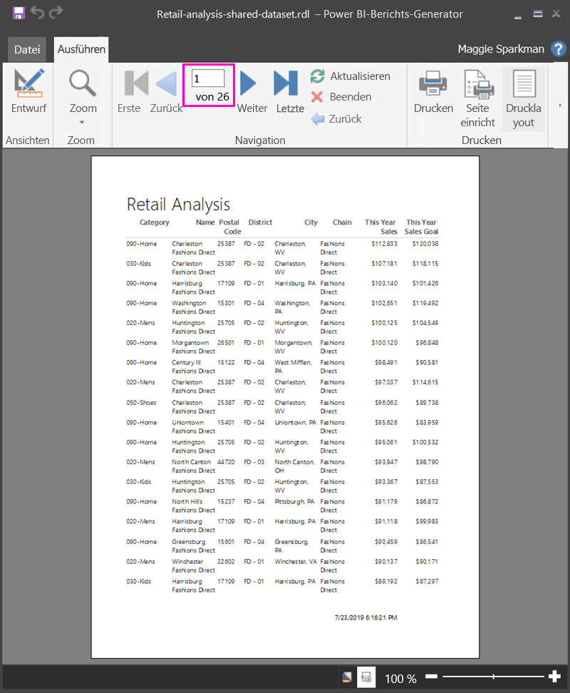

## Einschränkungen und Überlegungen 

- Für Datasets, für die eine Liveverbindung mit Analysis Services verwendet wird, können Sie eine direkte Verbindung herstellen, indem Sie die zugrunde liegende Analysis Services-Verbindung anstelle eines freigegebenen Datasets verwenden.
- Datasets mit der Empfehlung „Höher gestuft“ oder „Zertifiziert“ werden in der Liste der verfügbaren Datasets angezeigt, sind jedoch nicht als solche gekennzeichnet. 

## Nächste Schritte

- [Was sind paginierte Berichte in Power BI Premium? (Vorschau)](paginated-reports-report-builder-power-bi.md)