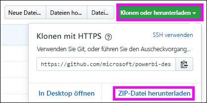

# <a name="embed-a-power-bi-report-server-report-using-an-iframe-in-sharepoint-server"></a>Einbetten eines Power BI-Berichtsserver-Berichts in einen iFrame in SharePoint Server

In diesem Artikel erfahren Sie, wie Sie einen Bericht des Power BI-Berichtsservers mithilfe eines iFrames in eine SharePoint-Seite einbetten. Wenn Sie mit SharePoint Online arbeiten, muss der öffentliche Zugriff auf den Power BI-Berichtsserver möglich sein. In SharePoint Online kann der Power BI-Webpart, der mit dem Power BI-Dienst eingesetzt wird, nicht mit dem Power BI-Berichtsserver verwendet werden.  


## <a name="prerequisites"></a>Voraussetzungen
* Der [Power BI-Berichtsserver](https://powerbi.microsoft.com/report-server/) ist installiert und konfiguriert.
* Die [für den Power BI-Berichtsserver optimierte Version von Power BI Desktop](install-powerbi-desktop.md) ist installiert.
* Eine [SharePoint-Umgebung](https://docs.microsoft.com/sharepoint/install/install) ist installiert und konfiguriert.

## <a name="create-the-power-bi-report-url"></a>Erstellen der Power BI-Berichts-URL

1. Laden Sie das Beispiel [Blogdemo](https://github.com/Microsoft/powerbi-desktop-samples) von GitHub herunter. Klicken Sie auf **Clone or download** (Klonen oder herunterladen) und anschließend auf **Download ZIP** (ZIP herunterladen).

    

2. Entzippen Sie die Datei, und öffnen Sie die PBIX-Beispieldatei in der für den Power BI-Berichtsserver optimierten Version von Power BI Desktop.

    

3. Speichern Sie den Bericht auf dem **Power BI-Berichtsserver**. 

    

4. Lassen Sie sich den Bericht im Webportal des Power BI-Berichtsservers anzeigen.

    

### <a name="capture-the-url-parameter"></a>Erfassen des URL-Parameters

Sobald die URL verfügbar ist, können Sie auf einer SharePoint-Seite einen iFrame erstellen, in dem der Bericht gehostet wird. Fügen Sie einer beliebigen URL eines Berichts des Power BI-Berichtsservers den Abfragezeichenfolgenparameter `?rs:embed=true` hinzu, um den Bericht in einen SharePoint-iFrame einzubetten.

   Beispiel:
    ``` 
    https://myserver/reports/powerbi/Sales?rs:embed=true
    ```
## <a name="embed-the-report-in-a-sharepoint-iframe"></a>Einbetten des Berichts in einen SharePoint-iFrame

1. Navigieren Sie zu einer **Websiteinhalte**-Seite in SharePoint.

    

2. Wählen Sie die Seite aus, auf der Sie Ihren Bericht hinzufügen möchten.

    

3. Klicken Sie auf das Zahnradsymbol oben rechts und dann auf **Seite bearbeiten**.

    

4. Klicken Sie auf **Webpart hinzufügen**.

5. Klicken Sie unter **Kategorien** auf **Medien und Inhalt**. Klicken Sie unter **Webparts** auf **Inhalts-Editor** und anschließend auf **Hinzufügen**.

    

6. Wählen Sie **Hier klicken, um neue Inhalte hinzuzufügen** aus.

7. Klicken Sie im oberen Menü auf **Text formatieren** und anschließend auf **Quelle bearbeiten**.

     

8. Fügen Sie im Fenster **Quelle bearbeiten** den iFrame-Code in **HTML-Quelle** ein, und klicken Sie auf **OK**.

    

     Beispiel:
     ```html
     <iframe width="800" height="600" src="https://myserver/reports/powerbi/Sales?rs:embed=true" frameborder="0" allowFullScreen="true"></iframe>
     ```

9. Klicken Sie im oberen Menü auf **Seite** und anschließend auf **Bearbeitung beenden**.

    

    Der Bericht wird auf der Seite angezeigt.

    

## <a name="next-steps"></a>Nächste Schritte

- [Erstellen eines Power BI-Berichts für den Power BI-Berichtsserver](quickstart-create-powerbi-report.md)  
- [Erstellen eines paginierten Berichts für den Power BI-Berichtsserver](quickstart-create-paginated-report.md)  

Weitere Fragen? [Wenden Sie sich an die Power BI-Community](https://community.powerbi.com/). 