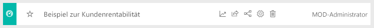
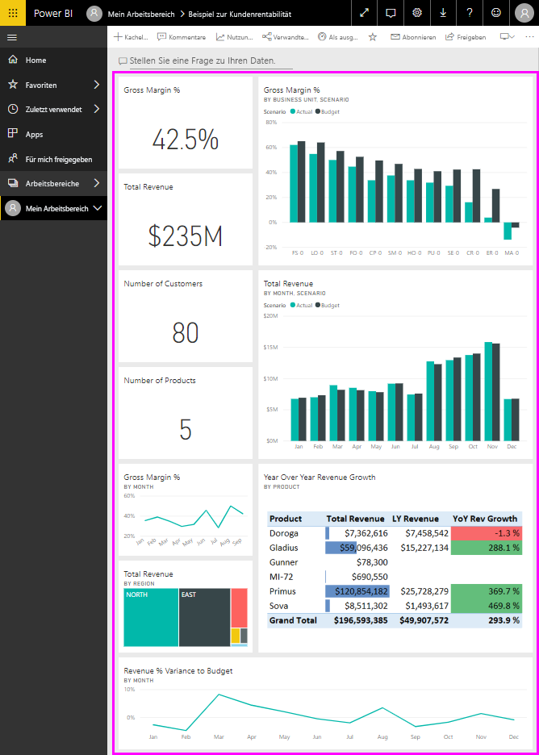
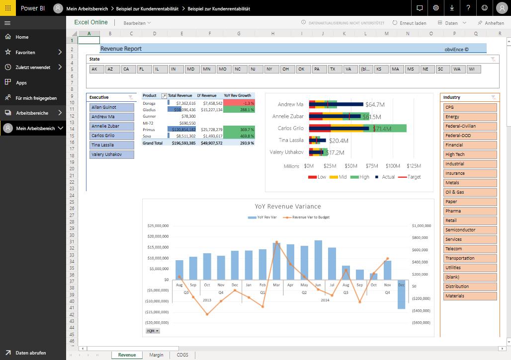
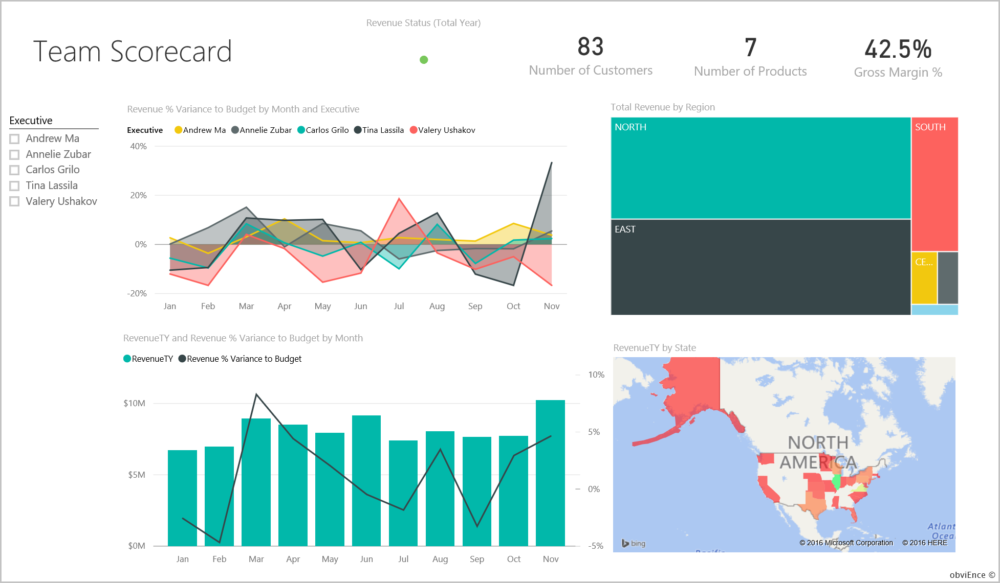
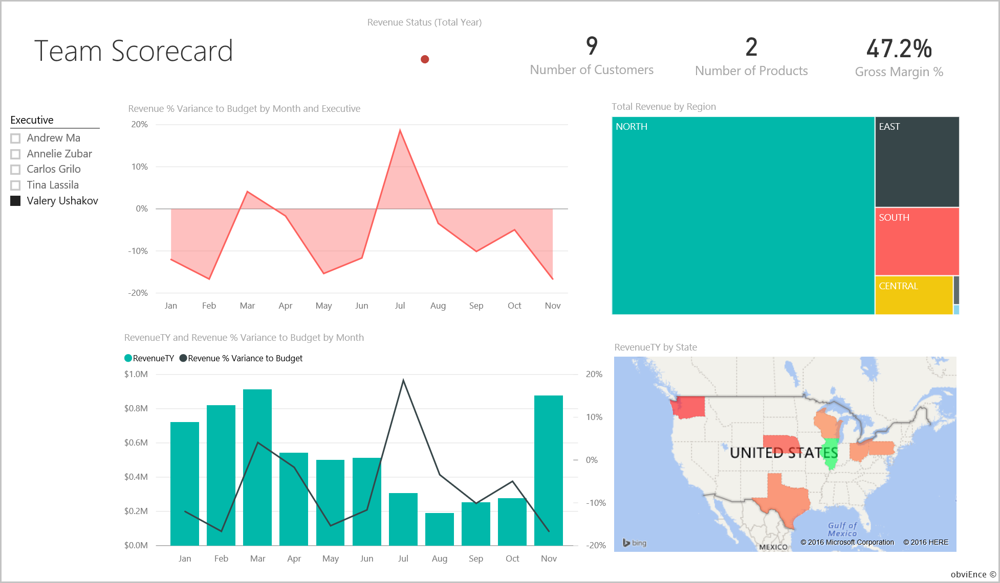
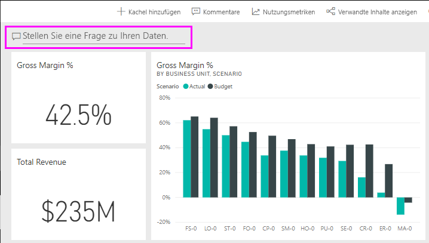
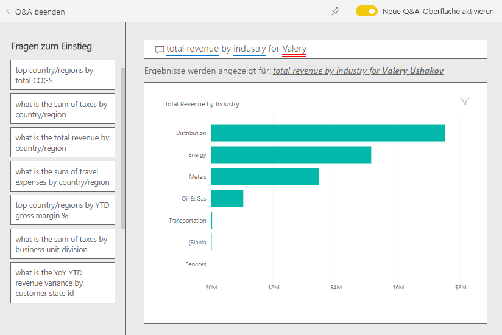
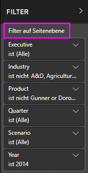
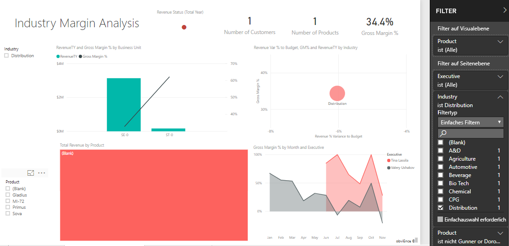
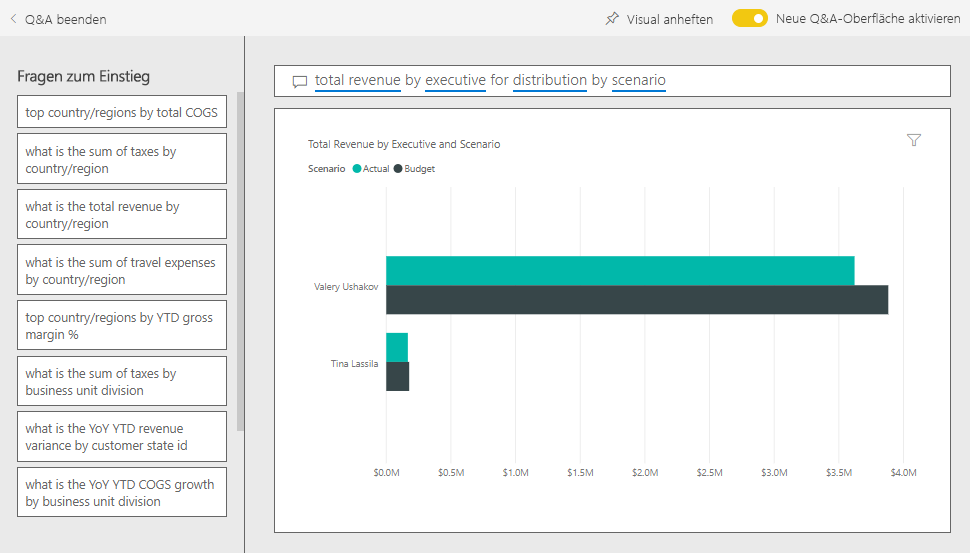

# Beispiel zur Kundenrentabilität für Power BI: Übersicht

Das Inhaltspaket „Beispiel zur Kundenrentabilität“ enthält ein Dashboard, einen Bericht und ein Dataset für ein Unternehmen, das Marketingmaterial erstellt. Dieses Dashboard wurde von einer Finanzdirektorin (CFO) erstellt, um die Metriken für ihre fünf Business Unit Manager (Führungskräfte), Produkte, Kunden und den Bruttogewinn verfolgen zu können. Auf einen Blick kann die Finanzdirektorin sehen, welche Faktoren die Rentabilität beeinflussen.

Dieses Beispiel ist Teil einer Reihe, die Ihnen die Verwendung von Power BI anhand geschäftsbezogener Daten, Berichte und Dashboards zeigt. Es wurde von [obviEnce](http://www.obvience.com/) mit echten Daten erstellt, die anonymisiert wurden. Die Daten sind in verschiedenen Formaten verfügbar: Inhaltspaket, Power BI Desktop-PBIX-Datei oder Excel-Arbeitsmappe. Weitere Informationen finden Sie unter [Welche Beispieldaten sind für die Verwendung mit Power BI verfügbar?](sample-datasets.md). 

Dieses Tutorial erkundet das Inhaltspaket „Beispiel zur Kundenrentabilität“ im Power BI-Dienst. Da die Berichtsoberfläche in Power BI Desktop und im Dienst ähnlich sind, können Sie das Tutorial auch anhand der PBIX-Beispieldatei in Power BI Desktop nachvollziehen. 

Sie benötigen keine Power BI-Lizenz, um die Beispiele in Power BI Desktop kennenzulernen. Wenn Sie nicht über eine Power BI Pro-Lizenz verfügen, können Sie das Beispiel im Power BI-Dienst in Ihrem Arbeitsbereich speichern. 

## Abrufen des Beispiels

Bevor Sie das Beispiel verwenden können, müssen Sie es zunächst als [Inhaltspaket](#get-the-content-pack-for-this-sample), [PBIX-Datei](#get-the-pbix-file-for-this-sample) oder [Excel-Arbeitsmappe](#get-the-excel-workbook-for-this-sample) herunterladen.

### Abrufen des Inhaltspakets für dieses Beispiel

1. Öffnen Sie den Power BI-Dienst (app.powerbi.com), melden Sie sich an, und öffnen Sie den Arbeitsbereich, in dem Sie das Beispiel speichern möchten.

   Wenn Sie nicht über eine Power BI Pro-Lizenz verfügen, können Sie das Beispiel in Ihrem Arbeitsbereich speichern.

2. Wählen Sie in der linken unteren Ecke **Daten abrufen** aus.

   
3. Klicken Sie auf der daraufhin angezeigten Seite **Daten abrufen** auf **Beispiele**.

4. Wählen Sie **Customer Profitability Sample** aus, und klicken Sie dann auf **Verbinden**.  

    
5. Das Inhaltspaket wird in Power BI importiert, und dem aktuellen Arbeitsbereich werden ein neues Dashboard, ein neuer Bericht und ein neues Dataset hinzugefügt.

    

### Abrufen der PBIX-Datei für dieses Beispiel

Alternativ können Sie das Beispiel zur Kundenrentabilität als [PBIX-Datei](http://download.microsoft.com/download/6/A/9/6A93FD6E-CBA5-40BD-B42E-4DCAE8CDD059/Customer%20Profitability%20Sample%20PBIX.pbix) herunterladen. Dabei handelt es sich um ein für Power BI Desktop entworfenes Dateiformat.

### Abrufen der Excel-Arbeitsmappe für dieses Beispiel

Wenn Sie sich die Datenquelle für dieses Beispiel ansehen möchten, dieses steht auch als [Excel-Arbeitsmappe](http://go.microsoft.com/fwlink/?LinkId=529781) zur Verfügung. Die Arbeitsmappe enthält Power View-Blätter, die Sie anzeigen und ändern können. Aktivieren Sie die Add-Ins für die Datenanalyse, um die Rohdaten anzuzeigen, und klicken Sie dann auf **Power Pivot > Verwalten**. Weitere Informationen zum Aktivieren der Add-Ins für Power View und Power Pivot finden Sie unter [Anzeigen der Excel-Beispiele in Excel](sample-datasets.md#optional-take-a-look-at-the-excel-samples-from-inside-excel-itself).

## Welche Erkenntnisse gewinnen wir über unser Dashboard?

Suchen Sie in dem Arbeitsbereich, in dem Sie das Beispiel gespeichert haben, das Dashboard „Customer Profitability Sample“, und wählen Sie es aus:

### Unternehmensweite Dashboardkacheln
1. Öffnen Sie das Dashboard im Power BI-Dienst. Auf den Dashboardkacheln erhält die Finanzdirektorin einen groben Überblick über die Metriken des Unternehmens, die für sie wichtig sind. Wenn sie etwas Interessantes sieht, kann sie eine Kachel auswählen, um einen genaueren Blick auf die Daten zu werfen.

2. Sehen Sie sich die Kacheln auf der linken Seite des Dashboards an.

    

   Beachten Sie Folgendes:
   - Der Bruttogewinn des Unternehmens beträgt 42,5 %.
   - Es hat 80 Kunden.
   - Es verkauft fünf verschiedene Produkte.
   - Die niedrigste Umsatzabweichung vom Budget in Prozent war im Februar, gefolgt von der höchsten Abweichung im März.
   - Die meisten Einnahmen stammen aus den Regionen „East“ (Osten) und „North“ (Norden). Der Bruttogewinn hat zu keinem Zeitpunkt das Budget überschritten, wobei die Geschäftseinheiten „ER-0“ und „MA-0“ näher untersucht werden müssen.
   - Der Gesamtumsatz für das Jahr liegt nahe an der Budgetvorgabe.

### Managerspezifische Dashboardkacheln
Die Kacheln auf der rechten Seite des Dashboard zeigen eine Scorecard für das Team an. Die Finanzdirektorin muss die Aktivitäten ihrer Manager verfolgen können, und über diese Kacheln erhält sie einen ersten Überblick über den Gewinn (durch Verwenden des Bruttogewinns in Prozent). Falls der Trend für den Bruttogewinn in % für einen Manager ungewöhnlich ist, kann sie dies näher untersuchen.

Durch die Analyse der managerspezifischen Dashboardkacheln können folgende Beobachtungen aufgestellt werden:

- Alle Führungskräfte, mit Ausnahme von Carlos, haben ihre Vertriebsziele bereits übertroffen. Carlos tatsächliche Verkaufszahlen sind jedoch die höchsten.
- Der Bruttogewinn in % von Annelie ist am niedrigsten, aber es ist ein kontinuierlicher Anstieg seit März zu erkennen.
- Der Bruttogewinn in % von Valery ist dagegen erheblich gefallen.
- Andrew hatte ein wechselhaftes Jahr.

## Erkunden der zugrunde liegenden Daten auf dem Dashboard
Auf diesem Dashboard befinden sich Kacheln, die mit einem Bericht und einer Excel-Arbeitsmappe verknüpft sind.

### Öffnen der Excel Online-Datenquelle
Zwei Kacheln auf dem Dashboard, **Target vs Actual** und **Year Over Year Revenue Growth**, wurden aus einer Excel-Arbeitsmappe angeheftet. Wenn Sie eine dieser Kacheln auswählen, öffnet Power BI die Datenquelle, in diesem Fall Excel Online.

1. Wählen Sie eine der aus Excel angehefteten Kacheln aus. Excel Online wird im Power BI-Dienst geöffnet.
2. Beachten Sie, dass diese Arbeitsmappe drei Registerkarten mit Daten enthält. Öffnen Sie **Revenue** (Umsatz).
3. Nun sehen wir uns an, warum Carlos sein Ziel noch nicht erreicht hat:  

    a. Wählen Sie aus der Liste **Executive** den Eintrag **Carlos Grilo** aus.   

    b. Die erste PivotTable-Ansicht informiert darüber, dass das Umsatzwachstum von Carlos für das Top-Produkt Primus 152 % geringer als im letzten Jahr ist. Das Diagramm **YoY Revenue Variance** (Umsatzabweichung im Jahresvergleich) zeigt, dass Carlos in den meisten Monaten das Budget unterschritten hat.  

    

    

4. Setzen Sie Ihre Erkundung fort. Wenn Sie etwas Interessantes finden, klicken Sie auf das Symbol **Anheften**  in der oberen rechten Ecke, um diese Informationen an [ein Dashboard anzuheften](service-dashboard-pin-tile-from-excel.md).

5. Verwenden Sie den Pfeil „Zurück“ in Ihrem Browser, um zum Dashboard zurückzukehren.

### Öffnen des zugrunde liegenden Power BI-Berichts
Viele Kacheln im Dashboard „Customer Profitability Sample“ wurden aus dem zugrunde liegenden Beispielbericht für Kundenrentabilität angeheftet.

1. Wählen Sie eine dieser Kacheln aus, um den Bericht in der Leseansicht zu öffnen.

   Wenn die Kachel in Q&A erstellt wurde, wird das Fenster „Q&A“ geöffnet, wenn Sie darauf klicken. Klicken Sie auf **Exit Q&A** (Q&A beenden), um zum Dashboard zurückzukehren und eine andere Kachel zu testen.

2. Der Bericht umfasst drei Seiten. Jede Registerkarte des Berichts entspricht einer anderen Seite.

    

    * Auf der Seite **Team Scorecard** werden die Leistung der fünf Manager und ihre Umsatzdaten aufgeführt.
    * Auf der Seite **Industry Margin Analysis** wird die Rentabilität im Vergleich zur gesamten Branche analysiert.
    * Auf der Seite **Executive Scorecard** wird eine für Cortana formatierte Ansicht der Daten der einzelnen Manager geboten.

### Seite „Team-Scorecard“

Wir sehen uns nun zwei Teammitglieder genauer an und ermitteln, welche Erkenntnisse wir gewinnen können: 

1. Wählen Sie links unter **Executive** Andrews Namen aus, um die Berichtsseite zu filtern und nur Daten für Andrew anzuzeigen:

   * Werfen Sie einen Blick auf den KPI, indem Sie Andrews **Revenue Status (Total Year)** (Umsatzstatus (gesamtes Jahr)) ansehen: Dieser ist grün, er erzielt also gute Ergebnisse.
   * Im Diagramm **Revenue % Variance to Budget by Month and Executive** (Umsatzabweichung in Prozent vom Budget nach Monat und Führungskraft) ist zu sehen, dass Andrew bis auf einen Einbruch im Februar gute Ergebnisse erzielt. Andrews wichtigste Region ist „East“ (Osten), zu der 49 Kunden und fünf von sieben Produkten gehören. Andrews Bruttogewinn in Prozent ist weder der höchste noch der niedrigste.
   * Aus dem Diagramm **RevenueTY and Revenue % Var to Budget by Month** (Jahresumsatz und Umsatzabweichung in Prozent vom Budget nach Monat) ist ein stetiger, gleichmäßiger Gewinn zu erkennen. Wenn Sie jedoch nach dem Rechteck für **Central** in der Struktur für die Region filtern, stellen Sie fest, dass Andrew nur im März und nur in Indiana Umsatz macht. Ist dieser Trend beabsichtigt, oder sollten Sie das näher untersuchen?

2. Jetzt machen wir mit Valery weiter. Wählen Sie unter **Executive** Valerys Namen aus, um die Berichtsseite zu filtern und nur Daten für Valery anzuzeigen. 

   

   * Beachten Sie den roten KPI-Hinweis für **Revenue Status (Total Year)** . Dieses Element sollte auf jeden Fall näher untersucht werden.
   * Valerys Umsatzabweichung gibt ebenfalls Anlass zur Sorge, denn Valery erfüllt nicht die festgelegten Umsatzmargen.
   * Valery hat nur neun Kunden, bearbeitet nur zwei Produkte und arbeitet fast ausschließlich mit Kunden im Norden zusammen. Diese Spezialisierung könnte eine Erklärung für die großen Schwankungen in ihren Metriken sein.
   * Wenn Sie das Rechteck **North** in der Strukturkarte auswählen, ist zu erkennen, dass der Bruttogewinn von Valery im Norden mit der Gesamtmarge konsistent ist.
   * Wenn Sie die anderen Rechtecke unter **Total Revenue by Region** (Gesamtumsatz nach Region) auswählen, erhalten Sie interessante Erkenntnisse: Valerys Bruttogewinn in Prozent liegt zwischen 23 % und 79 %. Valerys Umsatzzahlen sind in allen Regionen außer dem Norden stark von der Saison abhängig.

3. Untersuchen Sie die Daten weiter, um herauszufinden, warum in Valerys Zuständigkeitsbereich keine gute Leistung erzielt wird. Sehen Sie sich die Regionen, die anderen Geschäftseinheiten und die nächste Seite des folgenden Berichts an: **Industry Margin Analysis** (Analyse der Branchenmarge).

### Industry Margin Analysis
Auf dieser Berichtsseite wird ein anderes Segment der Daten bereitgestellt. Es geht um den Bruttogewinn der gesamten Branche, unterteilt nach Segment. Die Finanzdirektorin verwendet diese Seite, um Metriken des Unternehmens und der Geschäftseinheiten mit Branchenmetriken zu vergleichen und so Trends und Auswirkungen auf die Rentabilität erklären zu können. Vielleicht fragen Sie sich, warum sich das Diagramm **Gross Margin % by Month and Executive** (Bruttogewinn in Prozent nach Monat und Executive) auf dieser Seite befindet, obwohl es eher für das Team gilt. Der Grund ist, dass wir die Seite hiermit nach Business Unit Manager filtern können.  

1. Inwiefern variiert die Rentabilität nach der Branche? Wie lassen sich die Produkte und Kunden nach Branche unterteilen? Diese Frage kann beantwortet werden, indem Sie eine oder mehrere Branchen im oberen linken Bereich auswählen. Beginnen Sie dabei mit der Branche „CPG“ (Consumer Packaged Goods, Verbrauchsgüter). Klicken Sie auf das Radierersymbol, um den Filter zu löschen.

2. Im Blasendiagramm **Revenue Var % to Budget, GM%, and RevenueTY by Industry** (Umsatzabweichung in Prozent vom Budget, Bruttogewinn in Prozent und Jahresumsatz nach Branche) achtet ein CFO vor allem auf die größten Blasen, da diese sich am stärksten auf den Umsatz auswirken. Wenn Sie die Seite nach Managern filtern, indem Sie im Flächendiagramm auf den jeweiligen Namen klicken, können Sie die Auswirkungen der Manager nach Branchensegment sehen.

3. Beachten Sie Folgendes, wenn Sie die Manager nacheinander im Diagramm auswählen:
   * Der Einflussbereich von Andrew reicht über viele verschiedene Branchensegmente und weist starke Abweichungen beim Bruttogewinn in % (meist positiv) und bei der Abweichung in % auf.
   * Das Diagramm von Annelie ist ähnlich. Annelie deckt allerdings nur wenige Branchensegmente ab, und ihr Schwerpunkt liegt auf dem Segment „Federal“ (Behörden) und dem Produkt „Gladius“.
   * Bei Carlos liegt der Schwerpunkt eindeutig auf dem Segment „Services“ (Dienstleistungen), und der Gewinn ist gut. Carlos hat außerdem die Abweichung in Prozent für das Segment „High Tech“ (Hightech) stark verbessert und im neuen Segment „Industrial“ (Industrie) gegenüber dem Budget ein hervorragendes Ergebnis erzielt.
   * Tina bearbeitet eine Handvoll Segmente und verfügt über den höchsten Bruttogewinn in %, aber an den zumeist kleinen Blasen ist erkennbar, dass Tinas Beitrag zum Gesamtergebnis des Unternehmens sehr gering ist.
   * Valery, die nur für ein Produkt verantwortlich ist, bearbeitet nur fünf Branchensegmente. Valerys Brancheneinfluss ist saisonabhängig, aber es ergibt sich immer eine große Blase. Dies deutet auf einen signifikanten Beitrag zum Gesamtergebnis des Unternehmens hin. Kann ihre negative Leistung anhand der Segmente für die Branche erklärt werden?

### Executive Scorecard
Diese Seite wird als Cortana-Antwortseite formatiert. Weitere Informationen finden Sie unter [Verwenden des Power BI-Diensts oder von Power BI Desktop zum Erstellen einer benutzerdefinierten Antwortseite für Cortana](service-cortana-answer-cards.md).

## Näheres Untersuchen der Daten durch Stellen von Fragen mit Q&A
Für die Analyse kann es hilfreich sein, zu ermitteln, in welcher Branche Valery den höchsten Umsatz erzielt. Hierfür verwenden wir Q&A.

1. Wählen Sie **Bericht bearbeiten** aus, um den Bericht in der Bearbeitungsansicht zu öffnen. Sie können die Ansicht nur bearbeiten, wenn Sie der Besitzer des Berichts sind. Diese Ansicht wird auch als *Erstellermodus* bezeichnet. Wenn der Bericht jedoch nur für Sie freigegeben wurde, können Sie ihn nicht in der Bearbeitungsansicht öffnen.

2.  Wählen Sie oben auf dem Dashboard die Option **Ask a question** (Frage stellen) aus, um das Q&A-Feld zu öffnen.

    

3. Geben Sie in das Fragefeld *total revenue by industry for Valery* (Gesamtumsatz nach Branche für Valery) ein. Sie sehen, wie die Visualisierung beim Eingeben der Frage aktualisiert wird.

    

   Sie können sehen, dass Valery in der Branche „Distribution“ (Vertrieb) den größten Umsatz macht.

### Nähere Untersuchung durch das Hinzufügen von Filtern
Wir sehen uns die Branche „Distribution“ an.  

1. Öffnen Sie die Berichtsseite **Industry Margin Analysis** (Analyse der Branchenmarge).
2. Erweitern Sie den Filterbereich auf der rechten Seite, ohne eine der Visualisierungen auf der Berichtsseite auszuwählen (wenn der Bereich nicht bereits erweitert ist). Im Bereich **Filter** sollten nur **Filter auf Seitenebene** angezeigt werden.  

   
3. Suchen Sie den Filter für **Branche**, und wählen Sie den Pfeil, um die Liste zu erweitern. Fügen wir nun einen Seitenfilter für die Branche „Distribution“ hinzu. Heben Sie zunächst die gesamte Auswahl auf, indem Sie das Kontrollkästchen **Alles auswählen** deaktivieren. Wählen Sie dann nur **Distribution** (Vertrieb) aus.  

   
4. Im Flächendiagramm **Gross Margin % by Month and Executive** (Bruttogewinn in Prozent nach Monat und Führungskraft) wird deutlich, dass nur Valery und Tina Kunden aus dieser Branche haben und dass Valery für diese Branche nur von Juni bis November tätig war.   
5. Wählen Sie in der Legende des Flächendiagramms **Gross Margin by Month and Executive** (Bruttogewinn nach Monat und Führungskraft) zuerst **Tina** und dann **Valery** aus. Beachten Sie, dass Tinas Anteil an **Total Revenue by Product** (Gesamtumsatz nach Produkt) im Vergleich zu Valery sehr gering ist.
6. Wählen Sie im Dashboard das Q&A-Feld aus, und geben Sie *total revenue by executive for distribution by scenario* (Gesamtumsatz im Vertrieb nach Szenario und Executive) ein, um den tatsächlichen Umsatz anzuzeigen.  

     

    Auf ähnliche Weise können wir andere Branchen untersuchen und den visuellen Elementen sogar Kunden hinzufügen, um nach Gründen für die Leistung von Valery zu suchen.

## Nächste Schritte: Herstellen einer Verbindung mit den Daten
In dieser Umgebung können Sie sicher experimentieren, da Sie die Änderungen nicht speichern müssen. Wenn Sie sie speichern, können Sie jederzeit wieder auf **Daten abrufen** klicken, um ein neues Exemplar dieses Beispiels herunterzuladen.

Wir hoffen, diese Tour hat Ihnen gezeigt, wie Power BI-Dashboards, das Fragen- und Antwortenmodul und Berichte Ihnen Einblicke in Beispieldaten geben können. Jetzt liegt es an Ihnen – stellen Sie Verbindungen mit Ihren eigenen Daten her. Mit Power BI können Sie Verbindungen mit einer Vielzahl von Datenquellen herstellen. Weitere Informationen finden Sie unter [Erste Schritte mit dem Power BI-Dienst](service-get-started.md).

