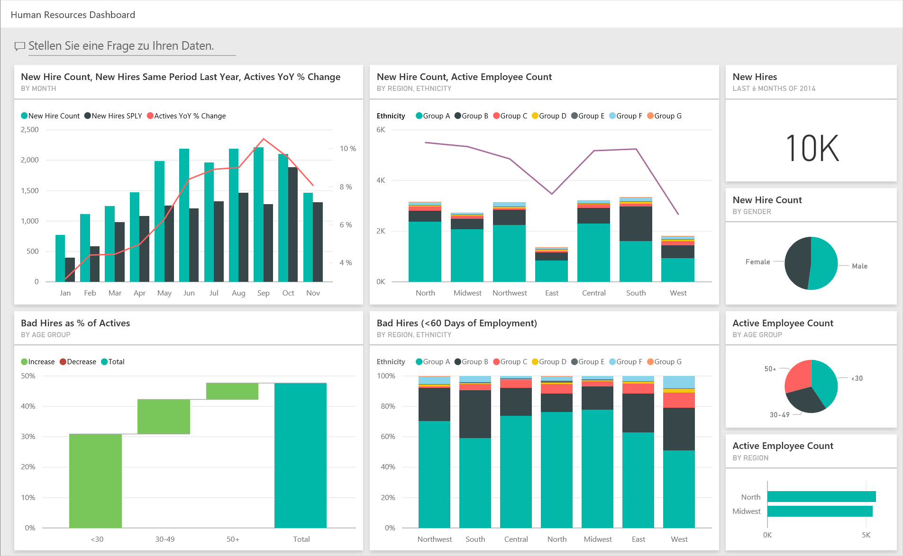
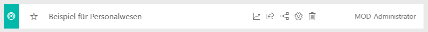
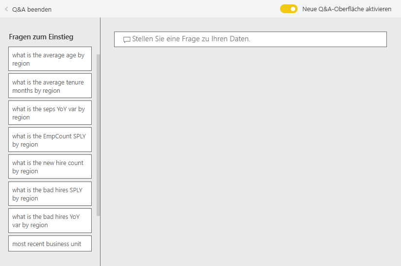
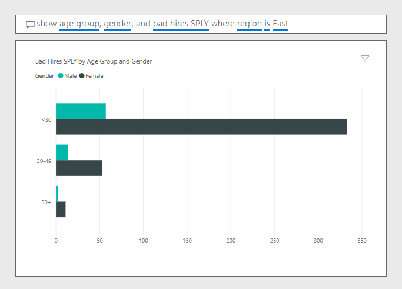

# Beispiel für Personalwesen für Power BI: Übersicht

## Übersicht über das Beispiel für das Personalwesen
Das Beispielinhaltspaket Personalwesen enthält ein Dashboard, einen Bericht und ein Dataset für eine Personalabteilung. In diesem Beispiel verwendet die Personalabteilung dasselbe Berichtsmodell für unterschiedliche Unternehmen, auch wenn diese sich nach Branche oder Größe unterscheiden. Die Untersuchungen in diesem Beispiel betreffen Neueinstellungen, aktive Mitarbeiter und ehemalige Mitarbeiter. Es zielt darauf ab, Trends in der Einstellungsstrategie aufzudecken. Hauptsächlich sollen folgende Erkenntnisse gewonnen werden:

* Wen wir einstellen
* Tendenzen unserer Personalgewinnungsstrategie
* Trends bei freiwilligem Ausscheiden

Dieses Beispiel ist Teil einer Reihe, die Ihnen die Verwendung von Power BI anhand geschäftsbezogener Daten, Berichte und Dashboards zeigt. Es wurde mit echten Daten von [obviEnce](http://www.obvience.com/) erstellt, die anonymisiert wurden. Die Daten sind in verschiedenen Formaten verfügbar: Inhaltspaket/-App, Power BI Desktop-PBIX-Datei oder Excel-Arbeitsmappe. Weitere Informationen finden Sie unter [Welche Beispieldaten sind für die Verwendung mit Power BI verfügbar?](sample-datasets.md). 

In diesem Tutorial werden der Power BI-Dienst und das Beispielinhaltspaket Personalwesen verwendet. Da die Benutzeroberflächen sich sehr ähneln, können Sie das Tutorial auch mit Power BI Desktop und der PBIX-Beispieldatei durchführen. 

## Voraussetzungen

Bevor Sie das Beispiel verwenden können, müssen Sie es zunächst als [Inhaltspaket](#get-the-content-pack-for-this-sample), [PBIX-Datei](#get-the-pbix-file-for-this-sample) oder [Excel-Arbeitsmappe](#get-the-excel-workbook-for-this-sample) herunterladen.

### Abrufen des Inhaltspakets für dieses Beispiel

1. Öffnen Sie den Power BI-Dienst (app.powerbi.com), melden Sie sich an, und öffnen Sie den Arbeitsbereich, in dem Sie das Beispiel speichern möchten.

2. Wählen Sie in der linken unteren Ecke **Daten abrufen** aus.
   
   
3. Klicken Sie auf der daraufhin angezeigten Seite **Daten abrufen** auf **Beispiele**.
   
4. Wählen Sie **Beispiel für das Personalwesen** aus, und wählen Sie dann **Verbinden**.  
   
   

5. Das Inhaltspaket wird in Power BI importiert, und dem aktuellen Arbeitsbereich werden ein neues Dashboard, ein neuer Bericht und ein neues Dataset hinzugefügt.
   
   
  
### Abrufen der PBIX-Datei für dieses Beispiel

Alternativ können Sie das Beispiel für das Personalwesen als [PBIX-Datei](http://download.microsoft.com/download/6/9/5/69503155-05A5-483E-829A-F7B5F3DD5D27/Human%20Resources%20Sample%20PBIX.pbix) herunterladen, ein für Power BI Desktop entworfenes Dateiformat.

### Abrufen der Excel-Arbeitsmappe für dieses Beispiel

Wenn Sie sich die Datenquelle für dieses Beispiel ansehen möchten, dieses steht auch als [Excel-Arbeitsmappe](http://go.microsoft.com/fwlink/?LinkId=529780) zur Verfügung. Die Arbeitsmappe enthält Power View-Blätter, die Sie anzeigen und ändern können. Aktivieren Sie die Add-Ins für die Datenanalyse, um die Rohdaten anzuzeigen, und klicken Sie dann auf **Power Pivot > Verwalten**. Weitere Informationen zum Aktivieren der Add-Ins für Power View und Power Pivot finden Sie unter [Anzeigen der Excel-Beispiele in Excel](sample-datasets.md#optional-take-a-look-at-the-excel-samples-from-inside-excel-itself).

## Neue Mitarbeiter
Betrachten wir zunächst die Neueinstellungen.

1. Wählen Sie im Arbeitsbereich die Registerkarte **Dashboards** aus, und öffnen Sie das Dashboard **Beispiel für das Personalwesen**.
2. Wählen Sie im Dashboard die Kachel **Anzahl der Neueinstellungen, Neueinstellungen im gleichen Zeitraum des Vorjahres, % Veränderung der Aktiven im Jahresvergleich nach Monat** aus.  

     

   Der Beispielbericht „Personalwesen“ wird auf der Seite **Neueinstellungen** geöffnet.  

   

3. Sehen Sie sich diese interessanten Elemente an:

    * Das Kombinationsdiagramm **Anzahl der Neueinstellungen, Neueinstellungen GZVJ und % Aktive im Jahresvergleich – Veränderung nach Monat** zeigt, dass wir in jedem Monat des laufenden Jahres mehr Mitarbeiter als im Vorjahr eingestellt haben. In einigen Monaten erheblich mehr Mitarbeiter.
    * Beachten Sie im Kombinationsdiagramm **Anzahl der Neueinstellungen und Anzahl der aktiven Mitarbeiter nach Region und ethnischer Gruppe**, dass wir weniger Personen im Bereich **Osten** einstellen.
    * Das Wasserfalldiagramm **Neueinstellungen im Jahresvergleich, Abw. nach Altersgruppe** zeigt, dass wir vor allem jüngere Menschen einstellen. Die Ursache dieses Trends könnte sein, dass die Stellen häufig Teilzeitstellen sind.
    * Das Kreisdiagramm **Anzahl der Neueinstellungen nach Geschlecht** zeigt eine ziemlich gleichmäßige Verteilung.

    Gewinnen Sie weitere Erkenntnisse? Beispielsweise eine Region, in der die Verteilung nach Geschlecht nicht gleichmäßig ist. 

4. Wählen Sie in den Diagrammen die verschiedenen Altersgruppen und Geschlechter aus, um die Beziehungen zwischen Alter, Geschlecht, Region und ethnischer Gruppe zu untersuchen.

5. Wählen Sie in der oberen Navigationsleiste **Beispiel für das Personalwesen** aus, um zum Dashboard zurückzukehren.

   

## Vergleichen der derzeit aktiven und ehemaligen Mitarbeiter
Wir sehen uns die Daten für die derzeit aktiven Mitarbeiter und die Mitarbeiter an, die nicht mehr für das Unternehmen arbeiten.

1. Wählen Sie auf dem Dashboard die Kachel **Anzahl der aktiven Mitarbeiter nach Altersgruppen** aus.

   

   Der Beispielbericht „Personalwesen“ wird auf der Seite **Aktive Mitarbeiter i. Vgl. zu Trennungen** geöffnet.  

   

 2. Sehen Sie sich diese interessanten Elemente an:

    * In den beiden Kombinationsdiagrammen auf der linken Seite wird die Veränderung Jahr über Jahr für aktive und ausgeschiedene Mitarbeiter angezeigt. Aufgrund von vermehrten Einstellungen haben wir in diesem Jahr mehr aktive, aber auch mehr ausgeschiedene Mitarbeiter als im letzten Jahr.
    * Im August hatten wir im Vergleich zu den anderen Monaten mehr ausgeschiedene Mitarbeiter. Wählen Sie die verschiedenen Altersgruppen, Geschlechter oder Regionen aus, um festzustellen, ob Ausreißer vorhanden sind.
    * Wenn wir uns die Kreisdiagramme ansehen, fällt auf, dass in Bezug auf die aktiven Mitarbeiter nach Geschlecht und Altersgruppe eine relativ gleichmäßige Verteilung besteht. Wählen Sie verschiedene Altersgruppen aus, um die Geschlechtsverteilung nach Alter anzuzeigen. Liegt für jede Altersgruppe eine gleichmäßige Verteilung nach Geschlecht vor?

## Gründe für das Ausscheiden
Wir sehen uns den Bericht in der Bearbeitungsansicht an. Sie können die Kreisdiagramme so ändern, dass sie Daten ausgeschiedener Mitarbeiter anstelle der Daten aktiver Mitarbeiter anzeigen.

1. Wählen Sie in der oberen linken Ecke **Bericht bearbeiten** aus.

2. Wählen Sie das Kreisdiagramm **Anzahl der aktiven Mitarbeiter nach Altersgruppen** aus.

3. Wählen Sie unter **Felder** **Mitarbeiter** aus, um die Tabelle **Mitarbeiter** zu erweitern. Deaktivieren Sie **Anzahl der aktiven Mitarbeiter**, um das Feld zu entfernen.

4. Wählen Sie **Anzahl der Ausgeschiedenen** in der Tabelle **Mitarbeiter** aus, um dieses Element dem Bereich **Werte** im Bereich **Feld** hinzuzufügen.

5. Aktivieren Sie im Zeichenbereich für den Bericht im Balkendiagramm **Anzahl der Trennungen nach Trennungsgrund** den Balken **Freiwillig**. 

   Dieser Balken hebt in den anderen Visualisierungen im Bericht die Mitarbeiter hervor, die freiwillig ausgeschieden sind.

6. Wählen Sie im Kreisdiagramm **Anzahl der Trennungen nach Altersgruppe** das Segment „50+“ aus.

7. Sehen Sie sich das Liniendiagramm unten rechts an. Dieses Diagramm wird gefiltert, um freiwillig ausgeschiedene Mitarbeiter anzuzeigen.  

   

   Beachten Sie den Trend in der Altersgruppe 50+. In der zweiten Jahreshälfte schieden vermehrt Mitarbeiter mit mehr als 50 Jahren freiwillig aus. Dieser Trend kann anhand von weiteren Daten genauer untersucht werden.

8. Sie können die gleichen Schritte auch für das Kreisdiagramm **Anzahl der aktiven Mitarbeiter nach Geschlecht** ausführen und es von aktiven Mitarbeitern in Trennungen ändern. Sehen Sie sich die Daten zum freiwilligen Ausscheiden nach Geschlecht an, um nach weiteren Erkenntnissen zu suchen.

9. Wählen Sie in der oberen Navigationsleiste **Beispiel für das Personalwesen** aus, um zum Dashboard zurückzukehren. Wenn Sie möchten, können Sie die Änderungen speichern, die Sie am Bericht vorgenommen haben.

## Fehleinstellungen
Als Letztes untersuchen wir den Bereich der Fehleinstellungen. Bei Fehleinstellungen geht es um Mitarbeiter, die weniger als 60 Tage im Unternehmen tätig waren. Wir stellen schnell ein, aber stellen wir gute Kandidaten ein?

1. Wählen Sie die Dashboardkachel **Fehleinstellungen in % aktiver Mitarbeiter nach Altersgruppe** aus. Der Bericht öffnet Registerkarte drei, **Fehleinstellungen**.

     
2. Wählen Sie im Datenschnitt **Region** auf der linken Seite **Nordwesten** und im Ringdiagramm **Anzahl der Fehleinstellungen nach Geschlecht** **Männlich** aus. Sehen Sie sich die anderen Diagramme auf der Seite **Fehleinstellungen** an. Beachten Sie, dass es mehr männliche als weibliche Fehleinstellungen gibt und viele Fehleinstellungen der Gruppe A.

     

3. Wenn Sie sich das Ringdiagramm **Anzahl der Fehleinstellungen nach Geschlecht** ansehen und verschiedene Regionen im Datenschnitt **Region** auswählen, werden Sie feststellen, dass die Region „Osten“ die einzige Region mit mehr weiblichen als männlichen Fehleinstellungen ist.  

4. Wählen Sie den Namen des Dashboards aus der oberen Navigationsleiste aus, um zum Dashboard zurückzukehren.

## Stellen einer Frage im Q&A-Feld des Dashboards
Im Dashboard können Sie im [Q&A-Fragenfeld](power-bi-tutorial-q-and-a.md) eine Frage zu Ihren Daten in natürlicher Sprache stellen. Q&A erkennt die eingegebenen Wörter und schließt, wo in Ihrem Dataset eine Antwort zu finden ist.

1. Wählen Sie das Q&A-Fragefeld aus. Beachten Sie: Noch bevor Sie mit der Eingabe beginnen, zeigt Q&A Vorschläge für die Formulierung Ihrer Frage an.

   

2. Sie können einen dieser Vorschläge auswählen oder eingeben: *Altersgruppe, Geschlecht und Fehleinstellungen im gleichen Vorjahreszeitraum für Region „Osten“ anzeigen*.  

   

   Beachten Sie, dass die meisten der weiblichen Fehleinstellungen jünger als 30 Jahre sind.

In dieser Umgebung können Sie sicher experimentieren, da Sie die Änderungen nicht speichern müssen. Wenn Sie sie speichern, können Sie jederzeit wieder auf **Daten abrufen** klicken, um ein neues Exemplar dieses Beispiels herunterzuladen.

## Nächste Schritte: Herstellen einer Verbindung mit den Daten
Wir hoffen, diese Tour hat Ihnen gezeigt, wie Power BI-Dashboards, das Fragen und Antworten-Modul und Berichte Ihnen Einblicke in Personaldaten geben können. Jetzt liegt es an Ihnen – stellen Sie Verbindungen mit Ihren eigenen Daten her. Mit Power BI können Sie Verbindungen mit einer Vielzahl von Datenquellen herstellen. Weitere Informationen finden Sie unter [Erste Schritte mit dem Power BI-Dienst](service-get-started.md).
