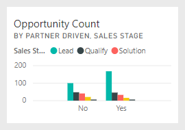
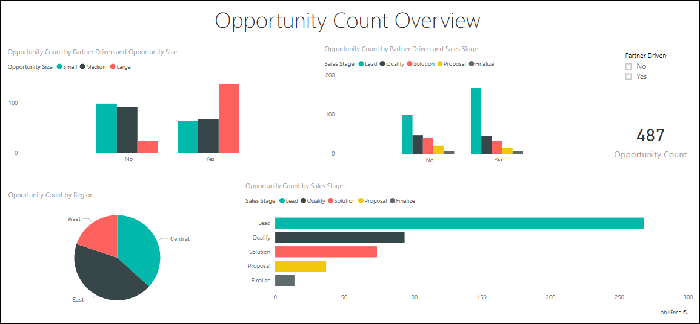

# Analysebeispiel für Verkaufschancen für Power BI: Übersicht

Das Beispielinhaltspaket zur Verkaufschancenanalyse enthält ein Dashboard, einen Bericht und ein Dataset für ein Softwareunternehmen, das zwei Vertriebskanäle besitzt: *direkt* und *Partner*. Der Vertriebsleiter erstellt dieses Dashboard, um einen Überblick über Verkaufschancen und Umsatz nach Region, Auftragsvolumen und Kanal zu gewinnen.

Dieses Beispiel baut auf zwei Kennzahlen für den Umsatz auf:

* Umsatz: Die Umsatzschätzung eines Vertriebsmitarbeiters.
* Umsatzfactoring: Wird als „Umsatz x Wahrscheinlichkeit in Prozent“ berechnet und im Allgemeinen als genauere Voraussage des tatsächlichen Umsatzes angesehen. Die Wahrscheinlichkeit wird über die aktuelle *Verkaufsphase* des Auftrags ermittelt:
  * Lead: 10 %  
  * Qualifizieren: 20 %  
  * Lösung: 40 %  
  * Angebot: 60 %  
  * Abschluss: 80 %

Dieses Beispiel ist Teil einer Reihe, die Ihnen die Verwendung von Power BI anhand geschäftsbezogener Daten, Berichte und Dashboards zeigt. Es wurde mit echten Daten von [obviEnce](http://www.obvience.com/) erstellt, die anonymisiert wurden. Die Daten sind in verschiedenen Formaten verfügbar: Inhaltspaket, Power BI Desktop-PBIX-Datei oder Excel-Arbeitsmappe. Weitere Informationen finden Sie unter [Welche Beispieldaten sind für die Verwendung mit Power BI verfügbar?](sample-datasets.md). 

In diesem Tutorial wird das Verkaufschancenanalyse-Beispielinhaltspaket im Power BI-Dienst erörtert. Da die Berichtsoberfläche in Power BI Desktop und im Dienst ähnlich sind, können Sie das Tutorial auch anhand der PBIX-Beispieldatei in Power BI Desktop nachvollziehen. 

Sie benötigen keine Power BI-Lizenz, um die Beispiele in Power BI Desktop kennenzulernen. Wenn Sie nicht über eine Power BI Pro-Lizenz verfügen, können Sie das Beispiel im Power BI-Dienst in Ihrem Arbeitsbereich speichern. 

## Abrufen des Beispiels

Bevor Sie das Beispiel verwenden können, müssen Sie es zunächst als [Inhaltspaket](#get-the-content-pack-for-this-sample), [PBIX-Datei](#get-the-pbix-file-for-this-sample) oder [Excel-Arbeitsmappe](#get-the-excel-workbook-for-this-sample) herunterladen.

### Abrufen des Inhaltspakets für dieses Beispiel

1. Öffnen Sie den Power BI-Dienst (app.powerbi.com), melden Sie sich an, und öffnen Sie den Arbeitsbereich, in dem Sie das Beispiel speichern möchten. 

    Wenn Sie nicht über eine Power BI Pro-Lizenz verfügen, können Sie das Beispiel in Ihrem Arbeitsbereich speichern.

2. Wählen Sie in der linken unteren Ecke **Daten abrufen** aus.

    
3. Klicken Sie auf der daraufhin angezeigten Seite **Daten abrufen** auf **Beispiele**.

4. Wählen Sie das **Beispiel einer Verkaufschancenanalyse**und dann **Verbinden** aus.  

   
5. Das Inhaltspaket wird in Power BI importiert, und dem aktuellen Arbeitsbereich werden ein neues Dashboard, ein neuer Bericht und ein neues Dataset hinzugefügt.

   

### Abrufen der PBIX-Datei für dieses Beispiel

Alternativ können Sie das Analysebeispiel für Verkaufschancen als [PBIX-Datei](http://download.microsoft.com/download/9/1/5/915ABCFA-7125-4D85-A7BD-05645BD95BD8/Opportunity%20Analysis%20Sample%20PBIX.pbix) herunterladen, ein für Power BI Desktop entworfenes Dateiformat.

### Abrufen der Excel-Arbeitsmappe für dieses Beispiel

Wenn Sie sich die Datenquelle für dieses Beispiel ansehen möchten, dieses steht auch als [Excel-Arbeitsmappe](http://go.microsoft.com/fwlink/?LinkId=529782) zur Verfügung. Die Arbeitsmappe enthält Power View-Blätter, die Sie anzeigen und ändern können. Aktivieren Sie die Add-Ins für die Datenanalyse, um die Rohdaten anzuzeigen, und klicken Sie dann auf **Power Pivot > Verwalten**. Weitere Informationen zum Aktivieren der Add-Ins für Power View und Power Pivot finden Sie unter [Anzeigen der Excel-Beispiele in Excel](sample-datasets.md#optional-take-a-look-at-the-excel-samples-from-inside-excel-itself).

## Welche Erkenntnisse gewinnen wir über unser Dashboard?
Unsere Vertriebsleiterin hat ein Dashboard erstellt, um diese für sie wichtigen Metriken zu verfolgen. Wenn sie etwas Interessantes sieht, kann sie eine Kachel auswählen, um einen genaueren Blick auf die Daten zu werfen:

- Der Umsatz des Unternehmens beträgt 2 Milliarden US-Dollar, und der fakturierte Umsatz beträgt 461 Millionen US-Dollar.
- Die Anzahl der Verkaufschancen und der Umsatz folgen einem vertrauten Trichtermuster, wobei sich die Summen in jeder nachfolgenden Phase verringern.
- Die meisten Verkaufschancen liegen für die Region „Osten“ vor.
- Mit größeren Verkaufschancen wird mehr Umsatz als mit mittleren oder kleinen Verkaufschancen generiert.
- Abschlüsse mit großen Partnern generieren mehr Umsatz: 8 Millionen USD im Mittel im Vergleich zu 6 Millionen für den Direktvertrieb.

Da der Aufwand zum Gewinnen eines Auftrags unabhängig davon gleich ist, ob er als groß, mittel oder klein klassifiziert ist, sollten die Mitarbeiter des Unternehmens die Daten genau analysieren, um mehr Informationen zu großen Verkaufschancen zu erhalten.

1. Öffnen Sie in dem Arbeitsbereich, in dem Sie das Beispiel gespeichert haben, die Registerkarte **Dashboards**, suchen Sie das Dashboard **Verkaufschancen-Analysebeispiel** , und wählen Sie es aus.

2. Wählen Sie die Kachel **Opportunity Count by Partner Driven, Sales Stage** (Anzahl Verkaufschancen nach Partnerbeteiligung, Vertriebsphase) aus, um die erste Seite des Verkaufschancen-Analysebeispielberichts zu öffnen. 

    

## Untersuchen der Seiten des Berichts

Sehen Sie die einzelnen Seiten im Bericht an, indem Sie die Seitenregisterkarten am unteren Rand auswählen.

### Seite „Anzahl der Verkaufschancen – Übersicht“

Beachten Sie Folgendes:
* „Osten“ ist in Bezug auf die Verkaufschancenanzahl unsere größte Region.  
* Wählen Sie im Kreisdiagramm **Opportunity Count by Region** (Anzahl der Verkaufschancen nach Region) die einzelnen Regionen aus, um die Seite nach der Region zu filtern. Beachten Sie, dass die Partner in jeder Region erheblich mehr große Verkaufschancen verfolgen.   
* Im Säulendiagramm **Opportunity Count by Partner Driven and Opportunity Size** (Verkaufschancenanzahl nach Partnerbeteiligung und Verkaufschancengröße) ist zu sehen, dass die meisten großen Verkaufschancen über Partnerbeteiligung verfügen, während dies für kleinere und mittlere Verkaufschancen häufiger nicht der Fall ist.
* Wählen Sie im Balkendiagramm **Opportunity Count by Sales Stage** (Anzahl Verkaufschancen nach Verkaufsphase) jede einzelne **Verkaufsphase** aus, um die regional unterschiedliche Anzahl zu erfassen. Beachten Sie, dass zwar die Region Osten die größte Anzahl Verkaufschancen aufweist, alle drei Regionen aber in den Verkaufsphasen Lösung, Angebot und Abschluss vergleichbare Zahlen aufweisen. Dieses Ergebnis bedeutet, dass ein größerer Prozentsatz der Geschäfte in den Regionen Mitte und Westen zum Abschluss kommt.

### Seite „Umsatzanalyse“
Auf dieser Seite werden die Daten auf ähnliche Weise dargestellt, jedoch nicht bezogen auf die Anzahl, sondern aus Sicht des Umsatzes.  

Beachten Sie Folgendes:
* „Osten“ ist nicht nur bezogen auf die Verkaufschancenanzahl unsere größte Region, sondern auch beim Umsatz.  
* Wenn Sie das Diagramm **Revenue by Sales Stage and Partner Driven** filtern, indem Sie **Yes** (Ja) für **Partner Driven** (Partnerbeteiligung) auswählen, sehen Sie einen Umsatz von 1,5 Milliarden USD und einen fakturierten Umsatz von 294 Millionen USD. Vergleichen Sie diese Beträge mit den 644 Millionen USD und 166 Millionen USD an Umsätzen ohne Partnerbeteiligung. 
* Der durchschnittliche Umsatz für Großkunden ist mit 8 Millionen höher, wenn es sich um eine Verkaufschance mit Partnerbeteiligung handelt, im Vergleich mit 6 Millionen für Aufträge ohne Partnerbeteiligung.  
* Bei Geschäften mit Partnerbeteiligung ist der durchschnittliche Umsatz für große Verkaufschancen fast doppelt so hoch wie bei Verkaufschancen mittlerer Größe.  
* Der durchschnittliche Umsatz für kleine und mittlere Unternehmen ist sowohl für Aufträge mit als auch ohne Partnerbeteiligung vergleichbar.   

Es wird deutlich, dass unsere Partnerunternehmen beim Verkauf an Kunden erfolgreicher sind als andere Vertriebskanäle. Es scheint sinnvoll zu sein, mehr Aufträge über unsere Partnerunternehmen abzuwickeln.

### Anzahl der Verkaufschancen nach Region und Phase
Diese Seite des Berichts betrachtet Daten ähnlich denen auf der vorhergehenden Seite, schlüsselt sie aber nach Region und Phase auf. 

Beachten Sie Folgendes:
* Wenn Sie im Kreisdiagramm **Opportunity Count by Region** (Anzahl der Verkaufschancen nach Region) **East** (Osten) auswählen, um nach der Region „Osten“ zu filtern, sehen Sie, dass die Verkaufschancen in dieser Region fast gleich auf Geschäfte mit Partnerbeteiligung und solche ohne Partnerbeteiligung aufgeteilt sind.
* Große Verkaufschancen kommen am häufigsten in der Region „Mitte“, kleine Verkaufschancen kommen am häufigsten in der Region „Osten“, und mittlere Verkaufschancen kommen am häufigsten in der Region „Westen“ vor.

### Seite „Anstehende Verkaufschancen nach Monat“
Für diese Seite suchen wir nach ähnlichen Faktoren, aber unter dem Gesichtspunkt von Datum und Uhrzeit. 
 

Unsere Finanzdirektorin verwendet diese Seite, um die Arbeitslast zu verwalten. Indem sie sich die Umsatzchancen nach Verkaufsphase und Monat ansieht, kann sie entsprechend planen.

Beachten Sie Folgendes:
* Der durchschnittliche Umsatz hat für die Verkaufsphase „Abschluss“ den höchsten Wert. Das Abschließen dieser Aufträge hat die höchste Priorität.
* Wenn Sie nach Monat filtern (indem Sie im Datenschnitt **Monat** einen Monat auswählen), sehen Sie, dass der Januar einen großen Anteil großer Abschlüsse in der Verkaufsphase „Abschluss“ mit einem fakturierten Umsatz von 75 Millionen USD aufweist. Der Februar enthält dagegen zumeist mittelgroße Aufträge in den Phasen „Lösung“ und „Angebot“.
* Im Allgemeinen schwanken die Zahlen des fakturierten Umsatzes je nach Verkaufsphase, Anzahl der Verkaufschancen und Auftragsgröße. Fügen Sie Filter für diese Faktoren hinzu (mit dem Bereich **Filter** auf der rechten Seite), um weitere Erkenntnisse zu gewinnen.

## Nächste Schritte: Herstellen einer Verbindung mit den Daten
In dieser Umgebung können Sie sicher experimentieren, da Sie die Änderungen nicht speichern müssen. Wenn Sie sie speichern, können Sie jederzeit wieder auf **Daten abrufen** klicken, um ein neues Exemplar dieses Beispiels herunterzuladen.

Wir hoffen, diese Tour hat Ihnen gezeigt, wie Power BI-Dashboards, das Fragen- und Antwortenmodul und Berichte Ihnen Einblicke in Beispieldaten geben können. Jetzt liegt es an Ihnen – stellen Sie Verbindungen mit Ihren eigenen Daten her. Mit Power BI können Sie Verbindungen mit einer Vielzahl von Datenquellen herstellen. Weitere Informationen finden Sie unter [Erste Schritte mit dem Power BI-Dienst](service-get-started.md).

