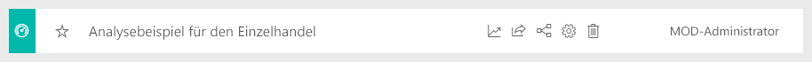
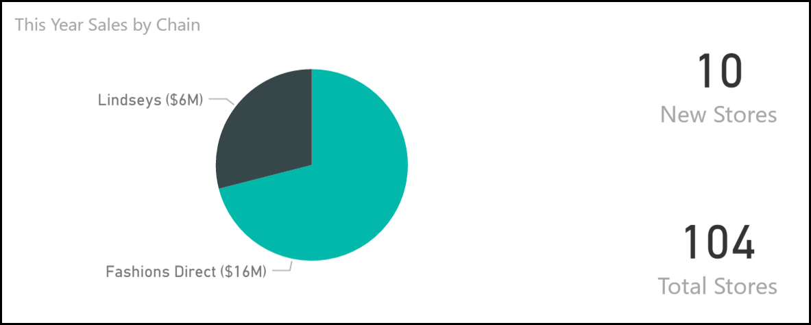
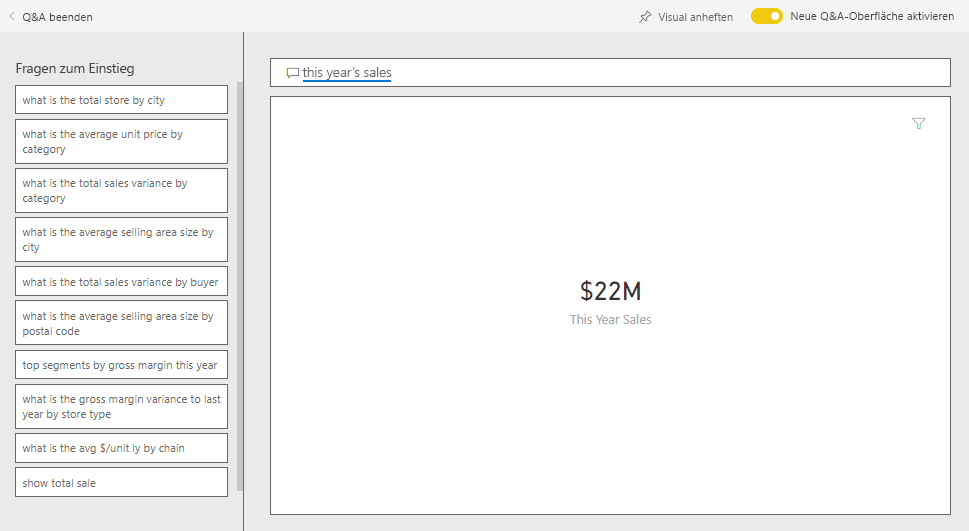
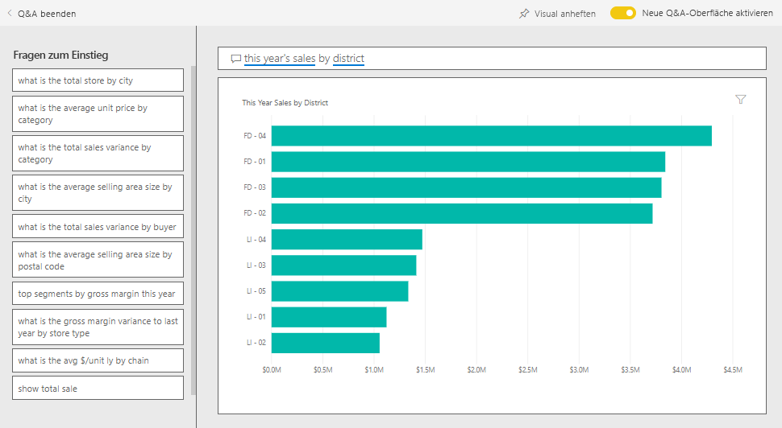
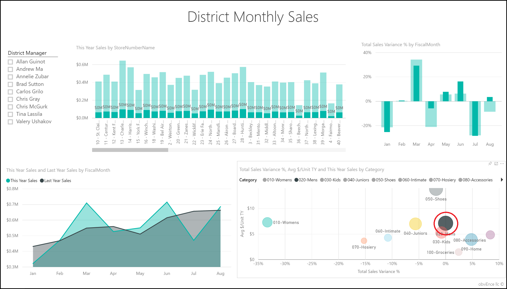
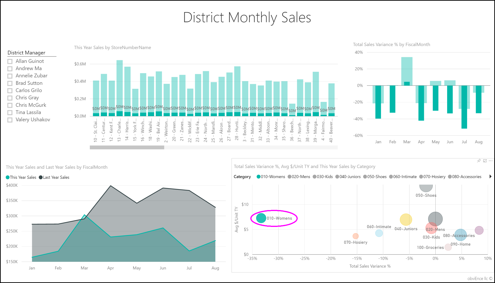
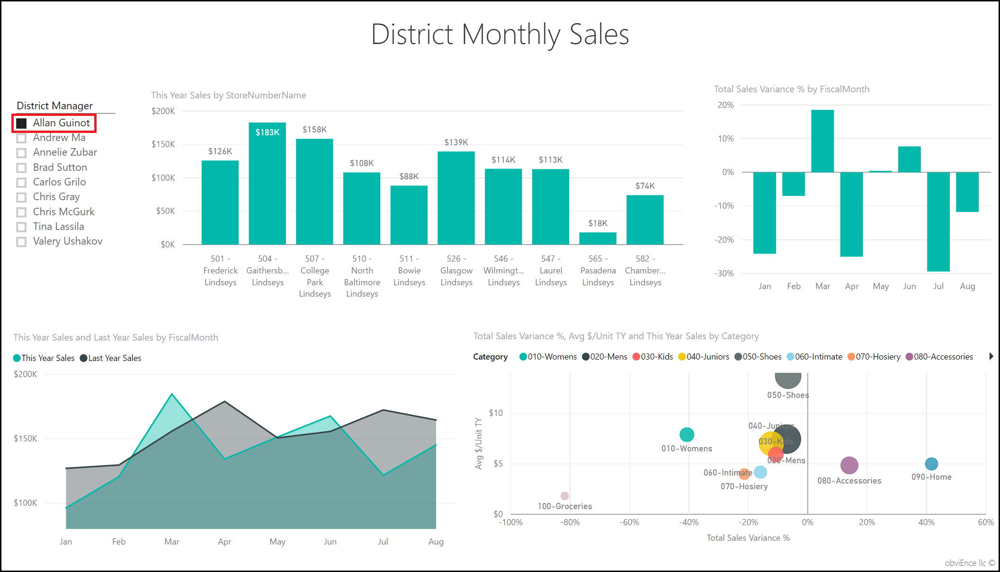
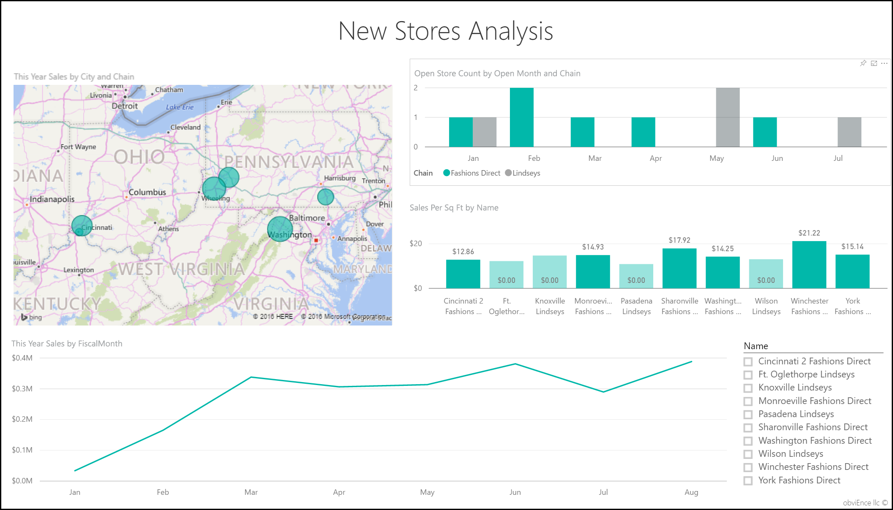
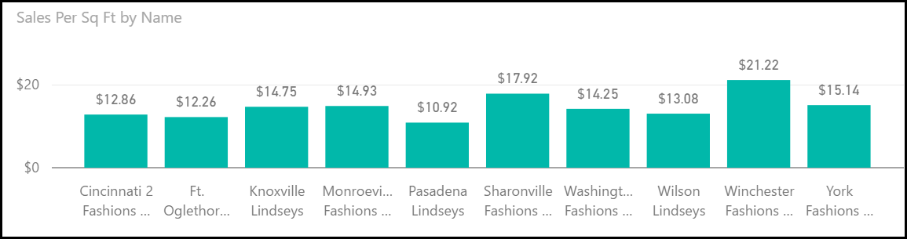

# Analysebeispiel für Einzelhandel für Power BI: Übersicht

Das Einzelhandels-Beispielinhaltspaket enthält ein Dashboard, einen Bericht und ein Dataset, das Einzelhandels-Vertriebsdaten von Artikeln analysiert, die in mehreren Geschäften und Bezirken verkauft wurden. Die Metriken vergleichen die Leistung dieses Jahres mit der des letzten Jahres: Umsatz, Einheiten, Bruttogewinn und Abweichung sowie Analyse neuer Filialen. 

Dieses Beispiel ist Teil einer Reihe, die Ihnen die Verwendung von Power BI anhand geschäftsbezogener Daten, Berichte und Dashboards zeigt. Es wurde von [obviEnce](http://www.obvience.com/) mit echten Daten erstellt, die anonymisiert wurden. Die Daten sind in verschiedenen Formaten verfügbar: Inhaltspaket, Power BI Desktop-PBIX-Datei oder Excel-Arbeitsmappe. Weitere Informationen finden Sie unter [Welche Beispieldaten sind für die Verwendung mit Power BI verfügbar?](sample-datasets.md). 

In diesem Tutorial wird das Einzelhandels-Beispielinhaltspaket im Power BI-Dienst erörtert. Da die Berichtsoberfläche in Power BI Desktop und im Dienst ähnlich sind, können Sie das Tutorial auch anhand der PBIX-Beispieldatei in Power BI Desktop nachvollziehen. 

Sie benötigen keine Power BI-Lizenz, um die Beispiele in Power BI Desktop kennenzulernen. Wenn Sie nicht über eine Power BI Pro-Lizenz verfügen, können Sie das Beispiel im Power BI-Dienst in Ihrem Arbeitsbereich speichern. 

## Abrufen des Beispiels

 Bevor Sie das Beispiel verwenden können, müssen Sie es zunächst als [Inhaltspaket](#get-the-content-pack-for-this-sample), [PBIX-Datei](#get-the-pbix-file-for-this-sample) oder [Excel-Arbeitsmappe](#get-the-excel-workbook-for-this-sample) herunterladen.

### Abrufen des Inhaltspakets für dieses Beispiel

1. Öffnen Sie den Power BI-Dienst (app.powerbi.com), melden Sie sich an, und öffnen Sie den Arbeitsbereich, in dem Sie das Beispiel speichern möchten. 

    Wenn Sie nicht über eine Power BI Pro-Lizenz verfügen, können Sie das Beispiel in Ihrem Arbeitsbereich speichern.

2. Wählen Sie in der linken unteren Ecke **Daten abrufen** aus.

    
3. Klicken Sie auf der daraufhin angezeigten Seite **Daten abrufen** auf **Beispiele**.
   
4. Wählen Sie das **Analysebeispiel für Einzelhandel** und dann **Verbinden** aus.  
  
   
   
5. Das Inhaltspaket wird in Power BI importiert, und dem aktuellen Arbeitsbereich werden ein neues Dashboard, ein neuer Bericht und ein neues Dataset hinzugefügt.
   
   
  
### Abrufen der PBIX-Datei für dieses Beispiel

Alternativ können Sie das Analysebeispiel für den Einzelhandel als [PBIX-Datei](https://download.microsoft.com/download/9/6/D/96DDC2FF-2568-491D-AAFA-AFDD6F763AE3/Retail%20Analysis%20Sample%20PBIX.pbix) herunterladen, ein für Power BI Desktop entworfenes Dateiformat. 

### Abrufen der Excel-Arbeitsmappe für dieses Beispiel

Wenn Sie sich die Datenquelle für dieses Beispiel ansehen möchten, dieses steht auch als [Excel-Arbeitsmappe](https://go.microsoft.com/fwlink/?LinkId=529778) zur Verfügung. Die Arbeitsmappe enthält Power View-Blätter, die Sie anzeigen und ändern können. Aktivieren Sie die Add-Ins für die Datenanalyse, um die Rohdaten anzuzeigen, und klicken Sie dann auf **Power Pivot > Verwalten**. Weitere Informationen zum Aktivieren der Add-Ins für Power View und Power Pivot finden Sie unter [Anzeigen der Excel-Beispiele in Excel](sample-datasets.md#optional-take-a-look-at-the-excel-samples-from-inside-excel-itself).

## Starten auf dem Dashboard und Öffnen des Berichts

1. Öffnen Sie in dem Arbeitsbereich, in dem Sie das Beispiel gespeichert haben, die Registerkarte **Dashboards**, suchen Sie das Dashboard **Analysebeispiel für den Einzelhandel**, und wählen Sie es aus. 
2. Wählen Sie auf dem Dashboard die Kachel **Total Stores New & Existing Stores** (Filialen insgesamt, Neue und vorhandene Filialen), die auf die Seite **Store Sales Overview** (Filialumsätze – Übersicht) im Beispielbericht „Analysebeispiel für Einzelhandel“ führt. 

     

   Auf dieser Berichtsseite sind insgesamt 104 Filialen aufgeführt, von denen 10 neu sind. Wir haben zwei Ketten Fashions Direct und Lindseys. Fashions Direct-Filialen sind im Durchschnitt größer.
3. Wählen Sie im Kreisdiagramm **This Year Sales by Chain** (Umsätze dieses Jahres nach Kette) **Fashions Direct** aus.

     

   Beachten Sie das Ergebnis im Blasendiagramm **Total Sales Variance %** (Gesamtumsatzabweichung in Prozent):

     

   Der Bezirk **FD-01** hat den höchsten durchschnittlichen **Umsatz pro Quadratmeter**, und FD-02 hat die geringste **Gesamtumsatzabweichung** im Vergleich zum Vorjahr. FD-03 und FD-04 schneiden insgesamt am schlechtesten ab.
4. Wählen Sie einige der einzelnen Blasen oder andere Diagramme, um die übergreifende Hervorhebung den Einfluss Ihrer Auswahl sichtbar machen zu lassen.
5. Um zum Dashboard zurückzukehren, wählen Sie im oberen Navigationsbereich **Analysebeispiel für Einzelhandel** aus.

   
6. Wählen Sie auf dem Dashboard die Kachel **This Year's Sales New & Existing Stores** (Umsätze dieses Jahres in neuen und vorhandenen Filialen) aus, was gleichbedeutend mit der Eingabe *Umsätze dieses Jahr* im Q&A-Fragefeld ist.

   

   Die Q&A-Ergebnisse werden angezeigt:

   

## Überprüfen einer Kachel, die über Fragen und Antworten in Power BI erstellt wurde
Gehen wir mehr ins Detail.

1. Ändern Sie die Frage in _this year sales **by district**_ . Beobachten Sie das Ergebnis: Q&A platziert die Antwort automatisch in einem Balkendiagramm, und es werden andere Formulierungen vorgeschlagen:

   
2. Ändern Sie jetzt die Frage in _this year sales **by zip and chain**_ .

   Beachten Sie, wie Power BI die Frage während Ihrer Eingabe beantwortet und das passende Diagramm anzeigt.
3. Experimentieren Sie ein bisschen mit weiteren Fragen, und sehen Sie sich die erzielten Ergebnisse an.
4. Wenn Sie soweit sind, kehren Sie zum Dashboard zurück.

## Eingehendere Untersuchung der Daten
Führen wir unsere Untersuchung auf einer Ebene mit mehr Details fort, indem wir die Leistung der einzelnen Regionen ansehen.

1. Wählen Sie auf dem Dashboard die Kachel **This Year's Sales, Last Year's Sales** (Umsätze dieses Jahr, Umsätze letztes Jahr), das die Seite **District Monthly Sales** (Monatliche Umsätze nach Bezirk) des Berichts öffnet.

   

   Beachten Sie im Diagramm **Total Sales Variance % by Fiscal Month** (Abweichung der Gesamtumsätze in Prozent nach Geschäftsmonat) die starke Variabilität bei Abweichung in Prozent gegenüber dem letzten Jahr, mit besonders schlechten Ergebnissen für Januar, April und Juli.

   

   Sehen wir uns einmal an, ob wir die Probleme eingrenzen können.
2. Wählen Sie im Blasendiagramm die Blase **020-Mens** (020–Herren) aus.

     

   Beobachten Sie, dass die Herrenkategorie zwar im April nicht so stark betroffen war wie das Geschäft insgesamt, wobei Januar und Juli aber dennoch problematische Monate waren.
1. Wählen Sie die Blase **010-Womens** (010–Damen) aus.

   

   Beachten Sie, dass die Damenkategorie viel schlechter abgeschnitten hat als das Unternehmen insgesamt in allen Monaten und außerdem fast jeden Monat schlechter im Vergleich zum Vorjahr.
1. Wählen Sie die Blase erneut aus, um den Filter zu löschen.

## Testen des Datenschnitts
Betrachten wir, wie sich einzelne Regionen entwickelt haben.

1. Wählen Sie **Allan Guinot** im Datenschnitt **District Manager** (Bezirksmanager) oben links aus.

   

   Beachten Sie, dass Allans Bezirk letztes Jahr in März und Juni im Vergleich zum Vorjahr outperformt hat.
2. Wählen Sie bei immer noch bestehender Auswahl **Allan Guinot** die Blase **Womens-10** im Blasendiagramm aus.

   

   Beachten Sie, dass für die Kategorie Womens-10 Allans Bezirk das Volumen des Vorjahres nicht erreicht hat.
3. Untersuchen Sie die anderen Bezirksmanager und Kategorien – welche weiteren Erkenntnisse können Sie finden?
4. Wenn Sie bereit sind, kehren Sie zum Dashboard zurück.

## Aussage der Daten über das Umsatzwachstum in diesem Jahr
Der letzte Bereich, den wir untersuchen möchten, ist unser Wachstum, indem wir uns die in diesem Jahr neu eröffneten Geschäfte ansehen.

1. Wählen Sie die Kachel **Stores Opened This Year by Open Month, Chain** (In diesem Jahr eröffnete Filialen nach Eröffnungsmonat, Kette) aus, die die Seite **New Stores Analysis** (Analyse der neuen Filialen) des Berichts öffnet.

   

   Wie aus der Kachel zu ersehen, wurden in diesem Jahr mehr Fashions Direct-Filialen als Lindseys-Filialen geöffnet.
2. Beobachten Sie das Diagramm **Sales Per Sq Ft by Name** (Umsatz pro Quadratmeter nach Namen):

   

    Beachten Sie die Unterschiede in Umsatzmittel/Quadratmeter zwischen den neuen Filialen.
3. Wählen Sie das Legendenelement **Fashions Direct** im Diagramm **Open Store Count by Open Month and Chain** (Anzahl der geöffneten Filialen nach Eröffnungsmonat und Kette) oben rechts aus. Beachten Sie, dass auch innerhalb der gleichen Kette das stärkste Geschäft (Winchester Fashions Direct) das schwächste Geschäft (Cincinnati 2 Fashions Direct) mit 21,22 $ gegen 12,86 $ deutlich schlägt.

   
4. Wählen Sie im Datenschnitt **Name** **Winchester Fashions Direct** aus, und beobachten Sie das Liniendiagramm. Die ersten Umsatzzahlen wurden im Februar gemeldet.
5. Wählen Sie im Datenschnitt **Cincinnati 2 Fashions Direct** aus, und beobachten Sie im Liniendiagramm, dass die Filiale im Juni eröffnet wurde und die schlechteste Performance aller Filialen zu erbringen scheint.
6. Untersuchen Sie durch Auswählen anderer Balken, Linien und Blasen quer durch alle Diagramme, welche Einblicke Sie gewinnen können.

## Nächste Schritte: Herstellen einer Verbindung mit den Daten
In dieser Umgebung können Sie sicher experimentieren, da Sie die Änderungen nicht speichern müssen. Wenn Sie sie speichern, können Sie jederzeit wieder auf **Daten abrufen** klicken, um ein neues Exemplar dieses Beispiels herunterzuladen.

Wir hoffen, diese Tour hat Ihnen gezeigt, wie Power BI-Dashboards, das Fragen- und Antwortenmodul und Berichte Ihnen Einblicke in Beispieldaten geben können. Jetzt liegt es an Ihnen – stellen Sie Verbindungen mit Ihren eigenen Daten her. Mit Power BI können Sie Verbindungen mit einer Vielzahl von Datenquellen herstellen. Weitere Informationen finden Sie unter [Erste Schritte mit dem Power BI-Dienst](service-get-started.md).
