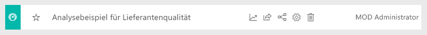
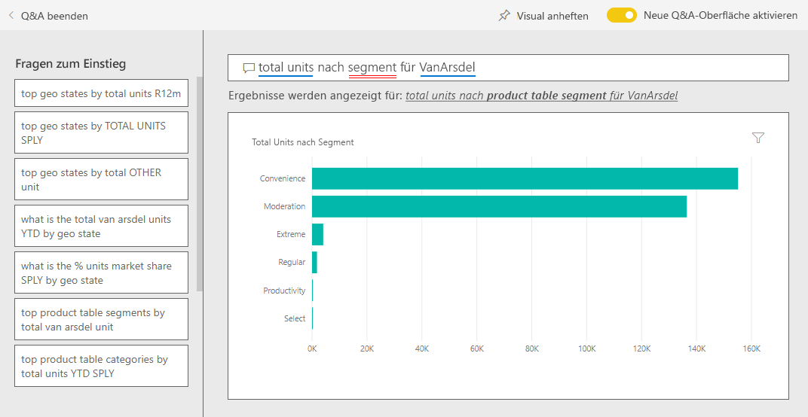
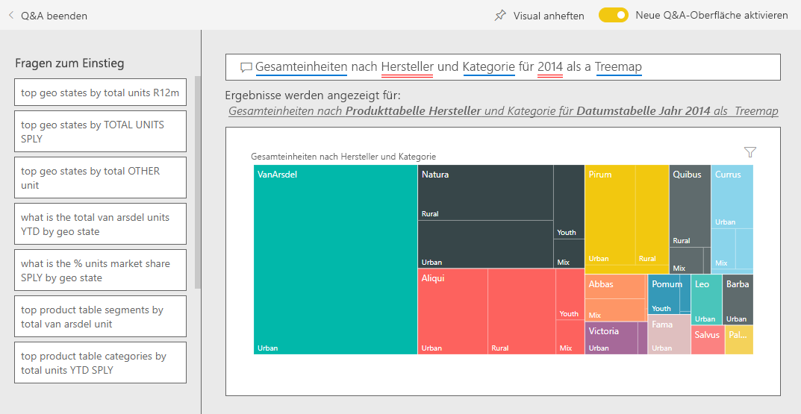

# Beispiel für Vertrieb und Marketing für Power BI: Übersicht

Das Vertriebs- und Marketingbeispiel enthält ein Dashboard und einen Bericht für das fiktive Fertigungsunternehmen VanArsdel Ltd. Der Chief Marketing Officer (CMO) von VanArsdel hat dieses Dashboard erstellt, um die Branche sowie den Marktanteil, das Produktvolumen, die Verkäufe und die Stimmungslage des Unternehmens im Blick zu haben.

VanArsdel hat viel Konkurrenz, ist aber Marktführer seiner Branche. Der CMO möchte den Marktanteil erhöhen und Wachstumschancen aufzeigen. Allerdings geht der Marktanteil von VanArsdel aus unbekannten Gründen zurück, insbesondere im Juni wurden größere Einbußen verzeichnet.

Dieses Beispiel ist Teil einer Reihe, die Ihnen die Verwendung von Power BI anhand geschäftsbezogener Daten, Berichte und Dashboards zeigt. Es wurde von [obviEnce](http://www.obvience.com/) mit echten Daten erstellt, die anonymisiert wurden. Die Daten sind in verschiedenen Formaten verfügbar: Inhaltspaket, Power BI Desktop-PBIX-Datei oder Excel-Arbeitsmappe. Weitere Informationen finden Sie unter [Welche Beispieldaten sind für die Verwendung mit Power BI verfügbar?](sample-datasets.md). 

In diesem Tutorial wird das zu dem Beispiel für Vertrieb und Marketing gehörende Inhaltspaket im Power BI-Dienst untersucht. Da die Berichtsoberfläche in Power BI Desktop und im Dienst ähnlich sind, können Sie das Tutorial auch anhand der PBIX-Beispieldatei in Power BI Desktop nachvollziehen. 

Sie benötigen keine Power BI-Lizenz, um die Beispiele in Power BI Desktop kennenzulernen. Wenn Sie nicht über eine Power BI Pro-Lizenz verfügen, können Sie das Beispiel im Power BI-Dienst in Ihrem Arbeitsbereich speichern. 

## Abrufen des Beispiels

Bevor Sie das Beispiel verwenden können, müssen Sie es zunächst als [Inhaltspaket](#get-the-content-pack-for-this-sample), [PBIX-Datei](#get-the-pbix-file-for-this-sample) oder [Excel-Arbeitsmappe](#get-the-excel-workbook-for-this-sample) herunterladen.

### Abrufen des Inhaltspakets für dieses Beispiel

1. Öffnen Sie den Power BI-Dienst (app.powerbi.com), melden Sie sich an, und öffnen Sie den Arbeitsbereich, in dem Sie das Beispiel speichern möchten.

   Wenn Sie nicht über eine Power BI Pro-Lizenz verfügen, können Sie das Beispiel in Ihrem Arbeitsbereich speichern.

2. Wählen Sie in der linken unteren Ecke **Daten abrufen** aus.
   
   
3. Klicken Sie auf der daraufhin angezeigten Seite **Daten abrufen** auf **Beispiele**.
   
4. Wählen Sie **Sales and Marketing Sample** (Beispiel für Vertrieb und Marketing) aus, und wählen Sie dann **Verbinden** aus.   
  
   
   
5. Das Inhaltspaket wird in Power BI importiert, und dem aktuellen Arbeitsbereich werden ein neues Dashboard, ein neuer Bericht und ein neues Dataset hinzugefügt.
   
   
  
### Abrufen der PBIX-Datei für dieses Beispiel

Alternativ können Sie das Beispiel für Vertrieb und Marketing als [PBIX-Datei](https://download.microsoft.com/download/9/7/6/9767913A-29DB-40CF-8944-9AC2BC940C53/Sales%20and%20Marketing%20Sample%20PBIX.pbix) herunterladen, die zur Verwendung mit Power BI Desktop vorgesehen ist.

### Abrufen der Excel-Arbeitsmappe für dieses Beispiel

Wenn Sie sich die Datenquelle für dieses Beispiel ansehen möchten, dieses steht auch als [Excel-Arbeitsmappe](https://go.microsoft.com/fwlink/?LinkId=529785) zur Verfügung. Die Arbeitsmappe enthält Power View-Blätter, die Sie anzeigen und ändern können. Aktivieren Sie die Add-Ins für die Datenanalyse, um die Rohdaten anzuzeigen, und klicken Sie dann auf **Power Pivot > Verwalten**. Weitere Informationen zum Aktivieren der Add-Ins für Power View und Power Pivot finden Sie unter [Anzeigen der Excel-Beispiele in Excel](sample-datasets.md#optional-take-a-look-at-the-excel-samples-from-inside-excel-itself).

## Welche Erkenntnisse gewinnen wir über unser Dashboard?
Wir werden uns nun das Dashboard und die Kacheln ansehen, die der CMO angeheftet hat. Wir sehen Informationen zu unserem Marktanteil, den Verkäufen und der Stimmungslage. Die Daten sind nach Region, Zeitraum und Wettbewerb aufgeschlüsselt.

* Die Zahlenkacheln entlang der linken Spalte zeigen das Verkaufsvolumen der Branche für das vergangene Jahr (50.000), den Marktanteil (32,86 %), das Verkaufsvolumen (16.000), die Bewertung der Stimmungslage (68), die Stimmungslücke (4) und die insgesamt verkauften Einheiten (1 Million).
* Das obere Liniendiagramm ( **% Units Market Share vs. % Units Market Share Rolling 12 Months**, Marktanteil von Einheiten in % und Marktanteil von Einheiten in % in letzten 12 Monaten) zeigt, wie unser Marktanteil im Zeitverlauf schwankt. Beachten Sie den großen Rückgang im Juni. Unser Marktanteil in den letzten 12 Monaten (Rolling 12 Months-, R12M-Share) beginnt nun zu stagnieren, nachdem er zuvor eine Weile lang gestiegen war.
* Unser größter Wettbewerber ist Aliqui, wie im Säulendiagramm auf der mittleren Kachel zu sehen ist (**Total Units YTD Variance %** , YTD-Varianz für Gesamteinheiten in %).
* Unser Kerngeschäft wird in Ost- und Mittelamerika erzielt.
* Das untere Liniendiagramm (**Total Units for 2014**, Gesamteinheiten für 2014) zeigt, dass der Rückgang im Juni nicht saisonbedingt ist, da sich bei keinem unserer Wettbewerber derselbe Trend zeigt.
* Auf den Kacheln **Total Units Overall** (Gesamteinheiten insgesamt) und **Total Units YTD** (Gesamteinheiten YTD) auf der rechten Seite sind die verkauften Einheiten aufgeschlüsselt nach Segment und Region/Hersteller dargestellt. Die größten Marktsegmente unserer Branche sind **Productivity** (Produktivität) und **Convenience** (Komfort).

## Weitere Informationen mit Q&A erhalten

Durch Verwenden von Q&A können Sie weitere Details in den Daten entdecken.

### Welche Segmente steigern unseren Umsatz? Entsprechen sie dem Branchentrend?
1. Wählen Sie die Kachel **Total Units Overall by Segment** (Gesamteinheiten insgesamt nach Segment) aus. Dadurch wird Q&A geöffnet, und es wird die Abfrage *total units by segment* (Gesamteinheiten nach Segment) in Q&A eingetragen.
2. Fügen Sie am Ende der vorhandenen Abfrage Folgendes hinzu: *for VanArsdel*. Q&A zeigt die Antwort auf die Frage in einem aktualisierten Diagramm an. Sie können sehen, dass unser Produktvolumen größtenteils aus den Segmenten **Convenience** (Komfort) und **Moderation** besteht.

   
3. Unser Anteil in den Kategorien **Moderation** und **Komfort** ist hoch – in diesen Segmenten behaupten wir uns im Wettbewerb.
4. Kehren Sie zum Dashboard zurück, indem Sie im oberen Navigationsbereich auf **Beispiel für Vertrieb und Marketing** klicken.

### Wie sieht der Marktanteil für die gesamten Einheiten für die Kategorie (im Vergleich zur Region) aus?
1. Betrachten Sie die Kachel **Total Units YTD by Manufacturer, Region** (Gesamteinheiten YTD nach Hersteller, Region). Wie groß ist der Marktanteil für die Einheiten insgesamt nach Kategorie?

   
2. Wählen Sie das Fragefeld am oberen Rand des Dashboards aus, und geben Sie die Frage *total units by manufacturer and category for 2014 as a treemap* (Gesamteinheiten nach Hersteller und Kategorie für 2014 als Treemap) ein. Sie sehen, wie die Visualisierung beim Eingeben der Frage aktualisiert wird.

   
3. Heften Sie das Diagramm an Ihr Dashboard an, um die Ergebnisse zu vergleichen. Beachten Sie diese interessante Tatsache: 2014 hat VanArsdel nur Produkte aus der Kategorie **Urban** (Stadt) verkauft.
4. Kehren Sie zum Dashboard zurück.

## Bericht für Beispiel für Vertrieb und Marketing

Dashboards sind ein Einstiegspunkt in Berichte. Wurde eine Kachel aus einem zugrunde liegenden Bericht erstellt, wird der Bericht durch Auswählen dieser Kachel geöffnet.

Auf unserem Dashboard ist an der Linie **% Units Market Share R12M** (Marktanteil von Einheiten in % in letzten 12 Monaten) im Diagramm **% Units Market Share vs. % Units Market Share Rolling 12 Months** (Marktanteil von Einheiten in % und Marktanteil von Einheiten in % in letzten 12 Monaten) zu erkennen, dass unser Marktanteil im Lauf der Zeit nicht mehr steigt. Der Marktanteil geht sogar etwas zurück. Und warum haben wir im Juni einen großen Einbruch beim Marktanteil? 

Der Bericht für das Beispiel für Vertrieb und Marketing hat vier Seiten.
 
### Seite „VanArsdel - Market Share“ (VanArsdel - Marktanteil)
Die erste Seite des Berichts konzentriert sich auf den Marktanteil von VanArsdel.

1. Wählen Sie auf dem Dashboard das Diagramm **% Units Market Share vs. % Units Market Share Rolling 12 Months** aus, um die Seite **VanArsdel - Market Share** des Berichts für das Beispiel für Vertrieb und Marketing zu öffnen.

   

2. Betrachten Sie das Säulendiagramm **Total Units by Month and isVanArsdel** (Gesamteinheiten nach Monat und isVanArsdel) im unteren Bereich des Berichts. Die schwarze Säule zeigt VanArsdel (unsere Produkte) und die grüne Säule unsere Wettbewerber. Der Einbruch, den VanArsdel im Juni 2014 verzeichnet, lässt sich bei den Wettbewerbern nicht feststellen.

3. Das Balkendiagramm **Total Category Volume by Segment** (Gesamtes Kategorievolumen nach Segment) auf der rechten Seite wird gefiltert, um die zwei besten Segmente von VanArsdel anzuzeigen. Dieser Filter wird folgendermaßen erstellt:  

   a. Wählen Sie das Diagramm **Total Category Volume by Segment** aus.

   b. Wählen Sie den Bereich **Filter** auf der rechten Seite aus, um ihn zu erweitern.  

   c. Unter **Filter auf visueller Ebene** wird nach **Segment** gefiltert, sodass nur die Segmente **Convenience** (Komfort) und **Moderation** einbezogen werden.  

   d. Ändern Sie den Filter, indem Sie **Segment** auswählen, um diesen Abschnitt zu erweitern, und aktivieren Sie dann **Productivity** (Produktivität), um dieses Segment hinzuzufügen.  

4. Wählen Sie im Diagramm **Total Units by Month and isVanArsdel** die Option **Ja** in der Legende aus, um die Seite nach VanArsdel kreuzzufiltern. Auf dem Diagramm **Total Category Volume by Segment** ist zu sehen, dass wir im Segment **Productivity** nicht wettbewerbsfähig sind.

5. Wählen Sie erneut **Ja** in der Legende aus, um den Filter zu entfernen.

6. Sehen Sie sich das Liniendiagramm **% Units Market Share and % Units Market Share R12M by Month** (Marktanteil von Einheiten in % und Marktanteil von Einheiten in % in letzten 12 Monaten) an. Es zeigt unseren monatlichen Marktanteil und unsere Marktanteile in den letzten 12 Monaten. Die Daten der letzten 12 Monate helfen uns, monatliche Schwankungen zu glätten und langfristige Trends zu erkennen. Wählen Sie im Balkendiagramm **Total Category Volume by Segment** das Segment **Convenience** (Komfort) und dann **Moderation** aus, um die Schwankung des Marktanteils für jedes Segment zu sehen. Sie sehen, dass das Segment **Moderation** deutlich mehr Schwankung im Marktanteil zeigt.

Wir versuchen immer noch herauszufinden, warum unser Marktanteil im Juni derart einbricht. Sehen Sie sich als nächstes **Standpunktanalyse**-Seite des Berichts an.

### Seite „Standpunktanalyse“
Die Seite drei des Berichts konzentriert sich auf die Kundenstimmungslage.

Tweets, Facebook, Blogs und Artikel tragen zur Kundenstimmungslage bei, die in den beiden Liniendiagrammen links auf der Seite dargestellt ist. Das Diagramm **VanArsdel - Sentiment by Month** (VanArsdel - Stimmungslage nach Monat) in der oberen linken Ecke zeigt, dass die Stimmungslage zu unseren Produkten bis Februar weitgehend neutral war. Dann begann im Februar ein großer Einbruch, und dieser erreichte im Juni seinen Tiefpunkt. Wo liegen die Ursachen für diesen Einbruch? 

Sehen wir uns dazu externen Quellen an. Im Februar wurde der Kundeservice von VanArsdel in mehreren Artikeln und Blogs als der schlechteste Service in der Branche bewertet. Diese negativen Schlagzeilen wirkten sich auf Stimmungslage und Verkauf aus. VanArsdel arbeitete hart daran, den Kundenservice zu verbessern, was in der Branche nicht unbemerkt blieb. Im Juli begann sich die Stimmungslage wieder zum Positiven zu wenden und erreichte den Höchststand im 60er-Bereich. Dieser Aufwärtstrend in der Stimmungslage ist in den **Total Units by Month**-Diagrammen (Gesamteinheiten nach Monat) auf den Seiten eins und zwei des Berichts dargestellt. Ist das möglicherweise die Erklärung für unsere Markteinbußen im Juni?

Die Stimmungslücke (Sentiment gap) kann ein weiterer Bereich sein, der untersucht werden sollte. In welchen Regionen gibt es die größte Stimmungslücke, wie kann das Management daraus Nutzen ziehen, und wie kann es diesen Nutzen in anderen Regionen wiederholen?

### Seite „YTD Category Trend Analysis“ (Analyse des YTD-Kategorietrends)
Die Seite zwei des Berichts konzentriert sich auf den YTD-Kategorietrend.

Beachten Sie die folgenden Details:
* VanArsdel ist das größte Unternehmen in dieser Kategorie, seine größten Wettbewerber sind Natura, Aliqui und Pirium. Wir werden sie im Auge behalten.
* Aliqui wächst, aber im Vergleich zu uns ist ihr Produktvolumen immer noch niedrig.
* In der Treemap wird VanArsdel in grün angezeigt. In der Region „Osten“ bevorzugen Kunden unsere Wettbewerber, aber in der Region „Mitte“ (Central) läuft unser Geschäft gut. Unser Anteil in der Region „Osten“ ist unser niedrigster Anteil.
* Die Geografie wirkt sich auf verkaufte Einheiten aus. Die Region „Osten“ ist für die meisten Hersteller die vorherrschende Region, und VanArsdel hat eine starke Präsenz in der Region „Mitte“.
* Auf dem Diagramm **Total Units YTD Var % by Month and Manufacturer** (Gesamteinheiten YTD Var % nach Monat und Hersteller) in der unteren rechten Ecke sehen Sie, dass wir eine positive Varianz haben, was ein gutes Zeichen ist. Unsere Geschäfte laufen besser als letztes Jahr, dies gilt aber auch für unseren Wettbewerber Aliqui.

### Seite „Growth Opportunities“ (Wachstumschancen)
Die Seite vier des Berichts konzentriert sich auf die Analyse von Wettbewerberprodukten.

Beachten Sie die folgenden Details:
* Das Diagramm **Total Units by Segment** (Gesamteinheiten nach Segment) unten links zeigt alle Kategoriesegmente mit Ausnahme der beiden stärksten Segmente von VanArsdel. Wählen Sie nacheinander jedes der Segmente aus, um mögliche Expansionsbereiche für VanArsdel zu identifizieren. 
* Sie können sehen, dass die Segmente **Extreme** (Extrem) und **Productivity** (Produktivität) schneller wachsen als andere. Wir sind in diesen Segmenten jedoch nicht wettbewerbsfähig. Wenn wir in diesen Segmenten Fortschritte erzielen möchten, können wir anhand unserer Daten feststellen, welche Segmente in welchen Regionen beliebt sind. Wir können weiter solche Fragen klären wie: In welchen Regionen gibt es schnelleres Wachstum, und wer ist unser größter Wettbewerber in diesem Segment?
* Erinnern Sie sich an den Einbruch unserer Marktanteile im Juni? Der Juni ist ein wichtiger Monat für das Segment **Productivity**. Dies ist ein Segment, in dem wir uns überhaupt nicht im Wettbewerb behaupten. Dieses Detail könnte den Einbruch unseres Marktanteils im Juni erklären.

Wenn wir die Visualisierungen nach VanArsdel, Segment, Monat und Region filtern, können wir die Wachstumschancen für VanArsdel ermitteln.

## Nächste Schritte: Herstellen einer Verbindung mit den Daten
In dieser Umgebung können Sie sicher experimentieren, da Sie die Änderungen nicht speichern müssen. Wenn Sie sie speichern, können Sie jederzeit wieder auf **Daten abrufen** klicken, um ein neues Exemplar dieses Beispiels herunterzuladen.

Wir hoffen, diese Tour hat Ihnen gezeigt, wie Power BI-Dashboards, das Fragen und Antworten-Modul und Berichte Ihnen Einblicke in Personaldaten geben können. Jetzt liegt es an Ihnen – stellen Sie Verbindungen mit Ihren eigenen Daten her. Mit Power BI können Sie Verbindungen mit einer Vielzahl von Datenquellen herstellen. Weitere Informationen finden Sie unter [Erste Schritte mit dem Power BI-Dienst](service-get-started.md).
