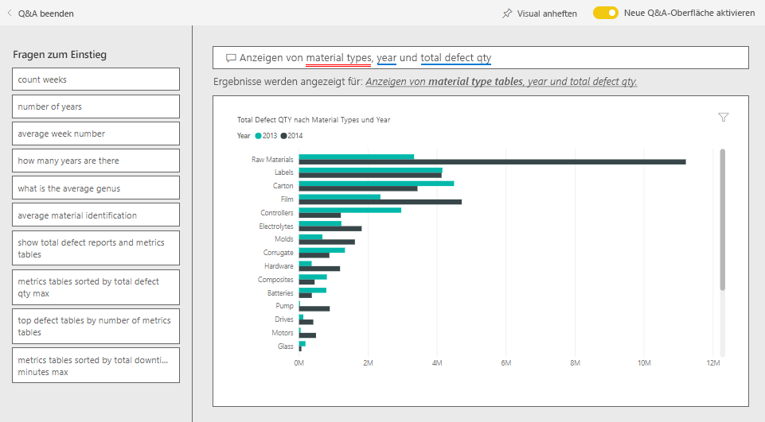
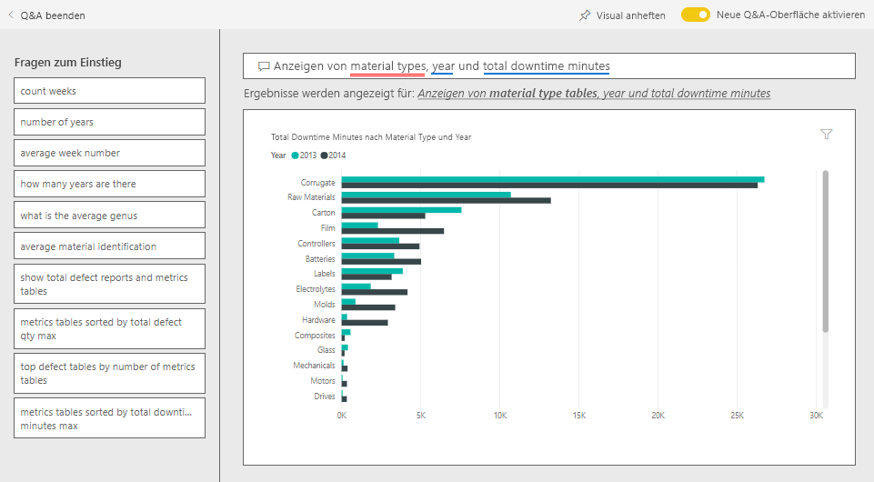
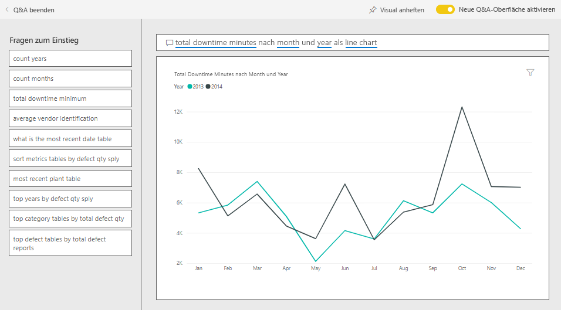

# Analysebeispiel für Lieferantenqualität für Power BI: Übersicht

Dieses branchenspezifische Beispieldashboard und der zugrunde liegende Bericht legen den Schwerpunkt auf eine der typischen Herausforderungen einer Lieferkette: die Lieferantenqualitätsanalyse. In dieser Analyse sind hauptsächlich zwei Metriken von Interesse: die Gesamtzahl der Mängel und die Ausfallzeiten, die dadurch verursacht wurden. 

Dieses Beispiel hat zwei wichtige Ziele:

* Erkennen, welcher Lieferant die beste und welcher die schlechteste Qualität liefert.
* Ermitteln, welche Werke Mängel besser erkennen und zurückweisen, um Ausfallzeiten zu minimieren.

Dieses Beispiel ist Teil einer Reihe, die Ihnen die Verwendung von Power BI anhand geschäftsbezogener Daten, Berichte und Dashboards zeigt. Es wurde von [obviEnce](http://www.obvience.com/) mit echten Daten erstellt, die anonymisiert wurden. Die Daten sind in verschiedenen Formaten verfügbar: Inhaltspaket, Power BI Desktop-PBIX-Datei oder Excel-Arbeitsmappe. Weitere Informationen finden Sie unter [Welche Beispieldaten sind für die Verwendung mit Power BI verfügbar?](sample-datasets.md). 

In diesem Tutorial wird das Inhaltspaket für das Analysebeispiel für die Anbieterqualität im Power BI-Dienst untersucht. Da die Berichtsoberfläche in Power BI Desktop und im Dienst ähnlich sind, können Sie das Tutorial auch anhand der PBIX-Beispieldatei in Power BI Desktop nachvollziehen. 

Sie benötigen keine Power BI-Lizenz, um die Beispiele in Power BI Desktop kennenzulernen. Wenn Sie nicht über eine Power BI Pro-Lizenz verfügen, können Sie das Beispiel im Power BI-Dienst in Ihrem Arbeitsbereich speichern. 

## Abrufen des Beispiels

Bevor Sie das Beispiel verwenden können, müssen Sie es zunächst als [Inhaltspaket](#get-the-content-pack-for-this-sample), [PBIX-Datei](#get-the-pbix-file-for-this-sample) oder [Excel-Arbeitsmappe](#get-the-excel-workbook-for-this-sample) herunterladen.

### Abrufen des Inhaltspakets für dieses Beispiel

1. Öffnen Sie den Power BI-Dienst (app.powerbi.com), melden Sie sich an, und öffnen Sie den Arbeitsbereich, in dem Sie das Beispiel speichern möchten.

   Wenn Sie nicht über eine Power BI Pro-Lizenz verfügen, können Sie das Beispiel in Ihrem Arbeitsbereich speichern.

2. Wählen Sie in der linken unteren Ecke **Daten abrufen** aus.
   
   
3. Klicken Sie auf der daraufhin angezeigten Seite **Daten abrufen** auf **Beispiele**.
   
4. Wählen Sie **Analysebeispiel für Lieferantenqualität** aus, und wählen Sie dann **Verbinden** aus.  
   
   

5. Das Inhaltspaket wird in Power BI importiert, und dem aktuellen Arbeitsbereich werden ein neues Dashboard, ein neuer Bericht und ein neues Dataset hinzugefügt.
   
   
  
### Abrufen der PBIX-Datei für dieses Beispiel

Alternativ können Sie das Analysebeispiel für Lieferantenqualität als [PBIX-Datei](http://download.microsoft.com/download/8/C/6/8C661638-C102-4C04-992E-9EA56A5D319B/Supplier-Quality-Analysis-Sample-PBIX.pbix) herunterladen, die zur Verwendung mit Power BI Desktop vorgesehen ist.

### Abrufen der Excel-Arbeitsmappe für dieses Beispiel

Wenn Sie sich die Datenquelle für dieses Beispiel ansehen möchten, dieses steht auch als [Excel-Arbeitsmappe](http://go.microsoft.com/fwlink/?LinkId=529779) zur Verfügung. Die Arbeitsmappe enthält Power View-Blätter, die Sie anzeigen und ändern können. Aktivieren Sie die Add-Ins für die Datenanalyse, um die Rohdaten anzuzeigen, und klicken Sie dann auf **Power Pivot > Verwalten**. Weitere Informationen zum Aktivieren der Add-Ins für Power View und Power Pivot finden Sie unter [Anzeigen der Excel-Beispiele in Excel](sample-datasets.md#optional-take-a-look-at-the-excel-samples-from-inside-excel-itself).

## Ausfallzeiten durch Materialmängel
Wir analysieren die Ausfallzeiten durch Materialmängel und stellen fest, welche Anbieter verantwortlich sind.  

1. Wählen Sie auf dem Dashboard die Kachel **Gesamtanzahl der Mängel** oder die Kachel **Gesamtdauer der Downtime in Minuten** aus.

     

   Der Bericht „Analysebeispiel für Lieferantenqualität“ wird mit der Seite **Analyse der Ausfallzeiten** geöffnet.

   Beachten Sie, dass es 33 Millionen fehlerhafte Teile gibt, die eine Gesamtausfallzeit (Downtime) von 77.000 Minuten verursachen. Obwohl es für einige Materialien weniger fehlerhafte Teile gibt, können diese zu Verzögerungen führen, die zu weiteren Ausfallzeiten führen. Sehen wir uns die Berichte dazu an.  
2. Ein Blick auf die Linie **Gesamtdauer der Downtime in Minuten** im Kombinationsdiagramm **Mängel und Ausfallzeiten (Min.) nach Materialtyp** zeigt, dass wellende Materialien die meisten Ausfallzeiten verursachen.  
3. Wählen Sie die Spalte **Corrugate** (Wellen) aus, um zu sehen, welche Werke am häufigsten von diesen Mängeln betroffen sind und welcher Lieferant verantwortlich ist.  

     
4. Wählen Sie auf der Karte **Downtime (min) by Plant** (Ausfallzeiten (Min.) nach Hersteller) nacheinander einzelne Werke aus, um zu sehen, welche Hersteller oder Materialien für die Ausfallzeiten in diesem Werk verantwortlich sind.

### Wer sind die schlechtesten Lieferanten?
 Wir möchten die acht schlechtesten Lieferanten finden und den Prozentsatz der durch sie verursachten Ausfallzeiten ermitteln. Dies lässt sich erreichen, indem Flächendiagramm **Ausfallzeiten (Min.) nach Hersteller** in eine Treemap geändert wird.  

1. Wählen Sie auf dem Bericht auf dessen Seite **Analyse der Ausfallzeiten** in der oberen linken Ecke die Option **Bericht bearbeiten** aus.  
2. Wählen Sie das Flächendiagramm **Ausfallzeiten (Min.) nach Hersteller** aus, und wählen Sie im Bereich **Visualisierungen** das Symbol **Treemap** aus.  

     

    In der Treemap wird das Feld **Hersteller** automatisch als **Gruppe** festgelegt.  

      

   Auf dieser Treemap sehen wir die acht wichtigsten Hersteller in den acht Blöcken auf der linken Seite der Treemap. Wir sehen auch, dass sie für knapp 50 % aller Ausfallzeiten in Minuten verantwortlich sind.  
3. Wählen Sie in der oberen Navigationsleiste die Option **Analysebeispiel für Lieferantenqualität** aus, um zum Dashboard zurückzukehren.

### Werke vergleichen
Nun möchten wir prüfen, welches Werk beim Umgang mit Materialmängeln besser abschneidet und weniger Ausfallzeiten verzeichnet.  

1. Wählen Sie auf dem Dasboard die Kartenkachel **Berichte zur Gesamtanzahl der Mängel nach Werk, Mängeltyp** aus.      

     

   Der Bericht wird auf der Seite **Analysebeispiel für Lieferantenqualität** geöffnet.  

2. Wählen Sie in der Legende der Kachel **Berichte zur Gesamtanzahl der Mängel nach Werk, Mängeltyp** den Kreis **Auswirkung** aus.  

      

    Im Blasendiagramm sehen Sie, dass **Logistik** die problematischste Kategorie ist. Sie ist die größte Kategorie in Bezug auf Gesamtanzahl der Mängel, Mängelberichte und Ausfallzeiten in Minuten. Untersuchen wir diese Kategorie genauer.  
3. Wählen Sie die **Logistik**-Blase im Blasendiagramm aus, und sehen Sie sich die Werke in Springfield und Naperville genauer an. Naperville scheint beim Umgang mit Mängeln erfolgreicher zu sein, da es eine Vielzahl an Reklamationen und eine geringe Auswirkung hat – Springfield verzeichnet hingegen einen hohen Wert bei der Auswirkung.  

     
4. Wählen Sie in der oberen Navigationsleiste die Option **Analysebeispiel für Lieferantenqualität** aus, um zum Dashboard zurückzukehren.

## Welcher Materialart schneidet am besten ab?
Der am besten verwaltete Materialtyp ist unabhängig von der Anzahl der Mängel der Typ mit den geringsten Ausfallzeiten oder gar keiner Beeinträchtigung.

1. Sehen wir uns im Dashboard die Kachel **Gesamte Mängel nach Materialart, Fehlerart** an.

   

   Es ist zu sehen, dass es für den Materialtyp **Raw Materials** (Rohmaterialien) zwar eine große Anzahl von Mängeln gibt, die meisten dieser Mängel jedoch entweder zurückgewiesen werden oder keine Auswirkung haben.

   Es soll nun überprüft werden, ob dieser Materialtyp trotz der großen Anzahl von Mängeln tatsächlich nicht viele Ausfallzeiten verursacht.

2. Sehen wir uns im Dashboard die Kachel **Gesamtzahl der Mängel, gesamte Ausfallzeiten in Minuten nach Materialart** an.

   

   Es scheint, dass Rohmaterialien gut im Griff sind: Obwohl es für sie mehr Mängel gibt, haben sie eine kleinere Gesamtdauer der Downtime in Minuten.

### Mängel nach Ausfallzeiten pro Jahr vergleichen
1. Wählen Sie die Kartenkachel **Gesamtanzahl der Mängel, Gesamtdauer der Downtime in Minuten nach Materialtyp** aus, um den Bericht mit der Seite **Analyse der Lieferantenqualität** zu öffnen.
2. Auf dem Diagramm **Gesamtanzahl der Mängel nach Monat und Jahr** ist zu sehen, dass die Anzahl der Mängel für 2014 größer ist als für 2013.  

      
3. Führen mehr Mängel zwangsläufig zu mehr Ausfallzeiten? Stellen Sie Fragen über das Q&A-Feld, um das in Erfahrung zu bringen.  
4. Wählen Sie in der oberen Navigationsleiste die Option **Analysebeispiel für Lieferantenqualität** aus, um zum Dashboard zurückzukehren.  
5. Da wir wissen, dass Rohmaterialien die höchste Anzahl von Mängeln haben, geben Sie dies in das Fragenfeld ein: *Anzeigen von Materialtypen, Jahr und Gesamtanzahl der Mängel* (show material types, year, and total defect qty).  

    2014 lagen mehr Mängel bei Rohmaterialien vor als 2013.  

      
6. Ändern Sie nun die Frage in: _show material types, year, and total **downtime minutes**_ (Anzeigen von Materialtypen, Jahr und Gesamtdauer der Downtime in Minuten).  

   

   Sie sehen, dass die Ausfallzeiten für Rohmaterialien 2013 und 2014 etwa gleich waren, obwohl es 2014 mehr Mängel bei Rohmaterialien gegeben hat. Es scheint, dass mehr Mängel bei Rohmaterialien im Jahr 2014 nicht zu viel mehr entsprechenden Ausfallzeiten geführt haben.

### Mängel nach Ausfallzeit pro Monat vergleichen
Sehen wir uns ein weiteres Dashboard-Kachel zur Gesamtzahl der Mängel an.  

1. Wählen Sie **Q&A beenden** in der oberen linken Ecke aus, um zum Dashboard zurückzukehren.  

    Sehen Sie sich die Kachel **Gesamtanzahl der Mängel nach Monat, Jahr** genauer an. Auf der Kachel ist zu sehen, dass in der ersten Hälfte von 2014 genauso viele Mängel auftraten wie 2013, in der zweiten Hälfte von 2014 die Anzahl der Mängel jedoch deutlich anstieg.  

      

    Prüfen wir nun, ob durch den Anstieg der Mängel auch die Ausfallzeiten in Minuten angestiegen sind.  
2. Geben Sie in das Fragenfeld Folgendes ein: *Gesamtdauer der Downtime in Minuten nach Monat und Jahr als Liniendiagramm* (total downtime minutes by month and year as a line chart).  

   

   Abgesehen von einem Sprung der Ausfallzeit im Juni und Oktober führte die Anzahl der Mängel nicht zu deutlich mehr Ausfallzeit. Dieses Ergebnis zeigt, dass wir Mängel gut im Griff haben.  
3. Um dieses Diagramm an Ihr Dashboard anzuheften, wählen Sie das Stecknadelsymbol  über dem Fragenfeld aus.  
4. Prüfen Sie zum Untersuchen der Monate mit Ausreißern die Ausfallzeiten in Minuten im Oktober nach Materialtyp, Werksstandort, Kategorie usw., indem Sie Fragen wie *Gesamte Downtime in Minuten im Oktober nach Werk* (total downtime minutes in October by plant) stellen. 
5. Wählen Sie **Q&A beenden** in der oberen linken Ecke aus, um zum Dashboard zurückzukehren.

## Nächste Schritte: Herstellen einer Verbindung mit den Daten
In dieser Umgebung können Sie sicher experimentieren, da Sie die Änderungen nicht speichern müssen. Wenn Sie sie speichern, können Sie jederzeit wieder auf **Daten abrufen** klicken, um ein neues Exemplar dieses Beispiels herunterzuladen.

Wir hoffen, diese Tour hat Ihnen gezeigt, wie Power BI-Dashboards, das Fragen- und Antwortenmodul und Berichte Ihnen Einblicke in Beispieldaten geben können. Jetzt liegt es an Ihnen – stellen Sie Verbindungen mit Ihren eigenen Daten her. Mit Power BI können Sie Verbindungen mit einer Vielzahl von Datenquellen herstellen. Weitere Informationen finden Sie unter [Erste Schritte mit dem Power BI-Dienst](service-get-started.md).
