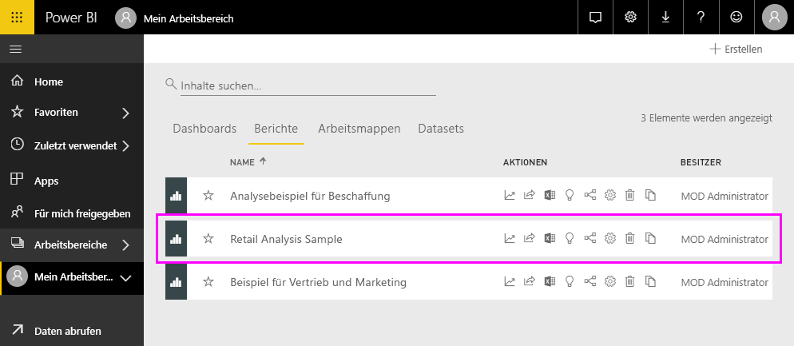
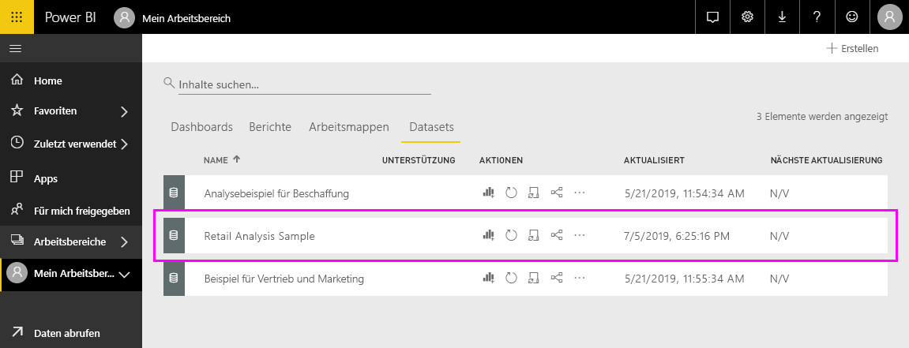

#  Herstellen einer Verbindung mit Beispielen im Power BI-Dienst

In diesem Tutorial wird Folgendes gezeigt: 
- Importieren eines Beispielinhaltspakets, Hinzufügen des Pakets zum Power BI-Dienst und Öffnen der Inhalte. Ein *Inhaltspaket* ist ein Beispieltyp, in dem das Dataset mit einem Dashboard und einem Bericht gebündelt ist. 
- Öffnen einer PBIX-Beispieldatei in Power BI Desktop.

Wenn Sie weitere Hintergrundinformationen wünschen, lesen Sie [Welche Beispieldaten sind für die Verwendung mit Power BI verfügbar?](sample-datasets.md). In diesem Artikel erfahren Sie alles über die Beispiele: wie Sie sie erhalten, wo Sie sie speichern und wie Sie sie verwenden, sowie einige der Geschichten, die jedes Beispiel erzählen kann. 

## Voraussetzungen
Die Beispiele sind für den Power BI-Dienst und für Power BI Desktop verfügbar. Wir verwenden das Analysebeispiel für den Einzelhandel.

Das in diesem Tutorial verwendete Beispielinhaltspaket zur *Einzelhandelsanalyse* besteht aus einem Dashboard, einem Bericht und einem Dataset.
Um sich mit diesem bestimmten Inhaltspaket und dessen Szenario vertraut zu machen, lesen Sie [Analysebeispiel für Einzelhandel für Power BI: Übersicht](sample-retail-analysis.md), bevor Sie beginnen.

## Beispiele im Power BI-Dienst

1. Öffnen Sie den Power BI-Dienst (app.powerbi.com), melden Sie sich an, und öffnen Sie den Arbeitsbereich, in dem Sie das Beispiel speichern möchten. 

    Wenn Sie nicht über eine Power BI Pro-Lizenz verfügen, können Sie das Beispiel in Ihrem Arbeitsbereich speichern.

2. Wählen Sie unten im Navigationsbereich **Daten abrufen** aus. 

   

   Wenn **Daten abrufen** nicht angezeigt wird, erweitern Sie den Navigationsbereich, indem Sie am oberen Rand des Bereichs das folgende Symbol auswählen: .

5. Klicken Sie auf der daraufhin angezeigten Seite **Daten abrufen** auf **Beispiele**.
   
6. Wählen Sie das **Analysebeispiel für Einzelhandel** und dann **Verbinden** aus.   
   
   

## Was wurde importiert?
Wenn Sie für ein Beispielinhaltspaket die Option **Verbinden** auswählen, ruft Power BI eine Kopie dieses Inhaltspakets ab und speichert das Paket für Sie in der Cloud. Da die Person, die das Inhaltspaket erstellt hat, ein Dataset, einen Bericht und ein Dashboard in das Paket eingebunden hat, erhalten Sie diese Komponenten, wenn Sie **Verbinden** auswählen. 

1. Wenn Sie **Verbinden** auswählen, erstellt Power BI das neue Dashboard und listet es auf der Registerkarte **Dashboards** auf. 
   
   
2. Öffnen Sie die Registerkarte **Berichte**. Hier wird ein neuer Bericht mit dem Namen *Analysebeispiel für Einzelhandel* angezeigt.
   
   
   
   Sehen Sie sich die Registerkarte **Datasets** an. Auf dieser gibt es nun ein neues Dataset.
   
   

## Untersuchen der neuen Inhalte
Untersuchen Sie jetzt selbstständig das Dashboard, das Dataset und den Bericht. Es gibt viele verschiedene Möglichkeiten, zu Dashboards, Berichten und Datasets zu navigieren. Eine dieser Möglichkeiten ist in der folgenden Vorgehensweise beschrieben.  

1. Navigieren Sie zurück zur Registerkarte **Dashboards**, und wählen Sie dann das Dashboard **Analysebeispiel für den Einzelhandel** aus, um es zu öffnen.       

   Das Dashboard wird geöffnet, und dessen Visualisierungskacheln werden angezeigt.   
 
1. Wählen Sie eine der Kacheln auf dem Dashboard aus, um den zugrunde liegenden Bericht zu öffnen. In diesem Beispiel wird das Flächendiagramm **This Year's Sales, Last Year's Sales by Fiscal Month** (Umsatz dieses Jahr, Vorjahresumsatz nach Geschäftsmonat) ausgewählt.  

   

   Der Bericht wird mit der Seite geöffnet, die das von Ihnen ausgewählte Flächendiagramm enthält. In diesem Fall ist dies die Berichtsseite **District Monthly Sales** (Monatliche Umsätze nach Bezirk).
   
   
   
   > [!NOTE]
   > Wurde die Kachel mit [Power BI Q&A](power-bi-tutorial-q-and-a.md) erstellt, wird stattdessen die Q&A-Seite geöffnet. Wurde die Kachel [aus Excel angeheftet](service-dashboard-pin-tile-from-excel.md), wird Excel Online in Power BI geöffnet.
   > 
   > 
1. Wenn eine Person ein Inhaltspaket für Kollegen freigibt, möchte diese Person normalerweise nur die Erkenntnisse freigeben, statt direkten Zugriff auf die Daten zu gewähren. Auf der Registerkarte **Datasets** haben Sie mehrere Möglichkeiten, das Dataset zu untersuchen. Sie können jedoch nicht die Zeilen und Spalten Ihrer Daten anzeigen, wie Sie dies in Power BI Desktop oder Excel tun können. 
   
   
   
1. Eine der Möglichkeiten zum Erkunden des Datasets besteht darin, Visualisierungen und Berichte von Grund auf neu zu erstellen. Klicken Sie auf das Diagrammsymbol,  um das Dataset im Berichtsbearbeitungsmodus zu öffnen.
     
   

1. Eine weitere Möglichkeit zum Erkunden des Datasets besteht darin, [Quick Insights](consumer/end-user-insights.md) (Schnelleinblicke) auszuführen. Wählen Sie **Weitere Optionen** (...) und dann **Schnelle Einblicke gewinnen** aus. Wenn die Einblicke bereit sind, wählen Sie **Einblicke anzeigen** aus.
     
    

## Beispiele in Power BI Desktop 
Wenn Sie die PBIX-Beispieldatei zum ersten Mal in Power BI Desktop öffnen, wird sie in der Berichtsansicht angezeigt, in der Sie beliebig viele Berichtsseiten mit Visualisierungen erkunden, erstellen und bearbeiten können. Die Berichtsansicht bietet nahezu den gleichen Funktionsumfang wie die Bearbeitungsansicht für Berichte im Power BI-Dienst. Sie können Visualisierungen verschieben, kopieren, einfügen, zusammenführen usw. 

Anders als Bearbeiten eines Berichts im Power BI-Dienst können Sie in Power BI Desktop auch mit Abfragen arbeiten und Daten modellieren, sodass Sie sicherstellen können, dass die Daten in Ihren Berichten optimale Einblicke bieten. Sie können die Power BI Desktop-Datei dann jederzeit entweder auf Ihrem lokalen Laufwerk oder in der Cloud speichern.

1. Laden Sie die [PBIX-Datei mit dem Analysebeispiel für den Einzelhandel](https://download.microsoft.com/download/9/6/D/96DDC2FF-2568-491D-AAFA-AFDD6F763AE3/Retail%20Analysis%20Sample%20PBIX.pbix) herunter, und öffnen Sie die Datei in Power BI Desktop. 

    

1. Die Datei wird in der Berichtsansicht geöffnet. Beachten Sie die vier Registerkarten am unteren Rand des Berichts-Editors. Diese Registerkarten entsprechen den vier Seiten in diesem Bericht. Für dieses Beispiel ist aktuell die Seite **New Stores** (Neue Geschäfte) ausgewählt. 

    .

1. Detaillierte Informationen zum Berichts-Editor finden Sie unter [Einführung in den Berichts-Editor in Power BI](service-the-report-editor-take-a-tour.md).

## Welche Bestandteile hat der Bericht?
Wenn Sie eine PBIX-Beispieldatei herunterladen, wird nicht nur ein Bericht, sondern auch das *zugrunde liegende Dataset* heruntergeladen. Wenn Sie die Datei öffnen, lädt Power BI Desktop die Daten mit den zugehörigen Abfragen und Beziehungen. Sie können die zugrunde liegenden Daten und Beziehungen anzeigen, aber die zugrunde liegenden Abfragen können Sie nicht im Abfrage-Editor anzeigen.

1. Wechseln Sie mithilfe des Tabellensymbols  zur [Datenansicht](desktop-data-view.md).
 
    

    In der Datenansicht können Sie Daten im Power BI Desktop-Modell überprüfen, untersuchen und verstehen. Die Ansicht unterscheidet sich davon, wie Sie Tabellen, Spalten und Daten im Abfrage-Editor anzeigen. Die Daten in der Datenansicht sind bereits in das Modell geladen.

    Wenn Sie Ihre Daten modellieren, möchten Sie möglicherweise gelegentlich sehen, was tatsächlich in den Zeilen und Spalten einer Tabelle vorhanden ist, ohne ein visuelles Element auf dem Berichtszeichenbereich erstellen zu müssen. Dies ist besonders dann der Fall, wenn Sie Measures und berechnete Spalten erstellen oder einen Datentyp oder die Datenkategorie identifizieren müssen.

1. Wechseln Sie zur [Beziehungsansicht](desktop-relationship-view.md), indem Sie das folgende Symbol auswählen: .
 
    

    Die Beziehungsansicht zeigt alle Tabellen, Spalten und Beziehungen in Ihrem Modell an. Hier können Sie Beziehungen anzeigen, ändern und erstellen.

## Nächste Schritte
In dieser Umgebung können Sie sicher experimentieren, da Sie die Änderungen nicht speichern müssen. Wenn Sie sie speichern, können Sie jederzeit wieder auf **Daten abrufen** klicken, um ein neues Exemplar dieses Beispiels herunterzuladen.

Wir hoffen, diese Tour hat Ihnen gezeigt, wie Power BI-Dashboards, -Datasets, -Beziehungen und -Berichte Ihnen Einblicke in Beispieldaten geben können. Jetzt liegt es an Ihnen – stellen Sie Verbindungen mit Ihren eigenen Daten her. Mit Power BI können Sie Verbindungen mit einer Vielzahl von Datenquellen herstellen. Wenn Sie tiefer in die Materie eindringen möchten, lesen Sie [Tutorial: Erste Schritte mit dem Power BI-Dienst](service-get-started.md) und [Erste Schritte mit Power BI Desktop](desktop-getting-started.md).  

Weitere Informationen finden Sie unter:  
- [Grundlegende Konzepte für Designer im Power BI-Dienst](service-basic-concepts.md)
- [Welche Beispieldaten sind für die Verwendung mit Power BI verfügbar?](sample-datasets.md)
- [Datenquellen für Power BI](service-get-data.md)

Weitere Fragen? [Wenden Sie sich an die Power BI-Community](https://community.powerbi.com/)
