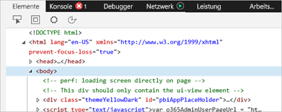
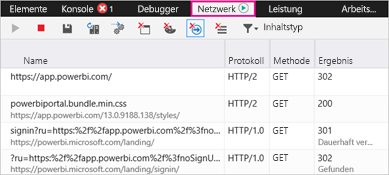
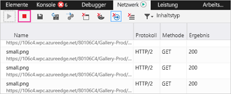
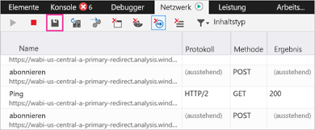

# Erfassen von zusätzlichen Diagnoseinformationen für Power BI

Dieser Artikel enthält Anweisungen für die manuelle Erfassung von zusätzlichen Diagnoseinformationen aus dem Webclient von Power BI.

1. Navigieren Sie mit Microsoft Edge oder Internet Explorer zu [Power BI](https://app.powerbi.com).

1. Drücken Sie **F12**, um die Microsoft Edge-Entwicklertools zu öffnen.

   

1. Wählen Sie die Registerkarte **Network** (Netzwerk) aus. Es wird der Datenverkehr aufgelistet, der bereits erfasst wurde.

   

    Sie können:

    * Im Fenster browsen und jedes eventuell auftretende Problem reproduzieren.

    * Das Entwicklertoolsfenster während der Sitzung jederzeit durch Drücken von F12 aus- und einblenden.

1. Zum Beenden der Profilerstellungssitzung das rote Quadrat auf der Registerkarte **Netzwerk** im Entwicklertoolbereich auswählen.

   

1. Wählen Sie das Diskettensymbol aus, um die Daten als HTTP-Archivdatei (HAR) zu exportieren.

   

1. Geben Sie einen Dateinamen ein, und speichern Sie die HAR-Datei.

    Die HAR-Datei enthält alle Informationen über Netzwerkanforderungen zwischen dem Browserfenster und Power BI, darunter:

    * Die Aktivitäts-IDs für jede Anforderung.

    * Den genauen Zeitstempel für jede Anforderung.

    * Alle an den Client zurückgegebenen Fehlerinformationen.

    Diese Ablaufverfolgung enthält außerdem die Daten, die zum Füllen der auf dem Bildschirm angezeigten visuellen Objekte verwendet werden.

1. Sie können die HAR-Datei angeben, um die Überprüfung zu unterstützen.

Weitere Fragen? [Stellen Sie Ihre Frage in der Power BI-Community.](http://community.powerbi.com/)
