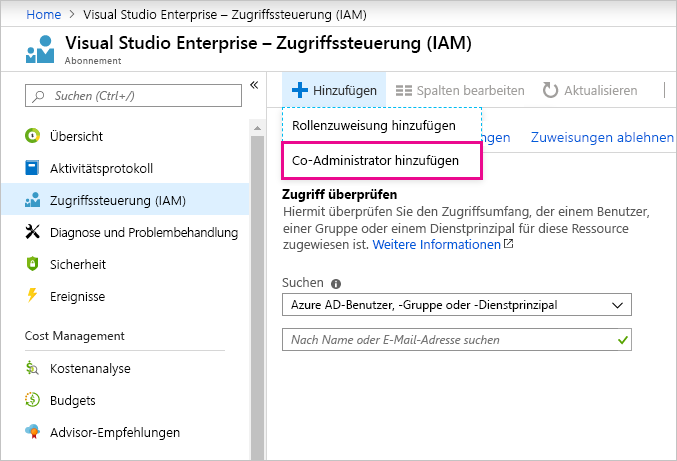

# Verwenden des gleichen Kontos für Power BI und Azure

Wenn Sie sowohl Benutzer von Power BI als auch von Azure sind, möchten Sie möglicherweise für beide Dienste die gleiche Anmeldung verwenden, um Ihr Kennwort nicht zweimal eingeben zu müssen.

In Power BI werden Sie mit Ihrem Unternehmenskonto registriert, das mit Ihrer Firmen- oder Schul-E-Mail-Adresse verknüpft ist.  In Azure werden Sie entweder mit einem Microsoft-Konto oder mit Ihrem Unternehmenskonto registriert.

Wenn Sie die gleiche Anmeldung sowohl für Azure als auch für Power BI verwenden möchten, müssen Sie sich bei Azure mit Ihrem Unternehmenskonto anmelden.

**Was geschieht, wenn ich mich in Azure bereits mit meinem Microsoft-Konto angemeldet habe?**

Sie können Ihr Unternehmenskonto mit folgenden Schritten als Co-Administrator in Azure hinzufügen:

1. Melden Sie sich beim [Azure-Portal](http://portal.azure.com/) an. Wenn Sie Benutzer in mehreren Azure-Verzeichnissen sind, wählen Sie **Abonnements** aus und filtern dann für die Anzeige nur das Verzeichnis und die Abonnements heraus, die Sie bearbeiten möchten.

1. Wählen Sie im Navigationsbereich die Option **Zugriffssteuerung (IAM)** und dann **Hinzufügen** \> **Co-Administrator hinzufügen** aus.

    

1. Geben Sie die E-Mail-Adresse ein, die mit Ihrem Unternehmenskonto verknüpft ist, und wählen Sie **Hinzufügen** aus.

1. Verwenden Sie bei Ihrer nächsten Anmeldung im Azure-Portal Ihre Organisations-E-Mail-Adresse.

Weitere Fragen? [Wenden Sie sich an die Power BI-Community](http://community.powerbi.com/)
