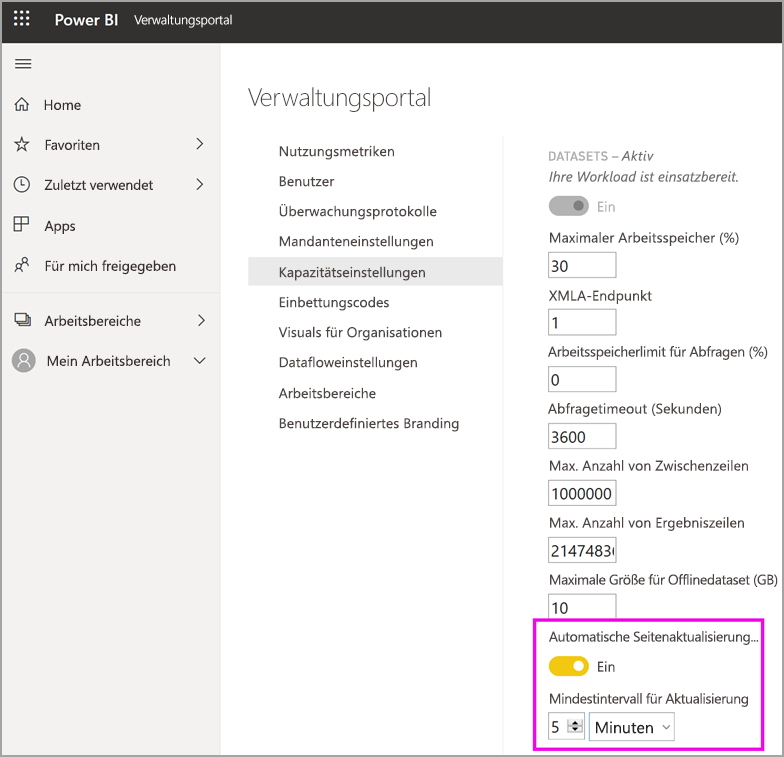

# Konfigurieren von Workloads in einer Premium-Kapazität

In diesem Artikel erfahren Sie, wie Sie Workloads für Power BI Premium-Kapazitäten aktivieren und konfigurieren. Kapazitäten unterstützen standardmäßig nur die Workload für die Ausführung von Power BI-Abfragen. Sie können auch zusätzliche Workloads für **[KI (Cognitive Services)](service-cognitive-services.md)** , **[Dataflows](service-dataflows-overview.md#dataflow-capabilities-on-power-bi-premium)** und **[Paginierte Berichte](paginated-reports-save-to-power-bi-service.md)** aktivieren und konfigurieren.

## Standardeinstellungen für den Arbeitsspeicher

Abfrageworkloads sind für Ressourcen optimiert und durch Ressourcen beschränkt, die durch Ihre Premium-Kapazitäts-SKU bestimmt werden. Premium-Kapazitäten unterstützen auch zusätzliche Workloads, die Ihre Kapazitätsressourcen nutzen können. Arbeitsspeicher-Standardwerte für diese Workloads basieren auf den Kapazitätsknoten, die für Ihre SKU zur Verfügung stehen. Die Einstellungen für maximalen Arbeitsspeicher sind nicht kumulativ. Für KI und Dataflows wird Arbeitsspeicher dynamisch bis zum angegebenen Maximalwert zugeordnet. Für paginierte Berichte ist die Zuordnung dagegen statisch.

### Microsoft Office-SKUs für Software-as-a-Service-Szenarios (SaaS)

|                     | EM2                      | EM3                       | P1                      | P2                       | P3                       |
|---------------------|--------------------------|--------------------------|-------------------------|--------------------------|--------------------------|
| KI | N/V | N/V | 20 % Standard; mindestens 20 % | 20 % Standard, mindestens 10 % | 20 % Standard, mindestens 5 % |
| Dataflows | N/V |20% Standard; mindestens 12%  | 20 % Standard, mindestens 5 %  | 20% Standard; mindestens 3% | 20 % Standard, mindestens 2 %  |
| Paginierte Berichte | N/V |N/V | 20 % Standard, mindestens 10 % | 20 % Standard, mindestens 5 % | 20 % Standard, mindestens 2,5 % |
| | | | | | |

### Microsoft Azure-SKUs für Plattform-as-a-Service-Szenarios (PaaS)

|                  | A1                       | A2                       | A3                      | A4                       | A5                      | A6                        |
|-------------------|--------------------------|--------------------------|-------------------------|--------------------------|-------------------------|---------------------------|
| KI | N/V                      | 20 % Standard; mindestens 100 %                     | 20 % Standard; mindestens 50 %                     | 20 % Standard; mindestens 20 % | 20 % Standard, mindestens 10 % | 20 % Standard, mindestens 5 % |
| Dataflows         | 40% Standard; mindestens 40% | 24% Standard; mindestens 24% | 20% Standard; mindestens 12% | 20 % Standard, mindestens 5 %  | 20% Standard; mindestens 3% | 20 % Standard, mindestens 2 %   |
| Paginierte Berichte | N/V                      | N/V                      | N/V                     | 20 % Standard, mindestens 10 % | 20 % Standard, mindestens 5 % | 20 % Standard, mindestens 2,5 % |
| | | | | | |

## Workloadeinstellungen

### KI (Vorschauversion)

Mit der KI-Workload können Sie Cognitive Services und automatisiertes maschinelles Lernen in Power BI verwenden. Verwenden Sie die folgenden Einstellungen, um das Workloadverhalten zu steuern.

| Einstellungsname | Beschreibung |
|---------------------------------|----------------------------------------|
| **Max. Arbeitsspeicher (%)** | Der Prozentsatz des maximal verfügbaren Arbeitsspeichers, der von KI-Prozessen in einer Kapazität verwendet werden kann. |
| **Verwendung über Power BI Desktop zulassen** | Diese Einstellung ist für die zukünftige Verwendung reserviert und wird nicht auf allen Mandanten angezeigt. |
| **Erstellung von Machine Learning-Modellen zulassen** | Diese Einstellung gibt an, ob Business Analysts Machine Learning-Modelle direkt in Power BI trainieren, überprüfen und aufrufen können. Weitere Informationen finden Sie unter [Automatisiertes Machine Learning in Power BI (Vorschau)](service-machine-learning-automated.md). |
| **Parallelismus für KI-Anforderungen aktivieren** | Diese Einstellung gibt an, ob KI-Anforderungen parallel ausgeführt werden können. |
|  |  |

### Datasets

Die Datasetworkload ist standardmäßig aktiviert und kann nicht deaktiviert werden. Verwenden Sie die folgenden Einstellungen, um das Workloadverhalten zu steuern. Unterhalb der Tabelle finden Sie zusätzliche Verwendungsinformationen für einige der Einstellungen.

| Einstellungsname | Beschreibung |
|---------------------------------|----------------------------------------|
| **Max. Arbeitsspeicher (%)** | Der Prozentsatz des maximal verfügbaren Arbeitsspeichers, der von Datasets in einer Kapazität verwendet werden kann. |
| **XMLA-Endpunkt** | Mit dieser Einstellung wird festgelegt, dass Verbindungen von Clientanwendungen die Sicherheitsgruppenmitgliedschaft berücksichtigen, die auf den Ebenen des Arbeitsbereichs und der Apps festgelegt wird. Weitere Informationen finden Sie unter [Herstellen einer Verbindung zwischen Datasets und Clientanwendungen und Tools](service-premium-connect-tools.md). |
| **Max Intermediate Row Set Count** (Maximale Anzahl von Zwischenrowsets) | Die maximale Anzahl von Zwischenzeilen, die von DirectQuery zurückgegeben werden. Der Standardwert ist 1.000.000, und der zulässige Bereich liegt zwischen 100.000 und 2.147.483.647. |
| **Maximale Größe für Offlinedataset (GB)** | Die maximale Größe des Offlinedatasets im Arbeitsspeicher. Dies ist die komprimierte Größe auf dem Datenträger. Der Standardwert wird durch die SKU festgelegt, und der zulässige Bereich liegt zwischen 0,1 und 10 GB. |
| **Max Result Row Set Count** (Maximale Anzahl von Ergebnisrowsets) | Die maximale Anzahl von Zeilen, die in einer DAX-Abfrage zurückgegeben werden. Der Standardwert ist -1 (keine Grenze), und der zulässige Bereich liegt zwischen 100000 und 2147483647. |
| **Query Memory Limit (%)** (Arbeitsspeicherlimit für Abfragen (%)) | Der Prozentsatz des maximal verfügbaren Arbeitsspeichers, der für temporäre Ergebnisse in einer Abfrage oder einem DAX-Measure verwendet werden kann. |
| **Query Timeout (seconds)** (Abfragetimeout (Sekunden)) | Die maximale Zeitspanne bis zum Timeout einer Abfrage. Der Standardwert lautet 3.600 Sekunden (1 Stunde). Bei einem Wert von 0 (null) tritt kein Timeout für Abfragen auf. |
| **Automatische Seitenaktualisierung (Vorschau)** | Ein-/Ausschalten, um für Premium-Arbeitsbereiche automatische Seitenaktualisierung zu ermöglichen. |
| **Mindestintervall für Aktualisierung** | Wenn die automatische Seitenaktualisierung aktiviert ist, das minimal zulässige Intervall für die Seitenaktualisierung. Der Standardwert beträgt fünf Minuten, und der zulässige Mindestwert ist eine Sekunde. |
|  |  |  |

#### Maximale Anzahl von Zwischenzeilen

Verwenden Sie diese Einstellung, um die Auswirkungen ressourcenintensiver oder schlecht konzipierter Berichte einzuschränken. Wenn eine Abfrage an ein DirectQuery-Dataset zu einem sehr großen Ergebnis aus der Quelldatenbank führt, kann dies zu einem Anstieg der Speicherauslastung und dem Verarbeitungsaufwand führen. Dies kann dazu führen, dass andere Benutzer und Berichte wenig Ressourcen haben. Mit dieser Einstellung kann der Kapazitätsadministrator anpassen, wie viele Zeilen von einer einzelnen Abfrage aus der Datenquelle abgerufen werden können.

Wenn die Kapazität mehr als den Standardwert von einer Million Zeilen unterstützen kann und Sie über ein großes Dataset verfügen, erhöhen Sie diese Einstellung, um weitere Zeilen abzurufen.

Beachten Sie, dass sich diese Einstellung nur auf DirectQuery-Abfragen auswirkt, während sich die Einstellung [Maximale Anzahl von Ergebniszeilen](#max-result-row-set-count) auf DAX-Abfragen auswirkt.

#### Maximale Größe für Offlinedataset

Mit dieser Einstellung hindern Sie Ersteller von Berichten daran, ein großes Dataset zu veröffentlichen, das sich negativ auf die Kapazität auswirken könnte. Beachten Sie, dass Power BI die tatsächliche Größe im Arbeitsspeicher erst ermitteln kann, wenn das Dataset in den Arbeitsspeicher geladen wurde. Es ist möglich, dass ein Dataset mit einer geringeren Offline-Größe über einen größeren Speicherbedarf als ein Dataset mit einer größeren Offline-Größe verfügt.

Wenn Sie über ein vorhandenes Dataset verfügen, das größer ist als die von Ihnen angegebene Größe für diese Einstellung, kann das Dataset nicht geladen werden, wenn ein Benutzer versucht, darauf zuzugreifen.

#### Maximale Anzahl von Ergebniszeilen

Verwenden Sie diese Einstellung, um die Auswirkungen ressourcenintensiver oder schlecht konzipierter Berichte einzuschränken. Wenn dieser Grenzwert in einer DAX-Abfrage erreicht wird, wird dem Benutzer des Berichts der folgende Fehler angezeigt. Er sollte die Fehlerdetails kopieren und einen Administrator kontaktieren.

Beachten Sie, dass sich diese Einstellung nur auf DAX-Abfragen auswirkt, während sich die Einstellung [Maximale Anzahl von Zwischenzeilen](#max-intermediate-row-set-count) auf DirectQuery-Abfragen auswirkt.

#### Arbeitsspeicherlimit für Abfragen

Verwenden Sie diese Einstellung, um die Auswirkungen ressourcenintensiver oder schlecht konzipierter Berichte einzuschränken. Einige Abfragen und Berechnungen können zu Zwischenergebnissen führen, die viel Arbeitsspeicher für die Kapazität verwenden. Dies kann dazu führen, dass andere Abfragen sehr langsam ausgeführt werden, andere Datasets aus der Kapazität entfernt werden und bei anderen Benutzern der Kapazität zum Fehler „Nicht genügend Speicher“ führt.

Diese Einstellung gilt für die Datenaktualisierung und das Rendern von Berichten. Die Datenaktualisierung führt sowohl die Aktualisierung der Daten aus der Datenquelle als auch die Aktualisierung einer Abfrage aus, es sei denn, die Einstellung „Abfrage aktualisieren“ ist deaktiviert. Wenn die Einstellung „Abfrage aktualisieren“ nicht deaktiviert ist, gilt dieses Speicherlimit auch für diese Abfragen. Alle fehlgeschlagenen Abfragen bewirken, dass der Status der geplanten Aktualisierung als Fehler gemeldet wird, obwohl die Datenaktualisierung erfolgreich war.

#### Abfragetimeout

Verwenden Sie diese Einstellung, um eine bessere Kontrolle über Abfragen mit langer Ausführungsdauer zu gewährleisten, die dazu führen können, dass Berichte für Benutzer langsam geladen werden. Diese Einstellung gilt für die Datenaktualisierung und das Rendern von Berichten. Die Datenaktualisierung führt sowohl die Aktualisierung der Daten aus der Datenquelle als auch die Aktualisierung einer Abfrage aus, es sei denn, die Einstellung „Abfrage aktualisieren“ ist deaktiviert. Wenn die Einstellung „Abfrage aktualisieren“ nicht deaktiviert ist, gilt dieses Zeitlimit auch für diese Abfragen.

Diese Einstellung gilt für eine einzelne Abfrage und nicht für die Dauer, die benötigt wird, um alle Abfragen auszuführen, die mit dem Aktualisieren eines Datasets oder eines Berichts verknüpft sind. Sehen Sie sich das folgende Beispiel an:

- Die Einstellung **Abfragetimeout** beträgt 1200 (20 Minuten).
- Es werden fünf Abfragen ausgeführt, die jeweils 15 Minuten laufen.

Die Gesamtzeit für alle Abfragen beträgt 75 Minuten, aber das Einstellungslimit wird nicht erreicht, weil alle einzelnen Abfragen weniger als 20 Minuten laufen.

Beachten Sie, dass Power BI-Berichte diesen Standardwert mit einem wesentlich geringeren Zeitlimit für jede Abfrage der Kapazität außer Kraft setzen. Das Zeitlimit für jede Abfrage beträgt in der Regel etwa drei Minuten.

#### Automatische Seitenaktualisierung (Vorschau)

Wenn diese Option aktiviert ist, ermöglicht die automatische Seitenaktualisierung Benutzern in Ihrer Premium-Kapazität das Aktualisieren von Seiten in ihrem Bericht in einem definierten Intervall für DirectQuery-Quellen. Als Kapazitätsadministrator können Sie die folgenden Aufgaben ausführen:

1.  Aktivieren und Deaktivieren der automatischen Seitenaktualisierung
2.  Definieren eines Mindestintervalls für die Aktualisierung

Die folgende Abbildung zeigt, wo Sie die Einstellung für das automatische Aktualisierungsintervall finden:

Abfragen, die durch automatische Seitenaktualisierung erstellt werden, werden direkt an die Datenquelle gerichtet. Daher ist es wichtig, die Zuverlässigkeit und Last dieser Quellen zu berücksichtigen, wenn Sie automatische Seitenaktualisierung in Ihrem Unternehmen zulassen. 

### Dataflows

Mit der Dataflow-Workload können Sie die Self-Service-Datenaufbereitung von Dataflows nutzen, um Daten zu erfassen, zu transformieren, zu integrieren und zu erweitern. Verwenden Sie die folgenden Einstellungen, um das Workloadverhalten zu steuern.

| Einstellungsname | Beschreibung |
|---------------------------------|----------------------------------------|
| **Max. Arbeitsspeicher (%)** | Der Prozentsatz des maximal verfügbaren Arbeitsspeichers, der von Dataflows in einer Kapazität verwendet werden kann. |
| **Erweiterte Dataflowcomputing-Engine (Vorschau)** | Aktivieren Sie diese Option, um eine bis zu 20-fach schnellere Berechnung von berechneten Entitäten bei der Arbeit mit umfangreichen Datenmengen zu erzielen. **Damit die neue Engine aktiviert wird, müssen Sie die Kapazität neu starten.** Weitere Informationen finden Sie unter [Erweiterte Dataflowcomputing-Engine](#enhanced-dataflows-compute-engine). |
| **Containergröße** | Die maximale Größe des Containers, der für jede Entität im Dataflow verwendet wird. Der Standardwert ist 700 MB. Weitere Informationen finden Sie unter [Containergröße](#container-size). |
|  |  |

#### Erweiterte Dataflowcomputing-Engine

Unterteilen Sie die Erfassung von Daten in separate Dataflows, und integrieren Sie Transformationslogik in berechnete Entitäten in verschiedenen Dataflows, um von der neuen Compute-Engine zu profitieren. Dieser Ansatz wird empfohlen, weil die Compute-Engine mit Dataflows arbeitet, die auf einen vorhandenen Dataflow verweisen. Dies funktioniert für Dataflows für die Erfassung von Daten nicht. Indem Sie den Anweisungen folgen, stellen Sie sicher, dass die neue Compute-Engine die Transformationsschritte verarbeitet, z. B. Joins und Merges, um optimale Leistung zu erzielen.

#### Containergröße

Beim Aktualisieren eines Dataflows erzeugt die Workload für Dataflows einen Container für jede Entität im Dataflow. Die Größe des Containerspeichers wird durch den Wert der Einstellung „Containergröße“ festgelegt. Der Standardwert für alle SKUs ist 700 MB. Sie sollten diese Einstellung in den folgenden Situationen ändern:

- Die Aktualisierung der Dataflows dauert zu lange oder schlägt bei einem Timeout fehl.
- Dataflowentitäten enthalten Berechnungsschritte wie Joins.  

Es wird empfohlen, die App [Power BI Premium Capacity Metrics](service-admin-premium-monitor-capacity.md) zu verwenden, um die Leistung der Workload für Dataflows zu analysieren.

In einigen Fällen führt das Erhöhen der Containergröße möglicherweise nicht zu einer Verbesserung der Leistung. Wenn z. B. der Dataflow Daten aus einer Quelle ausschließlich abruft, ohne wesentliche Berechnungen durchzuführen, hat eine Anpassung der Containergröße vermutlich keine positiven Auswirkungen. Die Erhöhung der Containergröße kann hilfreich sein, wenn die Workload für Dataflows mehr Speicher für Entitätsaktualisierungen belegen kann. Dadurch kann die Aktualisierungszeit für Entitäten verkürzt werden, für die rechenintensive Vorgänge ausgeführt werden.

Der Wert für „Containergröße“ darf die maximale Größe des Arbeitsspeichers für die Workload der Dataflows nicht überschreiten. Eine P1-Kapazität verfügt beispielsweise über 25 GB Arbeitsspeicher. Wenn für die Einstellung „Max. Arbeitsspeicher“ ein Wert von 20 % für die Workload der Dataflows festgelegt ist, kann der Wert von „Containergröße“ 5000 MB nicht überschreiten. In keinem Fall kann der Wert von „Containergröße“ den von „Max. Arbeitsspeicher“ überschreiten, und zwar auch dann nicht, wenn Sie einen höheren Wert festlegen.

### Paginierte Berichte

Die Workload für paginierte Berichte ermöglicht Ihnen die Ausführung paginierter Berichte basierend auf dem Standardformat von SQL Server Reporting Services im Power BI-Dienst. Verwenden Sie die folgende Einstellung, um das Workloadverhalten zu steuern.

| Einstellungsname | Beschreibung |
|---------------------------------|----------------------------------------|
| **Max. Arbeitsspeicher (%)** | Der Prozentsatz des maximal verfügbaren Arbeitsspeichers, der von paginierten Berichten in einer Kapazität verwendet werden kann. |
|  |  |

Mit paginierten Berichten kann benutzerdefinierter Code beim Rendern eines Berichts ausgeführt werden. Das ist beispielsweise sinnvoll, wenn sich die Textfarbe auf Grundlage der Inhalte dynamisch ändert, wodurch zusätzlicher Arbeitsspeicher belegt werden kann. Power BI Premium führt paginierte Berichte in einem Bereich innerhalb der Kapazität aus. Der festgelegte Wert für „Max. Arbeitsspeicher“ wird *unabhängig* davon verwendet, ob die Workload aktiv ist. Wenn Sie für die Einstellung „Max. Arbeitsspeicher“ einen Wert festlegen, der sich von der Standardeinstellung unterscheidet, müssen Sie einen ausreichend niedrigen Wert festlegen, damit dieser sich nicht negativ auf die anderen Workloads auswirkt.

Teilweise kann es vorkommen, dass die Workload für paginierte Berichte nicht verfügbar ist. In diesem Fall zeigt die Workload einen Fehlerstatus im Verwaltungsportal an, und den Benutzern werden Timeouts beim Rendern von Berichten angezeigt. Deaktivieren Sie die Workload, und aktivieren Sie sie dann erneut, um dieses Problem zu beheben.

## Konfigurieren von Workloads

Maximieren Sie die Kapazität der verfügbaren Ressourcen, indem Sie Workloads nur dann ermöglichen, wenn sie verwendet werden. Ändern Sie Arbeitsspeichereinstellungen und andere Einstellungen nur dann, wenn Sie Standardeinstellungen festgelegt haben, die Ihre Anforderungen an Kapazitätsressourcen nicht erfüllen.

### So konfigurieren Sie Workloads im Power BI-Verwaltungsportal

1. Wählen Sie unter **Kapazitätseinstellungen** > **PREMIUM-KAPAZITÄTEN** eine Kapazität aus.

1. Erweitern Sie unter **Weitere Optionen** **Workloads**.

1. Aktivieren Sie mindestens eine Workload, und legen Sie einen Wert für **Max. Arbeitsspeicher** und die anderen Einstellungen fest.

1. Klicken Sie auf **Übernehmen**.

### REST-API

Workloads können mithilfe der REST-APIs vom Typ [Capacities](https://docs.microsoft.com/rest/api/power-bi/capacities) aktiviert und einer Kapazität zugewiesen werden.

## Überwachung von Workloads

Die [Power BI Premium-Kapazitätsmetriken-App](service-admin-premium-monitor-capacity.md) bietet Metriken für Datasets, Dataflows und paginierte Berichte zur Überwachung von Workloads, die für Ihre Kapazitäten aktiviert sind. 

## Nächste Schritte

[Optimieren von Power BI Premium-Kapazitäten](service-premium-capacity-optimize.md)     
[Self-Service-Datenaufbereitung in Power BI (Vorschau)](service-dataflows-overview.md)   
[Was sind paginierte Berichte in Power BI Premium?](paginated-reports-report-builder-power-bi.md)   
[Automatische Seitenaktualisierung in Power BI Desktop (Vorschau)](desktop-automatic-page-refresh.md)

Weitere Fragen? [Fragen an die Power BI-Community](http://community.powerbi.com/)