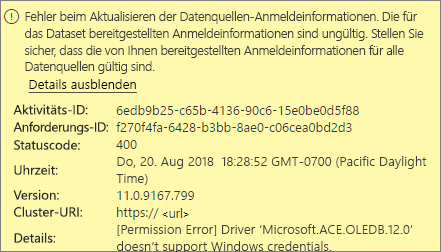
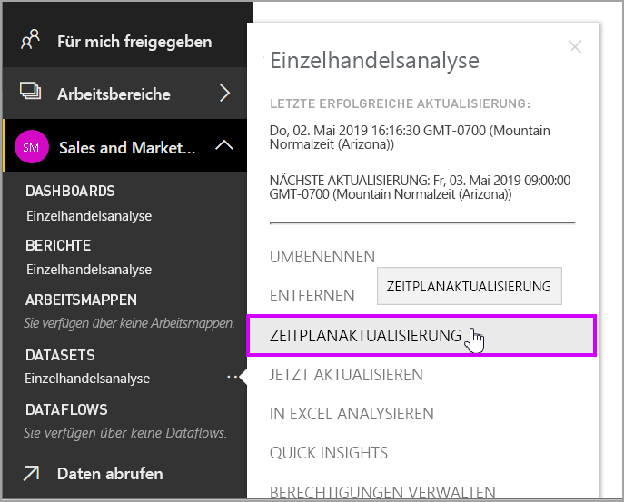
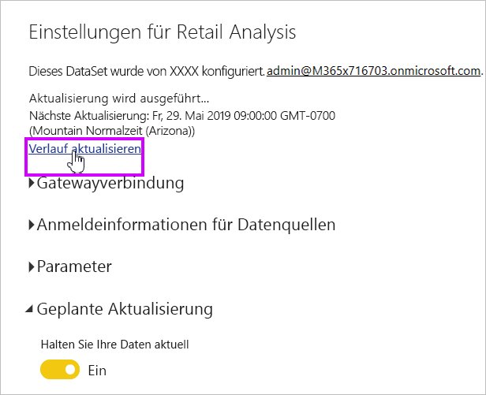
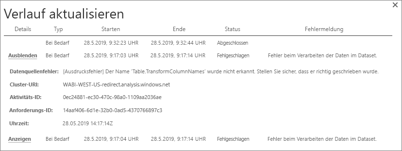
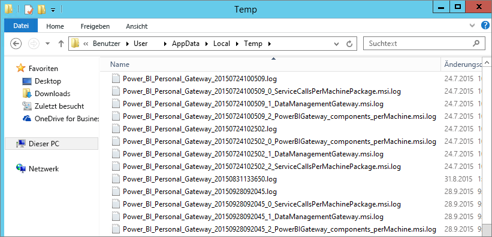

# Problembehandlung für Power BI Gateway (persönlicher Modus)

[!INCLUDE [gateway-rewrite](includes/gateway-rewrite.md)]

In den folgenden Abschnitten werden einige häufige Probleme erläutert, die beim Verwenden des lokalen Datengateways (persönlicher Modus) von Power BI auftreten können.

## Aktualisieren auf die neueste Version

Die aktuelle Version des Gateways für den persönlichen Gebrauch ist das lokale Datengateway (persönlicher Modus). Aktualisieren Sie Ihre Installation, um diese Version verwenden zu können.

Bei einer veralteten Gatewayversion können viele Probleme auftreten. Es ist ratsam sicherzustellen, dass Sie immer die aktuelle Version verwenden. Wenn Sie das Gateway einen Monat oder länger nicht mehr aktualisiert haben, sollten Sie die aktuelle Version des Gateways installieren. Überprüfen Sie dann, ob Sie das Problem reproduzieren können.

## Installation
**Das Gateway (persönlicher Modus) funktioniert nur auf 64-Bit-Versionen**: Wenn Sie mit einer 32-Bit-Version arbeiten, können Sie das Gateway (persönlicher Modus) nicht installieren. Es muss eine 64-Bit-Version des Betriebssystems vorhanden sein. Installieren Sie entweder eine 64-Bit-Version von Windows, oder installieren Sie das Gateway (persönlicher Modus) auf einem 64-Bit-Computer.

**Das Gateway (persönlicher Modus) kann nicht als Dienst installiert werden, auch wenn Sie ein lokaler Administrator für den Computer sind:** Bei der Installation kann ein Fehler auftreten, wenn der Benutzer zur lokalen Administratorgruppe des Computers gehört, die Gruppenrichtlinie jedoch nicht zulässt, dass sich dieser Benutzer als Dienst anmeldet. Vergewissern Sie sich, dass die Gruppenrichtlinien die Anmeldung von Benutzern als Dienst zulassen. Wir arbeiten an einer Korrektur für dieses Problem. Weitere Informationen finden Sie unter [Hinzufügen der Berechtigung „Anmelden als Dienst“ zu einem Konto](https://technet.microsoft.com/library/cc739424.aspx).

**Operation timed out** (Timeout beim Vorgang): Diese Meldung wird häufig angezeigt, wenn der Computer (physischer Computer oder VM), auf dem Sie das Gateway (persönlicher Modus) installieren, über einen Einzelkernprozessor verfügt. Schließen Sie alle eventuell geöffneten Anwendungen, deaktivieren Sie alle nicht benötigten Prozesse, und starten Sie die Installation erneut.

**Das Datenverwaltungsgateway oder der Analysis Services-Connector kann nicht auf demselben Computer wie das Gateway (persönlicher Modus) installiert werden:** Wenn Sie bereits einen Analysis Services-Connector oder ein Datenverwaltungsgateway installiert haben, müssen Sie zunächst den Connector oder das Gateway deinstallieren. Versuchen Sie dann, das Gateway (persönlicher Modus) zu installieren.

> [!NOTE]
> Wenn während der Installation ein Fehler auftritt, können Sie in den Setupprotokollen möglicherweise hilfreiche Informationen zum Lösen des Problems finden. Weitere Informationen finden Sie unter [Setupprotokolle](#SetupLogs).
> 
> 

 **Proxykonfiguration:** Es treten möglicherweise Probleme beim Konfigurieren des Gateways (persönlicher Modus) auf, wenn für Ihre Umgebung ein Proxy erforderlich ist. Weitere Informationen zum Konfigurieren von Proxyinformationen finden Sie unter [Konfigurieren von Proxyeinstellungen für das lokale Datengateway](/data-integration/gateway/service-gateway-proxy).

## Zeitplanaktualisierung
**Fehler: Die in der Cloud gespeicherten Anmeldeinformationen sind nicht vorhanden.**

Dieser Fehler kann z. B. in den Einstellungen für \<dataset\> auftreten, wenn eine geplante Aktualisierung durchgeführt und anschließend das Gateway (persönlicher Modus) deinstalliert und erneut installiert wurde. Bei der Deinstallation des Gateways (persönlicher Modus) werden die Anmeldeinformationen für die Datenquelle eines Datasets, die für die Aktualisierung konfiguriert wurden, aus dem Power BI-Dienst entfernt.

**Lösung:** Navigieren Sie in Power BI zu den Aktualisierungseinstellungen für ein Dataset. Klicken Sie unter **Datenquellen verwalten** für eine beliebige Datenquelle mit einem Fehler auf **Anmeldeinformationen bearbeiten**. Melden Sie sich dann erneut bei der Datenquelle an.

**Fehler: Die für das Dataset bereitgestellten Anmeldeinformationen sind ungültig. Aktualisieren Sie die Anmeldeinformationen mithilfe einer Aktualisierung oder im Dialogfeld „Datenquelleneinstellungen“, um fortzufahren.**

**Lösung:** Wenn Sie eine Nachricht bezüglich Anmeldeinformationen erhalten, könnte Folgendes zutreffen:

* Die für die Anmeldung bei Datenquellen verwendeten Benutzernamen und Kennwörter sind nicht aktuell. Navigieren Sie in Power BI zu den Aktualisierungseinstellungen für das Dataset. Klicken Sie unter **Datenquellen verwalten** auf **Anmeldeinformationen bearbeiten**, um die Anmeldeinformationen für die Datenquelle zu aktualisieren.
* Mashups zwischen einer Cloudquelle und einer lokalen Quelle in einer einzelnen Abfrage werden im Gateway (persönlicher Modus) nicht aktualisiert, wenn eine der Quellen OAuth als Authentifizierungsmethode verwendet. Ein Beispiel hierfür ist ein Mashup zwischen CRM Online und einer lokalen SQL Server-Instanz. Das Mashup funktioniert nicht, da CRM Online OAuth erfordert.
  
  Dieser Fehler ist bekannt und wird derzeit untersucht. Um das Problem zu umgehen, können für die Cloudquelle und die lokale Quelle getrennte Abfragen verwendet werden. Diese können dann in einer Merge- oder Append-Abfrage zusammengeführt werden.

**Fehler: Nicht unterstützte Datenquelle.**

**Lösung:** Wenn in den Einstellungen für **Aktualisierung planen** eine Nachricht zu einer nicht unterstützten Datenquelle angezeigt wird, kann das Folgendes bedeuten: 

* Die Aktualisierung der Datenquelle wird von Power BI aktuell nicht unterstützt. 
* Die Excel-Arbeitsmappe enthält kein Datenmodell, sondern nur Arbeitsblattdaten. Power BI unterstützt die Aktualisierung zurzeit nur, wenn die hochgeladene Excel-Arbeitsmappe ein Datenmodell enthält. Achten Sie beim Importieren von Daten in Excel mithilfe von Power Query darauf, die Option zum **Laden** von Daten in ein Datenmodell zu aktivieren. Mit dieser Option wird sichergestellt, dass die Daten in ein Datenmodell importiert werden. 

**Fehler: [Daten können nicht verbunden werden] &lt;Abfragteteil&gt;/&lt;…&gt;/&lt;…&gt; greift auf Datenquellen mit Sicherheitsstufen zu, die nicht gemeinsam verwendet werden können. Erstellen Sie diese Datenkombination neu.**

**Lösung:** Dieser Fehler wird durch die der Datenschutzstufe entsprechenden Einschränkungen sowie durch die Arten der verwendeten Datenquellen verursacht.

**Fehler: Datenquellenfehler: Der Wert „\[Tabelle\]“ kann nicht in den Typ „Tabelle“ konvertiert werden.**

**Lösung:** Dieser Fehler wird durch die der Datenschutzstufe entsprechenden Einschränkungen sowie durch die Arten der verwendeten Datenquellen verursacht.

**Fehler: Für diese Zeile ist nicht ausreichend Platz vorhanden.**

**Lösung:** Dieser Fehler tritt auf, wenn eine einzelne Zeile größer als 4 MB ist. Suchen Sie die entsprechende Zeile in der Datenquelle, und versuchen Sie, diese herauszufiltern oder zu verkleinern.

## Datenquellen
**Fehlende Datenanbieter:** Das Gateway (persönlicher Modus) funktioniert nur auf 64-Bit-Versionen. Auf dem Computer, auf dem das Gateway (persönlicher Modus) installiert ist, muss eine 64-Bit-Version der Datenanbieter installiert sein. Wenn beispielsweise die Datenquelle im Dataset Microsoft Access ist, müssen Sie den 64-Bit-ACE-Anbieter auf demselben Computer wie das Gateway (persönlicher Modus) installieren. 

>[!NOTE]
>Wenn Sie die 32-Bit-Version von Excel verwenden, können Sie keinen 64-Bit-ACE-Anbieter auf demselben Computer installieren.

**Die Windows-Authentifizierung wird von der Access-Datenbank nicht unterstützt:** Power BI unterstützt zurzeit nur die anonyme Authentifizierung für die Access-Datenbank.

**Fehler: Anmeldefehler bei der Eingabe von Anmeldeinformationen für eine Datenquelle:** Möglicherweise wird der folgende Fehler zurückgegeben, wenn Sie für eine Datenquelle Windows-Anmeldeinformationen eingeben: 

  

Dann haben Sie möglicherweise noch eine ältere Version des Gateways (persönlicher Modus) installiert. 

**Lösung:** Weitere Informationen finden Sie unter [Installieren der neuesten Version des Power BI-Gateways (persönlicher Modus)](https://powerbi.microsoft.com/gateway/).

**Fehler: Anmeldefehler bei der Auswahl der Windows-Authentifizierung für eine Datenquelle mit ACE OLEDB:** Möglicherweise wird der folgende Fehler zurückgegeben, wenn Sie Anmeldeinformationen für eine Datenquelle über einen ACE OLEDB-Anbieter eingeben:

Power BI unterstützt derzeit keine Windows-Authentifizierung für Datenquellen, die den ACE OLEDB-Anbieter verwenden.

**Lösung:** Zur Umgehung dieses Fehlers können Sie die **Anonyme Authentifizierung** auswählen. Bei Legacyanbietern von ACE OLEDB haben anonyme Anmeldeinformationen den gleichen Status wie Windows-Anmeldeinformationen.

## Kachelaktualisierung
Wenn beim Aktualisieren von Dashboardkacheln ein Fehler auftritt, finden Sie weitere Informationen unter [Problembehandlung bei Kachelfehlern](refresh-troubleshooting-tile-errors.md).

## Tools zur Problembehandlung
### Verlauf aktualisieren
Über die Option **Verlauf aktualisieren** können Sie erfahren, welche Fehler aufgetreten sind, und Sie erhalten nützliche Daten, falls Sie eine Supportanfrage erstellen müssen. Sie können sowohl geplante Aktualisierungen als auch bedarfsgesteuerte Aktualisierungen abrufen. Im Folgenden wird beschrieben, wie Sie zur Option **Verlauf aktualisieren** gelangen.

1. Wählen Sie im Power BI-Navigationsbereich unter **Datasets** ein Dataset aus. Öffnen Sie das Menü, und klicken Sie auf **Aktualisierung planen**.

   
1. Klicken Sie unter **Einstellungen für...** auf **Verlauf aktualisieren**. 

   
   
   

### Ereignisprotokolle
Es gibt mehrere Ereignisprotokolle, die Informationen liefern können. Die ersten beiden, **Datenverwaltungsgateway** und **PowerBIGateway**, sind vorhanden, wenn Sie der Administrator des Computers sind. Wenn Sie kein Administrator sind und das Gateway (persönlicher Modus) verwenden, können Sie die Protokolleinträge im Protokoll **Anwendung** abrufen.

Die Protokolle **Datenverwaltungsgateway** und **PowerBIGateway** befinden sich unter **Anwendungs- und Dienstprotokolle**.

### Ablaufverfolgung mit Fiddler
[Fiddler](http://www.telerik.com/fiddler) ist ein kostenloses Tool von Telerik, mit dem HTTP-Verkehr überwacht werden kann. Sie können die Kommunikation zwischen dem Power BI-Dienst und dem Clientcomputer verfolgen. Dieser Kommunikation können Sie Fehler und ähnliche Informationen entnehmen.

### Setupprotokolle
Wenn das Gateway (persönlicher Modus) nicht installiert werden kann, wird ein Link zum Anzeigen des Setupprotokolls eingeblendet. Darin können Details zum Fehler enthalten sein. Diese Protokolle sind Windows-Installationsprotokolle, auch MSI-Protokolle genannt. Sie können recht komplex und schwierig zu lesen sein. Der resultierende Fehler taucht in der Regel unten auf, das Bestimmen der Fehlerursache ist jedoch nicht trivial. Er kann durch Fehler in einem anderen Protokoll entstehen. Er kann aber auch durch einen Fehler weiter oben im Protokoll verursacht werden.

Sie können alternativ auch im Ordner „Temp“ (%temp%) nach Dateien suchen, die mit *Power\_BI\_* beginnen.

> [!NOTE]
> Wenn Sie auf „%temp%“ zugreifen, gelangen Sie unter Umständen in einen Unterordner von „Temp“. Die Dateien mit *Power\_BI\_* befinden sich im Stamm des Temp-Verzeichnisses. Sie müssen also ggf. ein oder zwei Ebenen nach oben navigieren.
> 
> 

## Nächste Schritte
- [Konfigurieren von Proxyeinstellungen für das lokale Datengateway](/data-integration/gateway/service-gateway-proxy)- [Datenaktualisierung](refresh-data.md)  
- [Verwenden persönlicher Gateways in Power BI](service-gateway-personal-mode.md)  
- [Problembehandlung für Kachelfehler](refresh-troubleshooting-tile-errors.md)  
- [Problembehandlung beim lokalen Datengateway](service-gateway-onprem-tshoot.md) 
 
Weitere Fragen? Stellen Sie Ihre Frage in der [Power BI-Community](http://community.powerbi.com/).

