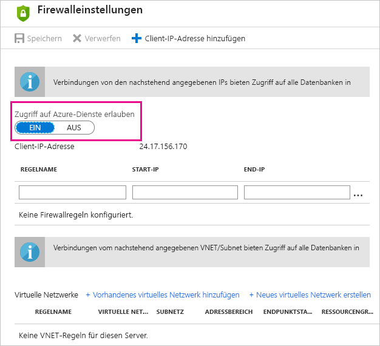

# Problembehandlung bei der planmäßigen Aktualisierung für Azure SQL-Datenbanken in Power BI

Ausführliche Informationen zur Aktualisierung finden Sie unter [Aktualisieren von Daten in Power BI](refresh-data.md) und [Konfigurieren von geplanten Aktualisierungen](refresh-scheduled-refresh.md).

Wenn Sie beim Einrichten der planmäßigen Aktualisierung für die Azure SQL-Datenbank bei der Bearbeitung der Anmeldeinformationen einen Fehler mit Fehlercode 400 erhalten, versuchen Sie Folgendes, um die entsprechende Firewall-Regel einzurichten:

1. Melden Sie sich beim [Azure-Portal](https://portal.azure.com) an.

1. Wechseln Sie zu der Instanz von Azure SQL-Datenbank, für die Sie die Aktualisierung konfigurieren.

1. Wählen Sie oben auf dem Blatt **Übersicht** die Option **Serverfirewall festlegen** aus.

1. Stellen Sie auf dem Blatt **Firewalleinstellungen** sicher, dass **Allow access to Azure services** (Zugriff auf Azure-Dienste erlauben) auf **ON** (EIN) festgelegt ist.

      

Weitere Fragen? [Wenden Sie sich an die Power BI-Community](http://community.powerbi.com/)
