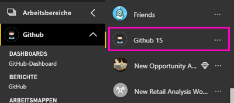
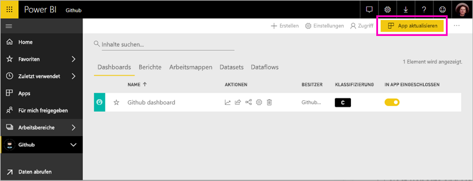

# Herstellen einer Verbindung mit GitHub mithilfe von Power BI
In diesem Artikel wird Schritt für Schritt erläutert, wie Sie Ihre Daten aus Ihrem GitHub-Konto mit einer Power BI-Vorlagen-App abrufen. Die Vorlagen-App generiert einen Arbeitsbereich mit einem Dashboard, einer Reihe von Berichten und einem Dataset, mit deren Hilfe Sie Ihre GitHub-Daten untersuchen können. Die GitHub-App für Power BI bietet Ihnen Einblicke in Ihr GitHub-Repository mit Daten zu Beiträgen, Problemen, Pullanforderungen und aktiven Benutzern.

Nachdem Sie die Vorlagen-App installiert haben, können Sie das Dashboard und den Bericht ändern. Anschließend können Sie sie als App an Kollegen in Ihrer Organisation verteilen.

Stellen Sie eine Verbindung mit der [GitHub-Vorlagen-App](https://app.powerbi.com/groups/me/getapps/services/pbi-contentpacks.pbiapps-github) her, oder erfahren Sie mehr über die [GitHub-Integration](https://powerbi.microsoft.com/integrations/github) in Power BI.

Sie können auch das [GitHub-Tutorial](service-tutorial-connect-to-github.md) verwenden. Es installiert echte GitHub-Daten zum öffentlichen Repository für die Power BI-Dokumentation.

>[!NOTE]
>Die Vorlagen-App erfordert, dass das GitHub-Konto auf das Repository zugreifen kann. Es folgen weitere Informationen zu den Anforderungen.

## Herstellen der Verbindung
[!INCLUDE [powerbi-service-apps-get-more-apps](./includes/powerbi-service-apps-get-more-apps.md)]
   
3. Wählen Sie **GitHub** \> **Jetzt anfordern** aus.
4. Wählen Sie unter **Diese Power BI-App installieren?** die Option **Installieren** aus.
4. Wählen Sie im Bereich **Apps** die Kachel **GitHub** aus.

    

6. Wählen Sie unter **Erste Schritte mit Ihrer neuen App** die Option **Daten verbinden** aus.

    

5. Geben Sie den Namen und Besitzer des Repositorys ein. Nachstehend finden Sie weitere Informationen zum [Suchen dieser Parameter](#FindingParams).
   
    

5. Geben Sie Ihre GitHub-Anmeldeinformationen ein (dieser Schritt kann übersprungen werden, wenn Sie bereits mit Ihrem Browser angemeldet sind). 
6. Wählen Sie als **Authentifizierungsmethode** die Option **oAuth2** \> **Anmelden** aus. 
7. Befolgen Sie die Anweisungen auf den Bildschirmen der GitHub-Authentifizierung. Gewähren Sie der GitHub-Vorlagen-App für Power BI die Berechtigung für den Zugriff auf die GitHub-Daten.
   
   
   
    Power BI stellt eine Verbindung mit GitHub und Ihren Daten her.  Die Daten werden einmal täglich aktualisiert. Nachdem Power BI die Daten importiert hat, werden die Inhalte Ihres neuen GitHub-Arbeitsbereichs angezeigt.

## Ändern und Verteilen der App

Sie haben die GitHub-Vorlagen-App installiert. Das bedeutet, dass Sie auch den Arbeitsbereich der GitHub-App erstellt haben. Im Arbeitsbereich können Sie den Bericht und das Dashboard ändern und dann als *App* an Kollegen in Ihrer Organisation verteilen. 

1. Klicken Sie in der linken Navigationsleiste auf den Pfeil neben dem Namen des Arbeitsbereichs. Sie sehen, dass der Arbeitsbereich ein Dashboard und einen Bericht enthält.

    

8. Wählen Sie das neue [GitHub-Dashboard](https://powerbi.microsoft.com/integrations/github) aus.    
    

3. Klicken Sie in der linken Navigationsleiste auf **Arbeitsbereiche** > **GitHub**, um den gesamten Inhalt Ihres neuen GitHub-Arbeitsbereichs anzuzeigen.
 
   

    Diese Ansicht ist die Inhaltsliste für den Arbeitsbereich. In der oberen rechten Ecke wird **App aktualisieren** angezeigt. Wenn Sie bereit sind, die App an Ihre Kollegen zu verteilen, beginnen Sie hier damit. 

    

2. Wählen Sie **Berichte** und **Datasets** aus, um die anderen Elemente im Arbeitsbereich anzuzeigen.

    Informieren Sie sich über das [Verteilen von Apps](service-create-distribute-apps.md) an Ihre Kollegen.

## Was ist in der App enthalten?
Die folgenden Daten sind über GitHub in Power BI verfügbar:     

| Tabellenname | Beschreibung |
| --- | --- |
| Beiträge |Die Tabelle für „Beiträge“ bietet die vom Mitwirkenden erstellten gesamten Zugänge, Abgänge und Commits, die wöchentlich aggregiert werden. Die Top 100-Mitwirkenden sind inklusive. |
| Probleme |Listet alle Probleme für das ausgewählte Repository auf und enthält Berechnungen wie die gesamte und durchschnittliche Zeit zum Schließen eines Problems, die Gesamtzahl offener Probleme sowie die Gesamtzahl geschlossener Probleme. Diese Tabelle ist leer, wenn im Repository keine Probleme vorliegen. |
| Pullanforderungen |Diese Tabelle enthält alle Pullanforderungen für das Repository und die Information, welcher Benutzer den Pullvorgang für die Anforderung ausgeführt hat. Sie enthält auch Berechnungen dazu, wie viele geöffnete, geschlossene und insgesamt verfügbare Pullanforderungen vorliegen, und wie lange die Pullanforderungen und die durchschnittliche Pullanforderung gedauert haben. Diese Tabelle ist leer, wenn im Repository keine Probleme vorliegen. |
| Benutzer |Diese Tabelle enthält eine Liste von GitHub-Benutzern oder Mitwirkenden, die Beiträge geleistet, Probleme gemeldet oder Pullanforderungen für das ausgewählte Repository gelöst haben. |
| Meilensteine |Diese Tabelle enthält alle Meilensteine für das ausgewählte Repository. |
| DateTable |Diese Tabelle enthält Datumsangaben von heute und für vergangene Jahre, die es Ihnen ermöglichen, Ihre GitHub-Daten nach Datum zu analysieren. |
| ContributionPunchCard |Diese Tabelle kann als Lochkarte für Beiträge für das ausgewählte Repository verwendet werden. Es zeigt die Commits nach Wochentag und Tagesstunde an. Diese Tabelle ist nicht mit anderen Tabellen im Modell verbunden. |
| RepoDetails |Diese Tabelle enthält die Details für das ausgewählte Repository. |

## Systemanforderungen
* Das GitHub-Konto, das Zugriff auf das Repository hat  
* Berechtigung für die Power BI für GitHub-App während der erstmaligen Anmeldung Nachstehend finden Sie Details zum Sperren des Zugriffs.  
* Ausreichende Anzahl verfügbarer API-Aufrufe zum Abrufen und Aktualisieren der Daten  

### Aufheben der Autorisierung von Power BI
Sie können den Zugriff in GitHub widerrufen, um die Autorisierung von Power BI zur Verbindung mit Ihrem GitHub-Repository aufzuheben. Weitere Informationen finden Sie unter diesem [GitHub-Hilfethema](https://help.github.com/articles/keeping-your-ssh-keys-and-application-access-tokens-safe/#reviewing-your-authorized-applications-oauth).

## Suchen von Parametern
Sie können den Besitzer und das Repository ermitteln, indem Sie das Repository in GitHub betrachten:

Der erste Teil „Azure“ ist der Besitzer und der zweite Teil „azure-sdk-for-php“ ist das Repository selbst.  Dieselben beiden Elemente werden in der URL des Repositorys angezeigt:

    <https://github.com/Azure/azure-sdk-for-php> .

## Problembehandlung
Bei Bedarf können Sie Ihre GitHub-Anmeldeinformationen überprüfen.  

1. Navigieren Sie in einem anderen Browserfenster zur GitHub-Website, und melden Sie sich bei GitHub an. Sie können in der oberen rechten Ecke der GitHub-Website sehen, dass Sie angemeldet sind.    
2. Navigieren Sie in GitHub zur URL des Repositorys, auf das Sie in Power BI zugreifen möchten. Beispiel: https://github.com/dotnet/corefx  
3. Versuchen Sie anschließend in Power BI, die Verbindung zu GitHub herzustellen. Verwenden Sie im Dialogfeld zum Konfigurieren von GitHub den Namen und Besitzer des Repositorys für dasselbe Repository.  

## Nächste Schritte

* [Tutorial: Herstellen einer Verbindung mit einem GitHub-Repository mit Power BI](service-tutorial-connect-to-github.md)
* [Erstellen der neuen Arbeitsbereiche in Power BI](service-create-the-new-workspaces.md)
* [Installieren und Verwenden von Apps in Power BI](consumer/end-user-apps.md)
* [Herstellen einer Verbindung mit Power BI-Apps für externe Dienste](service-connect-to-services.md)
* Haben Sie Fragen? [Stellen Sie Ihre Frage in der Power BI-Community.](http://community.powerbi.com/)

