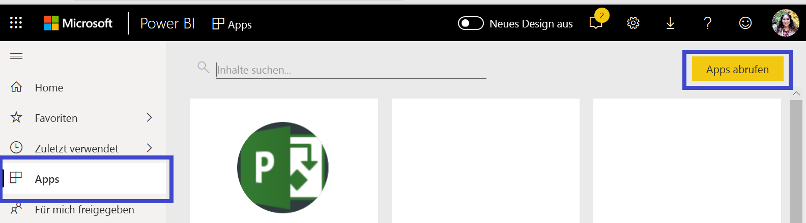
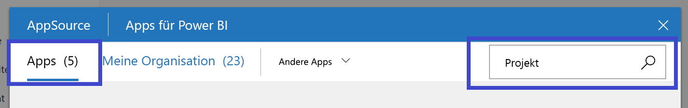
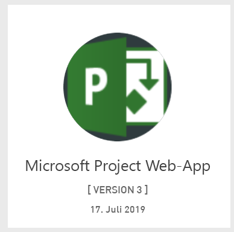
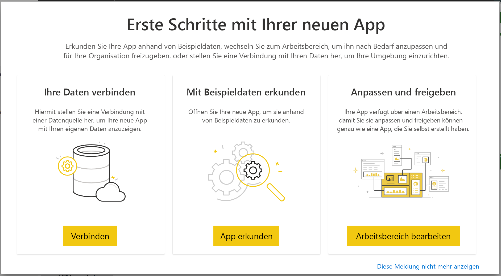

# Herstellen einer Verbindung mit Project Web App mithilfe von Power BI
Microsoft Project Web App ist eine flexible Onlinelösung für das Projektportfoliomanagement (PPM) und die tägliche Arbeit. Project Web App ermöglicht es Organisationen, die ersten Schritte zu unternehmen, Investitionen in Projektportfolios zu priorisieren und den beabsichtigten Geschäftserfolg zu realisieren. Mit der Vorlagen-App für Power BI von Project Web App können Sie Erkenntnisse von Project Web App nutzen, um das Verwalten von Projekten, Portfolios und Ressourcen zu vereinfachen.

Stellen Sie eine Verbindung mit der [Vorlagen-App von Project Web App](https://appsource.microsoft.com/product/power-bi/pbi_msprojectonline.pbi-microsoftprojectwebapp) für Power BI her.

## Herstellen der Verbindung

   
1. Wählen Sie im linken Navigationsbereich **Apps** und dann in der oberen rechten Ecke **Apps abrufen** aus.
2. Wählen Sie im Feld **Dienste** die Option **Abrufen**aus.
   
   
3. Wählen Sie in AppSource die Registerkarte **Apps** aus, und suchen Sie nach bzw. klicken Sie auf **Microsoft Project Web App**.
   
4. Klicken Sie bei der nun angezeigten Meldung **Diese Power BI-App installieren?** auf **Installieren**. 

   
5. Klicken Sie im Bereich **Apps** auf die Kachel **Microsoft Project Web App**. 
   
   
6. Wählen Sie unter **Erste Schritte mit Ihrer neuen App** die Option **Daten verbinden** aus.
   
   
7. Geben Sie im Textfeld **Project Web App-URL** die URL für die Project Web App (PWA) ein, mit der Sie eine Verbindung herstellen möchten.  Beachten Sie, dass dies bei Verwendung einer benutzerdefinierten Domäne vom Beispiel abweichen kann. Geben Sie im Textfeld **PWA Site Language** (PWA-Websitesprache) die Zahl ein, die der Sprache Ihrer PWA-Website entspricht. Geben Sie die einzelne Zahl „1“ für Englisch, „2“ für Französisch, „3“ für Deutsch, „4“ für Portugiesisch (Brasilien), „5“ für Portugiesisch (Portugal) oder „6“ für Spanisch ein. 
   
   
8. Wählen Sie als Authentifizierungsmethode die Option **oAuth2** \> **Anmelden** aus. Wenn Sie dazu aufgefordert werden, geben Sie Ihre Project Web App-Anmeldeinformationen ein, und führen Sie den Authentifizierungsvorgang aus.

    
Beachten Sie, dass Sie über Portfolio Viewer-, Portfolio Manager- oder Administratorberechtigungen für die Projekt-Web-App verfügen müssen, mit der Sie sich verbinden.

9. Eine Benachrichtigung wird angezeigt, dass Ihre Daten geladen werden. Je nach Größe Ihres Kontos kann dies einige Zeit dauern. Nachdem Power BI die Daten importiert hat, werden die Inhalte Ihres neuen Arbeitsbereichs angezeigt. Möglicherweise müssen Sie das Dataset aktualisieren, um die neuesten Updates zu erhalten. 

Nachdem die Daten von Power BI importiert wurden, werden im linken Navigationsbereich der Bericht mit 13 Seiten und das Dataset angezeigt. 

10. Sobald Ihre Berichte bereit sind, können Sie Ihre Project Web App-Daten erkunden. Die Vorlagen-App enthält 13 umfangreiche und detaillierte Berichte für die Portfolioübersicht (sechs Berichtsseiten), die Ressourcenübersicht (fünf Berichtsseiten) und den Projektstatus (zwei Berichtsseiten). 

   
   
   
   
   

**Was nun?**

* Zwar ist Ihr Dataset auf tägliche Aktualisierung festgelegt, jedoch können Sie das Aktualisierungsintervall ändern oder über **Jetzt aktualisieren** nach Bedarf aktualisieren.

**Erweitern der Vorlagen-App**

Laden Sie die [PBIT-Datei von GitHub](https://github.com/OfficeDev/Project-Power-BI-Content-Packs) runter, um das Inhaltspaket weiter anzupassen und zu aktualisieren.

## Nächste Schritte
[Erste Schritte mit Power BI](service-get-started.md)

[Abrufen von Daten in Power BI](service-get-data.md)

