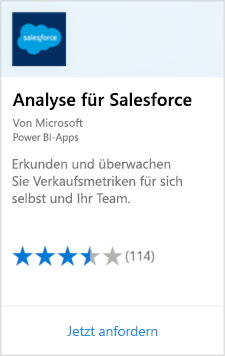

# Herstellen einer Verbindung mit Salesforce mithilfe von Power BI
Mit Power BI können Sie sich problemlos mit Ihrem Salesforce.com-Konto verbinden. Mit dieser Verbindung können Sie Ihre Salesforce-Daten abrufen, und ein Dashboard und Berichte werden automatisch bereitgestellt.

Weitere Informationen zur [Salesforce-Integration](https://powerbi.microsoft.com/integrations/salesforce) mit Power BI.

## Herstellen der Verbindung
1. Klicken Sie in Power BI unten im linken Navigationsbereich auf **Daten abrufen**.
   
    
2. Wählen Sie im Feld **Dienste** die Option **Abrufen**aus.
   
    
3. Wählen Sie **Analytics for Salesforce** aus, und klicken Sie auf **Jetzt holen**.  
   
   
4. Klicken Sie auf **Anmelden**, um die sich anzumelden.
   
    
5. Wenn Sie dazu aufgefordert werden, geben Sie Ihre Salesforce-Anmeldeinformationen ein. Klicken Sie auf **Zulassen**, damit Power BI auf Ihre grundlegenden Salesforce-Informationen und Daten zugreifen kann.
   
   
6. Konfigurieren Sie mithilfe der Dropdownoption, welche Daten Sie in Power BI importieren möchten:
   
   * **Dashboard**
     
     Wählen Sie auf Grundlage einer Persona ein vordefiniertes Dashboard aus (z.B. **Sales Manager**). Diese Dashboards rufen eine bestimmte Reihe von Standarddaten aus Salesforce ab, die keine benutzerdefinierten Felder enthalten.
     
     
   * **Berichte**
     
     Wählen Sie mindestens einen benutzerdefinierten Bericht aus Ihrem Salesforce-Konto aus. Diese Berichte entsprechen den Ansichten in Salesforce und können Daten aus benutzerdefinierten Feldern oder Objekten enthalten.
     
     
     
     Wenn keine Berichte angezeigt werden, können Sie diese über Ihr Salesforce-Konto hinzufügen oder erstellen. Anschließend stellen Sie die Verbindung erneut her.

7. Klicken Sie auf **Verbinden**, um den Importvorgang zu starten. Während des Imports wird eine Benachrichtigung angezeigt, dass der Import ausgeführt wird. Wenn der Importvorgang abgeschlossen ist, werden Dashboard, Bericht und Dataset für Ihre Salesforce-Daten im linken Navigationsbereich aufgeführt.
   
   

Sie können das Dashboard anpassen, damit Ihre Daten auf die gewünschte Weise angezeigt werden. Sie können im Q&A-Bereich Fragen stellen oder [auf eine Kachel klicken](consumer/end-user-tiles.md), um den zugrunde liegenden Bericht zu öffnen und [Dashboardkacheln zu bearbeiten oder zu entfernen](service-dashboard-edit-tile.md).

**Was nun?**

* Versuchen Sie, am oberen Rand des Dashboards [im Q&A-Feld eine Frage zu stellen](consumer/end-user-q-and-a.md).
* [Bearbeiten oder Entfernen einer Kachel](service-dashboard-edit-tile.md) im Dashboard
* [Wählen Sie eine Kachel aus](service-dashboard-tiles.md), um den zugrunde liegenden Bericht zu öffnen.
* Zwar ist Ihr Dataset auf tägliche Aktualisierung festgelegt, jedoch können Sie das Aktualisierungsintervall ändern oder über **Jetzt aktualisieren** nach Bedarf aktualisieren.

## Systemanforderungen und Hinweise

- Verbindung mit einem Salesforce-Produktionskonto, für das der API-Zugriff aktiviert ist.

- Berechtigung wurde der Power BI-App während der Anmeldung erteilt.

- Das Konto verfügt über ausreichend API-Aufrufe zum Abrufen und Aktualisieren der Daten.

- Für die Aktualisierung ist ein gültiges Authentifizierungstoken erforderlich. Salesforce ist auf fünf Authentifizierungstoken pro Anwendung begrenzt. Sie sollten daher sicherstellen, dass Sie maximal fünf Salesforce-Datasets importiert haben.

- Die API für Salesforce-Berichte weist eine Einschränkung auf, die bis zu 2.000 Datenzeilen unterstützt.

## Problembehandlung

Überprüfen Sie die oben genannten Anforderungen, wenn Fehler auftreten. 

Das Anmelden bei einer benutzerdefinierten oder einer Sandbox-Domäne wird derzeit nicht unterstützt.

### Meldung: „Es konnte keine Verbindung mit dem Remoteserver hergestellt werden.“

Sehen Sie sich diese Lösung im folgenden Forum an, wenn beim Versuch, eine Verbindung zu Ihrem Salesforce-Konto herzustellen, die Meldung "Unable to connect to the remote server" (Die Verbindung mit dem Remoteserver kann nicht hergestellt werden.) angezeigt wird: [Fehlermeldung des Salesforce-Connectors beim Anmelden: Die Verbindung mit dem Remoteserver kann nicht hergestellt werden](https://www.outsystems.com/forums/Forum_TopicView.aspx?TopicId=17674&TopicName=log-in-error-message-unable-to-connect-to-the-remote-server&)

## Nächste Schritte
[Was ist Power BI?](power-bi-overview.md)

[Datenquellen für den Power BI-Dienst](service-get-data.md)

