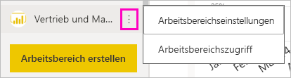
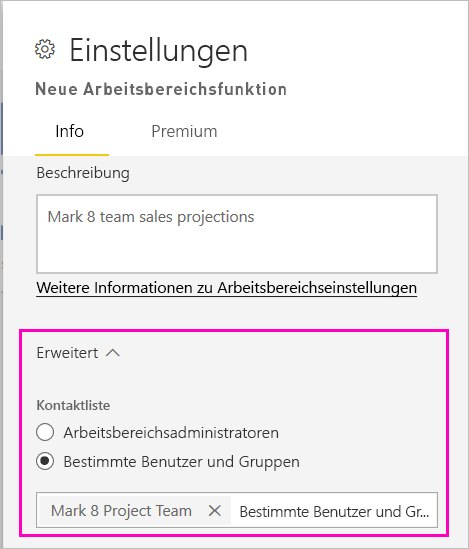
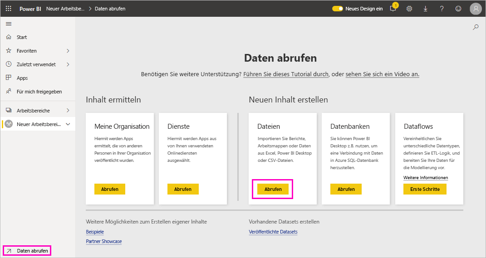
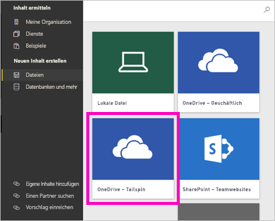
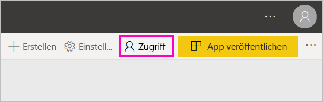
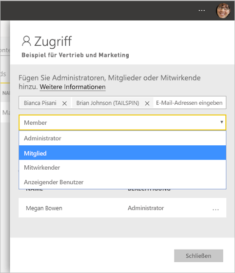

# Erstellen der neuen Arbeitsbereiche in Power BI

In Power BI werden neue Arbeitsbereiche eingeführt. Arbeitsbereiche sind immer noch Orte für die Zusammenarbeit mit Kollegen, um Sammlungen von Dashboards, Berichten und paginierten Berichten zu erstellen. Anschließend können Sie diese Sammlung in einer *App* bündeln, die Sie an die gesamte Organisation oder an bestimmte Personen oder Gruppen verteilen können. 

Hier liegt der Unterschied. In den neuen Arbeitsbereichen können Sie Folgendes durchführen:

- Arbeitsbereichsrollen Benutzergruppen zuweisen: Sicherheitsgruppen, Verteilerlisten, Office 365-Gruppen und Einzelpersonen.
- Einen Arbeitsbereich in Power BI erstellen, ohne eine Office 365-Gruppe zu erstellen.
- Genauere Arbeitsbereichsrollen für flexiblere Verwaltung von Berechtigungen in einem Arbeitsbereich verwenden.

> [!NOTE]
> Zum Erzwingen der Sicherheit auf Zeilenebene (Row-Level Security, RLS) für Power BI Pro-Benutzer, die Inhalte in einem Arbeitsbereich durchsuchen, weisen Sie den Benutzern die Viewer-Rolle zu.

Weitere Informationen finden Sie im Artikel [Neue Arbeitsbereiche](service-new-workspaces.md).

## Erstellen eines der neuen Arbeitsbereiche

1. Erstellen Sie zunächst den Arbeitsbereich. Wählen Sie **Arbeitsbereiche** > **Arbeitsbereich erstellen** aus.
   
     

2. Sie erstellen automatisch einen aktualisierten Arbeitsbereich, es sei denn, Sie wählen die Option **Auf klassische Version zurücksetzen**.
   
     
     
     Wenn Sie **Auf klassische Version zurücksetzen** auswählen, erstellen Sie einen [Arbeitsbereich, der auf einer Office 365-Gruppe basiert](service-create-workspaces.md). 

2. Benennen Sie den Arbeitsbereich. Wenn der Name nicht verfügbar ist, geben Sie einen eindeutigen Namen ein.
   
     Die App für den Arbeitsbereich hat denselben Namen und dasselbe Symbol wie der Arbeitsbereich.
   
1. Die folgenden optionalen Elemente können Sie für Ihren Arbeitsbereich festlegen:

    Laden Sie ein **Arbeitsbereichbild** hoch. Die Dateien können das PNG- oder JPG-Format aufweisen. Die Dateigröße darf 45 KB nicht überschreiten.
    
    [Fügen Sie eine **Kontaktliste**](#workspace-contact-list) hinzu. Standardmäßig sind die Arbeitsbereichsadministratoren die Kontakte. 
    
    [Geben Sie **OneDrive für Arbeitsbereich**](#workspace-onedrive) an, indem Sie nur den Namen einer vorhandenen Office 365-Gruppe eingeben, nicht die URL. Dieser Arbeitsbereich kann nun den Dateispeicherort der Office 365-Gruppe verwenden. 

    

    Um den Arbeitsbereich einer **Dedizierten Kapazität** zuzuweisen, wählen Sie auf der Registerkarte **Premium** die Option **Dedizierte Kapazität** aus.
     
    

1. Wählen Sie **Speichern**.

    Der Arbeitsbereich wird in Power BI erstellt und geöffnet. Er wird Ihnen in der Liste der Arbeitsbereiche angezeigt, deren Mitglied Sie sind. 

## Arbeitsbereichs-Kontaktliste

Sie können festlegen, welche Benutzer Benachrichtigungen über im Arbeitsbereich auftretende Probleme erhalten. Standardmäßig werden alle Benutzer oder Gruppen benachrichtigt, die als Arbeitsbereichsadministrator angegeben sind. Aber Sie können die Liste anpassen, indem Sie sie zur *Kontaktliste* hinzufügen. Benutzer oder Gruppen in der Kontaktliste werden auf der Benutzeroberfläche angezeigt, um Benutzern Hilfe zum Arbeitsbereich bieten zu können.

1. Greifen Sie auf eine von zwei Arten auf die neue Einstellung **Kontaktliste** zu:

    Im Bereich **Arbeitsbereich erstellen**, wenn Sie sie neu erstellen.

    Wählen Sie im Navigationsbereich den Pfeil neben **Arbeitsbereiche** aus, wählen Sie die **Weitere Optionen** (...) neben dem Arbeitsbereichsnamen aus, und wählen Sie dann **Arbeitsbereichseinstellungen** aus. Der Bereich **Einstellungen** wird geöffnet.

    

2. Akzeptieren Sie unter **Erweitert** > **Kontaktliste** den Standard, **Arbeitsbereichsadministratoren**, oder fügen Sie eine eigene Liste **Bestimmter Benutzer oder Gruppen** hinzu. 

    

3. Wählen Sie **Speichern**.

## OneDrive für Arbeitsbereich

Mit dem Feature OneDrive für Arbeitsbereich können Sie eine Office 365-Gruppe konfigurieren, deren SharePoint-Dokumentbibliothek-Speicher für Arbeitsbereichsbenutzer verfügbar ist. Sie erstellen die Gruppe zuerst außerhalb von Power BI. 

Power BI synchronisiert keine Berechtigungen von Benutzern oder Gruppen, für die der Arbeitsbereichszugriff mit der Office 365-Gruppenmitgliedschaft konfiguriert ist. Am besten gewähren Sie derselben Office 365-Gruppe, deren Dateispeicher Sie in dieser Einstellung konfigurieren, den [Zugriff auf den Arbeitsbereich](#give-access-to-your-workspace). Verwalten Sie dann den Zugriff auf den Arbeitsbereich durch Verwalten der Mitgliedschaft in der Office 365-Gruppe. 

1. Greifen Sie auf eine von zwei Arten auf die neue **OneDrive für Arbeitsbereich**-Einstellung zu:

    Im Bereich **Arbeitsbereich erstellen**, wenn Sie sie neu erstellen.

    Wählen Sie im Navigationsbereich den Pfeil neben **Arbeitsbereiche** aus, wählen Sie die **Weitere Optionen** (...) neben dem Arbeitsbereichsnamen aus, und wählen Sie dann **Arbeitsbereichseinstellungen** aus. Der Bereich **Einstellungen** wird geöffnet.

    

2. Geben Sie unter **Erweitert** > **OneDrive für Arbeitsbereich** den Namen der Office 365-Gruppe ein, die Sie zuvor erstellt haben. Power BI wählt automatisch die OneDrive-Instanz für die Gruppe aus.

    

3. Wählen Sie **Speichern**.

### Zugreifen auf den „OneDrive für Arbeitsbereich“-Speicherort

Nachdem Sie den OneDrive-Speicherort konfiguriert haben, gelangen Sie zu ihm auf die gleiche Weise wie zu anderen Datenquellen im Power BI-Dienst.

1. Klicken Sie im Navigationsbereich auf **Daten abrufen** und dann im Feld **Dateien** auf **Abrufen**.

    

1.  Der Eintrag **OneDrive – Business** ist Ihre eigene „OneDrive for Business“-Instanz. Die zweite OneDrive-Instanz ist die, die Sie hinzugefügt haben.

    

### Herstellen einer Verbindung mit Drittanbieterdiensten in neuen Arbeitsbereichen

In den neuen Arbeitsbereichen rücken *Apps* in den Vordergrund. Apps für Drittanbieterdienste erleichtern es Benutzern, Daten von den Diensten abzurufen, die sie verwenden, z. B. Microsoft Dynamics CRM, Salesforce oder Google Analytics.

In den neuen Arbeitsbereichen können Sie keine organisationsbezogenen Inhaltspakete erstellen oder nutzen. Stattdessen können Sie die Apps verwenden, die zum Herstellen einer Verbindung mit Drittanbieterdiensten bereitgestellt werden, oder fordern Sie Ihre internen Teams dazu auf, Apps für Inhaltspakete bereitzustellen, die Sie derzeit verwenden. 

## Erteilen von Zugriff auf Ihren Arbeitsbereich

1. Weil Sie ein Administrator sind, sehen Sie in der Inhaltsliste des Arbeitsbereichs die neue Aktion **Zugriff**.

    

1. Fügen Sie diesen Arbeitsbereichen Sicherheitsgruppen, Verteilerlisten, Office 365-Gruppen oder Einzelpersonen als Mitglieder, Mitwirkende oder Administratoren hinzu. Eine Erläuterung der verschiedenen Rollen finden Sie unter [Rollen in den neuen Arbeitsbereichen](service-new-workspaces.md#roles-in-the-new-workspaces).

    

9. Klicken Sie auf **Hinzufügen** > **Schließen**.

## Verteilen einer App

Wenn Sie offizielle Inhalte an eine große Zielgruppe innerhalb Ihrer Organisation verteilen möchten, können Sie eine App aus Ihrem Arbeitsbereich veröffentlichen.  Wenn der Inhalt bereit ist, wählen Sie aus, welche Dashboards und Berichte Sie veröffentlichen möchten, und veröffentlichen Sie diese dann als *App*. Sie können über jeden Arbeitsbereich eine App erstellen.

Informieren Sie sich über das [Veröffentlichen einer App aus den neuen Arbeitsbereichen](service-create-distribute-apps.md).

## Nächste Schritte
* Weitere Informationen zum [Organisieren von Arbeit in den neuen Arbeitsbereichen in Power BI](service-new-workspaces.md)
* [Erstellen klassischer Arbeitsbereiche](service-create-workspaces.md)
* [Veröffentlichen einer App aus den neuen Arbeitsbereichen in Power BI](service-create-distribute-apps.md)
* Haben Sie Fragen? [Stellen Sie Ihre Frage in der Power BI-Community.](https://community.powerbi.com/)
