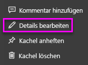

# <a name="add-images-videos-and-more-to-your-dashboard"></a>Hinzufügen von Bildern, Videos und mehr in Dashboards

Sie können ein Bild, ein Textfeld, ein Video, Streamingdaten oder Webcode in Ihr Dashboard einfügen, indem Sie eine Kachel zu Ihrem Dashboard hinzufügen. 

Sehen Sie sich an, wie Amanda Kacheln zu einem Dashboard hinzufügt.

   
<iframe width="560" height="315" src="https://www.youtube.com/embed/e2PD8m1Q0vU" frameborder="0" allowfullscreen></iframe>


## <a name="add-an-image-video-or-other-tile"></a>Hinzufügen eines Bilds, Videos oder einer anderen Kachel
Sie können ein Bild, ein Textfeld, ein Video, Streamingdaten oder Webcode direkt in Ihr Dashboard einfügen.

1. Klicken Sie in der oberen Menüleiste Ihres Dashboards auf **Kachel hinzufügen**. Je nach verfügbarem Platz wird möglicherweise nur das Pluszeichen  angezeigt.
   
    
2. Wählen Sie den Typ der Kachel aus, die Sie hinzufügen möchten: 

    **[Webinhalt](#add-web-content)**

    **[Bild](#add-an-image)**

    **[Textfeld](#add-a-text-box-or-dashboard-heading)**

    **[Video](#add-a-video)**

    **[Benutzerdefinierte Streamingdaten](#add-streaming-data)**
   
    

## <a name="add-an-image"></a>Hinzufügen von Bildern
Wenn Sie Ihr Unternehmenslogo oder ein anderes Bild zum Dashboard hinzufügen möchten, speichern Sie die Bilddatei online, und fügen Sie einen Link zu dieser Datei ein. Stellen Sie sicher, dass für den Zugriff auf die Bilddatei keine Sicherheitsanmeldeinformationen erforderlich sind. Da beispielsweise OneDrive und SharePoint eine Authentifizierung erfordern, können dort gespeicherte Bilder nicht auf diese Weise zu einem Dashboard hinzugefügt werden.  

1. Klicken Sie im Fenster **Kachel hinzufügen** auf **Bild** > **Weiter**.

2. Fügen Sie die folgenden Bildinformationen im Fenster **Bildkachel hinzufügen** ein:   
   
   a. Aktivieren Sie das Kontrollkästchen **Titel und Untertitel anzeigen**, und geben Sie einen **Titel** und einen optionalen **Untertitel** ein, um einen Titel über dem Bild anzuzeigen.

   b. Geben Sie die **Bild-URL** ein.

   c. Aktivieren Sie das Kontrollkästchen **Benutzerdefinierte Verknüpfung festlegen**, und geben Sie die **URL** ein, um die Kachel als Link zu aktivieren. 

      Wenn Arbeitskollegen auf das Bild oder den Titel klicken, gelangen sie zur angegebenen URL.

   d. Klicken Sie auf **Übernehmen**. 

      

3. Ändern Sie auf dem Dashboard die Größe und Position des Bilds nach Bedarf.
     
     

## <a name="add-a-text-box-or-dashboard-heading"></a>Hinzufügen eines Textfelds oder einer Dashboardüberschrift

Fügen Sie eine Dashboardüberschrift hinzu, indem Sie diese in das Textfeld eingeben und die Schrift vergrößern.

1. Klicken Sie im Fenster **Kachel hinzufügen** auf **Textfeld** > **Weiter**.

2. Formatieren Sie das Textfeld:
   
   a. Aktivieren Sie das Kontrollkästchen **Titel und Untertitel anzeigen**, und geben Sie einen **Titel** und einen optionalen **Untertitel** ein, um einen Titel über dem Textfeld anzuzeigen.

   b. Geben Sie den **Inhalt** für das Textfeld ein, und formatieren Sie ihn.  

   c. Legen Sie optional einen benutzerdefinierten Link für den Titel fest. Bei einem benutzerdefinierten Link kann es sich um eine externe Website oder ein Dashboard oder einen Bericht im Arbeitsbereich handeln. Allerdings wurden in diesem Beispiel Links innerhalb des Textfelds hinzugefügt, lassen Sie **Benutzerdefinierte Verknüpfung festlegen** daher deaktiviert.

   d. Klicken Sie auf **Übernehmen**. 

     
   
3. Ändern Sie auf dem Dashboard die Größe und Position des Textfelds nach Bedarf.
   
   

## <a name="add-a-video"></a>Hinzufügen von Videos
Wenn Sie Ihrem Dashboard eine YouTube- oder Vimeo-Videokachel hinzufügen, wird das Video direkt auf Ihrem Dashboard abgespielt.

1. Klicken Sie im Fenster **Kachel hinzufügen** auf **Video** > **Weiter**.
2. Fügen Sie Videoinformationen im Fenster **Videokachel hinzufügen** hinzu:   
   
   a. Aktivieren Sie das Kontrollkästchen **Titel und Untertitel anzeigen**, und geben Sie einen **Titel** und einen optionalen **Untertitel** ein, um oben in der Videokachel einen Titel (und einen Untertitel) anzuzeigen. In diesem Beispiel wird ein **Untertitel** hinzugefügt und anschließend in einen Link zur gesamten YouTube-Wiedergabeliste konvertiert.

   b. Geben Sie die **Video-URL** für das Video ein.

   c. Fügen Sie einen Link für den **Titel** und den **Untertitel** hinzu, damit Ihre Arbeitskollegen sich die ganze Wiedergabeliste auf YouTube ansehen können, nachdem sie das eingebettete Video gesehen haben. Aktivieren Sie hierzu das Kontrollkästchen **Benutzerdefinierte Verknüpfung festlegen** unter **Funktionalität**, und geben Sie dann die **URL** für die Wiedergabeliste ein.

   d. Klicken Sie auf **Übernehmen**.  

   

3. Ändern Sie auf dem Dashboard die Größe und Position der Videokachel nach Bedarf.
     
   
4. Wählen Sie die Videokachel aus, um das Video abzuspielen.
5. Wählen Sie den Untertitel aus, um zur Wiedergabeliste auf YouTube zu navigieren.

## <a name="add-streaming-data"></a>Hinzufügen von Streamingdaten
Sie können PubNub verwenden, um Streamingdaten, wie z. B. Twitter-Feeds oder Sensordaten, zu einer Kachel in Ihrem Dashboard hinzuzufügen. Power BI verfügt über eine Integration zum Abrufen der Daten von PubNub. Im folgenden Video erklärt Will, wie das funktioniert.
   

<iframe width="560" height="315" src="https://www.youtube.com/embed/kOuINwgkEkQ" frameborder="0" allowfullscreen></iframe>

1. Klicken Sie im Fenster **Kachel hinzufügen** auf **Benutzerdefinierte Streamingdaten** > **Weiter**.
2. Klicken Sie auf **Streamingdataset hinzufügen**.
3. Erstellen Sie ein **neues Streamingdataset** mit der Power BI-API oder mit PubNub.
4. Füllen Sie die Felder **Datasetname**, **Abonnementschlüssel** und **Kanalname** aus. Wenn es sich um eine sichere Verbindung handelt, müssen Sie auch einen Autorisierungsschlüssel angeben. Sie können die Beispielwerte von PubNub zum Testen verwenden.
5. Wählen Sie **Weiter** aus.
    Daraufhin werden die Felder mit den jeweiligen Datentypen und dem JSON-Format angezeigt, die im Dataset zur Verfügung stehen.
6. Wählen Sie **Verbinden** aus.
    Somit haben Sie ein Streamingdataset erstellt.
7. Navigieren Sie zurück zum Dashboard, und klicken Sie erneut auf **Kachel hinzufügen** > **Benutzerdefinierte Streamingdaten** > **Weiter**.
8. Wählen Sie das erstellte Dataset für Sensordaten aus, und klicken Sie dann auf **Weiter**.
9. Wählen Sie den gewünschten Visualtyp aus. Für diese Art von Daten eignet sich meist ein Liniendiagramm.
10. Wählen Sie die **Achse**, **Legende** und **Werte** aus.
11. Legen Sie den Zeitraum in Sekunden, Minuten oder Stunden fest, der angezeigt werden soll.
12. Wählen Sie **Weiter** aus.
13. Geben Sie einen **Titel** und **Untertitel** ein, wenn Sie möchten.
14. Heften Sie die Kachel an Ihr Dashboard an.


1. Klicken Sie im Fenster **Kachel hinzufügen** auf **Benutzerdefinierte Streamingdaten** > **Weiter**.

2. Klicken Sie auf **Streamingdataset hinzufügen**.

3. Erstellen Sie ein **neues Streamingdataset** mit der Power BI-API oder mit PubNub.

4. Füllen Sie die Felder **Datasetname**, **Abonnementschlüssel** und **Kanalname** aus. Wenn es sich um eine sichere Verbindung handelt, müssen Sie auch einen Autorisierungsschlüssel angeben. Sie können die Beispielwerte von PubNub zum Testen verwenden.

5. Wählen Sie **Weiter** aus.

   Daraufhin werden die Felder mit den jeweiligen Datentypen und dem JSON-Format angezeigt, die im Dataset zur Verfügung stehen.

6. Wählen Sie **Verbinden** aus.

   Hiermit haben Sie ein Streamingdataset erstellt.

7. Navigieren Sie zurück zum Dashboard, und klicken Sie erneut auf **Kachel hinzufügen** > **Benutzerdefinierte Streamingdaten** > **Weiter**.

8. Wählen Sie das erstellte Dataset für Sensordaten aus, und klicken Sie dann auf **Weiter**.

9. Wählen Sie den gewünschten Visualtyp aus. Für diese Art von Daten eignet sich meist ein Liniendiagramm.

10. Wählen Sie die **Achse**, **Legende** und **Werte** aus.

11. Legen Sie den Zeitraum in Sekunden, Minuten oder Stunden fest, der angezeigt werden soll.

12. Wählen Sie **Weiter** aus.

13. Geben Sie optional einen **Titel** und einen **Untertitel** ein.

14. Heften Sie die Kachel an Ihr Dashboard an.

## <a name="add-web-content"></a>Hinzufügen von Webinhalten
Sie können beliebigen HTML-Inhalt als Kachel in Ihren Bericht oder Ihr Dashboard einfügen. Geben Sie den Einbettungscode manuell ein, oder kopieren Sie ihn von Websites wie Twitter, YouTube und embed.ly usw.

1. Klicken Sie im Fenster **Kachel hinzufügen** auf **Webinhalt** > **Weiter**.

2. Geben Sie die folgenden Informationen im Fenster **Webinhaltskachel hinzufügen** ein:
   
   a. Aktivieren Sie das Kontrollkästchen **Titel und Untertitel anzeigen**, und geben Sie einen **Titel** und einen optionalen **Untertitel** ein, um einen Titel über der Kachel anzuzeigen.

   b. Geben Sie den Einbettungscode ein. In diesem Beispiel wird ein Twitter-Feed kopiert und eingefügt.

   c. Klicken Sie auf **Übernehmen**.

   
   

3. Ändern Sie auf dem Dashboard die Größe und Position der Webinhaltskachel nach Bedarf.
     
   

### <a name="tips-for-embedding-web-content"></a>Tipps für das Einbinden von Webinhalten
* Verwenden Sie für Iframes eine sichere Quelle. Wenn Sie Ihren iFrame-Einbettungscode eingeben und eine leere Kachel erhalten, überprüfen Sie, ob Sie *http* für die iFrame-Quelle verwenden. Falls ja, ändern Sie die Angabe in *https*.
  
  ```html
  <iframe src="https://xyz.com">
  ```
* Bearbeiten Sie die Informationen zu Breite und Höhe. Mit diesem Einbettungscode wird ein Video eingebettet, und der Videoplayer wird auf 560×315 Pixel festgelegt. Diese Größe wird beim Ändern der Kachelgröße nicht geändert.
  
  ```html
  <iframe width="560" height="315"
  src="https://www.youtube.com/embed/Cle_rKBpZ28" frameborder="0"
   allowfullscreen></iframe>
  ```
  
  Wenn die Größe des Players entsprechend zur Kachelgröße geändert werden soll, legen Sie Breite und Höhe auf 100 % fest.
  
  ```html
  <iframe width="100%" height="100%"
  src="https://www.youtube.com/embed/Cle_rKBpZ28" frameborder="0"
   allowfullscreen></iframe>
  ```
* Mit diesem Code wird ein Tweet eingebettet und Links zum AFK-Podcast, zur Twitter-Seite von \@GuyInACube, zum Folgen, zu #analytics, zum Antworten, zum Retweeten und zum Markieren mit „Gefällt mir“ werden (separat auf dem Dashboard) beibehalten.  Wenn Sie die Kachel selbst auswählen, gelangen Sie zum Podcast auf Twitter.
  
  ```html
  <blockquote class="twitter-tweet" data-partner="tweetdeck">
  <p lang="en" dir="ltr">Listen to
  <a href="https://twitter.com/GuyInACube">@GuyInACube</a> talk to
  us about making videos about Microsoft Business Intelligence
  platform
  <a href="https://t.co/TmRgalz7tv">https://t.co/TmRgalz7tv </a>
  <a href="https://twitter.com/hashtag/analytics?src=hash">
  #analytics</a></p>&mdash; AFTK Podcast (@aftkpodcast) <a
  href="https://twitter.com/aftkpodcast/status/693465456531771392">
  January 30, 2016</a></blockquote> <script async src="//platform.twitter.com/widgets.js" charset="utf-8"></script>
  ```

## <a name="edit-a-tile"></a>Bearbeiten einer Kachel
So nehmen Sie Änderungen an einer vorhandenen Kachel vor:

1. Bewegen sie den Mauszeiger über die rechte obere Ecke der Kachel, und wählen Sie **Weitere Optionen** (...) aus.
   
    
2. Wählen Sie **Details bearbeiten** aus, um Änderungen im Fenster **Kacheldetails** vorzunehmen.
   
    

## <a name="considerations-and-troubleshooting"></a>Zu beachtende Aspekte und Problembehandlung
* Fügen Sie einen Titel und einen optionalen Untertitel hinzu, um das Verschieben der Kachel in Ihrem Dashboard zu vereinfachen.
* Wenn Sie Inhalte von einer Website einbetten möchten, die Website aber keinen Einbettungscode zum Kopieren bereitstellt, finden Sie Informationen zum Erstellen des Einbettungscodes unter embed.ly.

## <a name="next-steps"></a>Nächste Schritte
[Einführung in Dashboardkacheln für Power BI-Designer](service-dashboard-tiles.md)

Weitere Fragen? [Wenden Sie sich an die Power BI-Community](https://community.powerbi.com/).

