# Erstellen eines Power BI-Dashboards aus einem Bericht
Sie haben die [Einführung in Dashboards in Power BI](service-dashboards.md) gelesen und möchten jetzt Sie Ihr eigenes erstellen. Es gibt viele Methoden zum Erstellen eines Dashboards. So können Sie beispielsweise ein Dashboard anhand eines Berichts, von Grund auf neu, anhand eines Datasets oder durch Duplizieren eines vorhandenen Dashboards erstellen.  

Anfangs kann diese Aufgabe überwältigend erscheinen. Daher erstellen wir zunächst ein schnelles und einfaches Dashboard, indem wir Visualisierungen aus einem Bericht anheften, der bereits erstellt wurde. 

Nachdem Sie diesen Schnellstart durchgeführt haben, verfügen Sie über ein gutes Verständnis der folgenden Aspekte:
- Beziehung zwischen Dashboards und Berichten
- Öffnen der Bearbeitungsansicht im Berichts-Editor
- Anheften von Kacheln 
- Navigieren zwischen einem Dashboard und einem Bericht 

## Wer kann ein Dashboard erstellen?
Die Fähigkeit zum Erstellen eines Dashboards ist eine Funktion für *Ersteller* und erfordert Bearbeitungsberechtigungen für den Bericht. Bearbeitungsberechtigungen sind für Berichtsersteller verfügbar sowie für diejenigen Kollegen, denen der Ersteller Zugriff gewährt. Ein Beispiel: David erstellt einen Bericht im Arbeitsbereich „ABC“ und fügt Sie als Mitglied zu diesem Arbeitsbereich hinzu. Dann verfügen sowohl Sie als auch David über Bearbeitungsberechtigungen. Wenn andererseits ein Bericht direkt für Sie oder im Rahmen einer [Power BI-App](service-create-distribute-apps.md) freigegeben wurde, Sie den Bericht also nur *nutzen*, können Sie keine Kacheln an ein Dashboard anheften.
 

> [!NOTE] 
> Dashboards sind ein Feature des Power BI-Diensts und nicht von Power BI Desktop. Obwohl Dashboards nicht mit Power BI Mobile erstellt werden können, lassen sie sich in dieser App [anzeigen und freigeben](consumer/mobile/mobile-apps-view-dashboard.md).
>
> 

## Video: Erstellen eines Dashboards durch Anheften von Visualisierungen und Bildern aus einem Bericht
Amanda zeigt Ihnen, wie Sie ein neues Dashboard erstellen, indem Sie Visualisierungen aus einem Bericht anheften. Befolgen Sie dann die Schritte unter[Importieren eines Datasets mit einem Bericht](#import-a-dataset-with-a-report), um die Vorgehensweise anhand des Beispiels für die Beschaffungsanalyse selbst auszuprobieren.
    

<iframe width="560" height="315" src="https://www.youtube.com/embed/lJKgWnvl6bQ" frameborder="0" allowfullscreen></iframe>

## Importieren eines Datasets mit einem Bericht
Wir werden eines der Beispiel-Power BI-Datasets importieren, um damit unser neues Dashboard zu erstellen. Das Beispiel ist eine Excel-Arbeitsmappe mit zwei PowerView-Tabellen. Wenn Sie die Arbeitsmappe in Power BI importieren, werden Ihrem Arbeitsbereich ein Dataset und ein Bericht hinzugefügt. Der Bericht wird automatisch aus den PowerView-Tabellen erstellt.

1. Laden Sie die [Excel-Datei](http://go.microsoft.com/fwlink/?LinkId=529784) mit dem Beispiel der Beschaffungsanalyse herunter. Wir empfehlen, die Datei in OneDrive for Business zu speichern.
2. Öffnen Sie den Power BI-Dienst in einem Browser (app.powerbi.com).
3. Wählen Sie im linken Navigationsbereich **Mein Arbeitsbereich** und anschließend **Daten abrufen** aus.

    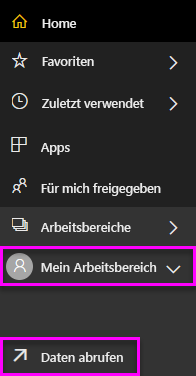
5. Wählen Sie **Dateien**aus.

   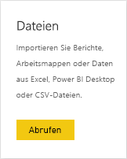
6. Navigieren Sie zum Speicherort der Excel-Datei des Beispiels für die Beschaffungsanalyse. Wählen Sie die Datei und dann **Verbinden** aus.

   
7. Wählen Sie für diese Übung **Importieren** aus.

    
8. Wenn die Erfolgsmeldung angezeigt wird, klicken Sie auf das **x**, um sie auszublenden.

   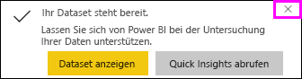

### Öffnen des Berichts und Anheften von Kacheln an Ihr Dashboard
1. Wählen Sie im gleichen Arbeitsbereich die Registerkarte **Berichte** und dann **Analysebeispiel für Beschaffung** aus, um den Bericht zu öffnen.

    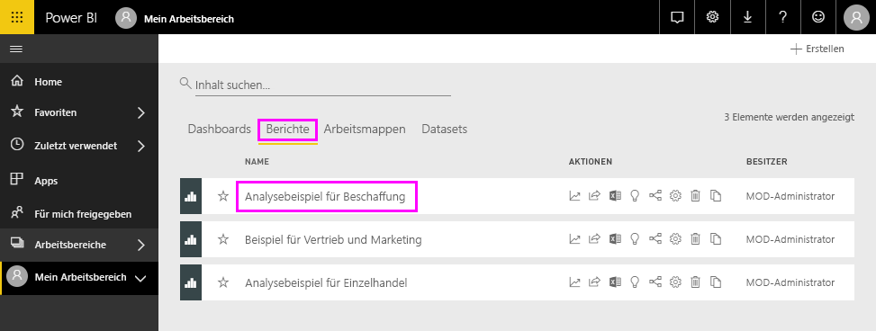 Der Bericht wird in der Leseansicht geöffnet. Beachten Sie, dass er am unteren Rand zwei Registerkarten aufweist: **Rabattanalyse** und **Übersicht über die Ausgaben**. Jede Registerkarte stellt eine Seite des Berichts dar.

2. Wählen Sie **Bericht bearbeiten** aus, um den Bericht in der Bearbeitungsansicht zu öffnen.

    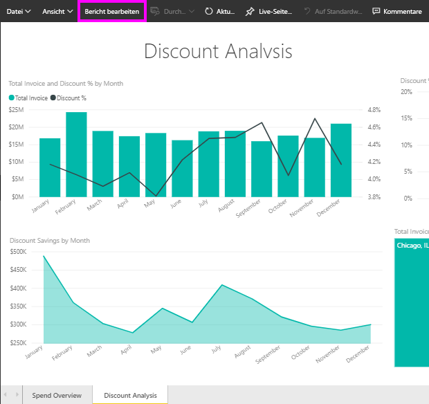
3. Zeigen Sie auf eine Visualisierung, um die verfügbaren Optionen anzuzeigen. Um einem Dashboard eine Visualisierung hinzuzufügen, wählen Sie das Stecknadelsymbol .

    
4. Da wir ein neues Dashboard erstellen, wählen Sie die Option **Neues Dashboard** aus und geben ihm einen Namen.

    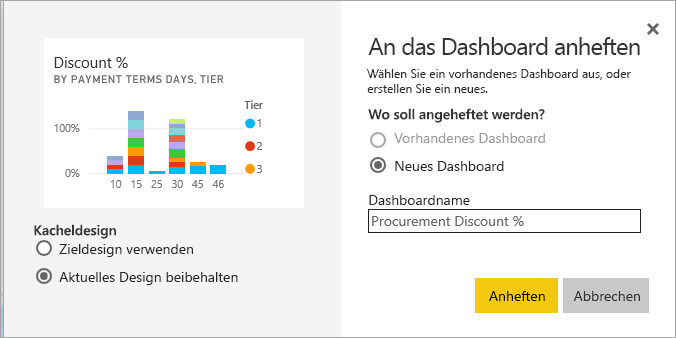
5. Wenn Sie **Anheften** auswählen, erstellt Power BI das neue Dashboard im aktuellen Arbeitsbereich. Wenn die Meldung **An das Dashboard angeheftet** angezeigt wird, wählen Sie **Zum Dashboard wechseln** aus. Wenn Sie aufgefordert werden, den Bericht zu speichern, wählen Sie **Speichern** aus.

    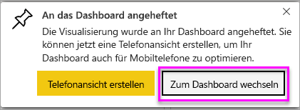

    Power BI öffnet das neue Dashboard. Es enthält eine Kachel: die soeben angeheftete Visualisierung.

   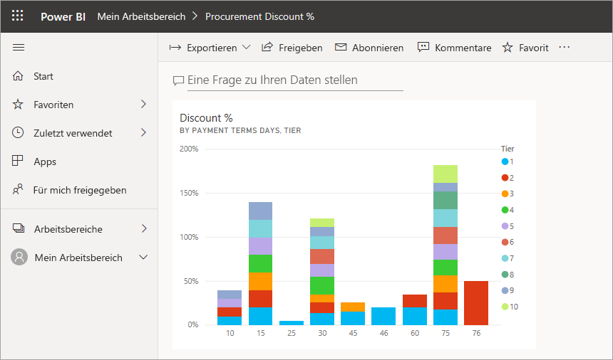
7. Klicken Sie auf die Kachel, um zum Bericht zurückzukehren. Heften Sie einige weitere Kacheln an das neue Dashboard an. Wenn das Fenster **An das Dashboard anheften** angezeigt wird, wählen Sie **Vorhandenes Dashboard** aus.  

   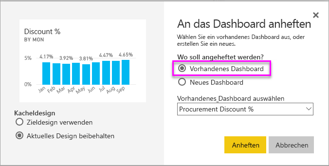

## Anheften einer vollständigen Berichtsseite an das Dashboard
Anstatt einzelne Visuals anzuheften, können Sie [eine vollständige Berichtsseite als *Live-Kachel* anheften](service-dashboard-pin-live-tile-from-report.md). Los geht‘s.

1. Wählen Sie im Berichts-Editor die Registerkarte **Ausgabenübersicht** aus, um die zweite Seite des Berichts zu öffnen.

   

2. Wir möchten auf Ihrem Dashboard alle visuellen Elemente im Bericht anzeigen. Wählen Sie in der oberen rechten Ecke der Menüleiste die Option **Live-Seite anheften**. Kacheln für Live-Seiten werden auf einem Dashboard jedes Mal aktualisiert, wenn die Seite aktualisiert wird.

   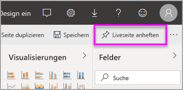

3. Wenn das Fenster **An das Dashboard anheften** angezeigt wird, wählen Sie **Vorhandenes Dashboard** aus.

   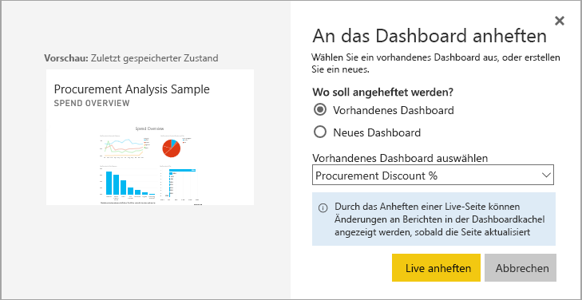

4. Wenn die Erfolgsmeldung angezeigt wird, wählen Sie **Zum Dashboard wechseln** aus. Dort sehen Sie die Kacheln, die Sie aus dem Bericht angeheftet haben. Im unten gezeigten Beispiel haben wir zwei Kacheln von Seite 1 des Berichts sowie eine Live-Kachel angeheftet, die Seite 2 des Berichts darstellt.

   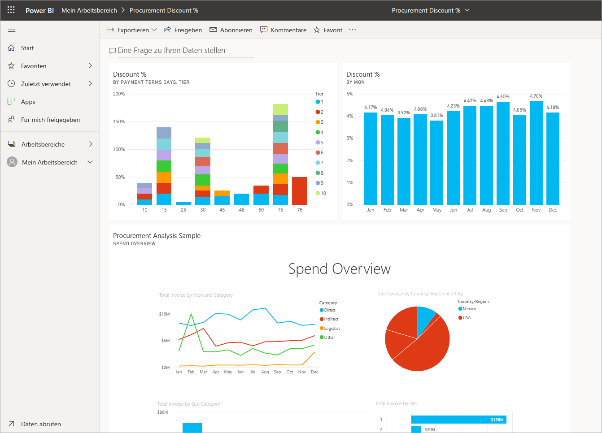

## Nächste Schritte
Glückwunsch, Sie haben Ihr erstes Dashboard erstellt! Da Sie jetzt über ein Dashboard verfügen, stehen Ihnen alle Möglichkeiten offen, die ein Dashboard bietet. Folgen Sie einem der unten angegebenen Artikel, oder beginnen Sie selbständig mit der Erkundung: 

* [Ändern der Größe und Position von Kacheln](service-dashboard-edit-tile.md)
* [Alle wichtigen Informationen über Dashboardkacheln](service-dashboard-tiles.md)
* [Freigeben des Dashboards durch Erstellen einer App](service-create-workspaces.md)
* [Power BI – Grundkonzepte](service-basic-concepts.md)
* [Tipps zum Gestalten überzeugender Power BI-Dashboards](service-dashboards-design-tips.md)

Weitere Fragen? [Wenden Sie sich an die Power BI-Community](http://community.powerbi.com/).
