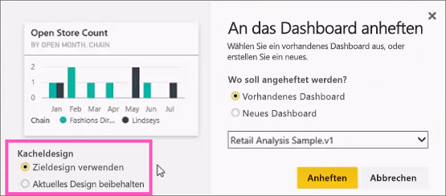
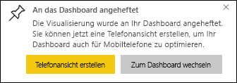

# Anheften einer Kachel an ein Power BI-Dashboard aus einem Bericht

Eine Möglichkeit zum Hinzufügen einer [Dashboardkachel](consumer/end-user-tiles.md) ist, dies innerhalb eines [Power BI-Berichts](consumer/end-user-reports.md) zu tun. Wenn Sie eine dieser Kacheln auswählen, wird sie im Bericht geöffnet.

Eine gesamte Berichtsseite kann an ein Dashboard angeheftet werden, was als Anheften einer *Live*-Kachel bezeichnet wird. Sie wird als Live-Kachel bezeichnet, da Sie mit der Kachel auf dem Dashboard interagieren können. Im Gegensatz zu einzelnen Visualisierungskacheln werden im Bericht vorgenommene Änderungen automatisch mit dem Dashboard synchronisiert. Weitere Informationen finden Sie unter [Anheften einer gesamten Berichtsseite](#pin-an-entire-report-page).

Kacheln aus für Sie freigegebenen Berichten oder aus Power BI Desktop können nicht angeheftet werden. 

> [!TIP]
> Da bei einigen Visualisierungen Hintergrundbilder verwendet werden, funktioniert das Anheften möglicherweise nicht, wenn das Hintergrundbild zu groß ist. Verringern Sie die Bildgröße, oder komprimieren Sie das Bild.  
> 
> 

## Anheften einer Kachel aus einem Bericht
Sehen Sie, wie ein Dashboard durch Anheften von Visualisierungen und Bildern aus einem Power BI-Bericht erstellt wird.
    

<iframe width="560" height="315" src="https://www.youtube.com/embed/lJKgWnvl6bQ" frameborder="0" allowfullscreen></iframe>

Erstellen Sie jetzt mithilfe eines der Power BI-Beispielberichte Ihr eigenes Dashboard.

1. Zeigen Sie im Bericht auf die Visualisierung, die Sie anheften möchten, und wählen Sie das Stecknadelsymbol aus. . Power BI öffnet den Bildschirm **An Dashboard anheften** .
   
     
2. Wählen Sie aus, ob Sie die Kachel an ein vorhandenes oder ein neues Dashboard anheften möchten.
   
   * **Vorhandenes Dashboard**: Wählen Sie den Namen des Dashboards in der Dropdownliste aus. Dashboards, die für Sie freigegeben wurden, werden nicht in der Dropdownliste angezeigt.
   * **Neues Dashboard**: Geben Sie den Namen des neuen Dashboards ein.
3. In einigen Fällen verfügt das Element, das Sie anheften möchten, möglicherweise bereits über ein *Design*. Dies ist z. B. bei Visualisierungen aus einer Excel-Arbeitsmappe der Fall. Wenn dies der Fall ist, wählen Sie aus, welches Design auf die Kachel angewendet werden soll.
4. Wählen Sie **Anheften**aus.
   
   Eine Meldung (in der Nähe der oberen rechten Ecke) weist Sie darauf hin, dass die Visualisierung Ihrem Dashboard erfolgreich als Kachel hinzugefügt wurde.
   
   
5. Wählen Sie im Navigationsbereich das Dashboard mit der neuen Kachel. [Bearbeiten Sie Anzeige und Verhalten der Kachel](service-dashboard-edit-tile.md), oder wählen Sie die Kachel aus, um zum Bericht zurückzukehren.

## Anheften einer gesamten Berichtsseite
Eine andere Möglichkeit besteht darin, eine gesamte Berichtsseite an ein Dashboard anzuheften. Dies ist eine einfache Möglichkeit, mehr als eine Visualisierung gleichzeitig anzuheften. Wenn Sie eine gesamte Seite anheften, werden die Kacheln als *Live*-Kacheln bezeichnet. Das heißt, dass Sie mit ihnen auf dem Dashboard interagieren können. Änderungen, die Sie im Berichts-Editor an Visualisierungen vornehmen, z.B. Hinzufügen eines Filters oder Ändern der im Diagramm verwendeten Felder, werden von der Dashboardkachel übernommen.  

Weitere Informationen finden Sie unter [Anheften einer gesamten Berichtsseite](service-dashboard-pin-live-tile-from-report.md).

## Nächste Schritte
- [Dashboard für Benutzer des Power BI-Diensts](consumer/end-user-dashboards.md)
- [Dashboardkacheln in Power BI](consumer/end-user-tiles.md)
- [Berichte in Power BI](consumer/end-user-reports.md)
- [Aktualisieren von Daten in Power BI](refresh-data.md)
- [Grundlegende Konzepte für Designer im Power BI-Dienst](service-basic-concepts.md)

Weitere Fragen? [Wenden Sie sich an die Power BI-Community](https://community.powerbi.com/)

