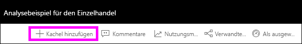
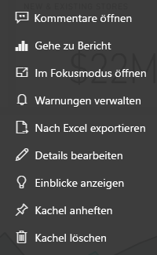

# Einführung in Dashboardkacheln für Power BI-Designer

Eine Kachel ist eine Momentaufnahme Ihrer Daten, die an das Dashboard geheftet ist. Eine Kachel kann u.a. aus einem Bericht, einem Dataset, einem Dashboard, dem Q&A-Feld, Excel-Berichten und SSRS-Berichten (SQL Server Reporting Services) erstellt werden.  Der Screenshot zeigt viele verschiedene Kacheln, die an ein Dashboard angeheftet sind.

Dashboards und Dashboardkacheln sind ein Feature des Power BI-Diensts und nicht von Power BI Desktop. Auf mobilen Geräten können Sie keine Dashboards erstellen, aber Sie können sie [anzeigen und freigeben](mobile-apps-view-dashboard.md).

Sie können Kacheln nicht nur anheften, sondern auch eigenständige Kacheln direkt auf dem Dashboard mithilfe des Steuerelements [Kachel hinzufügen](service-dashboard-add-widget.md) erstellen. Eigenständige Kacheln können Textfelder, Bilder, Videos, Streamingdaten und Webinhalte enthalten.

Benötigen Sie Hilfe, um die Grundkomponenten zu verstehen, aus denen Power BI besteht? Weitere Informationen finden Sie unter [Grundlegende Konzepte für Designer im Power BI-Dienst](service-basic-concepts.md).

> [!NOTE]
> Wenn sich die ursprüngliche Visualisierung ändert, die zum Erstellen der Kachel verwendet wurde, ändert sich die Kachel nicht.  Wenn Sie beispielsweise ein Liniendiagramm aus einem Bericht angeheftet haben und dann das Liniendiagramm in ein Balkendiagramm ändern, wird auf der Dashboardkachel weiterhin ein Liniendiagramm angezeigt. Die Daten werden aktualisiert, der Visualisierungstyp hingegen nicht.
> 
> 

## Anheften einer Kachel
Es gibt viele verschiedene Möglichkeiten, eine Kachel zu Ihrem Dashboard hinzuzufügen (anzuheften). Folgende Optionen stehen zur Verfügung:

* [Power BI Q&A](service-dashboard-pin-tile-from-q-and-a.md)
* [ein Bericht](service-dashboard-pin-tile-from-report.md)
* [ein anderes Dashboard](service-pin-tile-to-another-dashboard.md)
* [eine Excel-Arbeitsmappe auf OneDrive for Business](service-dashboard-pin-tile-from-excel.md)
* [Power BI Publisher für Excel](publisher-for-excel.md)
* [Quick Insights (Schnelle Einblicke)](service-insights.md)
* [ein lokaler paginierter Bericht im Power BI-Berichtsserver oder in SQL Server Reporting Services](https://docs.microsoft.com/sql/reporting-services/pin-reporting-services-items-to-power-bi-dashboards)

Eigenständige Kacheln für Bilder, Textfelder, Videos, Streamingdaten und Webinhalte können Sie mit [Kachel hinzufügen](service-dashboard-add-widget.md) direkt auf dem Dashboard erstellen.

  

## Interagieren mit Kacheln in einem Dashboard
Nachdem Sie einem Dashboard eine Kachel hinzugefügt haben, können Sie diese verschieben, ihre Größe ändern oder ihre Darstellung und ihr Verhalten anpassen.

### Verschieben und Ändern der Größe einer Kachel
Wählen Sie eine Kachel aus, und [verschieben Sie sie auf dem Dashboard](service-dashboard-edit-tile.md). Zeigen Sie auf eine Kachel, und klicken Sie auf den Ziehpunkt , um ihre Größe zu ändern.

### Zeigen Sie auf eine Kachel, um Aussehen und Verhalten zu ändern.
1. Zeigen Sie auf die Kachel, damit die Auslassungspunkte angezeigt werden.
   
    
2. Klicken Sie auf die Auslassungspunkte, um das Aktionsmenü der Kachel zu öffnen.
   
    
   
    Hier können Sie Folgendes tun:
   
     * [Hinzufügen von Kommentaren zu einem Dashboard](consumer/end-user-comment.md)
     * [Öffnen des Berichts, mit dem diese Kachel erstellt wurde](service-reports.md)  
     * [Anzeigen von Inhalten im Fokusmodus](service-focus-mode.md)   
     * [Exportieren der auf der Kachel verwendeten Daten](visuals/power-bi-visualization-export-data.md)
     * [Bearbeiten des Titels und Untertitels und Hinzufügen eines Hyperlinks](service-dashboard-edit-tile.md) 
     * [Ausführen von Quick Insights](service-insights.md) 
     * [Anheften der Kachel an ein anderes Dashboard](service-pin-tile-to-another-dashboard.md)
     * [Löschen der Kachel](service-dashboard-edit-tile.md)

3. Klicken Sie zum Schließen des Aktionsmenüs auf eine leere Fläche im Zeichenbereich.

### Auswählen einer Kachel
Wenn Sie eine Kachel auswählen, hängt das, was anschließend geschieht, davon ab, wie die Kachel erstellt wurde. Andernfalls gelangen Sie nach Auswählen der Kachel zu dem Bericht, der Excel Online-Arbeitsmappe, dem lokalen Reporting Services-Bericht oder der Q&A-Frage, die zum Erstellen der Kachel verwendet wurden. Wenn sie einen [benutzerdefinierten Link](service-dashboard-edit-tile.md) aufweist, wird dieser aufgerufen, sobald Sie die Kachel auswählen.

> [!NOTE]
> Eine Ausnahme sind Videokacheln, die mit **Kachel hinzufügen** direkt auf dem Dashboard erstellt wurden. Bei Auswählen einer Videokachel (die auf diese Weise erstellt wurde) wird das Video direkt auf dem Dashboard wiedergegeben.   
> 
> 

## Zu beachtende Aspekte und Problembehandlung

* Wenn der Bericht, der zum Erstellen des Visuals verwendet wurde, nicht gespeichert wurde, löst das Auswählen der Kachel keine Aktion aus.
* Wenn die Kachel über eine Arbeitsmappe in Excel Online erstellt wurde, benötigen Sie mindestens Leseberechtigungen für die Arbeitsmappe. Andernfalls können Sie durch Auswählen der Kachel die Arbeitsmappe in Excel Online nicht öffnen.
* Angenommen, Sie erstellen eine Kachel mit **Kachel hinzufügen** direkt auf dem Dashboard und legen einen benutzerdefinierten Hyperlink für diese fest. Wenn dies der Fall ist, wird die URL geöffnet, wenn Sie den Titel, den Untertitel oder die Kachel auswählen. Standardmäßig wird ansonsten bei der Auswahl einer Kachel, die direkt auf dem Dashboard für ein Bild, einen Webcode oder ein Textfeld erstellt wurde, keine weitere Aktion ausgeführt.
* Kacheln können aus lokalen paginierten Berichten erstellt werden, die sich im Power BI-Berichtsserver oder in SQL Server Reporting Services befinden. Wenn Sie nicht über die Zugriffsberechtigung für den lokalen Bericht verfügen, werden Sie beim Auswählen der Kachel zu einer Seite mit einer entsprechenden Fehlermeldung (rsAccessDenied) weitergeleitet.
* Angenommen, Sie wählen eine Kachel aus, die aus einem lokalen paginierten Bericht erstellt wurde, der sich im Power BI-Berichtsserver oder in SQL Server Reporting Services befindet. Wenn Sie keinen Zugriff auf das Netzwerk mit dem Berichtsserver haben, wird eine Seite angezeigt, die Sie darauf hinweist, dass der Server nicht gefunden wurde (HTTP 404). Ihr Gerät muss Netzwerkzugriff auf den Berichtsserver besitzen, um den Bericht anzeigen zu können.
* Wenn sich das ursprüngliche Visual ändert, das zum Erstellen der Kachel verwendet wurde, ändert sich die Kachel nicht. Wenn Sie beispielsweise ein Liniendiagramm aus einem Bericht anheften und dann das Liniendiagramm in ein Balkendiagramm ändern, wird auf der Dashboardkachel weiterhin ein Liniendiagramm angezeigt. Die Daten werden aktualisiert, der Visualtyp hingegen nicht.

## Nächste Schritte
- [Erstellen einer Karte (Kachel für große Zahlen) für das Dashboard](power-bi-visualization-card.md)
- [Einführung in Dashboards für Power BI-Designer](service-dashboards.md)  
- [Aktualisieren von Daten in Power BI](refresh-data.md)
- [Grundlegende Konzepte für Designer im Power BI-Dienst](service-basic-concepts.md)
- [Integrieren von Power BI Kacheln in Office-Dokumente](http://blogs.msdn.com/b/powerbidev/archive/2015/09/28/integrating-power-bi-tiles-into-office-documents.aspx)
- [Anheften von Reporting Services-Elementen an Power BI-Dashboards](https://msdn.microsoft.com/library/mt604784.aspx)

Weitere Fragen? [Wenden Sie sich an die Power BI-Community](http://community.powerbi.com/).

