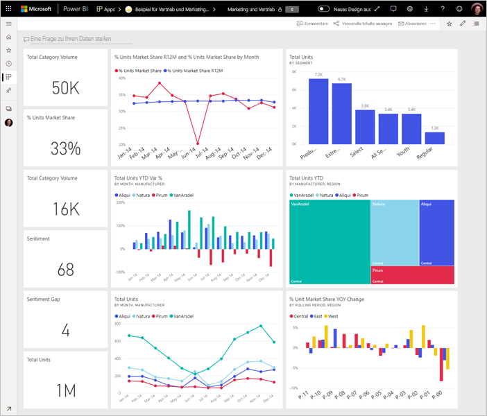

# Tipps zum Gestalten von Power BI-Dashboards
Nachdem Sie ein Dashboard erstellt und einige Kacheln hinzugefügt haben, können Sie Ihr Dashboard ansprechend und funktionell gestalten. In der Regel bedeutet dies, dass die wichtigsten Informationen hervorgehoben werden, sodass das Dashboard ordentlich und übersichtlich ist.

> [!TIP]
> Gefällt Ihnen dieses Dashboard? Sie können dieses Dashboard und zugehörige Berichte von AppSource herunterladen. Navigieren Sie zu **Daten abrufen** > **Dienste**. Suchen Sie nach **Microsoft Sample - Sales & Marketing** > **Jetzt abrufen**.

Hier finden Sie einige Tipps für Dashboards.

## Video zu den bewährten Methoden für den Dashboardentwurf

Sehen Sie sich dieses Video zu den [bewährten Methoden für den Dashboardentwurf in Power BI](https://www.youtube.com/watch?v=-tdkUYrzrio) an, um Entwurfstipps von Marco Russo (SQLBI.com) zu erhalten.

## Zielgruppe berücksichtigen
Wie lauten die wichtigsten Kennzahlen, um Entscheidungen zu treffen? Wie wird das Dashboard verwendet? Welche erlernten oder kulturellen Annahmen wirken sich möglicherweise auf die Gestaltung aus? Welche Informationen benötigt Ihre Zielgruppe, um erfolgreich zu sein?

Bedenken Sie, dass das Dashboard eine Übersicht ist, mit der Sie den aktuellen Status der Daten prüfen können. Das Dashboard basiert auf zugrunde liegenden Berichten und Datasets, und diese Elemente enthalten möglicherweise unzählige Details. Die Leser können die Berichte über Ihr Dashboard aufrufen. Nehmen Sie daher die Details nicht in das Dashboard auf, es sei denn, Ihre Leser müssen diese Details überwachen.

Wo wird das Dashboard angezeigt? Wenn die Anzeige auf einem großen Monitor erfolgt, können Sie mehr Inhalte einfügen. Wenn Leser den Inhalt jedoch auf Ihren Tablets anzeigen, ist ein Dashboard mit weniger Kacheln besser lesbar.

## Erzählen Sie eine Geschichte auf einem Bildschirm
Dashboards sind dafür vorgesehen, auf einen Blick wichtige Informationen anzuzeigen. Idealerweise sollten daher alle Kacheln auf einem Bildschirm erscheinen. Können Sie Bildlaufleisten auf Ihrem Dashboard vermeiden?

Ist das Dashboard unübersichtlich?  Entfernen Sie alles bis auf die wesentlichen Informationen, die leicht gelesen und interpretiert werden können.

## Nutzen des Vollbildmodus
Wenn Sie ein Dashboard bereitstellen, zeigen Sie es im [Vollbildmodus](consumer/end-user-focus.md) ohne Ablenkungen an.

## Betonen der wichtigsten Informationen
Wenn die Texte und Visualisierungen auf Ihrem Dashboard alle gleich groß sind, haben die Leser Schwierigkeiten, sich auf das Wesentliche zu konzentrieren. So sind z. B. Kartenvisualisierungen eine gute Möglichkeit, wichtige Informationen anschaulich zu präsentieren:  

Stellen Sie jedoch unbedingt Kontext bereit.  

Erfahren Sie, wie Sie [eine Kachel mit nur einer Nummer erstellen](visuals/power-bi-visualization-card.md).

## Platzieren der wichtigsten Informationen
Die meisten Personen lesen von oben nach unten. Daher sollten die wichtigsten Details oben links angezeigt und weitere Einzelheiten in der Leserichtung Ihrer Zielgruppe eingefügt werden (von links nach rechts, von oben nach unten).

## Die richtigen Visualisierungen für die Daten verwenden
Vermeiden Sie zahlreiche Visualisierungen auf Kosten der Vielfalt.  Visualisierungen sollten ein Bild vermitteln und leicht zu „lesen“ und interpretieren sein.  Für einige Daten und Visualisierungen reicht eine einfache grafische Visualisierung aus. Möglicherweise erfordern andere Daten eine komplexere Visualisierung – verwenden Sie Titel und Beschriftungen sowie andere Anpassungen, um das Lesen zu erleichtern.  

* Seien Sie vorsichtig, wenn Sie visuelle Elemente verwenden, die zwar ansprechend aussehen, aber schwer zu lesen sind, z.B. 3D-Diagramme. 
* Leider sind Kreisdiagramme, Ringdiagramme, Messdiagramme und andere Arten von Kreisdiagrammen nicht die optimale Lösung für die Datenvisualisierung. Kreisdiagramme sind mit weniger als acht Kategorien am übersichtlichsten. Da Menschen Werte nicht nebeneinander vergleichen können, ist es schwieriger, Werte in einem Kreisdiagramm zu vergleichen als in Balken- und Säulendiagrammen. Kreisdiagramme eignen sich besser zum Anzeigen von Teil-Ganzes-Beziehungen als zum Vergleichen der Teile. Und Messdiagramme eignen sich ideal, um den aktuellen Status im Kontext eines Ziels anzuzeigen.
* Seien Sie konsistent in Bezug auf Diagrammskalen auf Achsen, die Reihenfolge der Diagrammdimensionen und auch die Farben, die für Dimensionswerte innerhalb von Diagrammen verwendet werden.
* Stellen Sie sicher, dass quantitative Daten ansprechend verschlüsselt sind. Zeigen Sie in Telefonnummern maximal drei oder vier Ziffern am Stück an. Runden Sie Maßangaben auf eine oder zwei Stellen nach dem Dezimalkomma, und unterteilen Sie Tausender oder Millionen, d.h. 3,4 Millionen anstatt 3.400.000.
* Achten Sie auf eine Trennung von Genauigkeit und Zeit. Sorgen Sie für verständliche Zeitangaben. Zeigen Sie ein Diagramm vom letzten Monat nicht neben gefilterten Diagrammen von einem bestimmten Monat an.
* Mischen Sie nicht große und kleine Maße in der gleichen Größenordnung, z.B. für ein Linien- oder Balkendiagramm. Beispiel: Eine Maßeinheit wird in Millionen, die andere in Tausenden angegeben. Hier wäre es schwierig, die Differenz der Maßeinheit in Millionen und der Maßeinheit in Tausenden zu ermitteln. Müssen Sie beide angegeben, wählen Sie eine Visualisierung, bei der eine zweite Achse möglich ist.
* Überladen Sie Ihre Diagramme nicht mit unnötigen Datenbeschriftungen. Werte in Balkendiagrammen sind in der Regel auch ohne Anzeige der tatsächlichen Zahl verständlich.
* Achten Sie darauf, wie die [Diagramme sortiert werden](consumer/end-user-change-sort.md). Wenn Sie den höchsten oder niedrigsten Wert hervorheben möchten, sortieren Sie nach der Maßeinheit. Sollen Benutzer eine bestimmte Kategorie in vielen anderen Kategorien schnell finden können, sortieren Sie nach der Achse.  

Weitere Informationen zur Visualisierung finden Sie unter [Visualisierungstypen in Power BI](visuals/power-bi-visualization-types-for-reports-and-q-and-a.md).  

## Weitere Informationen zum Dashboardentwurf
Wenn Sie die Gestaltung erstklassiger Dashboards perfektionieren möchten, informieren Sie sich über die Gestaltgesetze der visuellen Wahrnehmung und die Kommunikation umsetzbarer Informationen im Kontext. Glücklicherweise finden sich in vielen unserer Blogs bereits zahlreiche Informationen zu diesem Thema. Zu unseren Lieblingsbüchern (in englischer Sprache) zählen:

* *Information Dashboard Design* von Stephen Few  
* *Show Me the Numbers* von Stephen Few  
* *Now You See It* von Stephen Few  
* *Envisioning Information* von Edward Tufte  
* *Advanced Presentations* von Design by Andrew Abela   

## Nächste Schritte
[Erstellen eines Dashboards aus einem Bericht](service-dashboard-create.md)  
[Grundlegende Konzepte für Designer im Power BI-Dienst](service-basic-concepts.md)  
Weitere Fragen? [Wenden Sie sich an die Power BI-Community](https://community.powerbi.com/)
