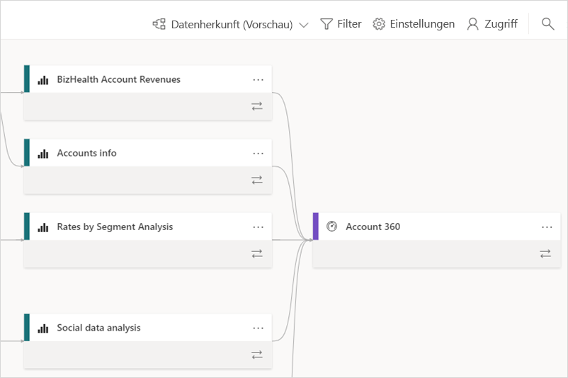
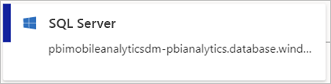
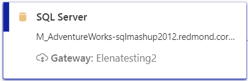
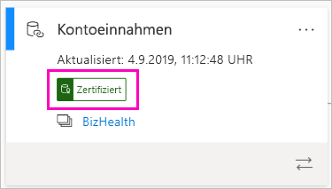
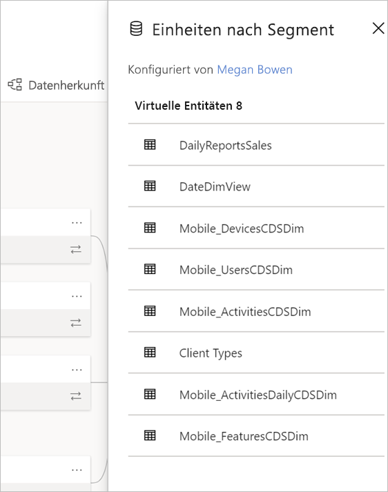
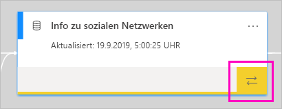
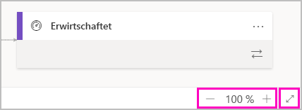

# Datenherkunft (Vorschau)
In Projekten mit moderner Business Intelligence (BI) kann es eine Herausforderung sein, den Datenfluss von der Datenquelle bis zum Ziel zu verstehen. Die Herausforderung ist noch größer, wenn Sie erweiterte analytische Projekte erstellt haben, die mehrere Datenquellen, Artefakte und Abhängigkeiten umfassen.  Es kann schwierig sein, Fragen wie „Was geschieht, wenn ich diese Daten ändere?“ oder „Warum ist dieser Bericht nicht auf dem neusten Stand?“ zu beantworten. Sie benötigen möglicherweise ein Team von Experten oder eine umfassende Untersuchung, um das zu verstehen. Wir haben die Datenherkunftsansicht entworfen, um Sie beim Beantworten dieser Fragen zu unterstützen.

 
Power BI verfügt über mehrere Artefakttypen, z. B. Dashboards, Berichte, Datasets und Dataflows. Viele Datasets und Dataflows stellen eine Verbindung mit externen Datenquellen wie SQL Server und externen Datasets in anderen Arbeitsbereichen her. Wenn ein Dataset für einen eigenen Arbeitsbereich extern ist, befindet es sich möglicherweise in einem Arbeitsbereich, der jemandem aus der IT oder einem anderen Analysten gehört. Externe Datenquellen und Datasets erschweren es, zu wissen, woher die Daten letztlich stammen. Für komplexe und für einfachere Projekte wird die Herkunftsansicht eingeführt. 

In der Herkunftsansicht sehen Sie die Herkunftsbeziehungen zwischen allen Artefakten in einem Arbeitsbereich und alle externen Abhängigkeiten. Dataflows haben bereits eine Diagrammansicht, und die Herkunftsansicht erweitert diese Ansicht. Sie zeigt Verbindungen zwischen allen Arbeitsbereichsartefakten, einschließlich sowohl Upstream- als auch Downstreamverbindungen mit Dataflows. Die separate Datenflussdiagrammansicht wird ab November eingestellt.

## Erkunden der Herkunftsansicht

Jeder Arbeitsbereich, egal ob neu oder klassisch, hat automatisch eine Herkunftsansicht, mit Ausnahme von „Mein Arbeitsbereich“. Sie benötigen mindestens eine „Mitwirkender“-Rolle im Arbeitsbereich, um sie anzuzeigen. Weitere Informationen finden Sie in diesem Artikel unter [Berechtigungen](#permissions). 

- Wechseln Sie zur Listenansicht des Arbeitsbereichs, um auf die Herkunftsansicht zuzugreifen. Tippen Sie auf den Pfeil neben **Listenansicht**, und wählen Sie **Herkunftsansicht** aus.

    

    In dieser Ansicht werden alle Arbeitsbereichsartefakte und die Art und Weise, wie die Daten von einem zum anderen fließen, angezeigt.

**Datenquellen**

Die Datenquellen, aus denen die Datasets und Dataflows abgerufen werden, werden angezeigt. Auf den Datenquellenkarten finden Sie weitere Informationen, die Ihnen beim Identifizieren der Quelle helfen können. Beispielsweise wird für Azure SQL Server auch der Datenbankname angezeigt.

 
**Gateways**

Wenn eine Datenquelle über ein lokales Gateway verbunden ist, werden die Gatewayinformationen der Datenquellenkarte hinzugefügt. Wenn Sie über Berechtigungen als Gatewayadministrator oder als Datenquellenbenutzer verfügen, werden weitere Informationen angezeigt, z. B. der Gatewayname.

**Datasets und Dataflows**
 
Bei Datasets sehen Sie den Zeitpunkt der letzten Aktualisierung und ob ein Dataset zertifiziert ist oder höher gestuft wurde.

 
Wenn ein Bericht im Arbeitsbereich auf einem Dataset in einem anderen Arbeitsbereich basiert, wird der Name des Quellarbeitsbereichs auf der Datasetkarte angezeigt. Wählen Sie den Namen des Quellarbeitsbereichs aus, um zu diesem Arbeitsbereich zu wechseln.
 
- Wählen Sie für jedes Artefakt **Weitere Optionen** (...) aus, um das Optionsmenü anzuzeigen. Es enthält alle Aktionen, die auch in der Listenansicht verfügbar sind.
  
Wählen Sie die Datasetkarte selbst aus, um mehr Metadaten in Datasets anzuzeigen. Weitere Informationen zum Dataset werden in einem Seitenbereich angezeigt.

 
## Anzeigen der Herkunft für ein beliebiges Artefakt 

Nehmen wir an, Sie möchten die Herkunft für ein bestimmtes Artefakt sehen.

- Wählen Sie die Doppelpfeile unter einem Artefakt aus.

    

    Power BI hebt alle Artefakte hervor, die sich auf dieses Artefakt beziehen, und verdunkelt den Rest. 

## Navigation und Vollbild 

Die Herkunftsansicht ist eine interaktive Canvas. Mit der Maus und dem Touchpad können Sie in der Canvas navigieren und diese vergrößern oder verkleinern.  

- Zum Vergrößern und Verkleinern verwenden Sie entweder das Menü in der unteren rechten Ecke oder die Maus oder das Touchpad. 

- Verwenden Sie die Vollbildoption in der unteren rechten Ecke, um mehr Platz für das Diagramm zu erhalten. 

    

## Berechtigungen

- Sie benötigen eine Power BI Pro-Lizenz, um die Herkunftsansicht anzuzeigen.
- Die Herkunftsansicht steht nur Benutzern mit Zugriff auf den Arbeitsbereich zur Verfügung.
- Benutzer müssen über eine Administrator-, eine Mitglieds- oder eine „Mitwirkender“-Rolle im Arbeitsbereich verfügen. Benutzer mit einer „Anzeigender Benutzer“-Rolle können nicht zur Herkunftsansicht wechseln.

## Überlegungen und Einschränkungen

- Die Herkunftsansicht ist in Internet Explorer nicht verfügbar. Weitere Informationen finden Sie unter [Unterstützte Browser für Power BI](power-bi-browsers.md).
- Die Herkunftsansicht ist in „Mein Arbeitsbereich“ nicht verfügbar.

## Nächste Schritte

- [Einführung in die Verwendung von Datasets in mehreren Arbeitsbereichen (Vorschau)](service-datasets-across-workspaces.md)
