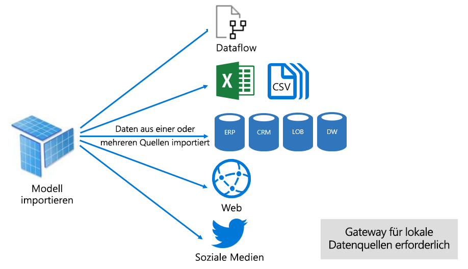
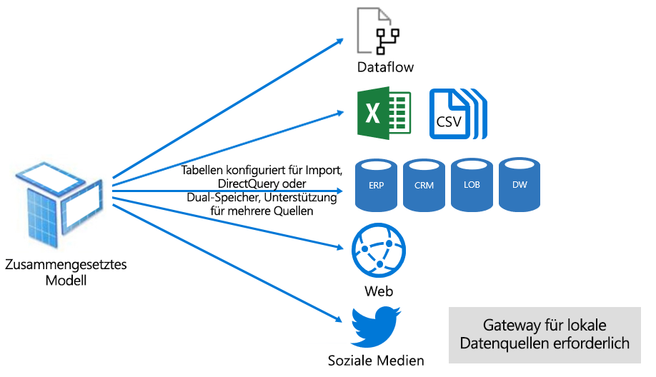

# Datasetmodi im Power BI-Dienst

In diesem Artikel finden Sie eine technische Erläuterung zu Power BI-Datasetmodi. Sie betrifft Datasets, die eine Liveverbindung mit einem extern gehosteten Analysis Services-Modell darstellen, sowie Modelle, die in Power BI Desktop entwickelt werden. Der Artikel legt den Schwerpunkt auf das Grundprinzip der einzelnen Modi und mögliche Einflüsse auf die Kapazitätsressourcen von Power BI.

Dies sind die drei Datasetmodi:

- [Import](#import-mode)
- [DirectQuery](#directquery-mode)
- [Zusammengesetzt](#composite-mode)

## Import-Modus

Der _Import_-Modus ist der in Entwicklungsmodellen am häufigsten verwendete Modus. Dieser Modus bietet dank der Ausführung der Abfragen im Arbeitsspeicher eine extrem hohe Leistung. Er bietet Modellentwicklern darüber hinaus Flexibilität und Unterstützung für bestimmte Power BI-Dienstfunktionen (Q&A, Quick Insights usw.). Aufgrund dieser Vorzüge ist er der Standardmodus beim Erstellen einer neuen Power BI Desktop-Projektmappe.

Es ist wichtig, zu verstehen, dass importierte Daten immer auf dem Datenträger gespeichert werden. Beim Abfragen oder Aktualisieren müssen die Daten vollständig in den Arbeitsspeicher der Power BI-Kapazität geladen werden. Sobald sie sich im Arbeitsspeicher befinden, können Import-Modelle sehr schnell Abfrageergebnisse erzielen. Es ist ebenfalls wichtig, zu verstehen, dass es kein Konzept des teilweisen Ladens eines Import-Modells in den Arbeitsspeicher gibt.

Beim Aktualisieren werden die Daten zuerst komprimiert und optimiert und anschließend von der VertiPaq-Speicher-Engine auf dem Datenträger gespeichert. Beim Laden vom Datenträger in den Arbeitsspeicher lässt sich eine bis zu zehnfache Komprimierung erzielen. Es kann also sinnvoll davon ausgegangen werden, dass 10 GB Quelldaten zu einem 1 GB komprimiert werden können. Die Speichergröße auf dem Datenträger kann eine Reduzierung von 20 % von der komprimierten Größe erreichen. (Der Größenunterschied kann durch Vergleich der Dateigröße in Power BI Desktop mit der Arbeitsspeicherbelegung der Datei im Task-Manager ermittelt werden.)

Flexibilität im Entwurf kann auf drei verschiedenen Wegen erreicht werden. Datenmodellierer bieten sich diese Möglichkeiten:

- Integrieren von Daten durch Zwischenspeichern von Dataflows und externen Datenquellen, unabhängig von Typ oder Format der Datenquelle
- Nutzen der gesamten Menge der Funktionen der [Power Query-Formelsprache](/powerquery-m/) (informell als M bezeichnet) beim Erstellen von Abfragen zur Datenvorbereitung
- Nutzen der gesamten Menge der [DAX-Funktionen (Data Analysis Expressions)](/dax/) beim Anreichern des Modells mit Geschäftslogik. Es besteht Unterstützung für berechnete Spalten, berechnete Tabellen und Measures.

Wie in der folgenden Abbildung dargestellt, kann ein Importmodell Daten aus einer beliebigen Anzahl unterstützter Datenquellentypen integrieren.

Während Importmodelle einerseits überzeugende Vorzüge zu bieten haben, gibt es auch Nachteile:

- Das gesamte Modell muss in den Arbeitsspeicher geladen werden, damit Power BI Abfragen für das Modell ausführen kann, was die verfügbaren Kapazitätsressourcen unter Druck setzen kann, insbesondere bei steigender Anzahl und Größe der Importmodelle
- Modelldaten sind stets nur so aktuell wie die letzte Aktualisierung, daher müssen Importmodelle aktualisiert werden, normalerweise mithilfe eines Zeitplans
- Eine vollständige Aktualisierung entfernt alle Daten aus allen Tabellen und lädt sie neu aus der Datenquelle. Dieser Vorgang kann im Hinblick auf Zeit und Ressourcen aufwändig für den Power BI-Dienst und die Datenquelle(n) sein.

    > [!NOTE]
    > Power BI kann eine inkrementelle Aktualisierung ausführen, um das Abschneiden und erneute Laden gesamter Tabellen zu vermeiden. Dieses Feature wird aber nur unterstützt, wenn das Dataset in Arbeitsbereichen auf Premium-Kapazitäten gehostet ist. Weitere Informationen finden Sie im Artikel [Inkrementelle Aktualisierung in Power BI Premium](service-premium-incremental-refresh.md).

Aus der Perspektive einer Power BI-Dienstressource ist für Importmodelle Folgendes erforderlich:

- Ausreichender Arbeitsspeicher, um das Modell zum Abfragen oder Aktualisieren zu laden
- Verarbeitungsressourcen und zusätzliche Arbeitsspeicherressourcen zum Aktualisieren der Daten

## DirectQuery-Modus

Der _DirectQuery_-Modus stellt eine Alternative zum Importmodus dar. Im DirectQuery-Modus entwickelte Modelle importieren keine Daten. Stattdessen bestehen sie nur aus Metadaten, die die Modellstruktur definieren. Wenn eine Abfrage für das Modell ausgeführt wird, werden native Abfragen verwendet, um Daten aus der zugrunde liegenden Datenquelle abzurufen.

Es gibt zwei Hauptgründe, warum man sich für die Entwicklung eines DirectQuery-Modells entscheiden kann:

- Wenn die Datenvolumen zu groß sind – selbst bei Anwendung von [Methoden zur Datenreduktion](guidance/import-modeling-data-reduction.md) – um sie in ein Modell zu laden oder auf praktikable Weise zu aktualisieren
- Wenn Berichte und Dashboards Daten nahezu in Echtzeit bereitstellen müssen, jenseits dessen, was im Rahmen von planmäßiger Aktualisierung erreicht werden kann. (Der Grenzwert für planmäßige Aktualisierung liegt bei 8-mal am Tag, 48-mal täglich für Premium-Kapazität.)

DirectQuery-Modelle bringen eine Reihe von Vorteilen mit:

- Die Größenbeschränkungen für Importmodelle spielen keine Rolle
- Die Modelle erfordern keine Aktualisierung
- Benutzer von Berichten greifen bei der Interaktion mit Berichtsfiltern und Datenschnitten auf die aktuellen Daten zu. Außerdem können Benutzer einen gesamten Bericht aktualisieren, um aktuelle Daten abzurufen.
- Echtzeitberichte können mithilfe der Funktion [Automatische Seitenaktualisierung](desktop-automatic-page-refresh.md) entwickelt werden
- Dashboardkacheln, die auf DirectQuery-Modellen basieren, können automatisch bis zu alle 15 Minuten aktualisiert werden

Allerdings gehen mit DirectQuery-Modellen auch viele Nachteile und Einschränkungen einher:

- Das Modell muss auf einer einzelnen unterstützten Datenquelle basieren. Daher muss jede Form von Datenintegration bereits in der Datenquelle erreicht werden. Die unterstützten Datenquellen sind relationale und analytische Systeme, mit Unterstützung für viele beliebte Datenspeicher.

    > [!TIP]
    > Viele Microsoft-Datenquellen werden unterstützt. Zu den Microsoft-Datenquellen gehören SQL Server, Azure Data Bricks, Azure HDInsight Spark (Beta), Azure SQL Database und Azure SQL Data Warehouse. Weitere Informationen finden Sie im Artikel [Von DirectQuery in Power BI unterstützte Datenquellen](desktop-directquery-data-sources.md).

- Die Leistung kann schwach sein, was sich negativ auf den Power BI-Dienst auswirken kann. Dieses Problem tritt möglicherweise auf, weil einige Abfragen für den Power BI-Dienst CPU-intensiv sind. Ein weiterer Grund kann darin bestehen, dass die Datenquelle nicht für die von Power BI gesendeten Abfragen optimiert ist.
- Power Query-Abfragen müssen „faltbar“ sein. Diese Anforderung bedeutet, dass Power Query-Logik nicht übermäßig komplex sein kann. Darüber hinaus muss sich die Logik auf die Verwendung von M-Ausdrücken und -Funktionen beschränken, die in native Abfragen umgewandelt werden können, die von der Datenquelle verstanden werden.
- DAX-Formeln sind auf die Verwendung von M-Ausdrücken und -Funktionen beschränkt, die in native Abfragen umgewandelt werden können, die von der Datenquelle verstanden werden. Ferner gibt es keine Unterstützung für berechnete Tabellen oder DAX-Zeitintelligenz-Funktionen.
- Es können keine Modellabfragen ausgeführt werden, die das Abrufen von mehr als einer Million Zeilen erfordern
- Berichte und Dashboards mit mehreren visuellen Elementen zeigen möglicherweise inkonsistente Ergebnisse an, insbesondere, wenn die Datenquelle volatil ist
- Die Funktionen Q&A und Quick Insights werden nicht unterstützt

Aus der Perspektive einer Power BI-Dienstressource ist für DirectQuery-Modelle Folgendes erforderlich:

- Nur minimaler Arbeitsspeicher zum Laden des Modells (nur Metadaten) bei der Abfrage
- Manchmal muss der Power BI-Dienst erhebliche Prozessorressourcen verwenden, um die an die Datenquelle gesendeten Abfragen zu generieren und zu verarbeiten. Wenn diese Situation eintritt, kann sie den Durchsatz beeinträchtigen, insbesondere, wenn das Modell gleichzeitig von mehreren Benutzern abgefragt wird.

Weitere Informationen finden Sie unter [Verwenden von DirectQuery in Power BI Desktop](desktop-use-directquery.md).

## Zusammengesetzter Modus

Im _Zusammengesetzten_ Modus können Import- und DirectQuery-Modi gemischt oder mehrere DirectQuery-Datenquellen integriert werden. Im zusammengesetzten Modus entwickelte Modelle unterstützen die Konfiguration des Speichermodus für jede Modelltabelle. Dieses Modell unterstützt außerdem berechnete Tabellen (die mit DAX definiert wurden).

Der Tabellenspeichermodus kann als „Import“, „DirectQuery“ oder „Dual“ konfiguriert werden. Eine für den Speichermodus „Dual“ konfigurierte Tabelle weist beide Speichermodi „Import“ und „DirectQuery“ auf, und diese Einstellung ermöglicht es dem Power BI-Dienst, von Abfrage zu Abfrage den effizientesten Modus zu bestimmen.

Hinter zusammengesetzten Modellen steht die Bestrebung, das Beste aus Import--und DirectQuery-Modus zu vereinen. Bei entsprechender Konfiguration kann die hohe Abfrageleistung von In-Memory-Modellen mit der Möglichkeit kombiniert werden, Daten nahezu in Echtzeit aus Datenquellen abzurufen.

Datenmodellierer, die zusammengesetzte Modelle entwickeln, werden wahrscheinlich Tabellen vom Dimensionstyp im Import- oder DirectQuery-Modus und Tabellen vom Faktentyp im DirectQuery-Modus konfigurieren. Weitere Informationen zur Rolle von Modelltabellen finden Sie unter [Informationen zum Sternschema und der Wichtigkeit für Power BI](guidance/star-schema.md).

Betrachten Sie beispielsweise ein Modell mit einer Tabelle **Produkt** vom Dimensionstyp und einer Tabelle **Umsatz** vom Faktentyp im DirectQuery-Modus. Die Tabelle **Produkt** kann effizient und schnell aus dem Arbeitsspeicher abgefragt werden, um einen Berichtsdatenschnitt zu rendern. Die Tabelle **Umsatz** könnte ebenso im DirectQuery-Modus mit der zugeordneten Tabelle **Produkt** abgefragt werden. Diese zweite Abfrage könnte die Generierung einer einzelnen, effizienten nativen SQL-Abfrage ermöglichen, die die Tabellen **Produkt** und **Umsatz** vereint und nach den Datenschnittwerten filtert.

In Allgemeinen hängen bei zusammengesetzten Modellen die Vorteile und Nachteile, die mit Import und DirectQuery einhergehen, von der Konfiguration der einzelnen Tabellen ab.

Weitere Informationen finden Sie unter [Verwenden zusammengesetzter Modelle in Power BI Desktop](desktop-composite-models.md).

## Nächste Schritte

- [Datasets im Power BI-Dienst](service-dataset-modes-understand.md)
- [Speichermodus in Power BI Desktop](desktop-storage-mode.md)
- [Verwendung von DirectQuery in Power BI](desktop-directquery-about.md)
- [Verwenden zusammengesetzter Modelle in Power BI Desktop](desktop-composite-models.md)
- Weitere Fragen? [Stellen Sie Ihre Frage in der Power BI-Community.](https://community.powerbi.com/)
