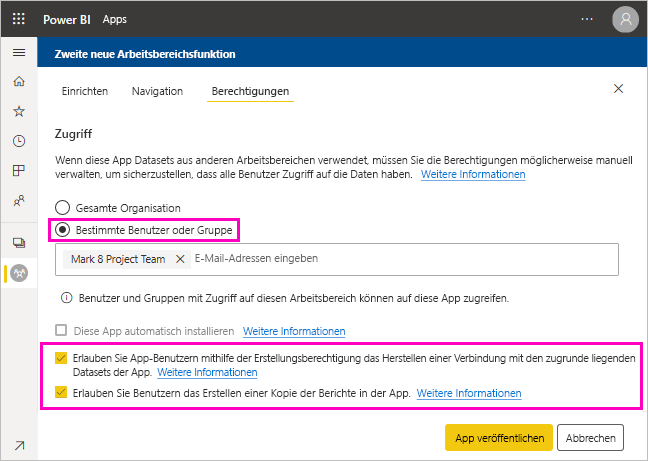

# Freigeben eines Datasets (Vorschau)

Als Ersteller von *Datenmodellen* in Power BI Desktop erstellen Sie *Datasets*, die Sie im Power BI-Dienst verteilen können. Anschließend können andere Ersteller von Berichten Ihre Datasets als Grundlage für ihre eigenen Berichte verwenden. In diesem Artikel erfahren Sie, wie Sie Ihre Datasets freigeben. Um zu erfahren, wie Sie den Zugriff auf Ihre freigegebenen Datensätze freigeben und aufheben können, machen Sie sich mit der [Berechtigung „Erstellen“](service-datasets-build-permissions.md) vertraut.

## Schritte zum Freigeben Ihres Datasets

1. Erstellen Sie zunächst eine PBIX-Datei mit einem Datenmodell in Power BI Desktop. Wenn Sie planen, dieses Dataset anderen Benutzern zum Erstellen von Berichten anzubieten, können Sie eventuell sogar auf das Entwerfen eines Berichts in der PBIX-Datei verzichten.

    Eine bewährte Methode besteht darin, die PBIX-Datei in einer Office 365-Gruppe zu speichern.

1. Veröffentlichen Sie die PBIX-Datei im Power BI-Dienst in einem [Arbeitsbereich mit neuer Benutzeroberfläche](service-create-the-new-workspaces.md).
    
    Damit können andere Mitglieder dieses Arbeitsbereichs bereits Berichte auf der Grundlage dieses Datasets in anderen Arbeitsbereichen erstellen.

1. Sie können aus diesem Arbeitsbereich auch eine [App veröffentlichen](service-create-distribute-apps.md). Geben Sie in diesem Fall auf der Seite **Berechtigungen** an, wer über Berechtigungen verfügt und was er bzw. sie damit tun kann.

    > [!NOTE]
    > Wenn Sie **Gesamte Organisation** auswählen, hat niemand in der Organisation die Berechtigung „Erstellen“. Dieses Problem ist bereits bekannt. Geben Sie vielmehr E-Mail-Adressen in **Bestimmte Benutzer oder Gruppen** an.  Wenn möchten, dass alle in Ihrer Organisation die Berechtigung „Erstellen“ haben, geben Sie einen E-Mail-Alias für die gesamte Organisation an.

    

1. Wählen Sie **App veröffentlichen** oder **App aktualisieren** aus, wenn sie bereits veröffentlicht wurde.

## Nachverfolgen der Verwendung Ihres Datasets

Wenn Sie über ein freigegebenes Dataset in Ihrem Arbeitsbereich verfügen, müssen Sie möglicherweise wissen, welche Berichte in anderen Arbeitsbereichen auf ihm aufbauen.

1. Wählen Sie in der Listenansicht der Datasets **Verwandte Inhalte anzeigen** aus.

    

1. Im Dialogfeld **Verwandte Inhalte** werden alle verwandten Elemente angezeigt. In dieser Liste sehen Sie die verwandten Elemente in diesem Arbeitsbereich und in **Anderen Arbeitsbereichen**.
 
    

## Nächste Schritte

- [Verwenden von Datasets in mehreren Arbeitsbereichen (Vorschau)](service-datasets-across-workspaces.md)
- Haben Sie Fragen? [Stellen Sie Ihre Frage in der Power BI-Community.](http://community.powerbi.com/)
