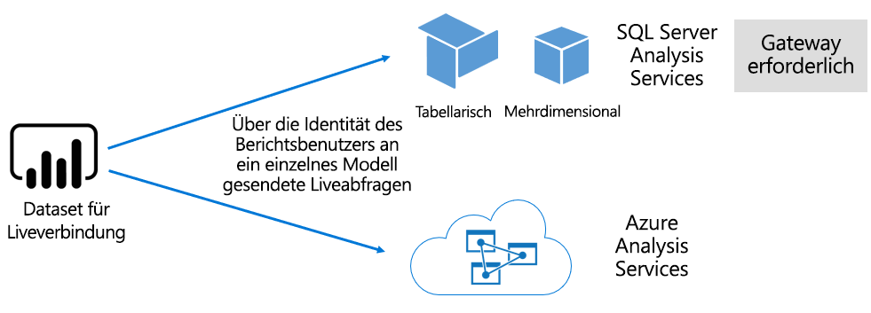

# Datasets im Power BI-Dienst

In diesem Artikel finden Sie eine technische Erläuterung zu Power BI-Datasets.

## Typen von Datasets

Power BI-Datasets stellen eine Datenquelle dar, die für Berichterstellung und Visualisierung einsatzbereit ist. Es gibt fünf verschiedene Datasettypen, die auf folgende Weisen erstellt werden:

- Herstellen einer Verbindung mit einem vorhandenen Datenmodell, das nicht in einer Power BI-Kapazität gehostet wird
- Hochladen einer Power BI Desktop-Datei, die ein Modell enthält
- Hochladen einer Excel-Arbeitsmappe (die mindestens eine Excel-Tabelle und bzw. oder ein Arbeitsmappendatenmodell enthält) oder einer CSV-Datei (durch Trennzeichen getrennte Werte)
- Verwendung des Power BI-Diensts zum Erstellen eines [Pushdatasets](developer/walkthrough-push-data.md)
- Verwendung des Power BI-Diensts zum Erstellen eines [Streaming- oder hybriden Streamingdatasets](service-real-time-streaming.md)

Mit Ausnahme von Streamingdatasets stellen Datasets ein Datenmodell dar, das die ausgereiften Modellierungstechnologien von [Analysis Services](/analysis-services/analysis-services-overview) nutzt.

> [!NOTE]
> In dieser Dokumentation werden die Begriffe _Datasets_ und _Modelle_ manchmal synonym verwendet. Aus der Perspektive des Power BI-Diensts wird es allgemein als **Dataset** bezeichnet und aus der Perspektive der Entwicklung als **Modell**. Im Kontext dieser Dokumentation ist dasselbe gemeint.

### Extern gehostete Modelle

Es gibt zwei Typen extern gehosteter Modelle: SQL Server Analysis Services und [Azure Analysis Services](/azure/analysis-services/analysis-services-overview).

Das Herstellen einer Verbindung mit einem SQL Server Analysis Services-Modell umfasst unabhängig davon die Installation des [lokalen Datengateways](service-gateway-onprem.md), ob es sich um eine lokal oder auf einer VM gehosteten IaaS (Infrastructure-as-a-Service) handelt. Azure Analysis Services erfordert kein Gateway.

Das Herstellen einer Verbindung mit Analysis Services ist meist sinnvoll, wenn bereits in vorhandene Modelle investiert wurde, die in der Regel als Teil eines Data Warehouses eines Unternehmens fungieren. Power BI kann eine _Liveverbindung_ zu Analysis Services herstellen, wobei Berechtigungen durch Verwendung der Identität des Power BI-Berichtsbenutzers erzwungen werden. Für SQL Server Analysis Services werden sowohl mehrdimensionale Modelle (Cubes) als auch tabellarische Modelle unterstützt. Wie im folgenden Bild veranschaulicht übermittelt ein Dataset mit Liveverbindung Abfragen an extern gehostete Modelle.

### In Power BI Desktop entwickelte Modelle

Power BI Desktop, eine Clientanwendung, die für die Power BI-Entwicklung vorgesehen ist, kann zum Entwickeln eines Modells verwendet werden. Das Modell fungiert effektiv als tabellarisches Analysis Services-Modell. Modelle können durch Importieren von Daten aus Dataflows entwickelt werden, welche dann mit externen Datenquellen integriert werden können. Spezifische Informationen zur Modellierung werden in diesem Artikel zwar nicht behandelt, jedoch ist es wichtig, dass Sie verstehen, dass es drei verschiedene Typen bzw. _Modi_ von Modellen gibt, die mit Power BI Desktop entwickelt werden können. Diese Modi bestimmen, ob Daten in das Modell importiert werden oder in der Datenquelle verbleiben. Es gibt die folgenden drei Modi: „Import“, „DirectQuery“ und „Composite“. Weitere Informationen zu den einzelnen Modi finden Sie im Artikel [Datasetmodi im Power BI-Dienst](service-dataset-modes-understand.md).

Extern gehostete Modelle und Power BI Desktop-Modelle können RLS (Sicherheit auf Zeilenebene) erzwingen, um die für einen bestimmten Benutzer abgerufenen Daten zu beschränken. Benutzer, die der Sicherheitsgruppe **Salespeople** zugewiesen sind, können beispielsweise nur Berichtsdaten für die Vertriebsregionen einsehen, denen sie zugewiesen sind. RLS-Rollen sind entweder _dynamisch_ oder _statisch_. Dynamische Rollen filtern nach dem Berichtsbenutzer, während statische Rollen dieselben Filter für alle Benutzer anwenden, die der jeweiligen Rolle zugewiesen sind. Weitere Informationen finden Sie unter [Sicherheit auf Zeilenebene mit Power BI](service-admin-rls.md).

### Excel-Arbeitsmappenmodelle

Das Erstellen von Datasets anhand von [Excel-Arbeitsmappen](service-excel-workbook-files.md) oder [CSV-Dateien](service-comma-separated-value-files.md) resultiert in der automatischen Erstellung eines Modells. Excel-Tabellen und CSV-Daten werden zum Erstellen von Modelltabellen importiert, während ein Excel-Arbeitsmappendatenmodell transponiert wird, um ein Power BI-Modell zu erstellen. In allen Fällen werden Dateidaten in ein Modell importiert.

## Zusammenfassung

Anschließend können Unterschiede zwischen Power BI-Datasets festgestellt werden, die Modelle darstellen:

- Sie werden entweder im Power BI-Dienst oder extern von Analysis Services gehostet.
- Sie können importierte Daten speichern, Pass-Through-Abfragen an zugrunde liegende Datenquellen ausgeben oder eine Kombination aus beiden Methoden verwenden.

Im Folgenden werden wichtige Informationen über Power BI-Datasets zusammengefasst, die Modelle darstellen:

- Von SQL Server Analysis Services gehostete Modelle erfordern ein Gateway für die Durchführung von Liveverbindungsabfragen.
- In Power BI gehostete Modelle, die Daten importieren:
  - müssen vollständig in den Arbeitsspeicher geladen werden, damit sie abgefragt werden können.
  - erfordern Aktualisierungen, damit die Daten aktuell bleiben, und müssen Gateways nutzen, wenn der Zugriff auf die Quelldaten nicht direkt über das Internet möglich ist.
- In Power BI gehostete Modelle, die den Speichermodus [DirectQuery](desktop-directquery-about.md) verwenden, erfordern Konnektivität zur Datenquelle. Wenn das Modell abgefragt wird, gibt Power BI Abfragen an die Datenquelle aus, um aktuelle Daten abzurufen. In diesem Modus müssen Gateways verwendet werden, wenn der Zugriff auf die Quelldaten nicht direkt über das Internet möglich ist.
- Modelle können RLS-Regeln erzwingen, wobei auch Filter zum Beschränken des Datenzugriffs auf bestimmte Benutzer erzwungen werden.

## Überlegungen

Für die erfolgreiche Bereitstellung und Verwaltung von Power BI ist es wichtig, dass Sie wissen, wo Modelle gehostet werden, welcher Speichermodus verwendet wird, ob Abhängigkeiten von Gateways bestehen, wie groß die importierten Daten sind und welcher Aktualisierungstyp mit welcher Frequenz vorliegt. All diese Konfigurationen können bedeutende Auswirkungen auf Power BI-Kapazitätsressourcen haben. Darüber hinaus enthält der Modellentwurf selbst eigene Datenaufbereitungsabfragen, Beziehungen und Berechnungen, die ebenfalls beachtet werden sollten.

Es ist auch wichtig, dass Sie verstehen, dass die Aktualisierung von in Power BI gehosteten Modellen anhand eines Zeitplans oder bei Bedarf durch einen Benutzer des Power BI-Diensts ausgelöst werden kann.

## Nächste Schritte

- [Datasetmodi im Power BI-Dienst](service-dataset-modes-understand.md)
- Weitere Fragen? [Stellen Sie Ihre Frage in der Power BI-Community.](https://community.powerbi.com/)
