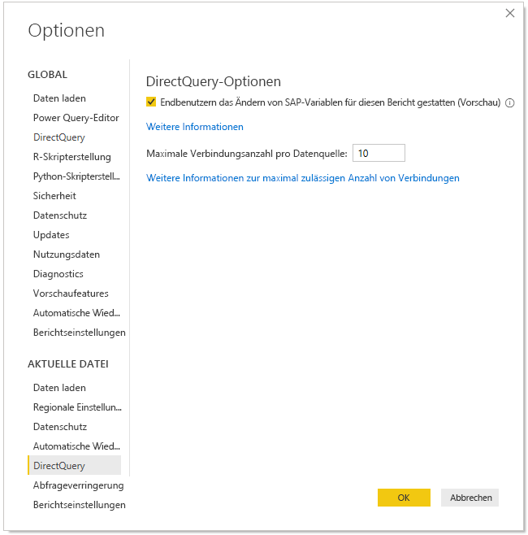
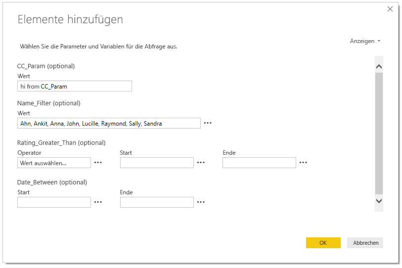
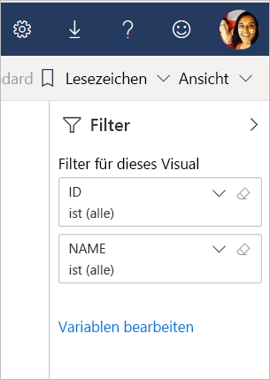

# Bearbeiten von SAP-Variablen im Power BI-Dienst (Vorschau)

Wenn sie SAP Business Warehouse oder SAP Hana mit DirectQuery verwenden, können die Autoren von Berichten jetzt zulassen, dass Endbenutzer SAP-Variablen im **Power BI Dienst** für Premium-Arbeitsbereiche bearbeiten können.

In diesem Dokument wird beschrieben, welche Anforderungen erfüllt sein müssen, damit Variablen in Power BI bearbeitet werden können. Außerdem erhalten Sie Informationen zum Aktivieren dieses Vorschaufeatures und zum Bearbeiten von Variablen im Power BI-Dienst.

## Anforderungen für das Feature „SAP edit variables“ (SAP-Variablen bearbeiten)

Damit Sie das Feature „SAP edit variables“ (SAP-Variablen bearbeiten) verwenden können, müssen Sie einige Anforderungen erfüllen, die im Folgenden aufgelistet sind.

**Neue Filteroberfläche erforderlich:** für den Bericht muss die [Neue Filteroberfläche](power-bi-report-filter.md) aktiviert sein. Gehen Sie wie folgt vor, um diese für Ihren Bericht in Power BI Desktop zu aktivieren:
- Klicken Sie in Power BI Desktop auf **Datei** > **Optionen und Einstellungen** > **Optionen**.
- Wählen Sie in der linken Navigationsleiste unter **Aktuelle Datei** die Option **Berichtseinstellungen** aus.
- Klicken Sie unter **Benutzeroberfläche zur Filterung** auf die Option **Enable the updated filter pane (Aktualisierten Filterbereich aktivieren)** .

**DirectQuery-Verbindungen erforderlich:** Sie müssen mithilfe von DirectQuery eine Verbindung mit der SAP-Datenquelle herstellen. Importverbindungen werden nicht unterstützt.

**Power BI Premium-Abonnement erforderlich:** das Feature „SAP Edit Variables“ (SAP-Variablen bearbeiten) funktioniert zurzeit nur mit Power BI Premium-Abonnements.

**SSO-Setup erforderlich:** Damit dieses Feature funktioniert, muss einmaliges Anmelden (Single Sign-On, SSO) konfiguriert sein. Weitere Informationen finden Sie unter [Übersicht: Single Sign-On (SSO)](service-gateway-sso-overview.md).

**Neue Gatewaybits erforderlich:** Laden Sie das neuste Gateway herunter, und aktualisieren Sie das vorhandene Gateway. Weitere Informationen finden Sie unter [Dienstgateway](service-gateway-onprem.md).

**Mehrdimensional, nur für SAP Hana SAP:** die Funktion „SAP Edit Variables“ (SAP-Variablen bearbeiten) funktioniert nur bei mehrdimensionalen Modellen und nicht bei relationalen Quellen.

**In Sovereign Clouds nicht unterstützt:** Derzeit ist Power Query Online in Sovereign Clouds nicht verfügbar. Daher wird dieses Feature in Sovereign Clouds nicht unterstützt.

## Aktivieren des Features

Wenn Sie das Feature **SAP edit variables** (SAP-Variablen bearbeiten) aktivieren möchten, sollten Sie in Power BI Desktop eine Verbindung mit der SAP HANA- oder der SAP BW-Datenquelle herstellen. Navigieren Sie anschließend zu **Datei > Optionen und Einstellungen > Optionen**, und klicken Sie dann im Bereich „Aktuelle Datei“ auf der linken Seite auf **DirectQuery**. Wenn Sie diese Option auswählen, werden wie in der folgenden Abbildung auf der rechten Seite DirectQuery-Optionen und ein Kontrollkästchen für die Option **Allow end users to change SAP variables in the report (preview)** (Zulassen, dass Endbenutzer SAP-Variablen im Bericht ändern können (Vorschau)) angezeigt.

## Verwenden des Features „SAP edit variables“ (SAP-Variablen bearbeiten) in Power BI Desktop

Wenn Sie in Power BI Desktop das Feature „SAP edit variables“ (SAP-Variablen bearbeiten) verwenden, können Sie die Variablen bearbeiten, indem Sie im Menüband **Abfragen bearbeiten** auf den Link „Variablen bearbeiten“ klicken. Daraufhin wird das folgende Dialogfeld angezeigt. Dieses Feature ist in Power BI Desktop schon seit einer Weile verfügbar. Über das folgende Dialogfeld können die Berichtersteller Variablen für den Bericht auswählen.

## Verwenden des Features „SAP edit variables“ (SAP-Variablen bearbeiten) im Dienst

Sobald der Bericht im Power BI-Dienst veröffentlicht wurde, wird den Benutzern der Link **Variablen bearbeiten** im Bereich „Neuer Filter“ angezeigt. Wenn Sie den Bericht zum ersten Mal veröffentlichen, kann es bis zu fünf Minuten dauern, bis der Link „Variable bearbeiten“ angezeigt wird. Wenn der Link danach noch immer nicht angezeigt wird, müssen Sie das Dataset manuell aktualisieren.
Gehen Sie dafür wie folgt vor:

1. Klicken Sie in der Inhaltsliste eines Arbeitsbereichs im Power BI-Dienst auf die Registerkarte **Datasets**.

2. Suchen Sie das Dataset, das Sie aktualisieren müssen, und klicken Sie auf das Symbol zum **Aktualisieren**.

    

3. Wenn Sie auf den Link „Variablen bearbeiten“ klicken, wird das Dialogfeld **Variablen bearbeiten** geöffnet, in dem Benutzer Variablen überschreiben können. Wenn Sie auf die Schaltfläche **Zurücksetzen** klicken, werden die Variablen auf die ursprünglichen Werte zurückgesetzt, die beim Öffnen dieses Dialogfelds angezeigt wurden.

    

4. Alle Änderungen, die ein Benutzer im Dialogfeld **Variablen bearbeiten** vornimmt, werden nur für diesen Benutzer gespeichert (ähnlich wie bei anderen persistenten Verhaltensweisen in Power BI). Wenn Sie die in der folgenden Abbildung dargestellten Option **Auf Standardwert zurücksetzen** auswählen, wird der Bericht einschließlich der Variablen auf seinen ursprünglichen Zustand (nach der Erstellung) zurückgesetzt.

    

Der Besitzer eines Berichts kann diese Standardeinstellungen ändern, wenn er an einem veröffentlichten Bericht im Power BI-Dienst arbeitet, der SAP HANA oder SAP BW verwendet, und das Feature **Variablen bearbeiten** aktiviert ist. Der Besitzer kann die Variablen im Bearbeitungsmodus ändern und den Bericht speichern, damit diese Einstellungen als die *neuen Standardeinstellungen* für diesen Bericht verwendet werden. Allen anderen Benutzer, die auf den Bericht zugreifen, nachdem der Besitzer des Berichts Änderungen vorgenommen hat, werden diese neuen Einstellungen als Standardeinstellungen angezeigt.

## Probleme und Überlegungen

Derzeit wird das Feature „SAP edit variables“ (SAP-Variablen bearbeiten) in Apps nicht unterstützt.

## Nächste Schritte

Weitere Informationen zu SAP HANA, SAP BW oder DirectQuery finden Sie in den folgenden Artikeln:

- [Verwenden von SAP HANA in Power BI Desktop](desktop-sap-hana.md)
- [DirectQuery und SAP Business Warehouse (BW)](desktop-directquery-sap-bw.md)
- [DirectQuery und SAP HANA](desktop-directquery-sap-hana.md)
- [Verwendung von DirectQuery in Power BI](desktop-directquery-about.md)