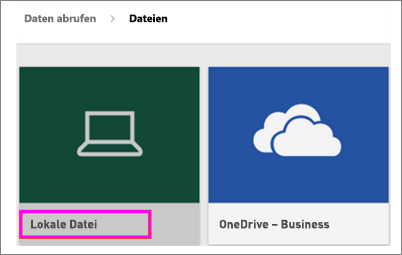
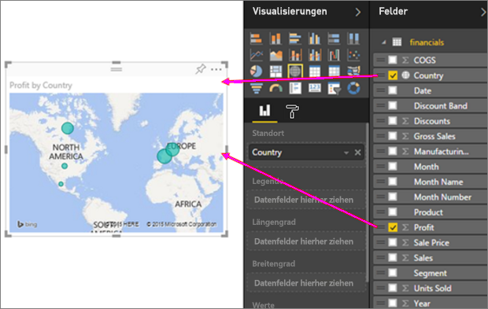
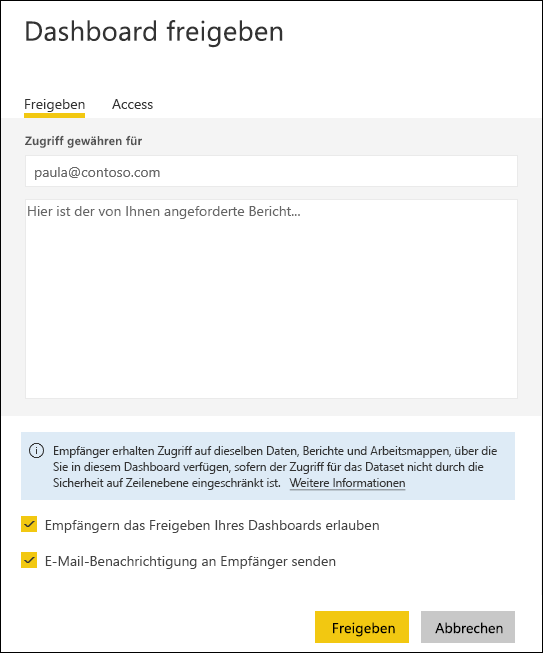

# Erstellen von ansprechenden Berichten aus Excel-Arbeitsmappen im Power BI-Dienst
Ihr Vorgesetzter möchte bis zum Ende des Arbeitstages von Ihnen einen Bericht über die aktuellen Verkaufszahlen in Verbindung mit den Eindrücken der letzten Kampagne angefertigt bekommen. Die neuesten Daten befinden sich jedoch auf verschiedenen Systemen von Drittanbietern und in Dateien auf Ihrem Laptop. In der Vergangenheit hat es Stunden gedauert, Visuals zu erstellen und einen Bericht zu formatieren, weshalb Sie nervös werden.

Kein Problem. Mit Power BI können Sie in kürzester Zeit einen beeindruckenden Bericht erstellen.

In diesem Beispiel laden Sie eine Excel-Datei von einem lokalen System hoch, erstellen einen neuen Bericht und geben diesen für Kollegen frei. Alle diese Schritte führen Sie in Power BI aus.

## Bereiten Sie die Daten vor.
Nehmen wir eine einfache Excel-Datei als Beispiel. 

1. Bevor Sie Ihre Excel-Datei in Power BI laden können, müssen Sie Ihre Daten in einer flachen Tabelle anordnen. In dieser enthält jede Spalte den gleichen Datentyp, z. B. für einen Text, ein Datum, eine Zahl oder eine Währung. Die Tabelle sollte eine Kopfzeile, jedoch keine Spalten oder Zeilen enthalten, in denen Summen angezeigt werden.

   

2. Formatieren Sie dann die Daten als Tabelle. Klicken Sie in Excel auf der Registerkarte **Start** in der Gruppe **Formatvorlagen** auf **Als Tabelle formatieren**. 

3. Wählen Sie ein Tabellenformat, das auf das Arbeitsblatt angewendet wird. 

   Das Excel-Arbeitsblatt kann jetzt in Power BI geladen werden.

   

## Hochladen der Excel-Datei in den Power BI-Dienst
Der Power BI-Dienst stellt Verbindungen mit vielen Datenquellen her, einschließlich Excel-Dateien auf Ihrem Computer. 

 > [!NOTE] 
 > Verwenden Sie die [Arbeitsmappe mit den Finanzbeispieldaten](sample-financial-download.md), um die verbleibenden Schritte in diesem Tutorial auszuführen.

1. Melden Sie sich zuerst beim Power BI-Dienst an. Wenn Sie sich noch nicht registriert haben, [können Sie dies kostenlos tun](https://powerbi.com).

2. Erstellen Sie ein neues Dashboard. Öffnen Sie **Mein Arbeitsbereich**, und klicken Sie auf **+ Erstellen**.

   

3. Klicken Sie auf **Dashboard**, geben Sie einen Namen ein, und klicken Sie auf **Erstellen**. 

   Das neue Dashboard wird angezeigt. Es enthält noch keine Daten.

   

4. Klicken Sie unten im linken Navigationsbereich auf **Daten abrufen**. 

5. Klicken Sie auf der Seite **Daten abrufen** im Feld **Dateien** unter **Neuen Inhalt erstellen** auf **Abrufen**.

   

6. Klicken Sie auf der Seite **Dateien** auf **Lokale Datei**. Navigieren Sie zur Excel-Arbeitsmappendatei auf Ihrem Computer, und klicken Sie auf **Öffnen**, um sie in den Power BI-Dienst zu laden. 

   

7. Klicken Sie auf der Seite **Lokale Datei** auf **Importieren**.

## Erstellen Sie den Bericht.
Nachdem die Excel-Datei vom Power BI-Dienst importiert wurde, können Sie mit der Erstellung des Berichts beginnen. 

1. Wenn die Meldung **Ihr Dataset steht bereit** angezeigt wird, wählen Sie **Dataset anzeigen** aus.  

   Power BI wird in der Bearbeitungsansicht geöffnet und zeigt den Berichtszeichenbereich an. Auf der rechten Seite werden die Bereiche **Visualisierungen**, **Filter** und **Felder** angezeigt. Beachten Sie, dass die Tabellendaten der Excel-Arbeitsmappe im Bereich **Felder** angezeigt werden. Unter dem Namen der Tabelle listet Power BI die Spaltenüberschriften als einzelne Felder auf.

   

2. Nun können Sie Visualisierungen erstellen. Angenommen, Ihr Vorgesetzter möchte sich die Gewinne in einem bestimmten Zeitraum ansehen. Ziehen Sie im Bereich **Felder** das Element **Gewinn** auf den Zeichenbereich des Berichts. 

   In Power BI wird standardmäßig ein Balkendiagramm angezeigt. 

3. Ziehen Sie jetzt **Datum** auf den Zeichenbereich des Berichts. 

   Power BI aktualisiert das Balkendiagramm, um Gewinne nach Datum anzuzeigen.

   

   > [!TIP]
   > Wenn das Diagramm nicht wie erwartet aussieht, überprüfen Sie die Aggregationen. Klicken Sie beispielsweise im Bereich **Wert** mit der rechten Maustaste auf das Feld, das Sie gerade hinzugefügt haben, und stellen Sie sicher, dass die Daten auf die von Ihnen gewünschte Weise aggregiert werden. In diesem Beispiel verwenden wir **Summe**.
   > 

Ihre Vorgesetzte möchte wissen, welche Länder die meisten Gewinne erzeugen. Beeindrucken Sie sie mit einer Kartenvisualisierung. 

1. Klicken Sie auf eine leere Fläche im Zeichenbereich Ihres Berichts. 

2. Ziehen Sie aus dem Bereich **Felder** die Elemente **Land** und **Gewinn** auf den Zeichenbereich Ihres Berichts.

   Power BI erstellt eine Kartenvisualisierung mit Blasendiagramm, die den relativen Gewinn jedes Standorts darstellt.

   

Wie sieht es mit der Anzeige einer Visualisierung der Verkäufe nach Produkt- und Marktsegment aus? Kein Problem. 

1. Wählen Sie im Bereich **Felder** die Elemente **Verkäufe**, **Produkt** und **Segment** aus. 
   
   Power BI erstellt sofort ein Balkendiagramm. 

2. Klicken Sie auf eines der Symbole im Menü **Visualisierungen**, um den Typ des Diagramms zu ändern. Ändern Sie ihn z. B. in **Gestapeltes Säulendiagramm**. 

3. Klicken Sie zum Sortieren des Diagramms auf die Auslassungspunkte (...) und dann auf **Sortieren nach**.

   

Heften Sie alle Visuals Ihrem Dashboard an. Dieses können Sie jetzt für Ihre Kollegen freigeben.

   

## Geben Sie das Dashboard frei.
Angenommen, Sie möchten Ihr Dashboard für Ihren Vorgesetzten freigeben. Sie können Ihr Dashboard und den zugrunde liegenden Bericht für alle Kollegen freigeben, die über ein Power BI-Konto verfügen. Diese können mit Ihrem Bericht interagieren, jedoch keine Änderungen speichern.

1. Zum Freigeben des Berichts wählen Sie am oberen Rand des Dashboards die Option **Freigeben**aus.

   

   In Power BI wird die Seite **Dashboard freigeben** angezeigt. 

2. Geben Sie im Feld **E-Mail-Adresse eingeben** die E-Mail-Adressen der Empfänger ein, und fügen Sie eine Nachricht in das Feld darunter ein. 

3. Um den Empfängern die Freigabe Ihres Dashboards für Dritte zu ermöglichen, wählen Sie **Empfängern das Freigeben Ihres Dashboards erlauben**aus. Wählen Sie **Freigeben**aus.

   

## Nächste Schritte

* [Erste Schritte mit Power BI](service-get-started.md)
* [Erste Schritte mit Power BI Desktop](desktop-getting-started.md)
* [Grundlegende Konzepte für Designer im Power BI-Dienst](service-basic-concepts.md)

Weitere Fragen? [Wenden Sie sich an die Power BI-Community](http://community.powerbi.com/).

