# Verwalten von Datenquellen

[!INCLUDE [gateway-rewrite](includes/gateway-rewrite.md)]

Power BI unterstützt viele lokale Datenquellen, von denen jede eigene Anforderungen aufweist. Ein Gateway kann für eine oder mehrere Datenquellen verwendet werden. In diesem Beispiel zeigen wir Ihnen, wie Sie SQL Server als Datenquelle hinzufügen, die Schritte sind für andere Datenquellen aber die gleichen.

>[!NOTE]
>Die meisten Verwaltungsvorgänge für Datenquellen können auch mit APIs ausgeführt werden. Weitere Informationen finden Sie unter [REST-APIs (Gateways)](/rest/api/power-bi/gateways).

## Hinzufügen einer Datenquelle

>[!NOTE]
>Gruppen ohne E-Mail-Adresse können nicht hinzugefügt werden.

1. Klicken Sie in der oberen rechten Ecke des Power BI-Diensts auf das Zahnradsymbol  >  und dann auf **Gateways verwalten**.

    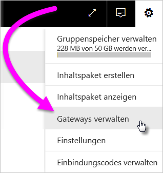

2. Wählen Sie ein Gateway aus und klicken auf **Datenquelle hinzufügen**, oder wechseln Sie zu „Gateways“ und klicken Sie auf **Datenquelle hinzufügen**.

    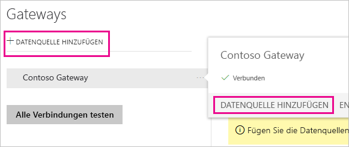

3. Wählen Sie den **Datenquellentyp** aus.

    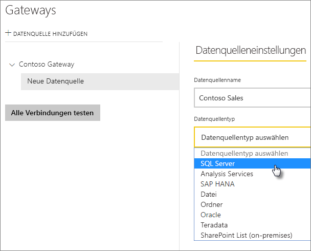

4. Geben Sie Informationen zur Datenquelle ein. In diesem Beispiel: **Server**, **Datenbank** und weitere Informationen.  

    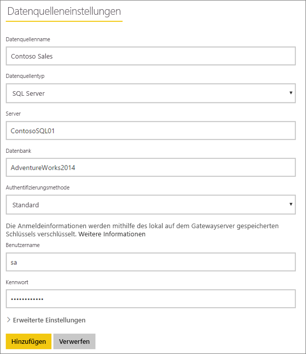

5. Für SQL Server wählen Sie die **Authentifizierungsmethode** **Windows** oder **Standard** (SQL-Authentifizierung) aus. Wenn Sie **Standard** auswählen, geben Sie die Anmeldeinformationen für Ihre Datenquelle ein.

6. Konfigurieren Sie optional unter **Erweiterte Einstellungen** die [Datenschutzebene](https://support.office.com/article/Privacy-levels-Power-Query-CC3EDE4D-359E-4B28-BC72-9BEE7900B540) für Ihre Datenquelle (gilt nicht für [DirectQuery](desktop-directquery-about.md)).

    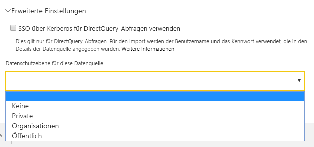

7. Wählen Sie **Hinzufügen**. Bei erfolgreicher Ausführung wird *Die Verbindung wurde hergestellt.* angezeigt.

    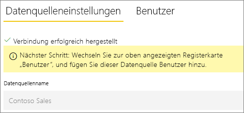

Sie können diese Datenquelle jetzt verwenden, um Daten aus SQL Server in Ihre Power BI-Dashboards und -Berichte einzubinden.

## Entfernen einer Datenquelle

Sie können eine Datenquelle entfernen, wenn Sie sie nicht mehr verwenden. Vorsicht: Durch Entfernen einer Datenquelle geht die Funktionsfähigkeit aller Dashboards und Berichte verloren, die auf der betreffenden Datenquelle beruhen.

Um eine Datenquelle zu entfernen, wechseln Sie zu der Datenquelle, und klicken Sie auf **Entfernen**.

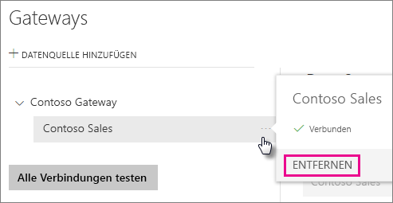

## Verwenden der Datenquelle für geplanten Aktualisierungen oder DirectQuery

Nachdem Sie die Datenquelle erstellt haben, kann diese mit DirectQuery-Verbindungen oder durch eine geplante Aktualisierung verwendet werden.

> [!NOTE]
>Der Name des Servers und der Datenbank müssen in Power BI Desktop und in der Datenquelle auf dem lokalen Datengateway übereinstimmen.

Der Link zwischen Ihrem Dataset und der Datenquelle im Gateway basiert auf dem Namen Ihres Servers und Ihrer Datenbank. Diese Namen müssen übereinstimmen. Wenn Sie z. B. eine IP-Adresse für den Servernamen angeben, müssen Sie in Power BI Desktop die IP-Adresse für die Datenquelle in der Gatewaykonfiguration verwenden. Wenn Sie *SERVER\INSTANZ* verwenden, müssen Sie in Power BI Desktop dieselbe Instanz verwenden, die auch in der für das Gateway konfigurierten Datenquelle verwendet wird.

Wenn Sie auf der Registerkarte **Benutzer** der im Gateway konfigurierten Datenquelle aufgeführt sind und die Namen des Servers und der Datenbank übereinstimmen, wird das Gateway als Option für geplante Aktualisierungen angezeigt.

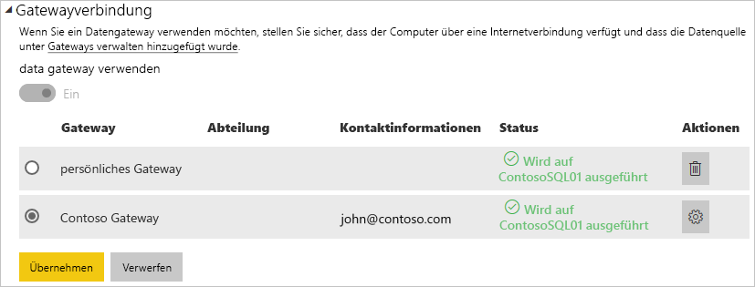

> [!WARNING]
> Wenn Ihr Dataset mehrere Datenquellen enthält, muss jede dieser Datenquellen dem Gateway hinzugefügt werden. Wenn eine oder mehrere Datenquellen dem Gateway nicht hinzugefügt werden, wird das Gateway nicht als für die geplante Aktualisierung verfügbar angezeigt.

### Einschränkungen

Das OAuth-Authentifizierungsschema wird nur für benutzerdefinierte Connectors in lokalen Datengateways unterstützt. Sie können keine anderen Datenquellen hinzufügen, für die OAuth erforderlich ist. Wenn Ihr Dataset über eine Datenquelle verfügt, die OAuth erfordert und kein benutzerdefinierter Connector ist, kann das Gateway nicht für die geplante Aktualisierung verwendet werden.

## Benutzer verwalten

Nachdem Sie eine Datenquelle zu einem Gateway hinzugefügt haben, gewähren Sie Benutzern und E-Mail-fähigen Sicherheitsgruppen Zugriff auf die spezifische Datenquelle (nicht auf das gesamte Gateway). Die Datenquellen-Benutzerliste steuert nur, wer Berichte veröffentlichen darf, die Daten aus der Datenquelle enthalten. Besitzer eines Berichts können Dashboards, Inhaltspakete und Apps erstellen und diese dann für andere Benutzer freigeben.

Sie können Benutzern und Sicherheitsgruppen auch Verwaltungszugriff auf das Gateway gewähren.

### Hinzufügen von Benutzern zu einer Datenquelle

1. Klicken Sie in der oberen rechten Ecke des Power BI-Diensts auf das Zahnradsymbol  >  und dann auf **Gateways verwalten**.

2. Wählen Sie die Datenquelle aus, der Sie Benutzer hinzufügen möchten.

3. Wählen Sie **Benutzer** aus, und geben Sie einen Benutzer aus Ihrer Organisation ein, dem Sie Zugriff auf die ausgewählte Datenquelle gewähren möchten. Auf dem folgenden Bildschirm fügen Sie z. B. Maggie und Adam hinzu.

    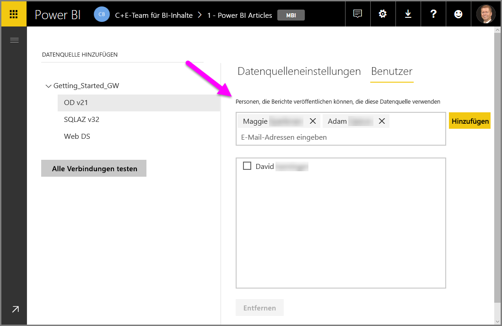

4. Klicken Sie auf **Hinzufügen**, und das hinzugefügte Mitglied wird im Feld angezeigt.

    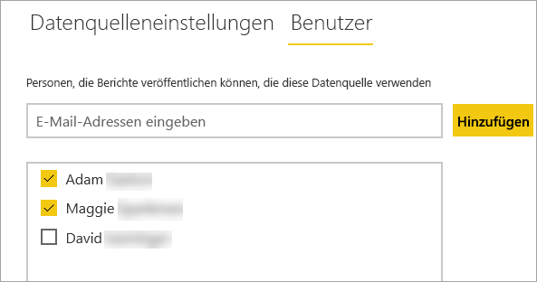

Das war schon alles. Denken Sie daran, dass Sie jeder Datenquelle, für die Sie den Zugriff gewähren möchten, Benutzer hinzufügen müssen. Jede Datenquelle verfügt über eine eigene Liste von Benutzern, und Sie müssen jeder Datenquelle separat Benutzer hinzufügen.

### Entfernen von Benutzern aus einer Datenquelle

Auf der Registerkarte **Benutzer** für die Datenquelle können Sie Benutzer und Sicherheitsgruppen entfernen, die diese Datenquelle verwenden.

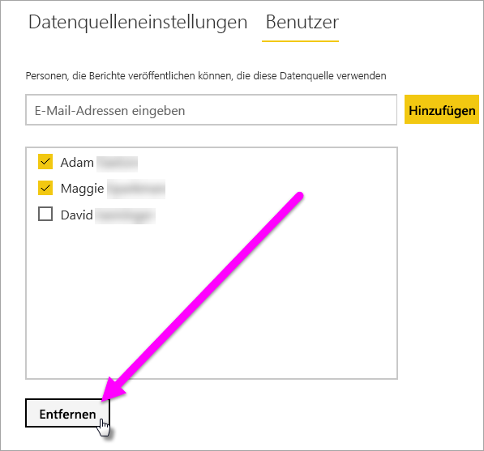

## Speichern von verschlüsselten Anmeldeinformationen in der Cloud

Beim Hinzufügen einer Datenquelle für das Gateway müssen Sie für diese Datenquelle Anmeldeinformationen angeben. Alle Abfragen der Datenquelle werden mithilfe dieser Anmeldeinformationen durchgeführt. Die Anmeldeinformationen werden mithilfe einer asymmetrischen Verschlüsselung vor der Speicherung in der Cloud sicher verschlüsselt, sodass sie in der Cloud nicht entschlüsselt werden können. Die Anmeldeinformationen werden an den lokalen Computer gesendet, der das Gateway ausführt, und auf diesem beim Zugriff auf die Daten entschlüsselt.

## Liste der verfügbaren Datenquellentypen

Das lokale Datengateway unterstützt die folgenden Datenquellen für Power BI. Zusätzlich zu lokalen Datenquellen ist für Quellen mit einer Firewall, einem VPN oder einem virtuellen Netzwerk möglicherweise auch ein Datengateway erforderlich.

| **Datenquelle** | **Live/DirectQuery** | **Benutzerdefinierte manuelle oder geplante Aktualisierung** |
| --- | --- | --- |
| ActiveDirectory |Nein |Ja |
| Amazon Redshift |Ja |Ja |
| Analysis Services |Ja |Ja |
| AtScale-Cubes |Ja |Ja |
| Azure Blob Storage |Nein |Ja |
| Azure DevOps Server |Nein |Ja |
| Azure Table Storage |Nein |Ja |
| BI-Connector |Ja |Ja |
| Denodo |Ja |Ja |
| Dremio |Ja |Ja |
| EmigoDataSourceConnector |Nein |Ja |
| Essbase |Ja |Ja |
| Exasol |Ja |Ja |
| Datei |Nein |Ja |
| Ordner |Nein |Ja |
| Paxata |Nein |Ja |
| IBM DB2 |Ja |Ja |
| IBM Informix-Datenbank |Nein |Ja |
| IBM Netezza |Ja |Ja |
| Impala |Ja |Ja |
| Jethro ODBC |Ja |Ja |
| Kyligence Enterprise |Ja |Ja |
| MarkLogic ODBC |Ja |Ja |
| Microsoft Graph-Sicherheit |Nein |Ja |
| MySQL |Nein |Ja |
| ODBC |Nein |Ja |
| OData |Nein |Ja |
| OLE DB |Nein |Ja |
| Oracle |Ja |Ja |
| PostgreSQL |Nein |Ja |
| QubolePresto |Ja |Ja |
| Quick Base-Connector |Nein |Ja |
| SAP Business Warehouse-Nachrichtenserver |Ja |Ja |
| SAP Business Warehouse-Server |Ja |Ja |
| SAP HANA |Ja |Ja |
| SQL Server |Ja |Ja |
| SharePoint |Nein |Ja |
| Snowflake |Ja |Ja |
| Spark |Ja |Ja |
| SurveyMonkey |Nein |Ja |
| Sybase |Nein |Ja |
| TeamDesk.Database |Nein |Ja |
| Teradata |Ja |Ja |
| Vertica |Ja |Ja |
| Web |Nein |Ja |
| Workforce Dimensions |Nein |Ja |

## Nächste Schritte

* [Verwalten Ihrer Datenquelle – Analysis Services](service-gateway-enterprise-manage-ssas.md)
* [Verwalten Ihrer Datenquelle –SAP HANA](service-gateway-enterprise-manage-sap.md)
* [Verwalten Ihrer Datenquelle – SQL Server](service-gateway-enterprise-manage-sql.md)
* [Verwalten der Datenquelle – Oracle](service-gateway-onprem-manage-oracle.md)
* [Verwalten der Datenquelle – Import/Geplante Aktualisierung](service-gateway-enterprise-manage-scheduled-refresh.md)
* [Leitfaden zum Bereitstellen eines Datengateways](service-gateway-deployment-guidance.md)

Weitere Fragen? [Wenden Sie sich an die Power BI-Community](http://community.powerbi.com/)
