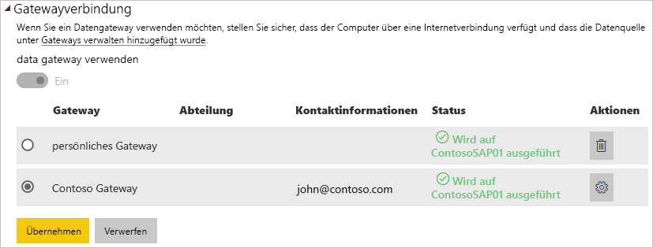

# Verwalten Ihrer Datenquelle –SAP HANA

[!INCLUDE [gateway-rewrite](includes/gateway-rewrite.md)]

Nachdem Sie das [lokale Datengateway installiert haben](/data-integration/gateway/service-gateway-install), müssen Sie [Datenquellen hinzufügen](service-gateway-data-sources.md#add-a-data-source), die mit dem Gateway verwendet werden können. In diesem Artikel wird beschrieben, wie Sie für die geplante Aktualisierung oder für DirectQuery mit Gateways und SAP HANA-Datenquellen arbeiten.

## Hinzufügen einer Datenquelle

Weitere Informationen zum Hinzufügen einer Datenquelle finden Sie unter [Hinzufügen einer Datenquelle](service-gateway-data-sources.md#add-a-data-source). Wählen Sie unter **Datenquellentyp** die Option **SAP HANA** aus.

Sobald Sie den Datenquellentyp „SAP HANA“ ausgewählt haben, vervollständigen Sie die Angaben zur Datenquelle für **Server**, **Benutzername** und **Kennwort**.

> [!NOTE]
> Alle Abfragen der Datenquelle werden mithilfe dieser Anmeldeinformationen durchgeführt. Weitere Informationen zum Speichern von Anmeldeinformationen finden Sie unter [Speichern verschlüsselter Anmeldeinformationen in der Cloud](service-gateway-data-sources.md#store-encrypted-credentials-in-the-cloud).

Nachdem Sie alles ausgefüllt haben, klicken Sie auf **Hinzufügen**. Sie können diese Datenquelle nun für eine geplante Aktualisierung oder DirectQuery mit einem lokalen SAP HANA-Server verwenden. Bei erfolgreicher Ausführung wird *Verbindung erfolgreich* angezeigt.

### Erweiterte Einstellungen

Optional können Sie die Datenschutzebene für die Datenquelle konfigurieren. Diese Einstellung steuert, wie Daten kombiniert werden können. Sie wird nur für die geplante Aktualisierung verwendet. Die Einstellung für die Datenschutzebene gilt nicht für DirectQuery. Weitere Informationen zu Datenschutzebenen für Ihre Datenquelle finden Sie unter [Datenschutzebenen (Power Query)](https://support.office.com/article/Privacy-levels-Power-Query-CC3EDE4D-359E-4B28-BC72-9BEE7900B540).

## Verwenden der Datenquelle

Nachdem Sie die Datenquelle erstellt haben, kann diese mit DirectQuery-Verbindungen oder durch eine geplante Aktualisierung verwendet werden.

> [!NOTE]
> Server- und Datenbanknamen müssen in Power BI Desktop und der Datenquelle innerhalb des lokalen Datengateways übereinstimmen.

Der Link zwischen Ihrem Dataset und der Datenquelle innerhalb des Gateways basiert auf dem Namen Ihres Servers und Ihrer Datenbank. Diese Namen müssen übereinstimmen. Wenn Sie z.B. eine IP-Adresse für den Servernamen in Power BI Desktop angeben, müssen Sie die IP-Adresse für die Datenquelle innerhalb der Gatewaykonfiguration verwenden. Wenn Sie *SERVER\INSTANCE* in Power BI Desktop verwenden, müssen Sie dies ebenfalls in der für das Gateway konfigurierten Datenquelle verwenden.

Diese Voraussetzung gilt für DirectQuery ebenso wie für geplante Aktualisierungen.

### Verwenden der Datenquelle mit DirectQuery-Verbindungen

Achten Sie darauf, dass die Namen des Servers und der Datenbank in Power BI Desktop mit der für das Gateway konfigurierten Datenquelle übereinstimmen. Stellen Sie außerdem sicher, dass der Benutzer auf der Registerkarte **Benutzer** der Datenquelle aufgeführt ist, um DirectQuery-Datasets veröffentlichen zu können. Die Auswahl für DirectQuery in Power BI Desktop erfolgt beim erstmaligen Importieren der Daten. Weitere Informationen zur Verwendung von DirectQuery finden Sie unter [Verwenden von DirectQuery in Power BI Desktop](desktop-use-directquery.md).

Nach der Veröffentlichung, entweder aus Power BI Desktop oder mithilfe von **Daten abrufen**, sollten Ihre Berichte funktionieren. Es kann nach dem Erstellen der Datenquelle im Gateway mehrere Minuten dauern, bis die Verbindung genutzt werden kann.

### Verwenden der Datenquelle mit geplanten Aktualisierungen

Wenn Sie auf der Registerkarte **Benutzer** der im Gateway konfigurierten Datenquelle aufgeführt sind und die Namen des Servers und der Datenbank übereinstimmen, wird das Gateway als Option für geplante Aktualisierungen angezeigt.

## Nächste Schritte

* [Problembehandlung beim lokalen Datengateway](/data-integration/gateway/service-gateway-tshoot)
* [Lokales Datengateway – Power BI](service-gateway-onprem-tshoot.md) 

Weitere Fragen? Stellen Sie Ihre Frage in der [Power BI-Community](https://community.powerbi.com/).

