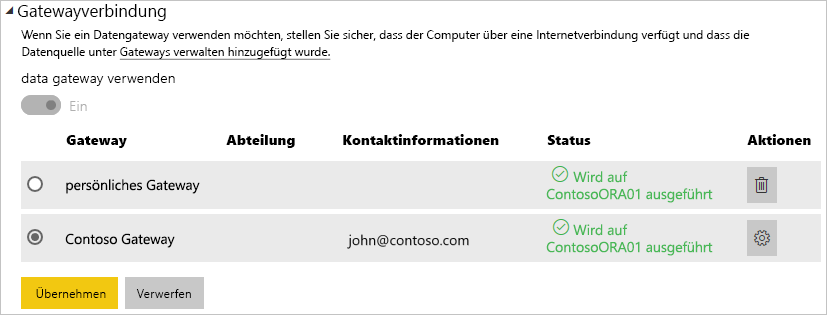

# Verwalten der Datenquelle: Import/Geplante Aktualisierung

[!INCLUDE [gateway-rewrite](includes/gateway-rewrite.md)]

Nachdem Sie das [lokale Datengateway installiert haben](/data-integration/gateway/service-gateway-install), müssen Sie [Datenquellen hinzufügen](service-gateway-data-sources.md#add-a-data-source), die mit dem Gateway verwendet werden können. In diesem Artikel wird untersucht, wie mit Gateways und Datenquellen gearbeitet wird, die für die geplante Aktualisierung im Gegensatz zu DirectQuery oder Live-Verbindungen verwendet werden.

## Hinzufügen einer Datenquelle

Weitere Informationen zum Hinzufügen einer Datenquelle finden Sie unter [Hinzufügen einer Datenquelle](service-gateway-data-sources.md#add-a-data-source). Wählen Sie einen Datenquellentyp aus.

Alle aufgeführten Datenquellentypen können für die geplante Aktualisierung mit dem lokalen Datengateway verwendet werden. Analysis Services, SQL Server und SAP HANA können für die geplante Aktualisierung oder DirectQuery-/Live-Verbindungen verwendet werden.

Vervollständigen dann die Angaben zur Datenquelle, zu denen die Quell- und Anmeldeinformationen gehören, die für den Zugriff auf die Datenquelle verwendet werden.

> [!NOTE]
> Alle Abfragen der Datenquelle erfolgen mithilfe dieser Anmeldeinformationen. Weitere Informationen zum Speichern von Anmeldeinformationen finden Sie unter [Speichern verschlüsselter Anmeldeinformationen in der Cloud](service-gateway-data-sources.md#store-encrypted-credentials-in-the-cloud).

Eine Liste der Datenquellentypen, die mit geplanten Aktualisierungen verwendet werden können, finden Sie unter [Liste der verfügbaren Datenquellentypen](service-gateway-data-sources.md#list-of-available-data-source-types).

Nachdem Sie alles ausgefüllt haben, klicken Sie auf **Hinzufügen**. Sie können jetzt diese Datenquelle für die geplante Aktualisierung mit Ihren lokalen Daten verwenden. Bei erfolgreicher Ausführung wird *Verbindung erfolgreich* angezeigt.

### Erweiterte Einstellungen

Optional können Sie die Datenschutzebene für die Datenquelle konfigurieren. Diese Einstellung steuert, wie Daten kombiniert werden können. Sie wird nur für die geplante Aktualisierung verwendet. Weitere Informationen zu Datenschutzebenen für Ihre Datenquelle finden Sie unter [Datenschutzebenen (Power Query)](https://support.office.com/article/Privacy-levels-Power-Query-CC3EDE4D-359E-4B28-BC72-9BEE7900B540).

## Verwenden der Datenquelle für geplante Aktualisierungen

Nachdem Sie die Datenquelle erstellt haben, kann diese mit DirectQuery-Verbindungen oder durch eine geplante Aktualisierung verwendet werden.

> [!NOTE]
> Server- und Datenbanknamen müssen in Power BI Desktop und der Datenquelle innerhalb des lokalen Datengateways übereinstimmen.

Der Link zwischen Ihrem Dataset und der Datenquelle innerhalb des Gateways basiert auf dem Namen Ihres Servers und Ihrer Datenbank. Diese Namen müssen übereinstimmen. Wenn Sie z.B. eine IP-Adresse für den Servernamen in Power BI Desktop angeben, müssen Sie die IP-Adresse für die Datenquelle innerhalb der Gatewaykonfiguration verwenden. Wenn Sie *SERVER\INSTANZ* in Power BI Desktop verwenden, müssen Sie dies ebenfalls in der für das Gateway konfigurierten Datenquelle verwenden.

Wenn Sie auf der Registerkarte **Benutzer** der im Gateway konfigurierten Datenquelle aufgeführt sind und die Namen des Servers und der Datenbank übereinstimmen, wird das Gateway als Option für geplante Aktualisierungen angezeigt.

> [!WARNING]
> Wenn Ihr Dataset mehrere Datenquellen enthält, muss jede dieser Datenquellen dem Gateway hinzugefügt werden. Wenn eine oder mehrere Datenquellen dem Gateway nicht hinzugefügt werden, wird das Gateway nicht als für die geplante Aktualisierung verfügbar angezeigt.

## Einschränkungen

Für das lokale Datengateway wird das Authentifizierungsschema OAuth nicht unterstützt. Datenquellen, die OAuth erfordern, können nicht hinzugefügt werden. Wenn Ihr Dataset über eine Datenquelle verfügt, die OAuth erfordert, kann das Gateway nicht für die geplante Aktualisierung verwendet werden.

## Nächste Schritte

* [Problembehandlung beim lokalen Datengateway](/data-integration/gateway/service-gateway-tshoot)
* [Lokales Datengateway – Power BI](service-gateway-onprem-tshoot.md)

Weitere Fragen? Wenden Sie sich an die [Power BI-Community](https://community.powerbi.com/).
