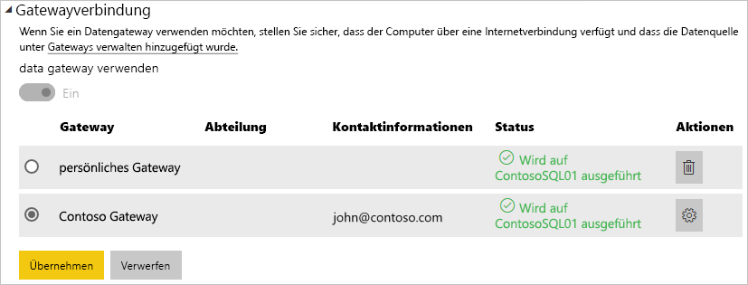

# Verwalten Ihrer Datenquelle – SQL Server

[!INCLUDE [gateway-rewrite](includes/gateway-rewrite.md)]

Nach der [Installation des lokalen Datengateways](/data-integration/gateway/service-gateway-install) können [Datenquellen hinzugefügt](service-gateway-data-sources.md#add-a-data-source) werden, die mit dem Gateway verwendet werden können. In diesem Artikel wird beschrieben, wie Sie für die geplante Aktualisierung oder für DirectQuery mit Gateways und SQL Server-Datenquellen arbeiten.

## Hinzufügen einer Datenquelle

Weitere Informationen zum Hinzufügen einer Datenquelle finden Sie unter [Add a data source (Hinzufügen einer Datenquelle)](service-gateway-data-sources.md#add-a-data-source).

> [!NOTE]
> Bei Verwendung von DirectQuery unterstützt das Gateway nur **SQL Server 2012 SP1** und nachfolgende Versionen.

Sie sollten die Angaben für die Datenquelle vervollständigen, insbesondere für **Server** und **Datenbank**.  

Zudem müssen Sie eine **Authentifizierungsmethode** festlegen. Dabei kann es sich um **Windows** oder **Basic**handeln. Wählen Sie **Basic** aus, wenn die SQL-Authentifizierung statt der Windows-Authentifizierung verwendet werden soll. Geben Sie dann die Anmeldeinformationen ein, die für diese Datenquelle verwendet werden sollen.

> [!NOTE]
> Alle Abfragen der Datenquelle werden mit diesen Anmeldeinformationen ausgeführt, es sei denn, für die Datenquelle ist einmaliges Anmelden (Single Sign-On, SSO) mit Kerberos-Authentifizierung konfiguriert und aktiviert. Bei Verwendung von SSO werden für Importdatasets die gespeicherten Anmeldeinformationen verwendet. Für DirectQuery-Datasets wird jedoch der aktuelle Power BI-Benutzer zum Ausführen der Abfragen mit SSO verwendet. Weitere Informationen zum Speichern von Anmeldeinformationen finden Sie unter [Speichern von verschlüsselten Anmeldeinformationen in der Cloud](service-gateway-data-sources.md#store-encrypted-credentials-in-the-cloud) oder [Verwenden von Kerberos für SSO (Single Sign-On, Einmaliges Anmelden) von Power BI bei lokalen Datenquellen](service-gateway-sso-kerberos.md).

Klicken Sie auf **Hinzufügen**, nachdem Sie alle Angaben eingetragen haben. Sie können diese Datenquelle nun für eine geplante Aktualisierung oder DirectQuery mit einem lokalen SQL-Server verwenden. Bei erfolgreicher Ausführung wird *Verbindung erfolgreich* angezeigt.

### Erweiterte Einstellungen

Optional können Sie die Datenschutzebene für die Datenquelle konfigurieren. Diese steuert, wie Daten kombiniert werden können. Diese wird nur für die geplante Aktualisierung verwendet und gilt nicht für DirectQuery. Weitere Informationen zu Datenschutzebenen für Ihre Datenquelle finden Sie unter [Privacy levels (Power Query) (Datenschutzebenen (Power Query))](https://support.office.com/article/Privacy-levels-Power-Query-CC3EDE4D-359E-4B28-BC72-9BEE7900B540).

## Verwenden der Datenquelle

Nachdem Sie die Datenquelle erstellt haben, kann diese mit DirectQuery-Verbindungen oder durch eine geplante Aktualisierung verwendet werden.

> [!NOTE]
> Die Namen des Servers und der Datenbank müssen in Power BI Desktop und der Datenquelle innerhalb des lokalen Datengateways übereinstimmen.

Der Link zwischen Ihrem Dataset und der Datenquelle innerhalb des Gateways basiert auf dem Namen Ihres Servers und Ihrer Datenbank. Diese müssen übereinstimmen. Wenn Sie z. B. eine IP-Adresse für den Servernamen in **Power BI Desktop** angeben, müssen Sie die IP-Adresse für die Datenquelle innerhalb der Gatewaykonfiguration verwenden. Wenn Sie *SERVER\INSTANZ* verwenden, müssen Sie in Power BI Desktop dieselbe Instanz verwenden, die auch in der für das Gateway konfigurierten Datenquelle verwendet wird.

Dies gilt für DirectQuery ebenso wie für geplante Aktualisierungen.

### Verwenden der Datenquelle mit DirectQuery-Verbindungen

Stellen Sie sicher, dass die Namen des Servers und der Datenbank in **Power BI Desktop** mit der für das Gateway konfigurierten Datenquelle übereinstimmen. Stellen Sie außerdem sicher, dass der Benutzer auf der Registerkarte **Benutzer** der Datenquelle aufgeführt ist, um DirectQuery-Datasets veröffentlichen zu können. Sie treffen die Auswahl für DirectQuery in Power BI Desktop beim Importieren der Daten. Weitere Informationen zur Verwendung von DirectQuery finden Sie unter [Verwenden von DirectQuery in Power BI Desktop](desktop-use-directquery.md).

Nach der Veröffentlichung von Power BI Desktop oder mit **Daten abrufen** sollten Ihre Berichte funktionieren. Es kann nach dem Erstellen der Datenquelle im Gateway mehrere Minuten dauern, bis die Verbindung genutzt werden kann.

### Verwenden der Datenquelle mit geplanten Aktualisierungen

Wenn Sie auf der Registerkarte **Benutzer** der im Gateway konfigurierten Datenquelle aufgeführt sind und die Namen des Servers und der Datenbank übereinstimmen, wird das Gateway als Option für geplante Aktualisierungen angezeigt.

## Nächste Schritte

* [Herstellen einer Verbindung mit lokalen Daten in SQL Server](service-gateway-sql-tutorial.md)
* [Problembehandlung beim lokalen Datengateway](/data-integration/gateway/service-gateway-tshoot)
* [Lokales Datengateway – Problembehandlung](service-gateway-onprem-tshoot.md)
* [Verwenden von Kerberos für SSO (Single Sign-On, Einmaliges Anmelden) von Power BI bei lokalen Datenquellen](service-gateway-sso-kerberos.md)

Weitere Fragen? [Wenden Sie sich an die Power BI-Community](http://community.powerbi.com/)

