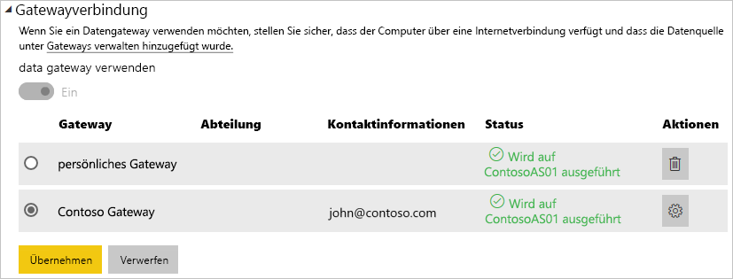

# <a name="manage-your-data-source---analysis-services"></a>Verwalten Ihrer Datenquelle – Analysis Services

[!INCLUDE [gateway-rewrite](includes/gateway-rewrite.md)]

Nachdem Sie [das lokale Datengateway installiert](/data-integration/gateway/service-gateway-install) haben, müssen Sie [Datenquellen hinzufügen](service-gateway-data-sources.md#add-a-data-source), die mit dem Gateway verwendet werden können. In diesem Artikel wird beschrieben, wie Sie für geplante Aktualisierungen oder für Liveverbindungen mit Gateways und SQL Server Analysis Services-Datenquellen (SSAS) arbeiten.

Weitere Informationen zum Einrichten einer Liveverbindung mit Analysis Services [finden Sie in diesem Video.](https://www.youtube.com/watch?v=GPf0YS-Xbyo&feature=youtu.be)

> [!NOTE]
> Wenn Sie über eine Analysis Services-Datenquelle verfügen, müssen Sie das Gateway auf einem Computer installieren, der der gleichen Gesamtstruktur oder Domäne wie der Analysis Services-Server angehört.

## <a name="add-a-data-source"></a>Hinzufügen einer Datenquelle

Weitere Informationen zum Hinzufügen einer Datenquelle finden Sie unter [Hinzufügen einer Datenquelle](service-gateway-data-sources.md#add-a-data-source). Wählen Sie **Analysis Services** als **Datenquellentyp**, wenn Sie eine Verbindung mit einem mehrdimensionalen oder tabellarischen Server herstellen.


Setzen Sie die Angaben für die Datenquelle ein, darunter **Server** und **Datenbank**. Die Informationen, die Sie für **Benutzername** und **Kennwort** eingeben, werden vom Gateway zum Herstellen der Verbindung mit der Analysis Services-Instanz verwendet.

> [!NOTE]
> Das von Ihnen eingegebene Windows-Konto muss über Administratorberechtigungen für die Instanz verfügen, mit der Sie eine Verbindung herstellen. Wenn für das Kennwort dieses Konto ein Ablauf festgelegt ist, erhalten Benutzer möglicherweise einen Verbindungsfehler, wenn das Kennwort für die Datenquelle nicht aktualisiert wurde. Weitere Informationen zum Speichern von Anmeldeinformationen finden Sie unter [Speichern verschlüsselter Anmeldeinformationen in der Cloud](service-gateway-data-sources.md#store-encrypted-credentials-in-the-cloud).


Nachdem Sie alles ausgefüllt haben, wählen Sie **Hinzufügen** aus. Sie können diese Datenquelle jetzt für geplante Aktualisierungen oder Liveverbindungen mit einer lokalen Analysis Services-Instanz verwenden. Bei erfolgreicher Ausführung wird *Verbindung erfolgreich* angezeigt.


### <a name="advanced-settings"></a>Erweiterte Einstellungen

Optional können Sie die Datenschutzebene für die Datenquelle konfigurieren. Diese Einstellung steuert, wie Daten kombiniert werden können. Sie wird nur für die geplante Aktualisierung verwendet. Die Einstellung für die Datenschutzebene betrifft Liveverbindungen nicht. Weitere Informationen zu Datenschutzebenen für Ihre Datenquelle finden Sie unter [Datenschutzebenen (Power Query)](https://support.office.com/article/Privacy-levels-Power-Query-CC3EDE4D-359E-4B28-BC72-9BEE7900B540).


## <a name="user-names-with-analysis-services"></a>Benutzernamen in Analysis Services

<iframe width="560" height="315" src="https://www.youtube.com/embed/Qb5EEjkHoLg" frameborder="0" allowfullscreen></iframe>

Bei jeder Interaktion eines Benutzers mit einem Bericht, der mit Analysis Services verbunden ist, wird der effektive Benutzername an das Gateway und von dort aus an Ihren lokalen Analysis Services-Server übergeben. Die E-Mail-Adresse, die Sie für die Anmeldung bei Power BI verwenden, wird als effektiver Benutzer an Analysis Services übergeben. Sie wird in der Verbindungseigenschaft [EffectiveUserName](https://msdn.microsoft.com/library/dn140245.aspx#bkmk_auth) übergeben. 

Die E-Mail-Adresse muss mit einem in der lokalen Active Directory-Domäne definierten Benutzerprinzipalnamen (UPN) übereinstimmen. Der UPN ist eine Eigenschaft des Active Directory-Kontos. Das Windows-Konto muss in einer Analysis Services-Rolle vorhanden sein. Wenn in Active Directory keine Übereinstimmung gefunden werden kann, ist die Anmeldung nicht erfolgreich. Weitere Informationen zu Active Directory und Benutzernamen finden Sie unter [Benutzernamenattribute](https://msdn.microsoft.com/library/ms677605.aspx).

Sie können auch [Ihren Power BI-Anmeldenamen einem lokalen Verzeichnis-UPN zuordnen](service-gateway-enterprise-manage-ssas.md#map-user-names-for-analysis-services-data-sources).

## <a name="map-user-names-for-analysis-services-data-sources"></a>Zuordnen von Benutzernamen zu Analysis Services-Datenquellen

<iframe width="560" height="315" src="https://www.youtube.com/embed/eATPS-c7YRU" frameborder="0" allowfullscreen></iframe>

Power BI ermöglicht die Zuordnung von Benutzernamen zu Analysis Services-Datenquellen. Sie können Regeln konfigurieren, um einen in Power BI angemeldeten Benutzernamen einem Namen zuzuordnen, der in EffectiveUserName über die Analysis Services-Verbindung übergeben wird. Diese Funktion zur Zuordnung von Benutzernamen ist eine hervorragende Möglichkeit, das Problem zu umgehen, wenn Ihr Benutzername für Azure Active Directory (Azure AD) nicht mit einem UPN in Ihrer lokalen Active Directory-Instanz übereinstimmt. Wenn Ihre E-Mail-Adresse beispielsweise nancy@contoso.onmicrsoft.com lautet, ordnen Sie sie nancy@contoso.com zu, und dieser Wert wird dann an das Gateway übergeben.

Es gibt zwei Möglichkeiten, Benutzernamen für Analysis Services zuzuordnen:

* Manuelles Neuzuordnen von Benutzern
* Lokale Suche von Active Directory-Eigenschaften, um Azure AD-UPNs Active Directory-Benutzern neu zuzuordnen (Zuordnung mit Active Directory-Suche)

Es ist zwar möglich, eine manuelle Zuordnung mit dem zweiten Ansatz durchzuführen, das ist aber sehr zeitaufwändig und schwierig zu verwalten. Es ist vor allem dann schwierig, wenn der Mustervergleich nicht ausreicht. Beispiele sind etwa abweichende Domänennamen zwischen Azure AD und dem lokalen Active Directory oder verschiedene Benutzerkontonamen in Azure AD und Active Directory. Aus diesen Gründen ist das manuelle Zuordnen mit dem zweiten Ansatz nicht zu empfehlen.

Diese beiden Ansätze werden nacheinander in den folgenden beiden Abschnitten beschrieben.

### <a name="manual-user-name-remapping"></a>Manuelles Neuzuordnen von Benutzernamen

Sie können für Analysis Services-Datenquellen benutzerdefinierte UPN-Regeln konfigurieren. Benutzerdefinierte Regeln sind hilfreich, wenn die Anmeldenamen für den Power BI-Dienst nicht mit Ihrem lokalen Verzeichnis-UPN übereinstimmen. Wenn Sie sich bei Power BI mit john@contoso.com anmelden, Ihr lokaler Verzeichnis-UPN aber john@contoso.local lautet, können Sie eine Zuordnungsregel konfigurieren, damit john@contoso.local an Analysis Services übergeben wird.

Den Bildschirm für die UPN-Zuordnung rufen Sie wie folgt auf.

1. Klicken Sie auf das Zahnradsymbol, und wählen Sie **Gateways verwalten** aus.
2. Erweitern Sie das Gateway, das die Analysis Services-Datenquelle enthält. Wenn Sie noch keine Analysis Services-Datenquelle erstellt haben, können Sie dies jetzt nachholen.
3. Wählen Sie die Datenquelle und dann die Registerkarte **Benutzer** aus.
4. Wählen Sie **Benutzernamen zuordnen** aus.

    

Sie sehen Optionen zum Hinzufügen von Regeln und zum Testen für einen bestimmten Benutzer.

> [!NOTE]
> Es kann vorkommen, dass Sie einen Benutzer versehentlich ändern. Wenn beispielsweise **Ersetzen (ursprünglicher Wert)** contoso.com und **Durch (Neuer Name)** @contoso.local ist, werden alle Benutzer mit einer Anmeldung, die @contoso.com enthält, durch @contoso.local ersetzt. Ebenso wird, wenn **Ersetzen (ursprünglicher Name)** dave@contoso.com und **Durch (Neuer Name)** dave@contoso.local ist, ein Benutzer mit der Anmeldung v-dave@contoso.com als v-dave@contoso.local gesendet.

### <a name="active-directory-lookup-mapping"></a>Zuordnung mit Active Directory-Suche

Führen Sie die Schritte in diesem Abschnitt aus, um eine lokale Active Directory-Eigenschaftensuche durchzuführen und Azure AD-UPNs Active Directory-Benutzern neu zuzuordnen. Gehen wir zunächst auf die Funktionsweise ein.

Im Power BI-Dienst geschieht Folgendes:

* Für jede Abfrage eines Power BI-Azure AD-Benutzers bei einem lokalen SSAS-Server wird eine UPN-Zeichenfolge übergeben. Beispiel:     firstName.lastName@contoso.com.

> [!NOTE]
> Alle manuellen UPN-Benutzerzuordnungen, die in der Power BI-Datenquellenkonfiguration definiert sind, werden angewendet, *bevor* die Zeichenfolge mit dem Benutzernamen an das lokale Datengateway gesendet wird.

Führen Sie am lokalen Datengateway mit konfigurierbarer benutzerdefinierter Benutzerzuordnung die folgenden Schritte aus.

1. Suchen Sie das zu durchsuchende Active Directory. Sie können „automatisch“ oder „konfigurierbar“ verwenden.
2. Schlagen Sie das Attribut der Active Directory-Person, beispielsweise ihre E-Mail-Adresse, im Power BI-Dienst nach. Das Attribut basiert auf einer eingehenden UPN-Zeichenfolge wie firstName.lastName@contoso.com.
3. Bei einem Fehler bei der Active Directory-Suche wird versucht, den übergebenen UPN als EffectiveUser an SSAS zu übergeben.
4. Bei erfolgreicher Active Directory-Suche wird der UserPrincipalName der betreffenden Active Directory-Person abgerufen.
5. Sie übergibt die E-Mail-Adresse für den UserPrincipalName als EffectiveUser an SSAS, beispielsweise Alias@corp.on-prem.contoso.

So konfigurieren Sie Ihr Gateway zum Durchführen der Active Directory-Suche:

1. [Herunterladen und Installieren des aktuellen Gateways](/data-integration/gateway/service-gateway-install)

2. Ändern Sie im Gateway den Dienst des lokalen Datengateways so, dass er mit einem Domänenkonto anstelle eines lokalen Dienstkontos ausgeführt wird. Andernfalls funktioniert die Active Directory-Suche zur Laufzeit nicht ordnungsgemäß. Wechseln Sie zur [App für das lokale Datengateway](/data-integration/gateway/service-gateway-app) auf Ihrem Computer und dann zu **Diensteinstellungen** > **Dienstkonto**. Vergewissern Sie sich, dass Sie über den Wiederherstellungsschlüssel für das Gateway verfügen, da Sie es auf demselben Computer wiederherstellen müssen (es sei denn, Sie möchten stattdessen ein neues Gateway erstellen). Starten Sie den Gateway-Dienst neu, damit die Änderung wirksam wird.

3. Navigieren Sie als Administrator zum Installationsordner des Gateways, *C:\Programme\On-premises data gateway*, um sicherzustellen, dass Sie über Schreibberechtigungen verfügen. Öffnen Sie die Datei *Microsoft.PowerBI.DataMovement.Pipeline.GatewayCore.dll.config*.

4. Bearbeiten Sie die folgenden beiden Konfigurationswerte gemäß *Ihren* Active Directory-Attributkonfigurationen für Ihre Active Directory-Benutzer. Die folgenden Konfigurationswerte stellen Beispiele dar. Geben Sie die Werte basierend auf Ihrer Active Directory Konfiguration an. Da bei diesen Konfigurationen Groß-/Kleinschreibung unterschieden wird, achten Sie darauf, dass sie mit den Werten in Active Directory übereinstimmen.

    

    Wenn kein Wert für die ADServerPath-Konfiguration angegeben ist, verwendet das Gateway standardmäßig den globalen Katalog. Sie können auch mehrere Werte für ADServerPath angeben. Alle Werte müssen durch ein Semikolon getrennt werden, wie im folgenden Beispiel dargestellt:

    ```xml
    <setting name="ADServerPath" serializeAs="String">
        <value> >GC://serverpath1; GC://serverpath2;GC://serverpath3</value>
    </setting>
    ```

    Das Gateway analysiert die Werte für ADServerPath von links nach rechts, bis eine Übereinstimmung gefunden wird. Wenn keine Übereinstimmung gefunden wird, wird der ursprüngliche UPN verwendet. Stellen Sie sicher, dass das Konto, das den Gatewaydienst (PBIEgwService) ausführt, Abfrageberechtigungen für alle Active Directory-Server besitzt, die Sie in ADServerPath angeben.

    Das Gateway unterstützt zwei Typen von ADServerPath, wie in den folgenden Beispielen dargestellt:

    **WinNT**

    ```xml
    <value="WinNT://usa.domain.corp.contoso.com,computer"/>
    ```

    **GC**

    ```xml
    <value> GC://USA.domain.com </value>
    ```

5. Starten Sie den lokalen Datengatewaydienst neu, damit die Konfigurationsänderung wirksam wird.

### <a name="work-with-mapping-rules"></a>Arbeiten mit Zuordnungsregeln

Um eine Zuordnungsregel zu erstellen, geben Sie einen Wert für **Ursprünglicher Name** und **Neuer Name** ein und wählen dann **Hinzufügen** aus.

| Feld | Beschreibung |
| --- | --- |
| Ersetzen (Ursprünglicher Name) |Die E-Mail-Adresse, die Sie für die Anmeldung bei Power BI verwendet haben. |
| Durch (Neuer Name) |Der Wert, durch den Sie ihn ersetzten möchten. Das Ergebnis der Ersetzung wird an die EffectiveUserName-Eigenschaft für die Analysis Services-Verbindung übergeben. |


Wenn Sie ein Element in der Liste auswählen, können Sie es mithilfe der Richtungspfeile an eine andere Position verschieben. Alternativ können Sie den Eintrag löschen.


### <a name="use-a-wildcard"></a>Verwenden eines Platzhalters

Sie können für die Zeichenfolge in **Ersetzen (Ursprünglicher Name)** einen Platzhalter (*) verwenden. Dieser kann nur einzeln und nicht zusammen mit anderen Teilen der Zeichenfolge verwendet werden. Verwenden Sie einen Platzhalter, wenn Sie alle Benutzer einbeziehen und nur einen einzelnen Wert an die Datenquelle übergeben möchten. Dieser Ansatz ist nützlich, wenn Sie möchten, dass alle Benutzer in der Organisation in der lokalen Umgebung den gleichen Benutzernamen verwenden.

### <a name="test-a-mapping-rule"></a>Testen von Zuordnungsregeln

Um zu überprüfen, wodurch ein ursprünglicher Name ersetzt wird, geben Sie einen Wert für **Ursprünglicher Name** ein. Wählen Sie **Regel testen** aus.


> [!NOTE]
> Nach dem Speichern dauert es einige Minuten, bis der Dienst beginnt, Regeln zu verwenden. Die Regel funktioniert im Browser sofort.

### <a name="limitations-for-mapping-rules"></a>Einschränkungen für Zuordnungsregeln

Die Zuordnung bezieht sich auf die spezifische Datenquelle, die konfiguriert wird. Es handelt sich nicht um eine globale Einstellung. Wenn Sie über mehrere Analysis Services-Datenquellen verfügen, müssen Sie die Benutzer für jede Datenquelle zuordnen.

## <a name="authentication-to-a-live-analysis-services-data-source"></a>Authentifizierung gegenüber einer Analysis Services-Livedatenquelle

Bei jeder Interaktion eines Benutzers mit Analysis Services wird der effektive Benutzername an das Gateway und von dort aus an Ihren lokalen Analysis Services-Server übergeben. Der UPN, bei dem es sich normalerweise um die E-Mail-Adresse handelt, die Sie für die Anmeldung bei der Cloud verwenden, wird als effektiver Benutzer an Analysis Services übergeben. Der UPN wird in der Verbindungseigenschaft „EffectiveUserName“ übergeben. 

Diese E-Mail-Adresse muss mit einem in der lokalen Active Directory-Domäne definierten UPN übereinstimmen. Der UPN ist eine Eigenschaft des Active Directory-Kontos. Das Windows-Konto muss dann in einer Analysis Services-Rolle vorhanden sein, um Zugriff auf den Server zu erhalten. Wenn in Active Directory keine Übereinstimmung gefunden wird, ist die Anmeldung nicht erfolgreich.

Analysis Services kann darüber hinaus eine Filterfunktion basierend auf diesem Konto bereitstellen. Es kann sowohl auf Grundlage eines rollenbasierten Sicherheitsmodells als auch auf Grundlage eines Sicherheitsmodells auf Zeilenebene gefiltert werden.

## <a name="role-based-security"></a>Rollenbasierte Sicherheit

Modelle stellen Sicherheit auf der Grundlage von Benutzerrollen bereit. Rollen werden für ein bestimmtes Modellprojekt während der Erstellung in den SQL Server Data Tools – Business Intelligence oder nach der Bereitstellung des Modells mithilfe von SQL Server Management Studio definiert. Rollen enthalten Mitglieder, die anhand ihres Windows-Benutzernamens oder ihrer Windows-Gruppe angegeben sind. Rollen definieren die Berechtigungen eines Benutzers für Abfragen oder Aktionen im Modell. Die meisten Benutzer gehören einer Rolle mit Leseberechtigungen an. Andere Rollen sind für Administratoren mit der Berechtigung zum Verarbeiten von Elementen, Verwalten von Datenbankfunktionen und Verwalten anderer Rollen vorgesehen.

## <a name="row-level-security"></a>Sicherheit auf Zeilenebene

Sicherheit auf Zeilenebene ist eine für Analysis Services charakteristische Funktion. Modelle können dynamische Sicherheitseinstellungen auf Zeilenebene bereitstellen. Im Gegensatz zu Rollen, von denen mindestens eine erforderlich ist, die Benutzer enthält, ist dynamische Sicherheit für tabellarische Modelle grundsätzlich nicht erforderlich. Allgemein ausgedrückt definiert dynamische Sicherheit den Lesezugriff eines Benutzers auf Daten bis hinunter zu einer bestimmten Zeile in einer bestimmten Tabelle. Ähnlich wie Rollen beruht dynamische Sicherheit auf Zeilenebene auf den Windows-Benutzernamen von Benutzern.

Die Fähigkeit eines Benutzers, Daten des Modells abzufragen und anzuzeigen, wird durch Folgendes bestimmt:

- Die Rollen, denen Ihr Windows-Benutzerkonto als Mitglied angehört.
- Dynamische Sicherheit auf Zeilenebene, sofern sie konfiguriert ist.

Das Implementieren von rollenbasierter Sicherheit und dynamischer Sicherheit auf Zeilenebene in Modellen würde den Rahmen dieses Artikels sprengen. Weitere Informationen finden Sie unter [Rollen (SSAS – tabellarisch)](https://msdn.microsoft.com/library/hh213165.aspx) und [Sicherheitsrollen (Analysis Services – mehrdimensionale Daten)](https://msdn.microsoft.com/library/ms174840.aspx) auf MSDN. Eine besonders fundierte Darstellung der Sicherheit in tabellarischen Modellen finden Sie im Whitepaper [Securing the Tabular BI Semantic Model](https://msdn.microsoft.com/library/jj127437.aspx) (Sichern des semantischen BI-Tabellenmodells).

## <a name="what-about-azure-ad"></a>Was ist mit Azure AD?

Die Clouddienste von Microsoft verwenden [Azure AD](/azure/active-directory/fundamentals/active-directory-whatis) für die Authentifizierung von Benutzern. Azure AD ist der Mandant, der die Benutzernamen und Sicherheitsgruppen enthält. In der Regel entspricht die E-Mail-Adresse, mit der sich ein Benutzer anmeldet, dem UPN des Kontos.

## <a name="what-is-the-role-of-my-local-active-directory-instance"></a>Was ist die Rolle meiner lokalen Active Directory-Instanz?

Damit Analysis Services bestimmen kann, ob ein Benutzer, der eine Verbindung mit ihm herstellt, einer Rolle angehört, die über Berechtigungen zum Lesen von Daten verfügt, muss der Server den von Azure AD an das Gateway und an den Analysis Services-Server übergebenen effektiven Benutzernamen konvertieren. Der Analysis Services-Server übergibt den effektiven Benutzernamen an einen Windows Active Directory-Domänencontroller (DC). Der Active Directory-DC überprüft dann, ob der effektive Benutzername einen gültigen UPN für ein lokales Konto darstellt. Der Windows-Benutzername des betreffenden Benutzers wird an den Analysis Services-Server zurückgegeben.

EffectiveUserName kann nicht auf einem Analysis Services-Server verwendet werden, der nicht mit der Domäne verknüpft ist. Der Analysis Services-Server muss einer Domäne angehören, um Anmeldefehler zu vermeiden.

## <a name="how-do-i-tell-what-my-upn-is"></a>Woher weiß ich meinen UPN?

Sie kennen möglicherweise Ihren UPN nicht und sind auch kein Domänenadministrator. Sie können den folgenden Befehl von Ihrer Arbeitsstation ausführen, um den UPN für Ihr Konto zu ermitteln.

    whoami /upn

Das Ergebnis ähnelt einer E-Mail-Adresse, es handelt sich aber um den UPN für Ihr Domänenkonto. Wenn Sie eine Analysis Services-Datenquelle für Liveverbindungen verwenden und dieser UPN nicht mit der E-Mail-Adresse übereinstimmt, mit der Sie sich bei Power BI anmelden, sollten Sie die Informationen unter [Zuordnen von Benutzernamen](#map-user-names-for-analysis-services-data-sources) lesen.

## <a name="synchronize-an-on-premises-active-directory-with-azure-ad"></a>Synchronisieren eines lokalen Active Directorys mit Azure AD

Wenn Sie Analysis Services-Liveverbindungen verwenden, müssen Ihre lokalen Active Directory-Konten mit Azure AD übereinstimmen. Ebenso muss der UPN der Konten übereinstimmen.

Die Clouddienste haben nur Kenntnis von Konten in Azure AD. Es spielt keine Rolle, ob Sie in Ihrer lokalen Active Directory-Instanz ein Konto hinzugefügt haben. Wenn das Konto in Azure AD nicht vorhanden ist, kann es nicht verwendet werden. Es gibt verschiedene Möglichkeiten, Ihre lokalen Active Directory-Konten mit Azure AD abzugleichen:

- Sie können Konten in Azure AD manuell hinzufügen.

   Sie können im Azure-Portal oder im Microsoft 365 Admin Center ein Konto erstellen, bei dem der Kontoname dem UPN des lokalen Active Directory Domain Services-Kontos entspricht.

- Sie können das [Azure AD Connect](/azure/active-directory/hybrid/how-to-connect-sync-whatis)-Tool verwenden, um lokale Konten mit Ihrem Azure AD-Mandanten zu synchronisieren.

   Das Azure AD Connect-Tool stellt Optionen für die Verzeichnissynchronisierung und das Einrichten von Authentifizierung zur Verfügung. Zu den Optionen gehören Kennworthash-Synchronisierung, Passthrough-Authentifizierung und Partnerverbund. Wenn Sie weder ein Mandantenadministrator noch ein lokaler Domänenadministrator sind, wenden Sie sich an Ihren IT-Administrator, um Hilfe bei der Konfiguration zu erhalten.

   Mit Azure AD Connect können Sie sicherstellen, dass der UPN Ihres Azure AD-Kontos und der Ihrer lokalen Active Directory-Instanz übereinstimmen.

> [!NOTE]
> Das Synchronisieren von Konten mithilfe des Azure AD Connect-Tools erstellt neue Konten in Ihrem Azure AD-Mandanten.

## <a name="use-the-data-source"></a>Verwenden der Datenquelle

Nachdem Sie die Datenquelle erstellt haben, kann diese mit Liveverbindungen oder durch eine geplante Aktualisierung verwendet werden.

> [!NOTE]
> Die Namen des Servers und der Datenbank müssen in Power BI Desktop und der Datenquelle innerhalb des lokalen Datengateways übereinstimmen.

Der Link zwischen Ihrem Dataset und der Datenquelle innerhalb des Gateways basiert auf dem Namen Ihres Servers und Ihrer Datenbank. Diese Namen müssen übereinstimmen. Wenn Sie z.B. eine IP-Adresse für den Servernamen in Power BI Desktop angeben, müssen Sie die IP-Adresse für die Datenquelle innerhalb der Gatewaykonfiguration verwenden. Wenn Sie *SERVER\INSTANZ* in Power BI Desktop verwenden, müssen Sie dies ebenfalls in der für das Gateway konfigurierten Datenquelle verwenden.

Diese Anforderung betrifft Liveverbindungen ebenso wie geplante Aktualisierungen.

### <a name="use-the-data-source-with-live-connections"></a>Verwenden der Datenquelle mit Liveverbindungen

Achten Sie darauf, dass die Namen des Servers und der Datenbank in Power BI Desktop mit der für das Gateway konfigurierten Datenquelle übereinstimmen. Sie müssen darüber hinaus sicherstellen, dass der Benutzer auf der Registerkarte **Benutzer** der Datenquelle aufgeführt ist, um Datasets über eine Liveverbindung zu veröffentlichen. Sie treffen die Auswahl für Liveverbindungen in Power BI Desktop beim Importieren der Daten.

Nach der Veröffentlichung, entweder aus Power BI Desktop oder mithilfe von **Daten abrufen**, sollten Ihre Berichte funktionieren. Es kann nach dem Erstellen der Datenquelle im Gateway mehrere Minuten dauern, bis die Verbindung genutzt werden kann.

### <a name="use-the-data-source-with-scheduled-refresh"></a>Verwenden der Datenquelle mit geplanten Aktualisierungen

Wenn Sie auf der Registerkarte **Benutzer** der im Gateway konfigurierten Datenquelle aufgeführt sind und die Namen des Servers und der Datenbank übereinstimmen, wird das Gateway als Option für geplante Aktualisierungen angezeigt.



### <a name="limitations-of-analysis-services-live-connections"></a>Einschränkungen der Liveverbindungen von Analysis Services

Sie können eine Liveverbindung für tabellarische oder mehrdimensionale Instanzen verwenden.

| **Serverversion** | **Erforderliche SKU** |
| --- | --- |
| 2012 SP1 CU4 oder höher |Business Intelligence und Enterprise SKU |
| 2014 |Business Intelligence und Enterprise SKU |
| 2016 |Standard-SKU oder höher |

* Die Formatierung auf Zellebene sowie Übersetzungsfunktionen werden nicht unterstützt.
* Aktionen und benannte Mengen werden nicht für Power BI verfügbar gemacht. Dennoch können Sie eine Verbindung mit mehrdimensionalen Cubes herstellen, die auch Aktionen oder benannte Mengen enthalten, und Sie können entsprechende Visualisierungen und Berichte erstellen.

## <a name="next-steps"></a>Nächste Schritte

* [Problembehandlung beim lokalen Datengateway](/data-integration/gateway/service-gateway-tshoot)
* [Lokales Datengateway – Power BI](service-gateway-onprem-tshoot.md)

Weitere Fragen? Probieren Sie die [Power BI Community](http://community.powerbi.com/) aus.

