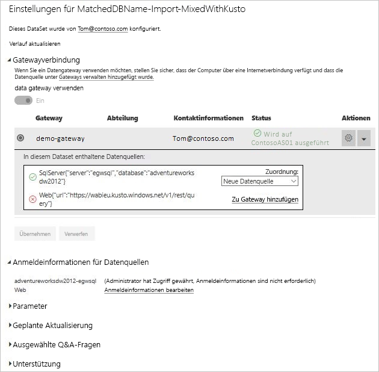

# Zusammenführen oder Anfügen von lokalen und Clouddatenquellen

[!INCLUDE [gateway-rewrite](includes/gateway-rewrite.md)]

Mit dem lokalen Datengateway können Sie lokale und Clouddatenquellen in derselben Abfrage zusammenführen oder daran anfügen. Dies ist hilfreich, wenn Sie Daten aus mehreren Quellen in derselben Abfrage kombinieren möchten.

>[!NOTE]
>Dieser Artikel gilt nur für Datensätze, bei denen Cloud- und lokale Datenquellen in einer einzigen Abfrage zusammengefasst oder hinzugefügt wurden. Für Datensätze, die getrennte Abfragen beinhalten – eine Verbindung zu einer lokalen und eine Verbindung zu einer Clouddatenquelle – wird die Abfrage anhand der Clouddatenquelle nicht über das Gateway ausgeführt.

## Voraussetzungen

- Ein [auf einem lokalen Computer installiertes Gateway](/data-integration/gateway/service-gateway-install)
- Eine Power BI Desktop-Datei mit Abfragen, die lokale und Clouddatenquellen enthält.

>[!NOTE]
>Um auf Clouddatenquellen zugreifen zu können, müssen Sie sicherstellen, dass das Gateway Zugriff auf diese Datenquellen hat.

1. Klicken Sie in der oberen rechten Ecke des Power BI-Diensts auf das Zahnradsymbol  >  und dann auf **Gateways verwalten**.

    

2. Wählen Sie das Gateway aus, das Sie konfigurieren möchten.

3. Klicken Sie unter **Gatewayclustereinstellungen** auf die Optionen **Ermöglichen Sie die Aktualisierung der Clouddatenquellen des Benutzers über diesen Gatewaycluster** > **Übernehmen**.

    

4. Fügen Sie unter diesem Gatewaycluster alle [lokalen Datenquellen](service-gateway-enterprise-manage-scheduled-refresh.md#add-a-data-source) hinzu, die in Ihren Abfragen verwendet werden. Die Clouddatenquellen müssen hier nicht hinzugefügt werden.

5. Laden Sie die Power BI Desktop-Datei mit den Abfragen, die lokale und Clouddatenquellen enthalten, zu Power BI hoch.

6. Gehen Sie auf der Seite **Dataseteinstellungen** für das neue Dataset folgendermaßen vor:

   - Wählen Sie für die lokale Quelle das Gateway aus, das dieser Datenquelle zugeordnet ist.

   - Bearbeiten Sie unter **Datenquellen-Anmeldeinformationen** die Clouddatenquellen-Anmeldeinformationen nach Bedarf.

    Stellen Sie sicher, dass die Datenschutzebenen sowohl für Cloud- als auch für lokale Datenquellen entsprechend eingestellt sind, um sicherzustellen, dass die Joins sicher verarbeitet werden.

     

7. Wenn Sie die Cloudanmeldeinformationen festgelegt haben, können Sie das Dataset mithilfe der Option **Jetzt aktualisieren** aktualisieren oder eine Aktualisierung in regelmäßigen Abständen planen.

## Nächste Schritte

Weitere Informationen zu Datenaktualisierung für Gateways finden Sie unter [Verwenden der Datenquelle für geplanten Aktualisierungen](service-gateway-enterprise-manage-scheduled-refresh.md#using-the-data-source-for-scheduled-refresh).
