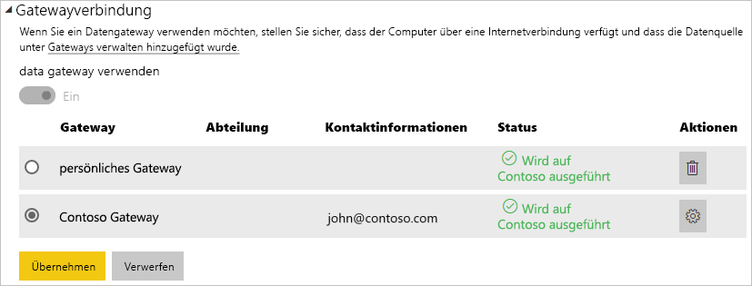

# <a name="manage-your-data-source---oracle"></a>Verwalten der Datenquelle – Oracle

[!INCLUDE [gateway-rewrite](includes/gateway-rewrite.md)]

Nach der [Installation des lokalen Datengateways](/data-integration/gateway/service-gateway-install) müssen Sie [Datenquellen hinzufügen](service-gateway-data-sources.md#add-a-data-source), die mit dem Gateway verwendet werden können. In diesem Artikel wird beschrieben, wie Sie für die geplante Aktualisierung oder für DirectQuery mit Gateways und Oracle-Datenquellen arbeiten.

## <a name="installing-the-oracle-client"></a>Installieren des Oracle-Clients

Damit das Gateway eine Verbindung mit dem Oracle-Server herstellen kann, muss der Oracle-Datenanbieter für .NET (ODP.NET) installiert und konfiguriert sein. ODP.NET ist Teil der Oracle Data Access Components (ODAC).

Verwenden Sie für **32-Bit**-Versionen von Power BI Desktop den folgenden Link, um den **32-Bit**-Oracle-Client herunterzuladen und zu installieren:

* [32-Bit-Oracle Data Access Components (ODAC) mit Oracle Developer Tools für Visual Studio (12.1.0.2.4)](http://www.oracle.com/technetwork/topics/dotnet/utilsoft-086879.html)

Verwenden Sie für **64-Bit**-Versionen von Power BI Desktop und für das lokale Datengateway den folgenden Link, um den **64-Bit**-Oracle-Client herunterzuladen und zu installieren:

* [64-Bit-ODAC 12.2c-Version 1 (12.2.0.1.0) für Windows x64](http://www.oracle.com/technetwork/database/windows/downloads/index-090165.html)

Nach der Installation müssen Sie die Datei „tnsnames.ora“ mit den korrekten Informationen für Ihre Datenbank konfigurieren. Power BI Desktop und das Gateway verwenden den Wert „net_service_name“, der in der Datei „tnsnames.ora“ definiert wird. Wenn dieser Wert nicht konfiguriert wurde, kann keine Verbindung hergestellt werden. Der Standardpfad der Datei „tnsnames.ora“ ist `[Oracle Home Directory]\Network\Admin\tnsnames.ora`. Weitere Informationen zur Konfiguration der Datei „tnsnames.ora“ finden Sie unter [Oracle: Local Naming Parameters (tnsnames.ora)](https://docs.oracle.com/cd/B28359_01/network.111/b28317/tnsnames.htm).

### <a name="example-tnsnamesora-file-entry"></a>Beispieleintrag in der Datei „tnsnames.ora“

Grundsätzlich haben Einträge in der Datei „tnsnames.ora“ das folgende Format.

```
net_service_name=
 (DESCRIPTION=
   (ADDRESS=(protocol_address_information))
   (CONNECT_DATA=
     (SERVICE_NAME=service_name)))
```

Hier sehen Sie ein Beispiel mit ausgefüllten Server- und Portinformationen.

```
CONTOSO =
  (DESCRIPTION =
    (ADDRESS = (PROTOCOL = TCP)(HOST = oracleserver.contoso.com)(PORT = 1521))
    (CONNECT_DATA =
      (SERVER = DEDICATED)
      (SERVICE_NAME = CONTOSO)
    )
  )
```

## <a name="add-a-data-source"></a>Hinzufügen einer Datenquelle

Weitere Informationen zum Hinzufügen einer Datenquelle finden Sie unter [Add a data source (Hinzufügen einer Datenquelle)](service-gateway-data-sources.md#add-a-data-source). Wählen Sie „Oracle“ als **Datenquellentyp** aus.


Sobald Sie den Datenquellentyp „Oracle“ ausgewählt haben, vervollständigen Sie die Angaben zur Datenquelle, darunter **Server** und **Datenbank**.  

Zudem müssen Sie eine **Authentifizierungsmethode** festlegen.  Dabei kann es sich um **Windows** oder **Basic**handeln.  Wählen Sie **Basic** (Standard) aus, wenn Sie ein in Oracle erstelltes Konto statt der Windows-Authentifizierung verwenden möchten. Geben Sie dann die Anmeldeinformationen ein, die für diese Datenquelle verwendet werden sollen.

> [!NOTE]
> Alle Abfragen der Datenquelle werden mithilfe dieser Anmeldeinformationen durchgeführt. Weitere Informationen zum Speichern von Anmeldeinformationen finden Sie unter [Storing encrypted credentials in the cloud (Speichern verschlüsselter Anmeldeinformationen in der Cloud)](service-gateway-data-sources.md#storing-encrypted-credentials-in-the-cloud).


Klicken Sie auf **Hinzufügen**, nachdem Sie alle Angaben eingetragen haben. Sie können diese Datenquelle (oder DirectQuery) jetzt für geplante Aktualisierungen mit einem lokalen Oracle-Server verwenden. Bei erfolgreicher Ausführung wird *Verbindung erfolgreich* angezeigt.


### <a name="advanced-settings"></a>Erweiterte Einstellungen

Optional können Sie die Datenschutzebene für die Datenquelle konfigurieren. Diese steuert, wie Daten kombiniert werden können. Diese wird nur für die geplante Aktualisierung verwendet und gilt nicht für DirectQuery. Weitere Informationen zu Datenschutzebenen für Ihre Datenquelle finden Sie unter [Privacy levels (Power Query) (Datenschutzebenen (Power Query))](https://support.office.com/article/Privacy-levels-Power-Query-CC3EDE4D-359E-4B28-BC72-9BEE7900B540).


## <a name="using-the-data-source"></a>Verwenden der Datenquelle

Nachdem Sie die Datenquelle erstellt haben, kann diese mit DirectQuery-Verbindungen oder durch eine geplante Aktualisierung verwendet werden.

> [!WARNING]
> Die Namen des Servers und der Datenbank müssen in Power BI Desktop und der Datenquelle innerhalb des lokalen Datengateways übereinstimmen.

Der Link zwischen Ihrem Dataset und der Datenquelle innerhalb des Gateways basiert auf dem Namen Ihres Servers und Ihrer Datenbank. Diese müssen übereinstimmen. Wenn Sie z. B. eine IP-Adresse für den Servernamen in Power BI Desktop angeben, müssen Sie die IP-Adresse für die Datenquelle innerhalb der Gatewaykonfiguration verwenden. Dieser Name muss außerdem einem Alias entsprechen, der in der Datei „tnsnames.ora“ definiert wurde. Weitere Informationen zur Datei „tnsnames.ora“ finden Sie unter [Installieren des Oracle-Clients](#installing-the-oracle-client).

Dies gilt für DirectQuery ebenso wie für geplante Aktualisierungen.

### <a name="using-the-data-source-with-directquery-connections"></a>Verwenden der Datenquelle mit DirectQuery-Verbindungen

Stellen Sie sicher, dass die Namen des Servers und der Datenbank in Power BI Desktop mit der für das Gateway konfigurierten Datenquelle übereinstimmen. Stellen Sie außerdem sicher, dass der Benutzer auf der Registerkarte **Benutzer** der Datenquelle aufgeführt ist, um DirectQuery-Datasets veröffentlichen zu können. Sie treffen die Auswahl für DirectQuery in Power BI Desktop beim Importieren der Daten. Weitere Informationen zur Verwendung von DirectQuery finden Sie unter [Verwenden von DirectQuery in Power BI Desktop](desktop-use-directquery.md).

Nach der Veröffentlichung von Power BI Desktop oder mit **Daten abrufen** sollten Ihre Berichte funktionieren. Es kann nach dem Erstellen der Datenquelle im Gateway mehrere Minuten dauern, bis die Verbindung genutzt werden kann.

### <a name="using-the-data-source-with-scheduled-refresh"></a>Verwenden der Datenquelle mit geplanten Aktualisierungen

Wenn Sie auf der Registerkarte **Benutzer** der im Gateway konfigurierten Datenquelle aufgeführt sind und die Namen des Servers und der Datenbank übereinstimmen, wird das Gateway als Option für geplante Aktualisierungen angezeigt.



## <a name="troubleshooting"></a>Problembehandlung

In Oracle werden möglicherweise mehrere Fehler angezeigt, wenn die Namenssyntax entweder fehlerhaft ist oder nicht ordnungsgemäß konfiguriert wurde.

* ORA-12154: TNS: could not resolve the connect identifier specified (Der angegebene Verbindungsbezeichner konnte nicht aufgelöst werden)  
* ORA-12514: TNS listener does not currently know of service requested in connect descriptor (TNS-Listener kann den in der Verbindungsbeschreibung angeforderten Dienst momentan nicht finden)  
* ORA-12541: TNS: no listener (kein Listener)  
* ORA-12170: TNS:Connect timeout occurred (Verbindungstimeout)  
* ORA-12504: TNS listener was not given the SERVICE_NAME in CONNECT_DATA (SERVICE_NAME in CONNECT_DATA wurde nicht an den TNS-Listener übergeben)  

Diese Fehler können auftreten, wenn der Oracle-Client nicht installiert ist oder nicht ordnungsgemäß konfiguriert wurde. Wenn der Client installiert ist, überprüfen Sie, ob die Datei „tnsnames.ora“ ordnungsgemäß konfiguriert und „net_service_name“ den richtigen Wert aufweist. Stellen Sie außerdem sicher, dass der Wert von „net_service_name“ auf dem Computer, auf dem Power BI Desktop ausgeführt wird, und auf dem Computer mit dem Gateway übereinstimmt. Weitere Informationen finden Sie unter [Installieren des Oracle-Clients](#installing-the-oracle-client).

> [!NOTE]
> Außerdem kann eine mangelnde Kompatibilität der Oracle-Serverversion mit der Oracle-Clientversion zu Problemen führen. Diese müssen in der Regel übereinstimmen.

Weitere Informationen zur Problembehandlung im Zusammenhang mit dem Gateway finden Sie unter [Problembehandlung beim lokalen Datengateway](/data-integration/gateway/service-gateway-tshoot).

## <a name="next-steps"></a>Nächste Schritte

* [Lokales Datengateway – Problembehandlung](service-gateway-onprem-tshoot.md)
* [Power BI Premium](service-premium.md)

Weitere Fragen? [Stellen Sie Ihre Frage in der Power BI-Community.](http://community.powerbi.com/)

