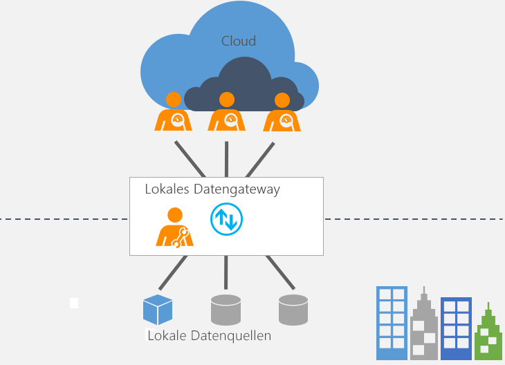

# Was ist ein lokales Datengateway?

[!INCLUDE [gateway-rewrite](includes/gateway-rewrite.md)]

Das lokale Datengateway fungiert als Brücke, die die schnelle und sichere Übertragung von Daten zwischen lokalen Daten (Daten, die nicht in der Cloud gespeichert sind) und mehreren Microsoft Cloud Services ermöglicht. Diese Clouddienst umfassen Power BI, PowerApps, Microsoft Flow, Azure Analysis Services und Azure Logic Apps. Mithilfe eines Gateways können Organisationen Datenbanken und andere Datenquellen in ihren eigenen Netzwerken behalten, diese lokalen Daten aber sicher in Clouddiensten verwenden.

## So funktioniert das Gateway

Weitere Informationen zur Funktionsweise des Gateways finden Sie unter [Architektur eines lokalen Datengateways](/data-integration/gateway/service-gateway-onprem-indepth).

## Arten von Gateways

Es gibt zwei verschiedene Arten von Gateways für zwei verschiedene Szenarios:

* **Lokales Datengateway** ermöglicht mehreren Benutzern, eine Verbindung mit mehreren lokalen Datenquellen herzustellen. Sie können ein lokales Datengateway mit allen unterstützten Diensten mit einer einzigen Gatewayinstallation verwenden. Dieses Gateway eignet sich für komplexe Szenarios, in denen mehrere Benutzer auf mehrere Datenquellen zugreifen.

* **Lokales Datengateway (persönlicher Modus)** ermöglicht einem Benutzer die Verbindung mit Datenquellen und kann nicht für andere Benutzer freigegeben werden. Ein lokales Datengateway (persönlicher Modus) kann nur mit Power BI verwendet werden. Dieses Gateway eignet sich für Szenarios, in denen Sie die einzige Person sind, die Berichte erstellt, und Sie Datenquellen nicht für andere Personen freigeben müssen.

## Verwenden eines Gateways

Die Verwendung eines Gateways besteht aus vier Hauptschritten.

1. [Laden Sie das Gateway herunter, und installieren Sie es](/data-integration/gateway/service-gateway-install) auf einem lokalen Computer.
2. [Konfigurieren](/data-integration/gateway/service-gateway-app) Sie das Gateway basierend auf Ihrer Firewall und anderen Netzwerkanforderungen.
3. [Fügen Sie Gatewayadministratoren](/data-integration/gateway/service-gateway-manage) hinzu, die auch andere Netzwerkanforderungen verwalten können.
4. [Beheben Sie Probleme](service-gateway-onprem-tshoot.md) mit dem Gateway, falls Fehler auftreten.

## Nächste Schritte

* [Installieren des lokalen Datengateways](/data-integration/gateway/service-gateway-install)

Weitere Fragen? [Wenden Sie sich an die Power BI-Community](http://community.powerbi.com/)
