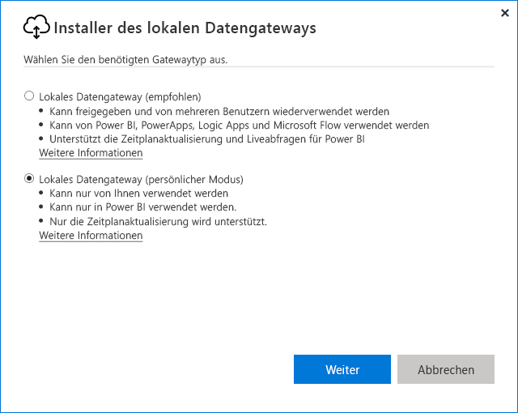
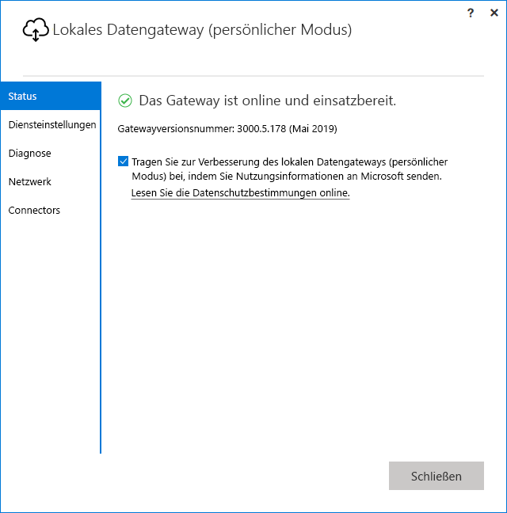

# <a name="use-personal-gateways-in-power-bi"></a>Verwenden persönlicher Gateways in Power BI

[!INCLUDE [gateway-rewrite](includes/gateway-rewrite.md)]

Das lokale Datengateway (persönlicher Modus) ist eine Version des lokalen Datengateways, das nur mit Power BI funktioniert. Ein persönliches Gateway ermöglicht es Benutzern, ein Gateway auf Ihrem eigenen Computer zu installieren und Zugriff auf lokale Daten zu erhalten.

> [!NOTE]
> Sie können für jeden Power BI-Benutzer nur ein Gateway im persönlichen Modus ausführen. Wenn Sie ein weiteres Gateway im persönlichen Modus für denselben Benutzer installieren (selbst wenn dies auf einem anderen Computer geschieht), ersetzt die neueste Installation die vorhandene vorherige Installation.

## <a name="on-premises-data-gateway-vs-on-premises-data-gateway-personal-mode"></a>Lokales Datengateway und lokales Datengateway (persönlicher Modus) im Vergleich

In der folgenden Tabelle werden die Unterschiede zwischen einem lokalen Datengateway und einem lokalen Datengateway (persönlicher Modus) beschrieben.

|   |Lokales Datengateway | Lokales Datengateway (persönlicher Modus) |
| ---- | ---- | ---- |
|Unterstützte Clouddienste |Power BI, PowerApps, Azure Logic Apps, Microsoft Flow, Azure Analysis Services, Datenflüsse |Power BI |
|Ausführung |Wie vom Benutzer konfiguriert, der Zugriff auf das Gateway hat |Wie für Ihre Windows-Authentifizierung und andere Authentifizierungstypen konfiguriert |
|Kann nur als Computeradministrator installiert werden |Ja |Nein |
|Zentrales Gateway und Datenquellenverwaltung |Ja |Nein |
|Datenimport und Zeitplanaktualisierung |Ja |Ja |
|DirectQuery-Unterstützung |Ja |Nein |
|LiveConnect-Unterstützung für Analysis Services |Ja |Nein |

## <a name="install-the-on-premises-data-gateway-personal-mode"></a>Installation des lokalen Datengateways (persönlicher Modus)

So installieren Sie das lokale Datengateway (persönlicher Modus):

1. [Laden Sie das lokale Datengateway herunter.](https://go.microsoft.com/fwlink/?LinkId=820925&clcid=0x409)

2. Wählen Sie im Installationsprogramm das lokale Datengateway (persönlicher Modus) aus, und klicken Sie dann auf die Schaltfläche **Weiter**.

   

Nachdem die Installation erfolgreich abgeschlossen wurde und Sie sich angemeldet haben, wird der folgende Bildschirm angezeigt.



## <a name="using-fast-combine-with-the-personal-gateway"></a>Verwendung von schnellem Kombinieren mit Personal Gateway

Mit Fast Combine auf einem persönlichen Gateway können Sie die festgelegten Datenschutzebenen beim Ausführen von Abfragen ignorieren. So können Sie Fast Combine für das lokale Datengateway (persönlicher Modus) aktivieren:

1. Öffnen Sie die folgende Datei mit dem Datei-Explorer:

   `%localappdata%\Microsoft\On-premises data gateway (personal mode)\Microsoft.PowerBI.DataMovement.Pipeline.GatewayCore.dll.config`

2. Fügen Sie am Ende der Datei den folgenden Text ein:

    ```xml
    <setting name="EnableFastCombine" serializeAs="String">
       <value>true</value>
    </setting>
    ```

3. Sobald der Vorgang abgeschlossen ist, wird die Einstellung in ungefähr einer Minute wirksam. Um zu überprüfen, ob es ordnungsgemäß funktioniert, versuchen Sie eine bedarfsgesteuerte Aktualisierung im **Power BI-Dienst**, um zu bestätigen, dass **schnelles Kombinieren** funktioniert.

## <a name="frequently-asked-questions-faq"></a>Häufig gestellte Fragen (FAQ)

**Frage:** Kann ich das **lokale Datengateway (persönlicher Modus)** parallel mit dem **lokalen Datengateway** ausführen (vormals bekannt als die Enterpriseversion des Gateways)?
  
**Antwort:** Ja, beide können gleichzeitig ausgeführt werden.

**Frage:** Kann ich das **lokale Datengateway (persönlicher Modus)** als Dienst ausführen?
  
**Antwort:** Nein. Das **lokale Datengateway (persönlicher Modus)** kann nur als Anwendung ausgeführt werden. Wenn Sie das Gateway als Dienst bzw. im Administratormodus ausführen müssen, müssen Sie das [**lokale Datengateway**](/data-integration/gateway/service-gateway-onprem) (vormals bekannt als das Enterprisegateway) in Betracht ziehen.

**Frage:** Wie oft wird das **lokale Datengateway (persönlicher Modus)** aktualisiert?
  
**Antwort:** Wir möchten das persönliche Gateway monatlich aktualisieren.

**Frage:** Warum werde ich aufgefordert, Anmeldeinformationen zu aktualisieren?
  
**Antwort:** Viele Situationen können eine Aufforderung zur Eingabe von Anmeldeinformationen auslösen. Meistens passiert dies, wenn Sie das **lokale Datengateway (persönlicher Modus)** erneut auf einem anderen Computer als Ihr **Power BI – Personal**-Gateway installiert haben. Es kann auch ein Problem in der Datenquelle vorliegen und Power BI konnte keine Testverbindung herstellen, oder ein Timeout oder ein Systemfehler ist aufgetreten. Sie können Ihre Anmeldeinformationen im **Power BI-Dienst** aktualisieren, indem Sie auf das **Zahnradsymbol** klicken und **Einstellungen** und dann **Datasets** auswählen, das betreffende Dataset suchen und auf **Anmeldeinformationen für Datenquellen** klicken.

**Frage:** Wie lang wird mein vorheriges Personal Gateway während des Upgrades offline geschaltet?
  
**Antwort:** Die Aktualisierung des persönlichen Gateways auf die neue Version sollte nur einige Minuten dauern.

**Frage:** Ich verwende R- und Python-Skripts. Wird dies unterstützt?
  
**Antwort:** R- und Python-Skripts werden für den persönlichen Modus unterstützt.

## <a name="next-steps"></a>Nächste Schritte

* [Konfigurieren von Proxyeinstellungen für das lokale Datengateway](/data-integration/gateway/service-gateway-proxy)  

Weitere Fragen? [Wenden Sie sich an die Power BI-Community](http://community.powerbi.com/)

