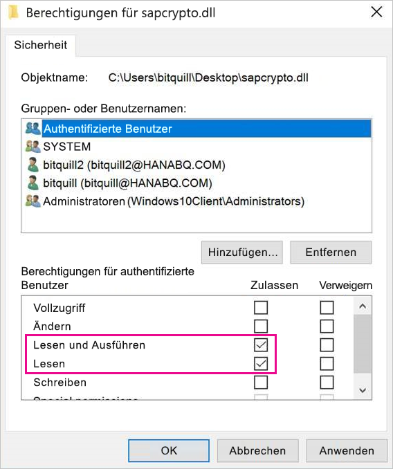
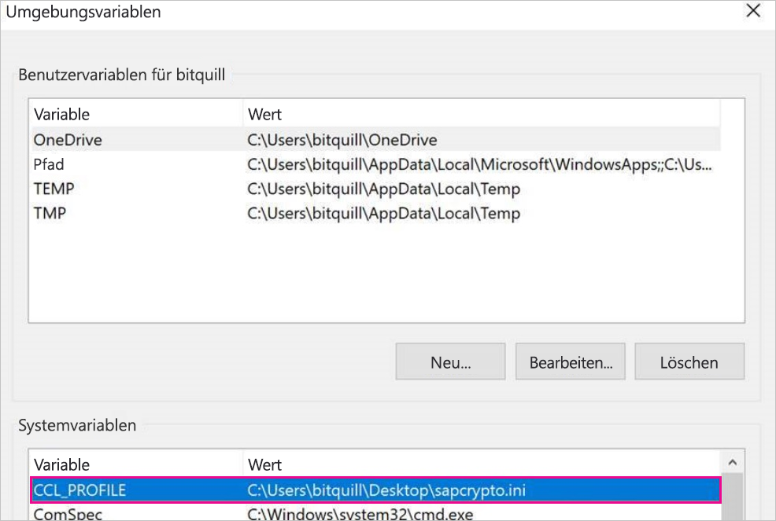
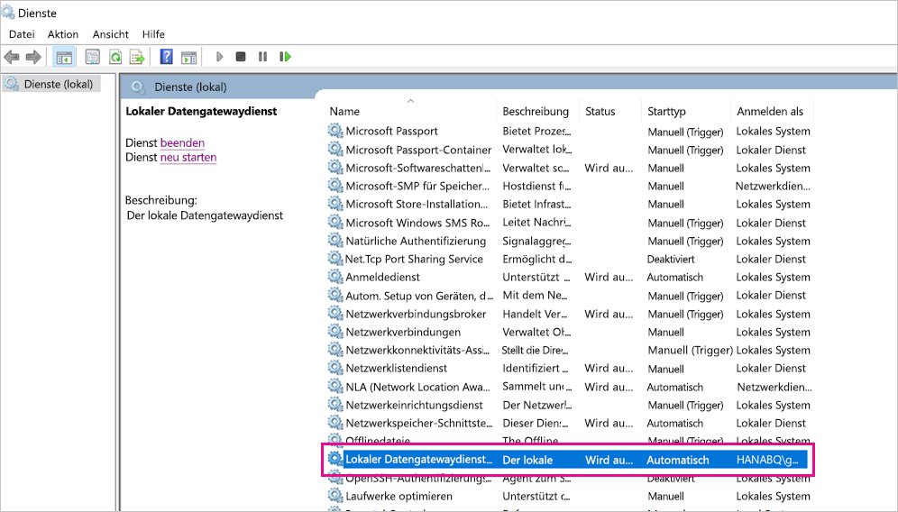
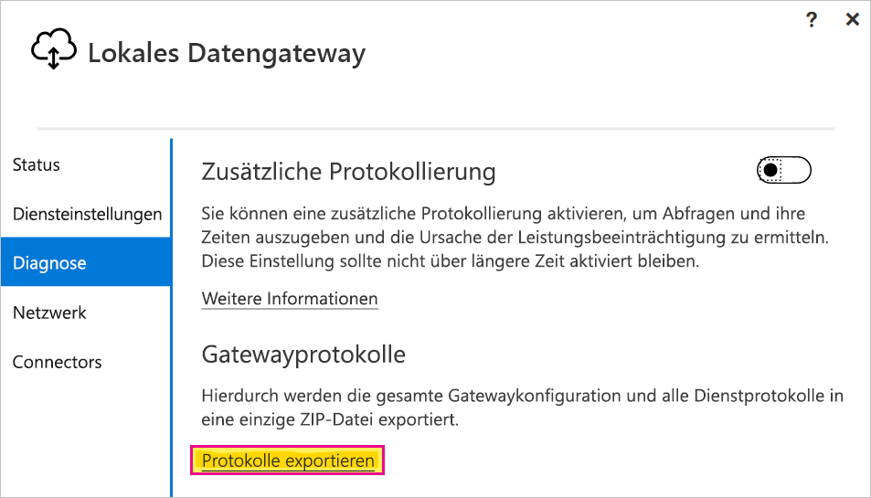

# <a name="use-kerberos-single-sign-on-for-sso-to-sap-bw-using-commoncryptolib-sapcryptodll"></a>Verwenden von Kerberos-Single Sign-On für Einmaliges Anmelden (SSO) bei SAP BW mithilfe von CommonCryptoLib (sapcrypto.dll)

In diesem Artikel wird beschrieben, wie Sie Ihren SAP BW-Server dafür konfigurieren, dass SSO vom Power BI-Dienst mithilfe von CommonCryptoLib (sapcrypto.dll) aktiviert wird.

> [!NOTE]
> Führen Sie die Schritte in diesem Artikel zusätzlich zu den Schritten in [Konfigurieren von Kerberos-SSO](service-gateway-sso-kerberos.md) aus, bevor Sie versuchen, einen SAP BW-basierten Bericht, der Kerberos-SSO verwendet, zu aktualisieren. Die Verwendung von CommonCryptoLib als SNC-Bibliothek ermöglicht SSO-Verbindungen mit SAP BW-Anwendungsservern und SAP BW-Nachrichtenservern.

## <a name="configure-sap-bw-server-to-enable-sso-using-commoncryptolib"></a>Konfigurieren von SAP BW-Servern für SSO mithilfe von CommonCryptoLib

> [!NOTE]
> Das lokale Datengateway ist eine 64-Bit-Software und erfordert daher die 64-Bit-Version von CommonCryptoLib (sapcrypto.dll). Wenn Sie die Absicht haben, die SSO-Verbindung mit Ihrem SAP BW-Server auf der SAP-Benutzeroberfläche (GUI) zu testen, bevor Sie versuchen, eine SSO-Verbindung über das Gateway herzustellen (empfohlen), benötigen Sie außerdem die 32-Bit-Version von CommonCryptoLib, da SAP GUI eine 32-Bit-Software darstellt.

1. Stellen Sie sicher, dass Ihr BW-Server ordnungsgemäß mithilfe von CommonCryptoLib für Kerberos-SSO konfiguriert ist. Ist dies der Fall, sollten Sie in der Lage sein, SSO mithilfe eines SAP-Tools wie SAP GUI, das für die Verwendung von CommonCryptoLib konfiguriert wurde, für den Zugriff auf Ihren BW-Server zu verwenden (entweder direkt oder über einen SAP BW-Nachrichtenserver). Weitere Informationen zu den Setupschritten finden Sie unter [SAP Single Sign-On: Authentifizieren mit Kerberos/SPNEGO](https://blogs.sap.com/2017/07/27/sap-single-sign-on-authenticate-with-kerberosspnego/). Ihr BW-Server sollte CommonCryptoLib als SNC-Bibliothek verwenden und einen SNC-Namen haben, der mit „CN=“ beginnt, z.B. „CN=BW1“. Weitere Informationen zu SNC-Namensanforderungen finden Sie unter [SNC-Parameter für die Kerberos-Konfiguration](https://help.sap.com/viewer/df185fd53bb645b1bd99284ee4e4a750/3.0/en-US/360534094511490d91b9589d20abb49a.html) (siehe hier insbesondere den Parameter „snc/identity/as“).

1. Installieren Sie die x64-Version des [SAP .NET-Connectors](https://support.sap.com/en/product/connectors/msnet.html) auf dem Computer, auf dem das Gateway installiert ist, wenn dies noch nicht geschehen ist. Sie können überprüfen, ob die Komponente installiert ist, indem Sie versuchen, eine Verbindung mit Ihrem BW-Server in Power BI Desktop herzustellen. Wenn Sie keine Verbindung mithilfe der 2.0-Implementierung herstellen können, ist der .NET-Connector nicht installiert.

1. Stellen Sie sicher, dass SAP Secure Login Client (SLC) auf dem Computer, auf dem das Gateway installiert ist, nicht ausgeführt wird. SLC speichert Kerberos-Tickets auf eine Weise zwischen, die die Fähigkeit des Gateways, Kerberos für SSO zu verwenden, beeinträchtigen kann. Wenn SLC installiert ist, deinstallieren Sie es, oder stellen Sie sicher, dass Sie SAP Secure Login Client beenden. Klicken Sie dazu mit der rechten Maustaste auf das Symbol auf der Taskleiste, und wählen Sie „Abmelden“ und „Beenden“ aus, bevor Sie versuchen, eine SSO-Verbindung mithilfe des Gateways herzustellen. SLC wird nicht für die Verwendung auf Windows Server-Computern unterstützt. Weitere Informationen finden Sie im [SAP-Hinweis 2780475](https://launchpad.support.sap.com/#/notes/2780475) (S-User erforderlich).

    

    Wenn Sie SLC deinstallieren oder **Abmelden** und **Beenden** auswählen, öffnen Sie ein Befehlsfenster, und geben Sie `klist purge` ein, um zwischengespeicherte Kerberos-Tickets zu löschen, bevor Sie versuchen, eine SSO-Verbindung über das Gateway herzustellen.

1. Laden Sie 64-Bit-CommonCryptoLib (sapcrypto.dll), Version **8.5.25 oder höher**, aus dem SAP Launchpad herunter, und kopieren Sie es in einen Ordner auf Ihrem Gatewaycomputer. Erstellen Sie in demselben Verzeichnis, in das Sie „sapcrypto.dll“ kopiert haben, eine Datei mit dem Namen „sapcrypto.ini“ und dem folgenden Inhalt:

    ```
    ccl/snc/enable_kerberos_in_client_role = 1
    ```

    Die INI-Datei enthält Konfigurationsinformationen, die von CommonCryptoLib zum Aktivieren von SSO im Gatewayszenario benötigt werden.

    > [!NOTE]
    > Diese Dateien müssen am gleichen Speicherort gespeichert werden. Das bedeutet, dass _/path/to/sapcrypto/_ sowohl „sapcrypto.ini“ als auch „sapcrypto.dll“ enthalten sollte.

    Sowohl der Gatewaydienstbenutzer als auch der Active Directory (AD)-Benutzer, dessen Identität der Dienstbenutzer annimmt, benötigen Lese-und Ausführungsberechtigungen für beide Dateien. Es wird empfohlen, der Gruppe „Authentifizierte Benutzer“ Berechtigungen für die INI- und DLL-Datei zu erteilen. Zu Testzwecken können Sie diese Berechtigungen auch explizit dem Gatewaydienstbenutzer und dem Active Directory-Benutzer erteilen, die Sie zum Testen verwenden möchten. Im folgenden Screenshot wurde der Gruppe „Authentifizierte Benutzer“ die Berechtigung zum **Lesen und Ausführen** für „sapcrypto.dll“ erteilt:

    

1. Wenn Sie über keine SAP BW-Datenquelle verfügen, fügen Sie auf der Seite **Gateways verwalten** im Power BI-Dienst eine Datenquelle hinzu. Wenn Sie bereits über eine BW-Datenquelle verfügen, die dem Gateway zugeordnet ist, über das die SSO-Verbindung erfolgen soll, bereiten Sie deren Bearbeitung vor. Wählen Sie **SAP Business Warehouse** als **Datenquellentyp** aus, wenn Sie eine SSO-Verbindung zu einem BW-Anwendungsserver herstellen möchten. Wählen Sie **SAP Business Warehouse-Nachrichtenserver** aus, wenn Sie eine SSO-Verbindung mit einem BW-Nachrichtenserver herstellen möchten.

    Wählen Sie als **SNC-Bibliothek** entweder **SNC\_LIB oder die SNC\_LIB\_64-Umgebungsvariable** oder **Benutzerdefiniert** aus. Wenn Sie die Option **SNC\_LIB** auswählen, müssen Sie den Wert der **SNC\_LIB\_64**-Umgebungsvariablen auf dem Gatewaycomputer auf den absoluten Pfad der 64-Bit-Kopie von „sapcrypto.dll“ auf dem Gatewaycomputer festlegen, z.B. „C:\Benutzer\Test\Desktop\sapcrypto.dll“. Wenn Sie **Benutzerdefiniert** auswählen, fügen Sie den absoluten Pfad zur Datei „sapcrypto.dll“ in das Feld „Benutzerdefinierter SNC-Bibliothekspfad“ ein, das auf der Seite **Gateways verwalten** angezeigt wird. Geben Sie als **Name des SNC-Partners** den SNC-Namen des BW-Servers ein. Stellen Sie sicher, dass unter **Erweiterte Einstellungen** das Kontrollkästchen **SSO über Kerberos für DirectQuery-Abfragen verwenden** aktiviert ist. Die anderen Felder sollten so ausgefüllt sein, wie sie für die Einrichtung einer Windows-Authentifizierungsverbindung von PBI-Desktop konfiguriert wären.

1. Erstellen Sie eine CCL\_PROFILE-Systemvariable mit einem Verweis auf „sapcrypto.ini“:

    

    Beachten Sie, dass sich die Dateien „sapcrypto.dll“ und „sapcrypto.ini“ am gleichen Speicherort befinden müssen. Im oben gezeigten Beispiel, bei dem sich „sapcrypto.ini“ auf dem Desktop befindet, muss sich auch „sapcrypto.dll“ auf dem Desktop befinden.

1. Starten Sie den Gatewaydienst neu:

    

1. [Ausführen eines Power BI-Berichts](service-gateway-sso-kerberos.md#run-a-power-bi-report)

## <a name="troubleshooting"></a>Problembehandlung

Wenn der Bericht im Power BI-Dienst nicht aktualisiert werden kann, können Sie die Gateway-Ablaufverfolgung, CPIC-Ablaufverfolgung und CommonCryptoLib-Ablaufverfolgung verwenden, um das Problem zu diagnostizieren. Die CPIC-Ablaufverfolgung und CommonCryptoLib sind SAP-Produkte, sodass Microsoft keinen direkten Support für sie bereitstellen kann. Für Active Directory Benutzer, denen SSO-Zugriff auf BW erteilt wird, kann es bei einigen Active Directory-Konfigurationen erforderlich sein, dass die Benutzer Mitglieder der Gruppe „Administratoren“ auf dem Computer sind, auf dem das Gateway installiert ist.

1. **Gatewayprotokolle:** Reproduzieren Sie das Problem, öffnen Sie die [Gateway-App](https://docs.microsoft.com/data-integration/gateway/service-gateway-app), wechseln Sie zur Registerkarte **Diagnose**, und wählen Sie **Protokolle exportieren** aus:

    

1. **CPIC-Ablaufverfolgung:** Legen Sie zum Aktivieren der CPIC-Ablaufverfolgung zwei Umgebungsvariablen fest: CPIC\_TRACE und CPIC\_TRACE\_DIR. Mit der ersten Variablen wird die Ablaufverfolgungsebene und mit der zweiten Variablen das Verzeichnis für die Ablaufverfolgungsdatei festgelegt. Bei dem Verzeichnis muss es sich um einen Speicherort handeln, in den Mitglieder der Gruppe „Authentifizierte Benutzer“ schreiben können. Legen Sie CPIC\_TRACE auf 3 und CPIC\_TRACE\_DIR auf das Verzeichnis fest, in das die Ablaufverfolgungsdateien geschrieben werden sollen.

    

    Reproduzieren Sie das Problem, und überprüfen Sie, ob CPIC\_TRACE\_DIR Ablaufverfolgungsdateien enthält.

1. **CommonCryptoLib-Ablaufverfolgung:** Aktivieren Sie die CommonCryptoLib-Ablaufverfolgung, indem Sie der zuvor erstellten Datei „sapcrypto.ini“ zwei Zeilen hinzufügen:

    ```
    ccl/trace/level=5
    ccl/trace/directory=<drive>:\logs\sectrace
    ```

    Stellen Sie sicher, dass Sie die Option _ccl/trace/directory_ in einen Speicherort ändern, in den Mitglieder der Gruppe „Authentifizierte Benutzer“ schreiben können. Erstellen Sie alternativ eine neue INI-Datei, um dieses Verhalten zu ändern. Erstellen Sie in demselben Verzeichnis, in dem sich „sapcrypto.ini“ und „sapcrypto.dll“ befinden, eine Datei mit dem Namen „sectrace.ini“ und dem unten dargestellten Inhalt. Ersetzen Sie die DIRECTORY-Option durch einen Speicherort auf Ihrem Computer, in den die Gruppe „Authentifizierte Benutzer“ schreiben kann:

    ```
    LEVEL = 5

    DIRECTORY = <drive>:\logs\sectrace
    ```

    Reproduzieren Sie nun das Problem, und prüfen Sie, ob der Speicherort, auf den durch DIRECTORY verwiesen wird, Ablaufverfolgungsdateien enthält. Stellen Sie sicher, dass Sie die CPIC- und CCL-Ablaufverfolgung deaktivieren, wenn Sie fertig sind.

    Weitere Informationen zur CommonCryptoLib-Ablaufverfolgung finden Sie in [SAP-Hinweis 2491573](https://launchpad.support.sap.com/#/notes/2491573) (S-User erforderlich).

## <a name="next-steps"></a>Nächste Schritte

Weitere Informationen zum **lokalen Datengateway** und zu **DirectQuery** finden Sie in den folgenden Ressourcen:

* [What is an on-premises data gateway? (Was ist ein lokales Datengateway?)](/data-integration/gateway/service-gateway-getting-started)
* [DirectQuery in Power BI](desktop-directquery-about.md)
* [Von DirectQuery unterstützte Datenquellen](desktop-directquery-data-sources.md)
* [DirectQuery und SAP BW](desktop-directquery-sap-bw.md)
* [DirectQuery und SAP HANA](desktop-directquery-sap-hana.md)
