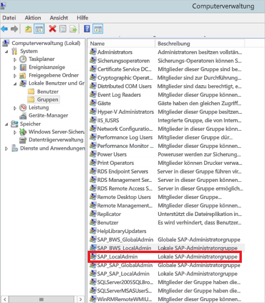

# <a name="use-kerberos-for-single-sign-on-sso-to-sap-bw-using-gx64krb5"></a>Verwenden von Kerberos für SSO (Single Sign-On, Einmaliges Anmelden) bei SAP BW mithilfe von gx64krb5

In diesem Artikel wird beschrieben, wie Sie Ihre SAP BW-Datenquelle so konfigurieren, dass SSO vom Power BI-Dienst mithilfe von gx64krb5 aktiviert wird.

> [!NOTE]
> Sie können die Schritte in diesem Artikel zusätzlich zu den Schritten in [Konfigurieren von Kerberos-SSO](service-gateway-sso-kerberos.md) ausführen, um eine SSO-basierte Aktualisierung von auf SAP BW Application Server basierenden Berichten im Power BI-Dienst zu ermöglichen. Microsoft empfiehlt jedoch die Verwendung von CommonCryptoLib, und nicht gx64krb5, als SNC-Bibliothek. SAP bietet keine Unterstützung für gx64krb5 mehr, und die zur Konfiguration für das Gateway erforderlichen Schritte sind im Vergleich mit CommonCryptoLib deutlich komplexer. Informationen zum Konfigurieren von SSO unter Verwendung von CommonCryptoLib finden Sie unter [Konfigurieren von SAP BW für SSO mithilfe von CommonCryptoLib](service-gateway-sso-kerberos-sap-bw-commoncryptolib.md). Sie sollten CommonCryptoLib _oder_ gx64krb5 als Ihre SNC-Bibliothek verwenden. Führen Sie nicht die Konfigurationsschritte für beide Bibliotheken aus.

Dieser Leitfaden ist sehr umfassend gestaltet. Sollten Sie einige dieser Schritte bereits ausgeführt haben, können Sie sie überspringen. Beispielsweise haben Sie möglicherweise bereits Ihren SAP BW-Server für SSO mithilfe von gx64krb5 konfiguriert.

## <a name="set-up-gx64krb5-on-the-gateway-machine-and-the-sap-bw-server"></a>Einrichten von gx64krb5 auf dem Gatewaycomputer und dem SAP BW-Server

> [!NOTE]
> Die gx64krb5-Bibliothek wird nicht länger von SAP unterstützt. Weitere Informationen finden Sie im [SAP-Hinweis 352295](https://launchpad.support.sap.com/#/notes/352295). Beachten Sie auch, dass gx64krb5 keine SSO-Verbindungen vom Datengateway zu SAP BW-Nachrichtenservern zulässt. Es sind nur Verbindungen mit SAP BW-Anwendungsservern möglich. Diese Einschränkung entfällt, wenn Sie [CommonCryptoLib](service-gateway-sso-kerberos-sap-bw-commoncryptolib.md) als SNC-Bibliothek verwenden. Andere SNC-Bibliotheken funktionieren möglicherweise auch für BW-SSO, werden aber von Microsoft nicht offiziell unterstützt.

Die gx64krb5-Bibliothek muss sowohl vom Client als auch vom Server verwendet werden, damit eine SSO-Verbindung über das Gateway hergestellt werden kann, d. h. Client und Server müssen die gleiche SNC-Bibliothek verwenden.

1. Laden Sie „gx64krb5.dll“ aus dem [SAP-Hinweis 2115486](https://launchpad.support.sap.com/) herunter (S-User von SAP erforderlich). Stellen Sie sicher, dass Sie mindestens über Version 1.0.11.x verfügen. Laden Sie außerdem „gsskrb5.dll“ (die 32-Bit-Version der Bibliothek) herunter, wenn Sie die SSO-Verbindung in der SAP-GUI testen möchten, bevor Sie die SSO-Verbindung über das Gateway versuchen (empfohlen). Die 32-Bit-Version ist für das Testen mit der SAP-GUI erforderlich, da die SAP-GUI nur als 32-Bit-Version verfügbar ist.

1. Platzieren Sie „gx64krb5.dll“ an einem Speicherort auf Ihrem Gatewaycomputer, auf den der Gatewaydienstbenutzer zugreifen kann. Wenn Sie die SSO-Verbindung mithilfe der SAP-GUI testen möchten, speichern Sie auch eine Kopie von „gsskrb5.dll“ auf dem Computer, und legen Sie die Umgebungsvariable **SNC_LIB** so fest, dass sie darauf verweist. Sowohl der Gatewaydienstbenutzer als auch die Active Directory-Benutzer (AD), deren Identität der Dienstbenutzer annimmt, benötigen Lese- und Ausführungsberechtigungen für die Kopie von „gx64krb5.dll“. Es wird empfohlen, der Gruppe „Authentifizierte Benutzer“ Berechtigungen für die DLL zu erteilen. Zu Testzwecken können Sie diese Berechtigungen auch explizit dem Gatewaydienstbenutzer und dem Active Directory-Benutzer gewähren, die Sie für den Test verwenden möchten.

1. Wenn Ihr BW-Server noch nicht mithilfe von „gx64krb5.dll“ für SSO konfiguriert wurde, legen Sie eine weitere Kopie der DLL-Datei auf Ihrem SAP BW-Servercomputer an einem Speicherort ab, auf den der SAP BW-Server zugreifen kann. 

    Weitere Informationen zum Konfigurieren von „gx64krb5.dll“ für die Verwendung mit einem SAP BW-Server finden Sie in der [SAP-Dokumentation](https://launchpad.support.sap.com/#/notes/2115486) (S-User erforderlich).

1. Legen Sie auf dem Client- und Servercomputer die Umgebungsvariablen **SNC_LIB** und **SNC_LIB_64** fest: 
    - Wenn Sie „gsskrb5.dll“ verwenden, legen Sie die Variable **SNC_LIB** auf den absoluten Pfad von „gsskrb5.dll“ fest. 
    - Wenn Sie „gx64krb5.dll“ verwenden, legen Sie die Variable **SNC_LIB_64** auf den absoluten Pfad von „gx64krb5.dll“ fest.

## <a name="configure-an-sap-bw-service-user-and-enable-snc-communication-on-the-bw-server"></a>Konfigurieren eines SAP BW-Dienstbenutzers und Aktivieren der SNC-Kommunikation auf dem BW-Server

Bearbeiten Sie diesen Abschnitt, wenn Sie Ihren SAP BW-Server noch nicht für die SNC-Kommunikation (beispielsweise SSO) mithilfe von gx64krb5 konfiguriert haben.

> [!NOTE]
> In diesem Abschnitt wird davon ausgegangen, dass Sie bereits einen Dienstbenutzer für BW erstellt und einen passenden SPN daran gebunden haben (d. h. einen Namen, der mit *SAP/* beginnt).

1. Gewähren Sie dem Dienstbenutzer Zugriff auf Ihren SAP BW-Anwendungsserver:

    1. Fügen Sie auf dem SAP BW-Servercomputer den Dienstbenutzer zur lokalen Administratorgruppe hinzu. Öffnen Sie hierzu das Programm **Computerverwaltung**, und ermitteln Sie die Gruppe der lokale Administratoren für Ihren Server. 

        

    1. Doppelklicken Sie auf die lokale Administratorgruppe, und wählen Sie **Hinzufügen** aus, um Ihren Dienstbenutzer der Gruppe hinzuzufügen. 

    1. Wählen Sie **Namen überprüfen** aus, um sicherzustellen, dass Sie den Namen korrekt eingegeben haben. Klicken Sie dann auf **OK**.

1. Legen Sie den Dienstbenutzer des SAP BW-Servers als den Benutzer fest, der den SAP BW-Serverdienst auf dem SAP BW-Servercomputer startet:

    1. Öffnen Sie **Ausführen**, und geben Sie dann **Services.msc** ein. 

    1. Suchen Sie den Dienst, der der Instanz Ihres SAP BW-Anwendungsservers entspricht, klicken Sie mit der rechten Maustaste darauf, und wählen Sie dann **Eigenschaften** aus.

        

    1. Wechseln Sie zur Registerkarte **Anmelden**, und ändern Sie den Benutzer in Ihren SAP BW-Dienstbenutzer. 

    1. Geben Sie das Kennwort des Benutzers ein, und klicken Sie auf **OK**.

1. Melden Sie sich über SAP Logon bei Ihrem Server an, und legen Sie mithilfe der Transaktion RZ10 die folgenden Profilparameter fest:

    1. Legen Sie den Profilparameter **snc/identity/as** auf *p:&lt;von Ihnen erstellter SAP BW-Dienstbenutzer&gt;* fest. Beispiel: *p:BWServiceUser\@MYDOMAIN.COM*. Beachten Sie das *p:* , das dem UPN des Dienstbenutzers vorangestellt ist. Das Präfix lautet nicht *p:CN=* wie bei Verwendung der CommonCryptoLib als SNC-Bibliothek.

    1. Legen Sie den Profilparameter **snc/gssapi\_lib** auf den *&lt;Pfad zu gx64krb5.dll auf dem BW-Servercomputer&gt;* fest. Platzieren Sie die Bibliothek an einem Ort, auf den der SAP BW-Anwendungsserver zugreifen kann.

    1. Legen Sie außerdem die folgenden zusätzlichen Profilparameter fest, deren Wert Sie nach Bedarf ändern können. Die letzten fünf Optionen ermöglichen es Clients, über SAP Logon eine Verbindung mit dem SAP BW-Server herzustellen, ohne dass SNC konfiguriert ist.

        | **Einstellung** | **Wert** |
        | --- | --- |
        | snc/data\_protection/max | 3 |
        | snc/data\_protection/min | 1 |
        | snc/data\_protection/use | 9 |
        | snc/accept\_insecure\_cpic | 1 |
        | snc/accept\_insecure\_gui | 1 |
        | snc/accept\_insecure\_r3int\_rfc | 1 |
        | snc/accept\_insecure\_rfc | 1 |
        | snc/permit\_insecure\_start | 1 |

    1. Legen Sie die Eigenschaft **snc/enable** auf 1 fest.

1. Nachdem Sie diese Profilparameter festgelegt haben, öffnen Sie auf dem Servercomputer die SAP-Verwaltungskonsole, und starten Sie die SAP BW-Instanz neu. 

   Sollte der Server nicht starten, vergewissern Sie sich, dass Sie die Profilparameter korrekt festgelegt haben. Weitere Informationen zu den Einstellungen für die Profilparameter finden Sie in der [SAP-Dokumentation](https://help.sap.com/saphelp_nw70ehp1/helpdata/en/e6/56f466e99a11d1a5b00000e835363f/frameset.htm). Sie können auch den Abschnitt [Problembehandlung](#troubleshooting) im vorliegenden Artikel zurate ziehen.

## <a name="map-an-sap-bw-user-to-an-active-directory-user"></a>Zuordnen eines SAP BW-Benutzers zu einem Active Directory-Benutzer

Sofern nicht bereits geschehen, ordnen Sie einen Active Directory-Benutzer einem Benutzer des SAP BW-Anwendungsservers zu. Testen Sie anschließend die SSO-Verbindung in SAP Logon.

1. Melden Sie sich mit SAP Logon bei Ihrem SAP BW-Server an. Führen Sie die Transaktion SU01 aus.

1. Geben Sie für **User** (Benutzer) den SAP BW-Benutzer ein, für den Sie SSO-Verbindungen aktivieren möchten. Klicken Sie im linken oberen Bereich des SAP Logon-Fensters auf das **Bearbeitungssymbol** (Stift).

    

1. Wählen Sie die Registerkarte **SNC** aus. Geben Sie im Eingabefeld „SNC name“ (SNC-Name) die Zeichenfolge *p:&lt;Ihr Active Directory-Benutzer&gt;@&lt;Ihre Domäne&gt;* ein. Für den SNC-Namen muss dem UPN des Active Directory-Benutzers das Präfix *p:* vorangestellt werden. Für den UPN muss die Groß-/Kleinschreibung beachtet werden.

   Der angegebene Active Directory-Benutzer muss zu der Person oder Organisation gehören, für die Sie den SSO-Zugriff auf den SAP BW-Anwendungsserver gewähren möchten. Geben Sie beispielsweise *p:testuser\@TESTDOMAIN.COM* ein, wenn Sie dem Benutzer testuser\@TESTDOMAIN.COM SSO-Zugriff gewähren möchten.

    

1. Klicken Sie im linken oberen Bereich des Bildschirms auf das **Speichersymbol** (Diskette).

## <a name="test-sign-in-via-sso"></a>Testen der Anmeldung über SSO

Überprüfen Sie, ob Sie sich mithilfe von SAP Logon über SSO als der Active Directory-Benutzer anmelden können, für den Sie den SSO-Zugriff aktiviert haben:

1. Melden Sie sich als der Active Directory-Benutzer, für den Sie soeben den SSO-Zugriff aktiviert haben, bei einem Computer in Ihrer Domäne an, auf dem SAP Logon installiert ist. Starten Sie SAP Logon, und erstellen Sie eine neue Verbindung.

1. Kopieren Sie die Datei „gsskrb5.dll“, die Sie zuvor in einen Speicherort auf dem Computer heruntergeladen haben, bei dem Sie angemeldet sind. Legen Sie die Umgebungsvariable **SNC_LIB** auf den absoluten Pfad dieses Speicherorts fest.

1. Starten Sie SAP Logon, und erstellen Sie eine neue Verbindung.

1. Wählen Sie im Fenster **Neuen Systemeintrag erstellen** die Option **Vom Benutzer angegebenes System** und dann **Weiter** aus.

    

1. Geben Sie auf dem nächsten Bildschirm die entsprechenden Details (einschließlich Anwendungsserver, Instanznummer und System-ID) ein. Wählen Sie **Fertig stellen** aus.

1. Klicken Sie mit der rechten Maustaste auf die neue Verbindung, wählen Sie **Eigenschaften** und anschließend die Registerkarte **Netzwerk** aus. 

1. Geben Sie im Feld **SNC-Name** den Wert *p:&lt;UPN des SAP BW-Dienstbenutzers&gt;* ein. Beispiel: *p:BWServiceUser\@MYDOMAIN.COM*. Wählen Sie **OK**aus.

    

1. Doppelklicken Sie auf die Verbindung, die Sie gerade erstellt haben, um eine SSO-Verbindung mit dem SAP BW-Server herzustellen. 

   Wenn die Verbindung erfolgreich hergestellt werden kann, fahren Sie mit dem nächsten Abschnitt fort. Gehen Sie andernfalls die vorherigen Schritt in dieser Dokumentation erneut durch, um sicherzustellen, dass diese ordnungsgemäß durchgeführt wurden. Alternativ können Sie den Abschnitt zur [Problembehandlung](#troubleshooting) zurate ziehen. Wenn Sie in diesem Kontext keine SSO-Verbindung mit dem SAP BW-Server herstellen können, können Sie auch im Gatewaykontext keine SSO-Verbindung mit dem SAP BW-Server herstellen.

## <a name="add-registry-entries-to-the-gateway-machine"></a>Hinzufügen von Registrierungseinträgen zum Gatewaycomputer

Fügen Sie die erforderlichen Einträge zur Registrierung des Computers hinzu, auf dem das Gateway installiert ist, sowie zu den Computern, die für die Verbindung von Power BI Desktop vorgesehen sind. Führen Sie zum Hinzufügen dieser Registrierungseinträge die folgenden Befehle aus:

- ```REG ADD HKLM\SOFTWARE\Wow6432Node\SAP\gsskrb5 /v ForceIniCredOK /t REG_DWORD /d 1 /f```

- ```REG ADD HKLM\SOFTWARE\SAP\gsskrb5 /v ForceIniCredOK /t REG_DWORD /d 1 /f```

## <a name="add-a-new-sap-bw-application-server-data-source-to-the-power-bi-service-or-edit-an-existing-one"></a>Hinzufügen einer neuen Datenquelle vom Typ „SAP BW-Anwendungsserver“ zum Power BI-Dienst oder Bearbeiten einer vorhandenen Datenquelle

1. Geben Sie im Fenster für die Konfiguration der Datenquelle genau wie bei der Anmeldung beim SAP BW-Server über Power BI Desktop den **Hostnamen**, die **Systemnummer** und die **Client-ID** des SAP BW-Anwendungsservers ein.

1. Geben Sie im Feld **Name des SNC-Partners** den *p:&lt;SPN ein, den Sie Ihrem SAP BW-Dienstbenutzer zugeordnet haben&gt;* . Wenn der SPN beispielsweise SAP/BWServiceUser\@MYDOMAIN.COM lautet, geben Sie *p:SAP/BWServiceUser\@MYDOMAIN.COM* in das Feld **Name des SNC-Partners** ein.

1. Wählen Sie für die SNC-Bibliothek **SNC\_LIB** oder **SNC\_LIB\_64** aus. Vergewissern Sie sich, dass **SNC\_LIB\_64** auf dem Gatewaycomputer auf die gx64krb5.dll-Datei verweist. Alternativ können Sie die Option **Benutzerdefiniert** auswählen und den absoluten Pfad zu „gx64krb5.dll“ auf dem Gatewaycomputer angeben.

1. Aktivieren Sie **SSO über Kerberos für DirectQuery-Abfragen verwenden**, und wählen Sie **Anwenden** aus. Wenn die Testverbindung nicht erfolgreich ist, überprüfen Sie, dass das Setup und die Konfigurationsschritte ordnungsgemäß durchgeführt wurden.

1. [Ausführen eines Power BI-Berichts](service-gateway-sso-kerberos.md#run-a-power-bi-report)

## <a name="troubleshooting"></a>Problembehandlung

### <a name="troubleshoot-gx64krb5-configuration"></a>Problembehandlung der gx64krb5-Konfiguration

Falls eines der nachfolgend aufgeführten Probleme mit der gx64krb5-Installation oder mit SSO-Verbindungen auftritt, gehen Sie wie folgt vor:

* Beim Ausführen der Schritte für das gx64krb5-Setup kommt es zu Fehlern. Beispielsweise kann es vorkommen, dass der SAP BW-Server nicht gestartet wird, nachdem die Profilparameter geändert wurden. Zeigen Sie die Serverprotokolle („…work\dev\_w0“ auf dem Servercomputer) an, um diese Fehler zu beheben. 

* Der SAP BW-Dienst kann aufgrund eines Anmeldefehlers nicht gestartet werden. Möglicherweise haben Sie das falsche Kennwort angegeben, als Sie den *start-as*-Benutzer für SAP BW eingerichtet haben. Überprüfen Sie das Kennwort, indem Sie sich als der SAP BW-Dienstbenutzer bei einem Computer in Ihrer Active Directory-Umgebung anmelden.

* Sollte eine Fehlermeldung im Zusammenhang mit den zugrunde liegenden Datenquellen-Anmeldeinformationen (z. B. SQL Server) angezeigt werden, überprüfen Sie, ob Sie dem Dienstbenutzer Zugriff auf die SAP BW-Datenbank gewährt haben.

* Sie erhalten die folgende Meldung: *(GSS-API) Das angegebene Ziel ist unbekannt oder nicht erreichbar*. Dieser deutet üblicherweise darauf hin, dass Sie den falschen SNC-Namen angegeben haben. Vergewissern Sie sich, dass Sie in der Clientanwendung dem UPN des Dienstbenutzers nur *p:* und nicht *p:CN=* vorangestellt haben.

* Sie erhalten die folgende Meldung: *(GSS-API) Es wurde ein ungültiger Name angegeben*. Vergewissern Sie sich, dass der Wert *p:* als SNC-Identitätsprofilparameters des Servers angegeben ist.

* Sie erhalten die folgende Meldung: *(SNC-Fehler) Das angegebene Modul wurde nicht gefunden*. Dieser Fehler wird häufig dadurch verursacht, dass „gx64krb5.dll“ an einem Speicherort platziert wird, auf den nur mit erhöhten Rechten (Administratorrechten) zugegriffen werden kann.

### <a name="troubleshoot-gateway-connectivity-issues"></a>Behandeln von Problemen mit der Gatewaykonnektivität

1. Überprüfen Sie die Gatewayprotokolle. Öffnen Sie die Anwendung für die Gatewaykonfiguration, und wählen Sie **Diagnose**, dann **Protokolle exportieren** aus. Die neuesten Fehler befinden sich jeweils am Ende einer Protokolldatei.

    

1. Aktivieren Sie die SAP BW-Ablaufverfolgung, und überprüfen Sie die generierten Protokolldateien. Es sind verschiedene Arten von SAP BW-Ablaufverfolgungen verfügbar (z. B. CPIC-Ablaufverfolgung):

   a. Legen Sie zum Aktivieren der CPIC-Ablaufverfolgung zwei Umgebungsvariablen fest: **CPIC\_TRACE** und **CPIC\_TRACE\_DIR**.

      Mit der ersten Variablen wird die Ablaufverfolgungsebene festgelegt, die zweite Variable gibt das Verzeichnis für die Ablaufverfolgungsdatei an. Bei dem Verzeichnis muss es sich um einen Speicherort handeln, in den Mitglieder der Gruppe „Authentifizierte Benutzer“ schreiben können. 
 
    b. Legen Sie **CPIC\_TRACE** auf *3* und **CPIC\_TRACE\_DIR** auf das Verzeichnis fest, in das die Ablaufverfolgungsdateien geschrieben werden sollen. Beispiel:

      

    c. Reproduzieren Sie das Problem, und stellen Sie sicher, dass **CPIC\_TRACE\_DIR** Ablaufverfolgungsdateien enthält. 

## <a name="next-steps"></a>Nächste Schritte

Weitere Informationen zum lokalen Datengateway und zu DirectQuery finden Sie in den folgenden Ressourcen:

* [What is an on-premises data gateway? (Was ist ein lokales Datengateway?)](/data-integration/gateway/service-gateway-onprem)
* [DirectQuery in Power BI](desktop-directquery-about.md)
* [Von DirectQuery unterstützte Datenquellen](desktop-directquery-data-sources.md)
* [DirectQuery und SAP BW](desktop-directquery-sap-bw.md)
* [DirectQuery und SAP HANA](desktop-directquery-sap-hana.md)
