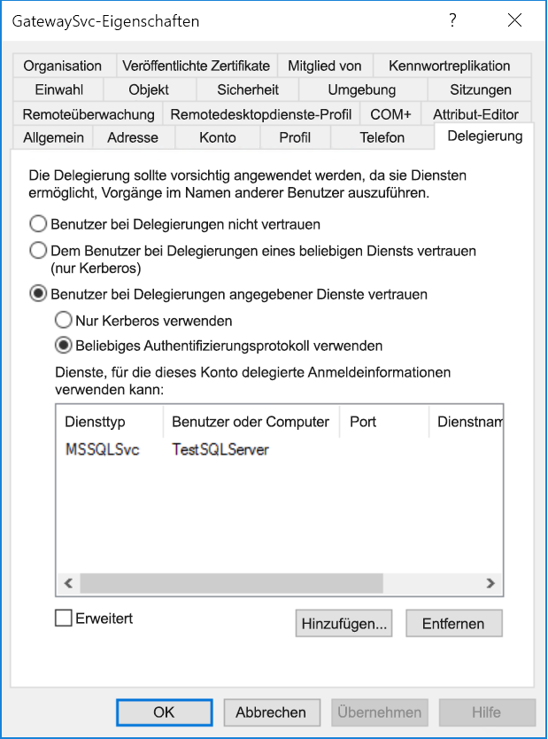
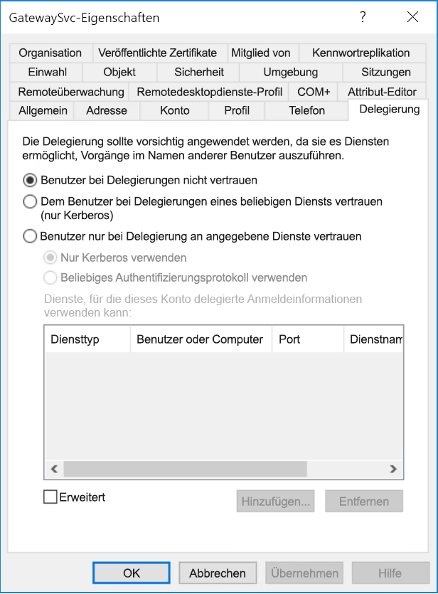
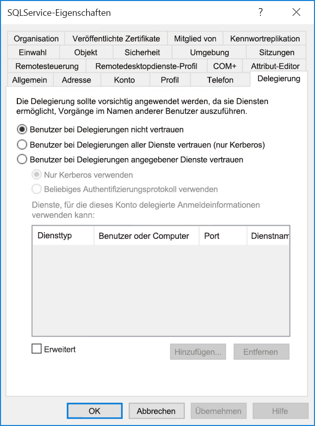
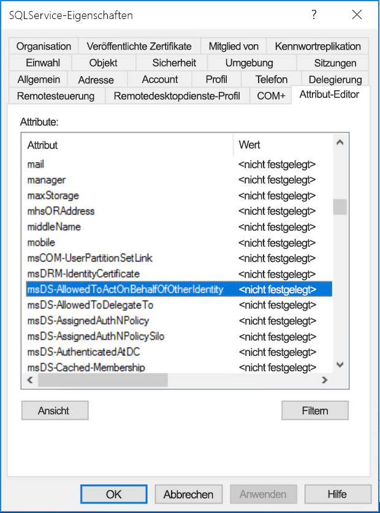

# <a name="configure-kerberos-based-sso-from-power-bi-service-to-on-premises-data-sources"></a>Konfigurieren des Kerberos-basierten einmaligen Anmeldens (Single Sign-On, SSO) im Power BI-Dienst bei lokalen Datenquellen

Verwenden Sie die [eingeschränkte Kerberos-Delegierung](/windows-server/security/kerberos/kerberos-constrained-delegation-overview), um eine nahtlose SSO-Konnektivität zu ermöglichen. Durch das Aktivieren von SSO für Power BI-Berichte und -Dashboards können Daten aus lokalen Datenquellen unter Beachtung der für diese Quellen konfigurierten Benutzerberechtigungen einfacher aktualisiert werden.

Damit die eingeschränkte Kerberos-Delegierung ordnungsgemäß funktioniert, müssen verschiedene Elemente konfiguriert werden, u. a. _Dienstprinzipalnamen_ (SPN) und Delegierungseinstellungen für Dienstkonten.

### <a name="prerequisite-1-install-and-configure-the-microsoft-on-premises-data-gateway"></a>Voraussetzung 1: Installieren und Konfigurieren des lokalen Datengateways von Microsoft

Dieses lokale Datengateway unterstützt das direkte Upgrade sowie die _Übernahme der Einstellungen_ von vorhandenen Gateways.

### <a name="prerequisite-2-run-the-gateway-windows-service-as-a-domain-account"></a>Voraussetzung 2: Ausführen des Gateway-Windows-Diensts als Domänenkonto

Bei einer Standardinstallation wird das Gateway als Dienstkonto des lokalen Computers (speziell _NT Service\PBIEgwService_) ausgeführt (siehe folgende Abbildung):


Zum Aktivieren der eingeschränkten Kerberos-Delegierung muss das Gateway als Domänenkonto ausgeführt werden, es sei denn, Ihre Instanz von Azure Active Directory (Azure AD) ist bereits mit Ihrer lokalen Active Directory-Instanz synchronisiert (mittels Azure AD DirSync/Connect). Weitere Informationen zum Wechseln zu einem Domänenkonto finden Sie unter [Ändern des Dienstkontos für das lokale Datengateway](/data-integration/gateway/service-gateway-service-account).

> [!NOTE]
> Wenn Azure AD Connect konfiguriert ist und Benutzerkonten synchronisiert werden, muss der Gatewaydienst zur Laufzeit keine lokalen Azure AD-Suchläufe ausführen. Stattdessen können Sie einfach die lokale Dienst-SID für den Gatewaydienst verwenden, um alle erforderlichen Konfigurationen in Azure Active Directory vorzunehmen. Die in diesem Artikel beschriebenen Schritte für die Konfiguration der eingeschränkten Kerberos-Delegierung sind identisch mit den Konfigurationsschritten im Azure Active Directory-Kontext. Sie werden lediglich auf das Computerobjekt des Gateways (entsprechend der Identifizierung anhand der Dienst-ID) in Azure AD statt auf das Domänenkonto angewendet.

### <a name="prerequisite-3-have-domain-admin-rights-to-configure-spns-setspn-and-kerberos-constrained-delegation-settings"></a>Voraussetzung 3: Vorhandene Domänenadministratorrechte zum Konfigurieren von SPNs (SetSPN) und Einstellungen für die eingeschränkte Kerberos-Delegierung

Es wird nicht empfohlen, dass ein Domänenadministrator jemand anderem vorübergehend oder dauerhaft Rechte zur Konfiguration von SPNs und Kerberos-Delegierungseinstellungen erteilt, ohne dass diese Person über Domänenadministrationsrechte verfügen muss. Die empfohlenen Konfigurationsschritte werden im folgenden Abschnitt ausführlicher erläutert.

## <a name="configure-kerberos-constrained-delegation-for-the-gateway-and-data-source"></a>Konfigurieren der eingeschränkten Kerberos-Delegierung für das Gateway und die Datenquelle

Konfigurieren Sie als Domänenadministrator einen SPN für das Domänenkonto des Gatewaydiensts (falls erforderlich) sowie Delegierungseinstellungen für dieses Domänenkonto.

### <a name="configure-an-spn-for-the-gateway-service-account"></a>Konfigurieren eines SPN für das Gatewaydienstkonto

Ermitteln Sie zunächst, ob bereits ein SPN für das Domänenkonto erstellt wurde, das als Gatewaydienstkonto verwendet wird:

1. Starten Sie **Active Directory-Benutzer und -Computer** als Domänenadministrator.

2. Klicken Sie mit der rechten Maustaste auf die Domäne, wählen Sie **Suchen** aus, und geben Sie den Kontonamen des Gatewaydienstkontos ein.

3. Klicken Sie im Suchergebnis mit der rechten Maustaste auf das Gatewaydienstkonto, und wählen Sie **Eigenschaften** aus.

4. Wenn im Dialogfeld **Eigenschaften** die Registerkarte **Delegierung** angezeigt wird, wurde bereits ein SPN erstellt, sodass Sie mit [Festlegen der ressourcenbasierten oder standardmäßigen eingeschränkten Kerberos-Delegierung](#decide-on-resource-based-or-standard-kerberos-constrained-delegation) fortfahren können.

    Wenn im Dialogfeld **Eigenschaften** keine Registerkarte namens **Delegierung** angezeigt wird, können Sie einen SPN für das Konto manuell erstellen, um sie zu aktivieren. Verwenden Sie das in Windows enthaltene [setspn-Tool](https://technet.microsoft.com/library/cc731241.aspx). (Für die SPN-Erstellung sind Domänenadministratorrechte erforderlich.)

    Angenommen, das Konto des Gatewaydiensts ist **Contoso\GatewaySvc**, und der Name des Computers, auf dem der Gatewaydienst ausgeführt wird, lautet **MyGatewayMachine**. Zum Festlegen des SPN für das Gatewaydienstkonto führen Sie den folgenden Befehl aus:

    

    Sie können den SPN auch mit dem MMC-Snap-In (Microsoft Management Console) „Active Directory-Benutzer und -Computer“ festlegen.

### <a name="decide-on-resource-based-or-standard-kerberos-constrained-delegation"></a>Festlegen der ressourcenbasierten oder standardmäßigen eingeschränkten Kerberos-Delegierung

Die Delegierungseinstellungen können _entweder_ für die ressourcenbasierte eingeschränkte Kerberos-Delegierung oder die standardmäßige eingeschränkte Kerberos-Delegierung konfiguriert werden. Verwenden Sie die ressourcenbasierte Delegierung, wenn Ihre Datenquelle zu einer anderen Domäne als Ihr Gateway gehört. Beachten Sie jedoch, dass hierfür mindestens Windows Server 2012 erforderlich ist. Weitere Informationen zu den Unterschieden zwischen den beiden Delegierungsansätzen finden Sie auf der [Übersichtsseite zur eingeschränkten Kerberos-Delegierung](/windows-server/security/kerberos/kerberos-constrained-delegation-overview).

 Nachdem Sie entschieden haben, welchen Ansatz Sie befolgen möchten, fahren Sie _entweder_ mit [Konfigurieren des Gatewaydienstkontos für die standardmäßige eingeschränkte Kerberos-Delegierung](#configure-the-gateway-service-account-for-standard-kerberos-constrained-delegation) _oder_ mit [Konfigurieren des Gatewaydienstkontos für die ressourcenbasierte eingeschränkte Kerberos-Delegierung](#configure-the-gateway-service-account-for-resource-based-kerberos-constrained-delegation) fort. Entscheiden Sie sich für nur einen dieser Unterabschnitte.

## <a name="configure-the-gateway-service-account-for-standard-kerberos-constrained-delegation"></a>Konfigurieren des Gatewaydienstkontos für die standardmäßige eingeschränkte Kerberos-Delegierung

> [!NOTE]
> Führen Sie die Schritte in diesem Abschnitt aus, wenn Sie die standardmäßige eingeschränkte Kerberos-Delegierung aktivieren möchten. Wenn Sie die ressourcenbasierte eingeschränkte Kerberos-Delegierung aktivieren möchten, führen Sie die Schritte im Unterabschnitt [Konfigurieren des Gatewaydienstkontos für die ressourcenbasierte eingeschränkte Kerberos-Delegierung](#configure-the-gateway-service-account-for-resource-based-kerberos-constrained-delegation) aus.

Wir legen nun die Delegierungseinstellungen für das Gatewaydienstkonto fest. Es gibt verschiedene Tools, mit denen Sie diese Schritte ausführen können. Hier verwenden wir „Active Directory-Benutzer und -Computer“ – ein Snap-In der MMC (Microsoft Management Console) zur Verwaltung und Veröffentlichung von Informationen im Verzeichnis. Es steht auf Domänencontrollern standardmäßig zur Verfügung, doch Sie können es auch über die Konfiguration von Windows-Features auf anderen Computern aktivieren.

Wir müssen die eingeschränkte Kerberos-Delegierung mit Protokollübertragung konfigurieren. Bei der eingeschränkten Delegierung müssen Sie explizit angeben, für welche Dienste Sie dem Gateway erlauben möchten, delegierte Anmeldeinformationen vorzulegen. Delegierungsaufrufe des Gatewaydienstkontos werden beispielsweise nur von SQL Server oder Ihrem SAP HANA-Server akzeptiert.

In diesem Abschnitt wird davon ausgegangen, dass Sie bereits SPNs für die zugrunde liegenden Datenquellen (wie SQL Server, SAP HANA, SAP BW, Teradata oder Spark) konfiguriert haben. Informationen zum Konfigurieren der SPNs für diese Datenquellenserver finden Sie in der technischen Dokumentation für den jeweiligen Datenbankserver. Weitere Informationen finden Sie auch im Blogbeitrag [My Kerberos Checklist (Checkliste für Kerberos)](https://techcommunity.microsoft.com/t5/SQL-Server-Support/My-Kerberos-Checklist-8230/ba-p/316160) unter *What SPN does your app require? (Welcher SPN ist für die App erforderlich?)* .

In den folgenden Schritten wird davon ausgegangen, dass Sie über eine lokale Umgebung mit zwei Computern in derselben Domäne verfügen: einem Gatewaycomputer und einem Datenbankserver mit SQL Server, die bereits mit auf Kerberos basierendem SSO konfiguriert sind. Die Schritte können für eine der anderen unterstützten Datenquellen übernommen werden, sofern die Datenquelle bereits für Kerberos-basiertes SSO konfiguriert wurde. Für dieses Beispiel wird ebenfalls von folgenden Einstellungen und Namen ausgegangen:

* Active Directory-Domäne (NetBIOS): **Contoso**
* Name des Gatewaycomputers: **MyGatewayMachine**
* Gatewaydienstkonto: **Contoso\GatewaySvc**
* Computername der SQL Server-Datenquelle: **TestSQLServer**
* Dienstkonto der SQL Server-Datenquelle: **Contoso\SQLService**

Konfigurieren Sie die Delegierungseinstellungen wie folgt:

1. Öffnen Sie **Active Directory-Benutzer und -Computer** mit Domänenadministratorrechten.

2. Klicken Sie mit der rechten Maustaste auf das Gatewaydienstkonto (**Contoso\GatewaySvc**), und wählen Sie **Eigenschaften** aus.

3. Wählen Sie die Registerkarte **Delegierung** aus.

4. Wählen Sie **Computer nur bei Delegierungen angegebener Dienste vertrauen** > **Beliebiges Authentifizierungsprotokoll verwenden** aus.

5. Wählen Sie unter **Dienste, für die dieses Konto delegierte Anmeldeinformationen verwenden kann** die Option **Hinzufügen** aus.

6. Wählen Sie im Dialogfeld „Neu“ **Benutzer oder Computer** aus.

7. Geben Sie das Dienstkonto für die Datenquelle ein. Eine SQL Server-Datenquelle kann ein Dienstkonto wie **Contoso\SQLService** aufweisen. Auf diesem Konto sollte bereits ein entsprechender Dienstprinzipalname für die Datenquelle festgelegt sein. Klicken Sie auf **OK**, sobald das Konto hinzugefügt wurde.

8. Wählen Sie den SPN aus, den Sie für den Datenbankserver erstellt haben. In unserem Beispiel beginnt der SPN mit **MSSQLSvc**. Wenn Sie sowohl den FQDN als auch den NetBIOS-SPN für den Datenbankdienst hinzugefügt haben, wählen Sie beide aus. Unter Umständen wird nur eine einzelne Option angezeigt.

9. Wählen Sie **OK**aus. Der Dienstprinzipalname sollte nun in der Liste der Dienste aufgeführt werden, für die das Gatewaydienstkonto delegierte Anmeldeinformationen verwenden kann.

    

Fahren Sie als Nächstes mit [Erteilen von lokalen Richtlinienrechten auf dem Gatewaycomputer für das Gatewaydienstkonto](#grant-the-gateway-service-account-local-policy-rights-on-the-gateway-machine) fort, um das Setup fortzusetzen.

## <a name="configure-the-gateway-service-account-for-resource-based-kerberos-constrained-delegation"></a>Konfigurieren des Gatewaydienstkontos für die ressourcenbasierte eingeschränkte Kerberos-Delegierung

> [!NOTE]
> Führen Sie die Schritte in diesem Abschnitt aus, wenn Sie die ressourcenbasierte eingeschränkte Kerberos-Delegierung aktivieren möchten. Wenn Sie die standardmäßige eingeschränkte Kerberos-Delegierung aktivieren möchten, führen Sie die Schritte im Unterabschnitt [Konfigurieren des Gatewaydienstkontos für die standardmäßige eingeschränkte Kerberos-Delegierung](#configure-the-gateway-service-account-for-standard-kerberos-constrained-delegation) aus.

Verwenden Sie die [ressourcenbasierte eingeschränkte Kerberos-Delegierung](/windows-server/security/kerberos/kerberos-constrained-delegation-overview), um SSO-Konnektivität für Windows Server 2012 und höhere Versionen zu ermöglichen und so zuzulassen, dass sich Front-End- und Back-End-Dienste in unterschiedlichen Domänen befinden. Damit dies funktioniert, muss die Domäne des Back-End-Diensts der Domäne des Front-End-Diensts vertrauen.

In den folgenden Schritten wird davon ausgegangen, dass Sie eine lokale Umgebung mit zwei Computern in unterschiedlichen Domänen haben: einem Gatewaycomputer und einem Datenbankserver mit SQL Server, die bereits mit Kerberos-basiertem SSO konfiguriert sind. Die Schritte können für eine der anderen unterstützten Datenquellen übernommen werden, sofern die Datenquelle bereits für Kerberos-basiertes SSO konfiguriert wurde. In diesem Beispiel wird außerdem von folgenden Einstellungen und Namen ausgegangen:

* Active Directory-Front-End-Domäne (NetBIOS): **ContosoFrontEnd**
* Active Directory-Back-End-Domäne (NetBIOS): **ContosoBackEnd**
* Name des Gatewaycomputers: **MyGatewayMachine**
* Gatewaydienstkonto: **ContosoFrontEnd\GatewaySvc**
* Computername der SQL Server-Datenquelle: **TestSQLServer**
* Dienstkonto der SQL Server-Datenquelle: **ContosoBackEnd\SQLService**

Führen Sie für diese Beispielnamen und -einstellungen die folgenden Konfigurationsschritte aus:

1. Stellen Sie mithilfe von **Active Directory-Benutzer und -Computer**, einem Snap-In der Microsoft Management Console (MMC), auf dem Domänencontroller für die Domäne **ContosoFrontEnd** sicher, dass für das Gatewaydienstkonto keine Delegierungseinstellungen gelten.

    

2. Stellen Sie mithilfe von **Active Directory-Benutzer und -Computer** auf dem Domänencontroller für die Domäne **ContosoBackEnd** sicher, dass für das Back-End-Dienstkonto keine Delegierungseinstellungen gelten.

    

3. Vergewissern Sie sich darüber hinaus, dass das Attribut **msDS-AllowedToActOnBehalfOfOtherIdentity** für dieses Konto ebenfalls nicht festgelegt ist. Sie finden dieses Attribut im **Attribut-Editor** (siehe die folgende Abbildung):

    

4. Erstellen Sie in **Active Directory-Benutzer und -Computer** auf dem Domänencontroller für die Domäne **ContosoBackEnd** eine Gruppe. Fügen Sie dieser Gruppe das Gatewaydienstkonto hinzu, wie in der folgenden Abbildung dargestellt. Die Abbildung zeigt eine neue Gruppe namens _ResourceDelGroup_ und das dieser Gruppe hinzugefügte Gatewaydienstkonto **GatewaySvc**.

    

5. Öffnen Sie die Eingabeaufforderung, und führen Sie auf dem Domänencontroller für die Domäne **ContosoBackEnd** die folgenden Befehle aus, um das Attribut **msDS-AllowedToActOnBehalfOfOtherIdentity** des Back-End-Dienstkontos zu aktualisieren:

    ```powershell
    $c = Get-ADGroup ResourceDelGroup
    Set-ADUser SQLService -PrincipalsAllowedToDelegateToAccount $c
    ```

6. Sie können überprüfen, ob das Update auf der Registerkarte „Attribut-Editor“ in den Eigenschaften für das Back-End-Dienstkonto in **Active Directory-Benutzer und -Computer** angezeigt wird. Das Attribut **msDS-AllowedToActOnBehalfOfOtherIdentity** sollte nun festgelegt sein.

## <a name="grant-the-gateway-service-account-local-policy-rights-on-the-gateway-machine"></a>Erteilen der lokalen Richtlinienrechte auf dem Gatewaycomputer für das Gatewaydienstkonto

Abschließend müssen dem Gatewaydienstkonto auf dem Computer, auf dem der Gatewaydienst (in diesem Beispiel **MyGatewayMachine**) ausgeführt wird, die lokalen Richtlinien **Annehmen der Clientidentität nach Authentifizierung** und **Einsetzen als Teil des Betriebssystems (SeTcbPrivilege)** erteilt werden. Diese Konfiguration kann über den lokalen Gruppenrichtlinien-Editor (**gpedit**) ausgeführt und überprüft werden.

1. Führen Sie auf dem Gatewaycomputer Folgendes aus: *gpedit.msc*

2. Navigieren Sie zu **Richtlinie für „Lokaler Computer“** &gt;**Computerkonfiguration**&gt;**Windows-Einstellungen**&gt;**Sicherheitseinstellungen**&gt;**Lokale Richtlinien**&gt;**Zuweisen von Benutzerrechten**.

    

3. Wählen Sie unter **Zuweisen von Benutzerrechten** in der Richtlinienliste den Eintrag **Annehmen der Clientidentität nach Authentifizierung** aus.

    

    Klicken Sie mit der rechten Maustaste, und öffnen Sie **Eigenschaften**. Überprüfen Sie die Kontenliste. Sie muss das Gatewaydienstkonto enthalten (je nach Typ der eingeschränkten Delegierung **Contoso\GatewaySvc** oder **ContosoFrontEnd\GatewaySvc**).

4. Wählen Sie unter **Zuweisen von Benutzerrechten** in der Richtlinienliste den Eintrag **Als Teil des Betriebssystems fungieren (SeTcbPrivilege)** aus. Vergewissern Sie sich, dass das Gatewaydienstkonto auch in der Liste der Konten aufgeführt wird.

5. Starten Sie den Dienstprozess **Lokales Datengateway** neu.

### <a name="set-user-mapping-configuration-parameters-on-the-gateway-machine-if-required"></a>Festlegen von Konfigurationsparametern je nach Bedarf für die Benutzerzuordnung auf dem Gatewaycomputer

Wenn Azure AD Connect nicht konfiguriert ist, führen Sie die folgenden Schritte aus, um einen Power BI-Dienstbenutzer einem lokalen Active Directory-Benutzer zuzuordnen. Jeder Active Directory Benutzer, der auf diese Weise zugeordnet wird, muss über SSO-Berechtigungen für Ihre Datenquelle verfügen. Weitere Informationen finden Sie in diesem [Guy in a Cube-Video](https://www.youtube.com/watch?v=NG05PG9aiRw).

1. Öffnen Sie die Hauptdatei für die Gatewaykonfiguration (`Microsoft.PowerBI.DataMovement.Pipeline.GatewayCore.dll`). Standardmäßig befindet sich diese Datei unter C:\Programme\Lokales Datengateway.

1. Legen Sie **ADUserNameLookupProperty** auf ein nicht verwendetes Active Directory Attribut fest. Wir gehen davon aus, dass `msDS-cloudExtensionAttribute1` in den folgenden Schritten verwendet wird, obwohl dieses Attribut nur in Windows Server 2012 und höher verfügbar ist. Legen Sie **ADUserNameReplacementProperty** auf `SAMAccountName` fest. Speichern Sie die Konfigurationsdatei.

1. Klicken Sie auf der Registerkarte **Dienste** des Task-Managers mit der rechten Maustaste auf den Gatewaydienst, und wählen Sie **Neu starten** aus.

    

1. Legen Sie für jeden Power BI-Dienstbenutzer, für den Sie Kerberos SSO aktivieren möchten, die Eigenschaft `msDS-cloudExtensionAttribute1` eines lokalen Active Directory-Benutzers (mit SSO-Berechtigung für Ihre Datenquelle) auf den vollständigen Benutzernamen (d. h. den UPN) des Power BI-Dienstbenutzers fest. Wenn Sie sich beispielsweise als `test@contoso.com` beim Power BI-Dienst anmelden und diesen Benutzer einem lokalen Active Directory-Benutzer mit SSO-Berechtigungen, beispielsweise `test@LOCALDOMAIN.COM`, zuordnen möchten, legen Sie das Attribut `msDS-cloudExtensionAttribute1` von `test@LOCALDOMAIN.COM` auf `test@contoso.com` fest.

    Sie können die `msDS-cloudExtensionAttribute1`-Eigenschaft auch mit dem MMC-Snap-In (Microsoft Management Console) „Active Directory-Benutzer und -Computer“ festlegen:
    
    1. Starten Sie „Active Directory-Benutzer und -Computer“ als Domänenadministrator.
    
    1. Klicken Sie mit der rechten Maustaste auf die Domäne, wählen Sie „Suchen“ aus, und geben Sie den Kontonamen des lokalen Active Directory-Benutzers ein, zu dem die Zuordnung erfolgen soll.
    
    1. Wählen Sie die Registerkarte **Attribute Editor** (Attribut-Editor) aus.
    
        Suchen Sie nach der Eigenschaft `msDS-cloudExtensionAttribute1`, und doppelklicken Sie darauf. Legen Sie den Wert auf den vollständigen Benutzernamen (d. h. den UPN) fest, den Sie für die Anmeldung beim Power BI-Dienst verwenden.
    
    1. Wählen Sie **OK**aus.
    
        
    
    1. Klicken Sie auf **Übernehmen**. Vergewissern Sie sich in der Spalte **Value** (Wert), dass der korrekte Wert festgelegt wurde.

## <a name="complete-data-source-specific-configuration-steps"></a>Vervollständigen von datenquellenspezifischen Konfigurationsschritten

Für SAP HANA und SAP BW gelten zusätzliche datenquellenspezifische Konfigurationsanforderungen und Voraussetzungen, die erfüllt sein müssen, bevor Sie mit diesen Datenquellen eine SSO-Verbindung über das Gateway herstellen können. Weitere Informationen finden Sie auf der [SAP HANA-Konfigurationsseite](service-gateway-sso-kerberos-sap-hana.md) und der [ Konfigurationsseite für SAP BW – CommonCryptoLib (sapcrypto.dll)](service-gateway-sso-kerberos-sap-bw-commoncryptolib.md). Es ist auch möglich, [SAP BW für die Verwendung mit der SNC-Bibliothek „gx64krb5“ zu konfigurieren](service-gateway-sso-kerberos-sap-bw-gx64krb.md), aber diese Bibliothek wird von Microsoft nicht empfohlen, da sie von SAP nicht mehr unterstützt wird. Sie sollten CommonCryptoLib _oder_ gx64krb5 als Ihre SNC-Bibliothek verwenden. Führen Sie die Konfigurationsschritte nicht für beide Bibliotheken aus.

> [!NOTE]
> Andere SNC-Bibliotheken funktionieren ggf. auch für einmaliges Anmelden bei SAP BW, werden aber von Microsoft nicht offiziell unterstützt.

## <a name="run-a-power-bi-report"></a>Ausführen eines Power BI-Berichts

Nach Abschluss aller Konfigurationsschritte können Sie in Power BI auf der Seite **Gateway verwalten** die von Ihnen verwendete Datenquelle für SSO konfigurieren. Wenn Sie über mehrere Gateways verfügen, stellen Sie sicher, dass Sie das Gateway auswählen, das Sie für Kerberos SSO konfiguriert haben. Stellen Sie sicher, dass für die Datenquelle unter **Erweiterte Einstellungen** das Kontrollkästchen **SSO über Kerberos für DirectQuery-Abfragen verwenden** aktiviert ist.


 Veröffentlichen Sie einen **DirectQuery-basierten**-Bericht aus Power BI Desktop. Dieser Bericht muss Daten verwenden, auf die der Benutzer zugreifen kann, der dem (Azure) Active Directory-Benutzer zugeordnet ist, der sich am Power BI-Dienst anmeldet. Aufgrund der Funktionsweise der Aktualisierung müssen Sie DirectQuery anstelle von Import verwenden. Beim Aktualisieren importbasierter Berichte verwendet das Gateway die Anmeldeinformationen, die Sie beim Erstellen der Datenquelle in die Felder **Benutzername** und **Kennwort** eingegeben haben. Das bedeutet, dass Kerberos-SSO **nicht** verwendet wird. Stellen Sie außerdem beim Veröffentlichen sicher, dass Sie das Gateway auswählen, das Sie für SSO konfiguriert haben, sofern Sie über mehrere Gateways verfügen. Sie sollten nun im Power BI-Dienst in der Lage sein, den Bericht zu aktualisieren oder einen neuen Bericht auf der Grundlage des veröffentlichten Datasets zu erstellen.

Diese Konfiguration funktioniert in den meisten Fällen. Bei Kerberos können jedoch je nach Umgebung unterschiedliche Konfigurationen vorhanden sein. Sollte der Bericht immer noch nicht geladen werden, wenden Sie sich zur weiteren Untersuchung an Ihren Domänenadministrator. Wenn SAP BW Ihre Datenquelle ist, können Sie, je nachdem, welche SNC-Bibliothek Sie ausgewählt haben, auch die Abschnitte zur Problembehandlung auf den datenquellenspezifischen Konfigurationsseiten für [CommonCryptoLib](service-gateway-sso-kerberos-sap-bw-commoncryptolib.md#troubleshooting) und [gx64krb5/gsskrb5](service-gateway-sso-kerberos-sap-bw-gx64krb.md#troubleshooting) lesen.

## <a name="next-steps"></a>Nächste Schritte

Weitere Informationen zum **lokalen Datengateway** und zu **DirectQuery** finden Sie in den folgenden Ressourcen:

* [What is an on-premises data gateway? (Was ist ein lokales Datengateway?)](/data-integration/gateway/service-gateway-onprem)
* [DirectQuery in Power BI](desktop-directquery-about.md)
* [Von DirectQuery unterstützte Datenquellen](desktop-directquery-data-sources.md)
* [DirectQuery und SAP BW](desktop-directquery-sap-bw.md)
* [DirectQuery und SAP HANA](desktop-directquery-sap-hana.md)
