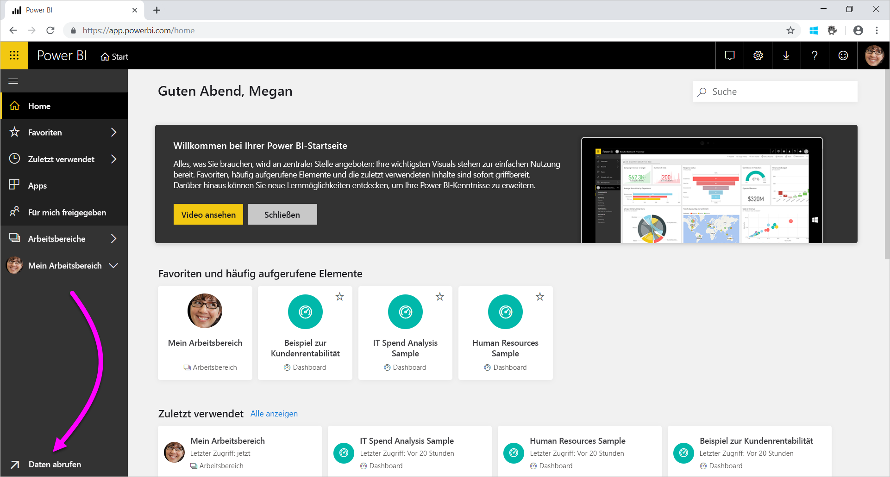
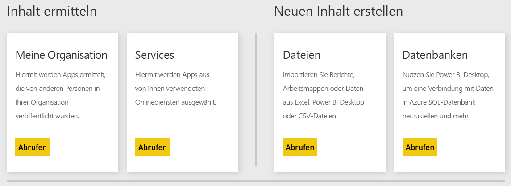

# Datenquellen für den Power BI-Dienst
Daten sind der Kern von Power BI. Nehmen wir an, dass Sie Daten untersuchen. Hierfür können Sie Diagramme und Dashboards erstellen oder über die **Q&A**-Funktion Fragen stellen. Die angezeigten Visualisierungen und Antworten rufen die zugrunde liegenden Daten aus einem Dataset ab. Doch woher stammt das Dataset? Es stammt aus einer Datenquelle.

In diesem Artikel werden die Datenquellentypen beschrieben, mit denen Sie über den Power BI-Dienst eine Verbindung herstellen können. Denken Sie daran, dass Sie Daten auch aus vielen weiteren Datenquellentypen beziehen können. Wenn Sie diese Datenquellen auswählen, kann es erforderlich sein, zunächst die Power BI Desktop- oder Excel-Features für erweitere Datenabfragen oder Datenmodellierung zu verwenden. Diese Optionen werden im Verlauf des Artikels näher erläutert. Zunächst sollen die unterschiedlichen Datenquellentypen betrachtet werden, die über die Website des Power BI-Diensts verfügbar sind.

Sie können Daten aus allen Power BI-Datenquellen abrufen, indem Sie in der unteren linken Ecke der Seite auf **Daten abrufen** klicken.

 

Nachdem Sie auf **Daten abrufen** geklickt haben, können Sie die Daten auswählen, auf die Sie zugreifen möchten.

## Inhalt ermitteln

Im Abschnitt **Inhalt ermitteln** sind bereits alle Daten und Berichte vorbereitet, die Sie benötigen. Es gibt zwei Arten von Inhaltspaketen in Power BI: für Organisationen und für Dienste. 

**Organisationen:** Wenn Sie und andere Benutzer in Ihrer Organisation über ein Power BI Pro-Konto verfügen, können Sie Inhaltspakete erstellen, freigeben und verwenden. Weitere Informationen finden Sie unter [Einführung in organisationsbezogene Inhaltspakete in Power BI](service-organizational-content-pack-introduction.md).

**Dienste:** Es gibt Dutzende von Diensten mit Inhaltspaketen für Power BI, und ihre Anzahl nimmt ständig zu. Für die meisten Dienste benötigen Sie ein Konto. Weitere Informationen finden Sie unter [Herstellung einer Verbindung mit den verwendeten Diensten mithilfe von Power BI](service-connect-to-services.md).

## Neuen Inhalt erstellen

Im Abschnitt **Neuen Inhalt erstellen** finden Sie Optionen für das Erstellen und Importieren von Inhalten. In Power BI gibt es zwei Möglichkeiten, um eigene Inhalte zu erstellen oder zu importieren: Dateien und Datenbanken. 

### Dateien

**Excel** ( *.xlsx*, *.xlsm*): Eine Excel-Arbeitsmappe kann unterschiedliche Datentypen enthalten. Dazu zählen beispielsweise Daten, die Sie selbst in das Arbeitsblatt eingetragen haben. Sie kann auch Daten enthalten, die Sie abgefragt und mithilfe von Power Query aus externen Datenquellen geladen haben. Power Query ist in Excel 2016 oder Power Pivot über die Funktionen zum **Abrufen und Transformieren** verfügbar. Sie können Daten aus Tabellen in Arbeitsblättern oder aus einem Datenmodell importieren. Weitere Informationen finden Sie unter [Abrufen von Daten aus Dateien für Power BI](service-get-data-from-files.md).

**Power BI Desktop** ( *.pbix*): Sie können mithilfe von Power BI Desktop Daten aus externen Datenquellen abfragen und laden und Berichte erstellen. Sie können Ihr Datenmodell zudem mit Measures und Beziehungen erweitern oder Ihre Power BI Desktop-Datei auf Ihre Power BI-Website importieren. Power BI Desktop ist für erfahrene Benutzer am besten geeignet. Diese Benutzer haben in der Regel gute Kenntnisse über Datenquellen. Sie sind auch mit der Abfrage und Transformation von Daten und mit den Konzepten zur Datenmodellierung vertraut. Weitere Informationen finden Sie unter [Verbinden mit Daten in Power BI Desktop](desktop-connect-to-data.md).

**Durch Trennzeichen getrennte Dateien** ( *.csv*): Hierbei handelt es sich um einfache Textdateien mit Datenzeilen. Jede Zeile kann einen oder mehrere Werte enthalten, die jeweils durch ein Komma getrennt sind. Eine *CSV*-Datei, die Daten zu Namen und Adressen enthält, kann beispielsweise aus vielen Zeilen bestehen. Jede Zeile kann Werte wie den Vornamen, den Nachnamen, den Straßennamen, die Stadt und das Bundesland enthalten. Sie können keine Daten in eine *CSV*-Datei importieren. Viele Anwendungen, z. B. Excel, können jedoch einfache Tabellendaten als *CSV*-Datei speichern.

Für andere Dateitypen, z. B. XML-Tabellendateien ( *.xml*) oder Textdateien ( *.txt*), können Sie zunächst die Funktionen zum **Abrufen und Transformieren** verwenden, um Daten abzufragen, zu transformieren und in eine Excel- oder Power BI Desktop-Datei zu laden. Anschließend können Sie die Excel- oder Power BI Desktop-Datei nach Power BI importieren.

Es macht zudem einen erheblichen Unterschied, wo Sie die Dateien speichern. OneDrive for Business bietet das größte Maß an Flexibilität und Integration in Power BI. Sie können Ihre Dateien auf einem lokalen Laufwerk speichern. Es sind dann jedoch zusätzliche Schritte erforderlich, wenn Sie Ihre Daten aktualisieren müssen. Weitere Informationen finden Sie in den folgenden Artikeln.

### Datenbanken

**Datenbanken in der Cloud:** Sie können über den Power BI-Dienst eine Liveverbindung mit folgenden Diensten herstellen:

* Azure SQL-Datenbank
* Azure SQL Data Warehouse
* Spark on Azure HDInsight

Bei diesen Power BI-Datenbankverbindungen handelt es sich um Liveverbindungen. Nehmen Sie an, dass Sie eine Verbindung mit einer Instanz von Azure SQL-Datenbank herstellen möchten. Zunächst untersuchen Sie dann die Daten, indem Sie Berichte in Power BI erstellen. Wenn Sie die Daten segmentieren oder ein Feld zu einer Visualisierung hinzufügen, fragt Power BI die Datenbank ab. Weitere Informationen finden Sie unter [Azure und Power BI](service-azure-and-power-bi.md).

**Lokale Datenbanken:** Sie können im Power BI-Dienst eine direkte Verbindung mit SQL Server Analysis Services-Datenbanken für tabellarische Modelle herstellen. Hierfür benötigen Sie ein Power BI-Enterprise-Gateway. Wenn Sie nicht genau wissen, wie Sie eine Verbindung mit der Datenbank für tabellarische Modelle Ihrer Organisation herstellen können, wenden Sie sich an den Administrator oder die IT-Abteilung. Weitere Informationen finden Sie unter [SQL Server Analysis Services-Livedaten in Power BI](sql-server-analysis-services-tabular-data.md).

Für andere Datenbanktypen in Ihrer Organisation müssen Sie mithilfe von Power BI Desktop oder Excel eine Verbindung mit den Daten herstellen, diese abfragen und in ein Datenmodell laden. Anschließend können Sie die Datei in Power BI importieren. Dort ist ein Dataset vorhanden. Wenn Sie eine geplante Aktualisierung konfigurieren, verwendet Power BI die Konfiguration und die Verbindungsinformationen aus der Datei, um eine direkte Verbindung mit der Datenquelle herzustellen und Updates abzufragen. Power BI lädt diese Updates dann in das Dataset. Weitere Informationen finden Sie unter [Verbinden mit Daten in Power BI Desktop](desktop-connect-to-data.md).

## Was muss ich beachten, wenn die Daten aus einer anderen Quelle stammen?
Es gibt Hunderte Datenquellen, die Sie mit Power BI verwenden können. Die Daten müssen jedoch immer in einem Format vorliegen, das vom Power BI-Dienst unterstützt wird. Aus nutzbaren Daten kann der Power BI-Dienst beispielsweise Berichte und Dashboards erstellen und Fragen über die **Q&A**-Funktion beantworten.

Einige Datenquellen enthalten bereits Daten, die für den Power BI-Dienst formatiert wurden. Diese Quellen sind mit Inhaltspaketen von Dienstanbietern wie Google Analytics oder Twilio vergleichbar. Die SQL Server Analysis Services-Datenbanken für tabellarische Modelle weisen ebenfalls ein geeignetes Format auf. Sie können zudem eine Liveverbindung mit Datenbanken in der Cloud, z. B. Azure SQL-Datenbank und Spark on HDInsight, herstellen.

In anderen Fällen müssen Sie möglicherweise die gewünschten Daten abfragen und in eine Datei laden. Angenommen, Sie speichern Logistikdaten in Ihrer Organisation. Diese Daten werden in einer Data Warehouse-Datenbank auf einem Server gespeichert. Sie können im Power BI-Dienst keine Verbindung mit der Datenbank herstellen und mit der Untersuchung der Daten beginnen (es sei denn, es handelt sich um eine Datenbank für tabellarische Modelle). Sie können jedoch mit Power BI Desktop oder Excel die Logistikdaten abfragen und in ein Datenmodell laden, das Sie dann als Datei speichern. Anschließend können Sie diese Datei in Power BI importieren. Dort ist ein Dataset vorhanden.

Sie denken jetzt wahrscheinlich, dass sich die Logistikdaten in der Datenbank täglich ändern und fragen sich, wie Sie Ihr Power BI-Dataset aktualisieren können. Wenn Sie die Daten in das Dataset importieren, werden auch die Verbindungsinformationen aus der Power BI Desktop- oder Excel-Datei importiert.

Angenommen, Sie konfigurieren eine geplante Aktualisierung oder aktualisieren das Dataset manuell. Power BI verwendet die Verbindungsinformationen des Datasets und einige andere Einstellungen, um eine direkte Verbindung mit der Datenbank herzustellen. Diese wird dann nach Updates abgefragt, und die Updates werden in das Dataset geladen. Sie benötigen voraussichtlich ein Power BI-Gateway, um die Datenübertragung zwischen dem lokalen Server und Power BI zu sichern. Nach der Übertragung werden alle Visualisierungen in Berichten und Dashboards automatisch aktualisiert.

Obwohl Sie keine direkte Verbindung vom Power BI-Dienst mit der Datenquelle herstellen können, können Sie die Daten also dennoch in Power BI übertragen. Es sind lediglich einige zusätzliche Schritte und eventuell ein wenig Hilfe von der IT-Abteilung erforderlich. Weitere Informationen finden Sie unter [Datenquellen in Power BI Desktop](desktop-data-sources.md).

## Einige weitere Informationen
Sie treffen in Power BI häufig auf die Begriffe „Dataset“ und „Datenquelle“. Diese werden häufig synonym verwendet. Sie sind zwar verwandt, aber dennoch sehr unterschiedlich.

Ein **Dataset** wird in Power BI automatisch verwendet, wenn Sie die Funktion **Daten abrufen** nutzen. Mit der Funktion **Daten abrufen** stellen Sie eine Verbindung mit einem Inhaltspaket oder eine Datei her, um Daten aus diesen zu importieren, oder Sie stellen eine Verbindung mit einer Livedatenquelle her. Ein Dataset enthält Informationen zur Datenquelle und den zugehörigen Anmeldeinformationen. Häufig enthält es auch eine Teilmenge der Daten, die aus der Datenquelle kopiert wurden. Beim Erstellen von Visualisierungen in Berichten und Dashboards basieren diese häufig auf Daten im Dataset.

Eine **Datenquelle** entspricht der Quelle der Daten in einem Dataset. Die Daten können beispielsweise aus folgenden Quellen stammen:

* einem Onlinedienst wie Google Analytics oder QuickBooks
* einer Datenbank in der Cloud wie Azure SQL-Datenbank
* einer Datenbank oder Datei auf einem lokalen Computer oder Server in Ihrer Organisation

## Datenaktualisierung
Wenn Sie Ihre Dateien auf einem lokalen Laufwerk oder einem Organisationslaufwerk speichern, benötigen Sie voraussichtlich ein Power BI-Gateway, um das Dataset in Power BI zu aktualisieren. Der Computer, auf dem die Dateien gespeichert sind, muss bei der Aktualisierung eingeschaltet sein. Sie können die Datei noch mal importieren oder die Funktion „Veröffentlichen“ in Excel oder Power BI Desktop verwenden. Diese Vorgänge laufen jedoch nicht automatisiert ab.

Wenn Sie die Dateien in OneDrive for Business oder SharePoint für Teamwebsites speichern, können Sie diese mit Power BI verbinden oder sie in Power BI importieren. Ihre Datasets, Berichte und Dashboards sind dann immer auf dem neuesten Stand. Da sich OneDrive und Power BI in der Cloud befinden, kann Power BI eine direkte Verbindung mit der gespeicherten Datei herstellen. Die Verbindung wird etwa einmal pro Stunde hergestellt, um zu überprüfen, ob Updates vorliegen. Das Dataset und sämtliche Visualisierungen werden automatisch aktualisiert, wenn Updates vorhanden sind.

Inhaltspakete aus Diensten werden automatisch aktualisiert. In den meisten Fällen werden diese einmal täglich aktualisiert. Sie können sie zwar manuell aktualisieren, aber es hängt vom Dienstanbieter ab, ob aktualisierte Daten angezeigt werden. Ob und wie die Inhaltspakete von Benutzern in Ihrer Organisation aktualisiert werden, hängt von der verwendeten Datenquelle ab. Zudem ist entscheidend, wie der Ersteller des Inhaltspakets die Aktualisierung konfiguriert hat.

Bei Azure SQL-Datenbank, Azure SQL Data Warehouse und Spark on Azure HDInsight handelt es sich um Datenquellen in der Cloud. Da sich der Power BI-Dienst ebenfalls in der Cloud befindet, kann Power BI mithilfe von **DirectQuery** eine Liveverbindung mit diesen Datenquellen herstellen. Die Daten in Power BI werden immer synchronisiert, und Sie müssen keine geplante Aktualisierung einrichten.

Wenn Sie von Power BI aus eine Verbindung mit SQL Server Analysis Services herstellen, handelt es sich wie bei einer Azure-Datenbank in der Cloud um eine Liveverbindung. Der Unterschied besteht darin, dass sich die Datenbank auf einem Organisationsserver befindet. Für diese Verbindungsart ist ein Power BI-Gateway erforderlich, das von der IT-Abteilung konfiguriert werden muss.

Die Datenaktualisierung ist ein äußerst wichtiger Aspekt von Power BI und zu komplex, um an dieser Stelle umfassend behandelt zu werden. Wenn Sie gründliche Kenntnisse zu diesem Aspekt erwerben möchten, lesen Sie [Aktualisieren von Daten in Power BI](refresh-data.md).

## Überlegungen und Einschränkungen
Für alle im Power BI-Dienst verwendeten Datenquellen gelten die folgenden Einschränkungen. Es gibt weitere Einschränkungen, die für bestimmte Features gelten, die folgende Liste gilt jedoch für den gesamten Power BI-Dienst:

* **Beschränkung der Datasetgröße**: Es gibt eine Einschränkung von 1 GB für Datasets, die in gemeinsam verwendeten Kapazitäten im Power BI-Dienst gespeichert sind. Wenn Sie größere Datasets benötigen, können Sie [Power BI Premium](service-premium-what-is.md)verwenden.

* **Verschiedene Werte in einer Spalte**: Beim Zwischenspeichern von Daten in einem Power BI-Dataset (manchmal auch als „Importmodus“ bezeichnet) gibt es einen Grenzwert von 1.999.999.997 für die Anzahl der verschiedenen Werte, die in einer Spalte gespeichert werden können.

* **Zeilenbegrenzung**: Wenn Sie **DirectQuery** verwenden, legt Power BI eine Obergrenze für die Abfrageergebnisse fest, die an Ihre zugrunde liegende Datenquelle gesendet werden. Wenn die an die Datenquelle gesendete Abfrage mehr als eine Million Zeilen zurückgibt, wird ein Fehler angezeigt, und die Abfrage schlägt fehl. Ihre zugrunde liegenden Daten können trotzdem mehr als eine Million Zeilen enthalten. Es ist unwahrscheinlich, dass Sie diese Obergrenze erreichen, da die meisten Berichte die Daten in kleinere Ergebnismengen zusammenfassen.

* **Spaltenbeschränkung:** Für alle Tabellen im Dataset sind zusammen maximal 16.000 Spalten zulässig. Diese Einschränkung gilt für den Power BI-Dienst und für in Power BI Desktop verwendete Datasets. Power BI verfolgt die Anzahl der Spalten und Tabellen im Dataset auf diese Weise nach. Dies bedeutet, dass die maximale Anzahl der Spalten 16.000 minus eine Spalte für jede Tabelle im Dataset beträgt.

