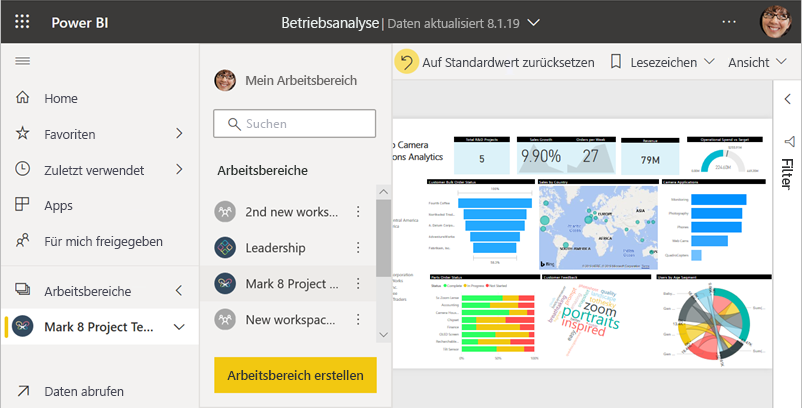
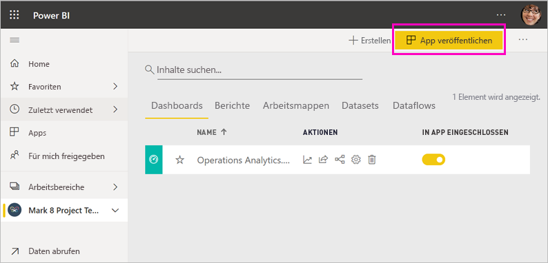
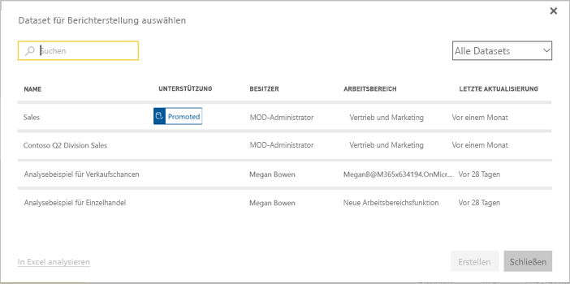
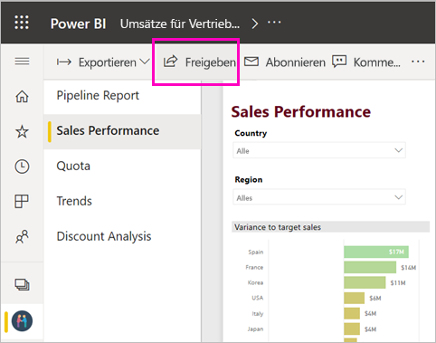

# Freigeben Ihrer Arbeit in Power BI

Sie haben Dashboards und Berichte erstellt. Zusätzlich kann es der Fall sein, dass Sie gemeinsam mit Ihren Kollegen an diesen Dashboards und Berichten gearbeitet haben. Nun möchten Sie, dass andere Benutzer Zugriff auf die Dashboards und Berichte haben. Was ist die beste Möglichkeit, um sie zu verteilen? In diesem Artikel werden folgende Optionen für die Zusammenarbeit und die Freigabe in Power BI verglichen:

* Zusammenarbeit mit Kollegen, um aussagekräftige Berichte und Dashboards in *Arbeitsbereichen* zu erstellen
* Bündeln dieser Dashboards und Berichte in *Apps* und Verteilen der Apps an eine größere Gruppe oder die gesamte Organisation
* Erstellen *freigegebener Datasets*, die Ihre Kollegen als Grundlage für eigene Berichte in eigenen Arbeitsbereichen verwenden können
* Erstellen einer *Vorlagen-App*, die Sie externen Power BI-Benutzern über Microsoft AppSource zur Verfügung stellen können
* Freigeben von Dashboards oder Berichten für andere Personen über den Dienst oder mobile Power BI-Apps
* Drucken von Berichten
* *Einbetten* von Berichten in sichere Portale oder öffentliche Websites

Unabhängig von der ausgewählten Option benötigen Sie zum Freigeben von Inhalten eine [Power BI Pro-Lizenz](service-features-license-type.md), oder es muss sich um Inhalte in einer [Premium-Kapazität](service-premium-what-is.md) handeln. Die Lizenzanforderungen für die Kollegen, die Ihre Inhalte anzeigen, sind von der ausgewählten Option abhängig. In den folgenden Abschnitten werden die Einzelheiten erläutert. 

*Apps im Power BI-Dienst*

## Zusammenarbeit in einem Arbeitsbereich

Bei der Arbeit im Team ist der Zugriff auf die gleichen Dokumente erforderlich, damit die Zusammenarbeit schnell erfolgen kann. In Power BI-Arbeitsbereichen können Teams effektiv zusammenarbeiten, um Dashboards, Berichte, Datasets und Arbeitsmappen gemeinsam zu besitzen und zu verwalten. Manchmal organisieren Power BI-Benutzer Ihre Arbeitsbereiche basierend auf Organisationsstrukturen, in anderen Fällen erstellen sie sie für bestimmte Projekte. Andere Organisationen verwenden mehrere Arbeitsbereiche zum Speichern verschiedener Versionen von Berichten oder Dashboards, die sie verwenden. 

Arbeitsbereiche enthalten Rollen, die bestimmen, welche Berechtigungen Ihre Kollegen haben. Sie können über diese Rollen festlegen, wer den gesamten Arbeitsbereich verwalten oder die Inhalte bearbeiten und verteilen kann.

Sie können Inhalte unter „Mein Arbeitsbereich“ speichern und diese von dort aus teilen. Arbeitsbereiche sind für die Zusammenarbeit jedoch besser als „Mein Arbeitsbereich“ geeignet, da sie den gemeinsamen Besitz von Inhalten ermöglichen. Sie und Ihr gesamtes Team können Änderungen ganz unkompliziert vornehmen oder anderen Zugriff erteilen. „Mein Arbeitsbereich“ ist am besten für einmalige oder persönliche Inhalte von einzelnen Benutzern geeignet.

Angenommen Sie verfügen über ein fertiggestelltes Dashboard, das Sie für Ihre Kollegen freigeben müssen. Was ist die beste Möglichkeit, ihnen den Zugriff auf das Dashboard zu gewähren? Die Antwort hängt von unterschiedlichen Faktoren ab. 

- Wenn Ihre Kollegen das Dashboard auf dem neuesten Stand halten müssen oder Zugriff auf alle Inhalte im Arbeitsbereich benötigen, sollten Sie diese zum Arbeitsbereich hinzufügen. 
- Wenn Ihre Kollegen nicht den gesamten Inhalt des Arbeitsbereichs benötigen, sondern nur das Dashboard anzeigen müssen, stehen Ihnen für die Umsetzung mehrere Optionen zur Verfügung. Wenn eine kleine Personengruppe nur Zugriff auf ein einziges Dashboard benötigt, besteht die beste Lösung im Freigeben des Dashboards.
- Wenn das Dashboard jedoch Teil einer größeren Menge an Inhalt ist, die Sie an viele Kollegen verteilen müssen, ist das Veröffentlichen einer *App* die beste Lösung.

Die Arbeitsbereiche in Power BI wurden überarbeitet. Unter [Create the new workspaces (Erstellen neuer Arbeitsbereiche)](service-create-the-new-workspaces.md) finden Sie weitere Informationen zu den Änderungen an den Arbeitsbereichen. 

## Verteilen von Informationen in einer App

Nehmen Sie an, dass Sie Ihr Dashboard an eine größere Gruppe von Benutzern in Ihrer Organisation verteilen möchten. Sie und Ihre Kollegen haben einen *Arbeitsbereich* erstellt und anschließend Dashboards, Berichte und Datasets im Arbeitsbereich erstellt und verfeinert. Jetzt wählen Sie die gewünschten Dashboards und Berichte aus und veröffentlichen diese als App für eine Gruppe oder Ihre gesamte Organisation.

Apps lassen sich im Power BI-Dienst ([https://app.powerbi.com](https://app.powerbi.com)) einfach finden und installieren. Sie können geschäftlichen Benutzern einen direkten Link zu der App senden, oder die Benutzer suchen sie in AppSource. Wenn der Power BI-Administrator Ihnen die entsprechenden Berechtigungen gewährt, können Sie eine App automatisch in den Power BI-Konten Ihrer Kollegen installieren lassen. Hier finden Sie [weitere Informationen zum Veröffentlichen von Apps](service-create-distribute-apps.md).

Nachdem die Benutzer eine App installiert haben, können sie diese in ihren Browsern oder mobilen Geräten anzeigen.

Damit die Benutzer Ihre App anzeigen können, müssen sie eine Power BI Pro-Lizenz haben, oder die App muss in einer Power BI-Premium-Kapazität gespeichert sein. Details finden Sie unter [Was ist Power BI Premium?](service-premium-what-is.md).

Sie können Apps auch für Personen außerhalb Ihrer Organisation veröffentlichen. Diese können den App-Inhalt anzeigen und damit interagieren, ihn jedoch nicht freigeben. Sie können nun *Vorlagen-Apps* erstellen und diese für jeden Power BI-Kunden bereitstellen.

## Freigeben eines Datasets

Ihnen ist bestimmt bewusst, dass manche Personen hochwertigere, besser gestaltete Datenmodelle als andere in ihren Berichten erstellen. Zählen Sie zu diesen Personen? Falls ja, kann Ihre gesamte Organisation davon profitieren, Ihre Datenmodelle zu verwenden. Hierfür können Sie *Datasets freigeben*. Wenn Sie einen Bericht mit einem Datenmodell erstellen, das alle Benutzer in Ihrer Organisation verwenden können sollen, können Sie den Bericht im Power BI-Dienst speichern und den entsprechenden Personen die Nutzungsberechtigung erteilen. Diese können dann Ihr Dataset als Grundlage für eigene Berichte verwenden. Dadurch basieren alle Berichte auf denselben Daten, sodass alle Benutzer einheitliche Ergebnisse erhalten.

Weitere Informationen zu diesem Thema finden Sie unter [Erstellen und Freigeben von Datasets](service-datasets-across-workspaces.md).

## Freigeben von Dashboards und Berichten

Angenommen, Sie haben ein Dashboard und einen Bericht in Ihrem eigenen „Mein Arbeitsbereich“ oder in einem Arbeitsbereich fertig gestellt, und Sie möchten einigen anderen Personen Zugriff auf das Dashboard gewähren. Dazu können Sie es *freigeben*. 

Zum Freigeben Ihrer Inhalte benötigen Sie und die Empfänger der Inhalte eine Power BI Pro-Lizenz, oder die Inhalte müssen sich in einem Arbeitsbereich in einer [Premium-Kapazität](service-premium-what-is.md) befinden. Wenn Sie ein Dashboard oder einen Bericht freigeben, können Empfänger das Dashboard anzeigen und mit ihm interagieren, es aber nicht bearbeiten. Sie sehen die gleichen Daten wie im Dashboard und in den Berichten, es sei denn, auf das zugrundeliegende Dataset ist die Sicherheit auf Zeilenebene (RLS) angewendet. Die Kollegen, für die Sie Inhalte freigeben, können diese für ihre Kollegen freigeben, wenn Sie dies zulassen. 

Sie können das Dashboard auch für Personen außerhalb Ihrer Organisation freigeben. Diese können das Dashboard oder den Bericht anzeigen und auch damit interagieren, es jedoch nicht freigeben. 

Erfahren Sie mehr zum [Freigeben von Dashboards und Berichten](service-share-dashboards.md) im Power BI-Dienst. Sie können auch einen Filter zu einem Link hinzufügen und [eine gefilterte Ansicht Ihres Berichts freigeben](service-share-reports.md).

## Kommentieren und Freigeben in den mobilen Power BI-Apps

In den mobilen Power BI-Apps für iOS- und Android-Geräte können Sie Kacheln, Berichte und visuellen Elemente kommentieren und per E-Mail für andere Personen freigeben.

Sie geben eine Momentaufnahme der Kacheln, Berichte oder visuellen Elemente frei, und diese werden für die Empfänger in dem Zustand angezeigt, in dem sie beim Versenden der E-Mail vorlagen. Die E-Mail enthält außerdem einen Link zum Dashboard oder Bericht. Wenn die Empfänger eine Power BI Pro-Lizenz haben oder wenn es sich um Inhalte in einer [Premium-Kapazität](service-premium-what-is.md) handelt, können die Empfänger das Objekt öffnen, sofern Sie das Objekt bereits für sie freigegeben haben. Sie können Momentaufnahmen von Kacheln an beliebige Empfänger senden – nicht nur an Kollegen in der gleichen E-Mail-Domäne.

Hier finden Sie weitere Informationen zum [Kommentieren und Freigeben von Kacheln, Berichten und visuellen Elementen](consumer/mobile/mobile-annotate-and-share-a-tile-from-the-mobile-apps.md) in den mobilen iOS- und Android-Apps.

Sie können auch eine [Momentaufnahme einer Kachel](consumer/mobile/mobile-windows-10-phone-app-get-started.md) aus der Power BI-App für Windows 10-Geräte freigeben.

## Ausdrucken oder als PDF (oder andere statische Datei) speichern

Sie können ein gesamtes Dashboard, eine Dashboardkachel, eine Berichtsseite oder eine Visualisierung im Power BI-Dienst drucken oder als PDF-Datei (oder in einem anderen statischen Dateiformat) speichern. Berichte können nur seitenweise gedruckt werden. Es ist nicht möglich, den ganzen Bericht auf einmal zu drucken. Weitere Informationen zum [Drucken und Speichern als statische Datei](consumer/end-user-print.md).

## Einbetten von Berichten in sichere Portale oder öffentliche Websites

### Einbetten in sichere Portale

Sie können Power BI-Berichte in die Portale oder Websites einbetten, in denen die Benutzer sie suchen würden.  
Mit der Option **Embed in SharePoint Online** (In SharePoint Online einbetten) und der Option **Einbetten** können Sie im Power BI-Dienst Berichte sicher für interne Benutzer einbetten. 

- Die **Einbettung in SharePoint Online** erfolgt über das Power BI-Webpart für SharePoint Online. Es umfasst das einmalige Anmelden, und Sie können festlegen, wie der Bericht eingebettet wird. 
- Die Option **Einbetten** kann für alle Portale und Websites verwendet werden, die das Einbetten von Inhalten mithilfe einer URL oder eines iframe-Elements unterstützen. 

Power BI erzwingt unabhängig von der gewählten Option alle Berechtigungen und die Sicherheit der Daten, bevor der Inhalt Benutzern angezeigt wird. Die Person, die Zugriff auf den Bericht erhalten möchte, benötigt die entsprechende Lizenz. In den folgenden Artikeln finden Sie weitere Informationen zur [Einbettung in SharePoint Online](service-embed-report-spo.md) und zur Option [Einbetten](service-embed-secure.md) in Power BI.

### Veröffentlichen auf öffentlichen Websites

Mit **Im Web veröffentlichen** können Sie Power BI-Berichte im Internet veröffentlichen, indem Sie interaktive Visualisierungen in Blogbeiträge, Websites, soziale Medien und andere Onlinekommunikationsmittel auf allen Geräten einbetten. Jede Person im Internet kann Ihre Berichte aufrufen, und Sie haben keine Kontrolle darüber, wer die von Ihnen veröffentlichten Daten einsieht. Diese Personen benötigen keine Power BI-Lizenz. Die Veröffentlichung im Web ist nur für Berichte verfügbar, die Sie bearbeiten können. Sie können keine Berichte im Web veröffentlichen, wenn diese für Sie freigegeben wurden oder sich in einer App befinden. Weitere Informationen zum [Veröffentlichen im Web](service-publish-to-web.md).

>[!Warning]
>Verwenden Sie [Im Web veröffentlichen](service-publish-to-web.md) nur, um Inhalt öffentlich freizugeben. Die Funktion ist nicht für die interne Freigabe geeignet.

## Erstellen und Bereitstellen von Vorlagen-Apps

*Vorlagen-Apps* wurden dafür entwickelt, öffentlich verteilt zu werden, z. B. in Microsoft AppSource. Wenn Sie eine App erstellt haben, können Sie diese ohne oder mit wenig Programmieraufwand für Power BI-Kunden bereitstellen. Ihre Kunden stellen Verbindungen mit ihren eigenen Daten her und instanziieren ihre eigenen Konten. Weitere Informationen zu diesem Thema finden Sie in diesem Artikel zu [Vorlagen-Apps in Power BI](service-template-apps-overview.md).

## Nächste Schritte

* [Freigeben von Dashboards für Kollegen und andere](service-share-dashboards.md)
* [Erstellen und Veröffentlichen einer App in Power BI](service-create-distribute-apps.md)
* [Einbetten eines Berichts in ein sicheres Portal oder eine sichere Website](service-embed-secure.md)

Feedback? Anregungen nehmen wir auf der [Power BI-Communitywebsite](https://community.powerbi.com/) entgegen.

Weitere Fragen? [Wenden Sie sich an die Power BI-Community](https://community.powerbi.com/)
